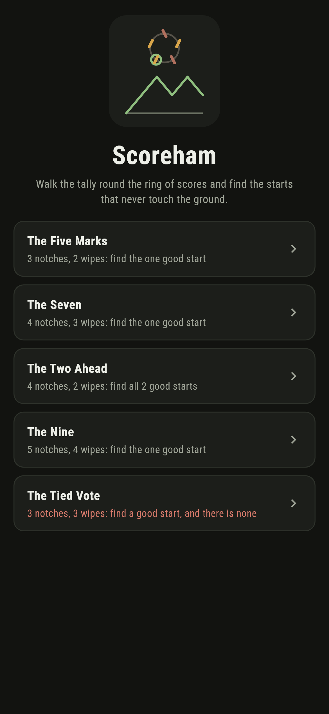
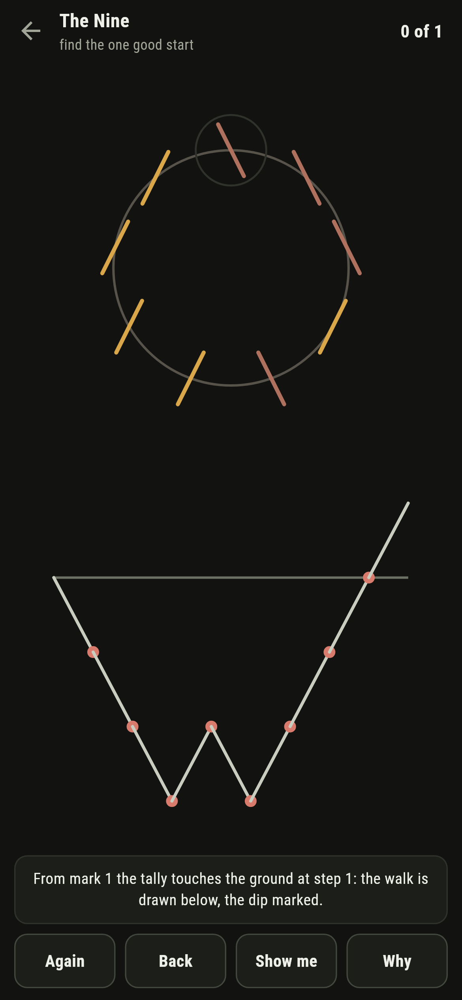
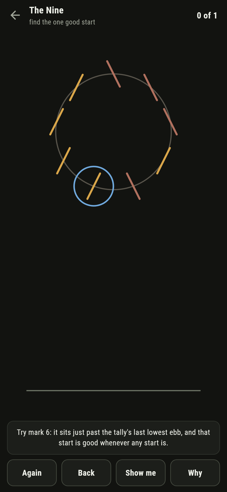
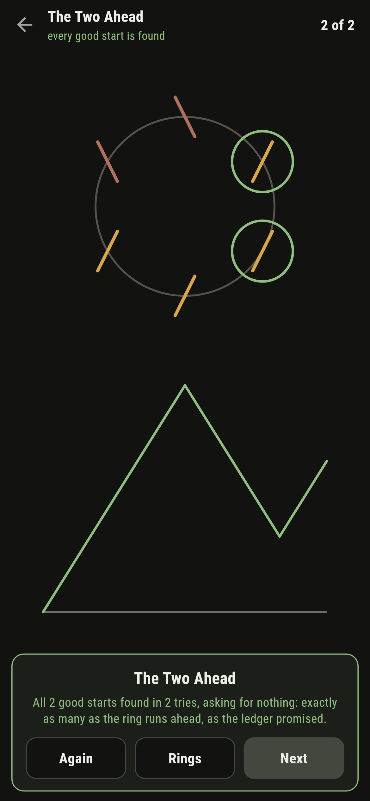
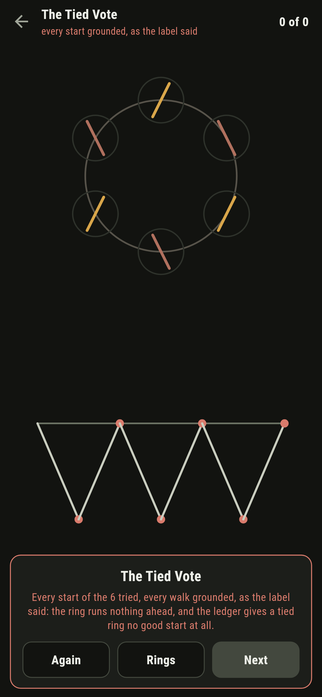
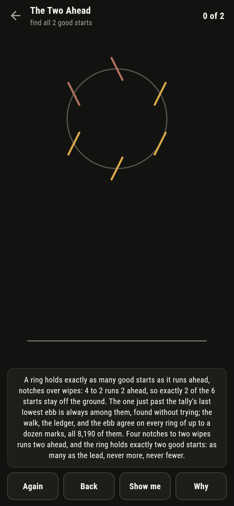

# Scoreham

A tally-walking puzzle for phones, in Flutter, for Android and iOS.

A ring of scores round the old chalk post, each mark a notch up or a
wipe down. Pick a start and the tally walks the whole ring from it,
drawn as a hill below; a good start never once touches the ground.
This is the cycle lemma walked out loud: a ring holds exactly as
many good starts as it runs ahead, notches over wipes, and the
start just past the tally's last lowest ebb is always among them.

| | | | |
|---|---|---|---|
|  |  |  |  |

## Three ways of knowing

The suite knows every ring three ways that share nothing. The walk
tries every start and counts what stays off the ground; the ledger
never walks, just sets notches against wipes; the ebb finds a good
start without trying, one mark past the tally's last lowest fall.
All three agree on every ring of up to a dozen marks, all 8,190 of
them, and every written count below is theirs together.

```
$ make rings
a ring holds exactly as many good starts as it runs ahead, and the start just past the last lowest ebb is always one of them: the walk, the ledger, and the ebb agree on every ring of up to a dozen marks, all 8,190 of them

 1 The Five Marks 3 notches, 2 wipes  find the one good start: the ring runs 1 ahead and holds exactly 1
 2 The Seven      4 notches, 3 wipes  find the one good start: the ring runs 1 ahead and holds exactly 1
 3 The Two Ahead  4 notches, 2 wipes  find all 2 good starts: the ring runs 2 ahead and holds exactly 2
 4 The Nine       5 notches, 4 wipes  find the one good start: the ring runs 1 ahead and holds exactly 1
 5 The Tied Vote  3 notches, 3 wipes  find a good start: the ring runs nothing ahead, and no start stays off the ground
```

## The tied vote

One ring ships labelled hopeless in the house tradition of maps
nobody can win: three notches, three wipes, nothing ahead. The
whole walk always comes home to nought, so every start touches the
ground somewhere on the way round. The game says so on the way in,
lets you try all six and watch each walk dip, and the card says
what the ledger promised: a tied ring holds no good start at all.



## The walk that draws itself

Nothing about the lemma is folklore here. Every tried start draws
its whole walk under the ring, dips marked where the tally touches,
green when it never does, and the verdict names the exact step a
bad start fails at. **Show me** points the mark just past the last
lowest ebb, the construction that is good whenever anything is, and
**Why** speaks all three voices over the ring in front of you.



## Building

```
make deps      # fetch packages
make check     # analyze + every test
make rings     # walk every start and hold the ledger to it
make shots     # render the screenshots and redraw the icons
make apk       # Android release build
make ios       # iOS release build (unsigned)
```

The logo and every app icon are drawn by the game's own painter in
`test/mark_test.dart`. There is no image in this repository that was not
produced by code in it.

## How it is put together

```
lib/score/rules.dart     the walk, the ledger, the ebb, and the
                         sweep that holds them together
lib/score/ring.dart      a ring: its marks and its good starts
lib/score/rings.dart     the five rings that ship
lib/score/play.dart      a ring being tried: walks shown, finds
                         kept, take-back
lib/ui/                  the painter, the screens, the mark
tool/check_rings.dart    the sweep and the ledger above
```

The tests walk small rings by hand, count good starts against the
lead on every shipped ring, hold all three voices together across
every ring to a dozen marks, settle every winnable ring by
following the ebb through the real taps, watch a grounded walk name
its dip, watch the tied vote ground from all six starts, and hold
the pictures against the real widget tree. If any of that drifts,
`make check` goes red before anything leaves the machine.
