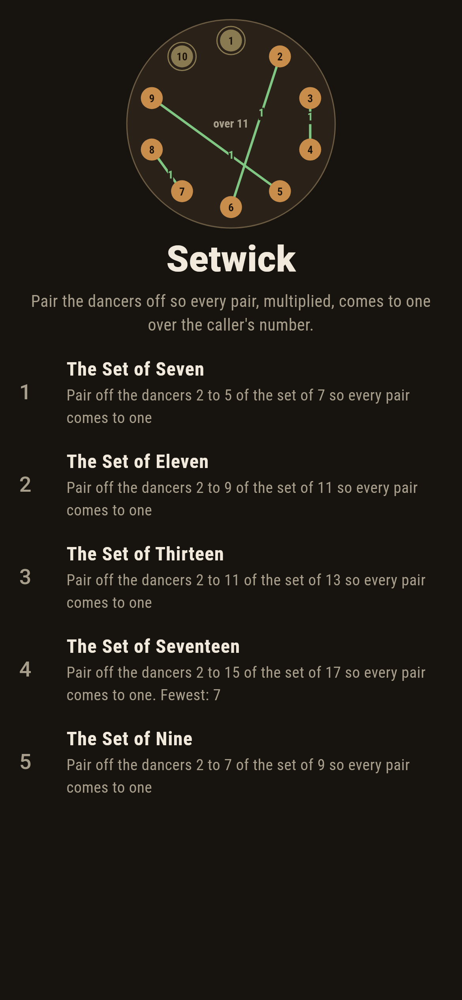
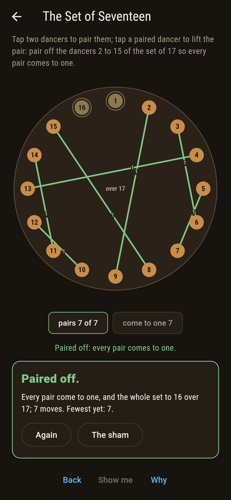
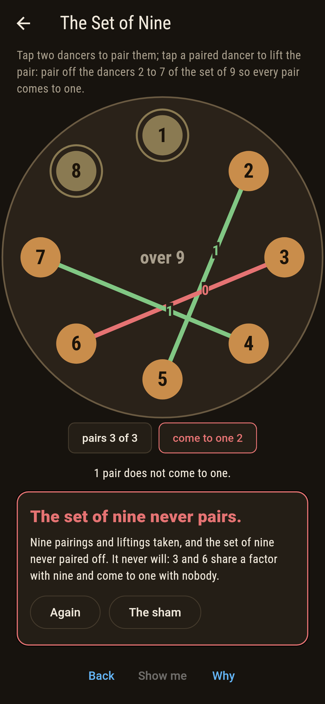
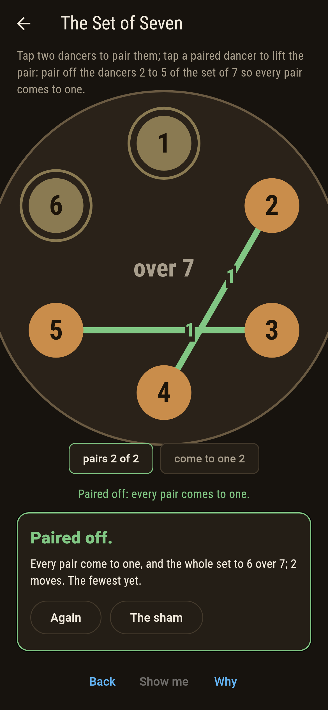
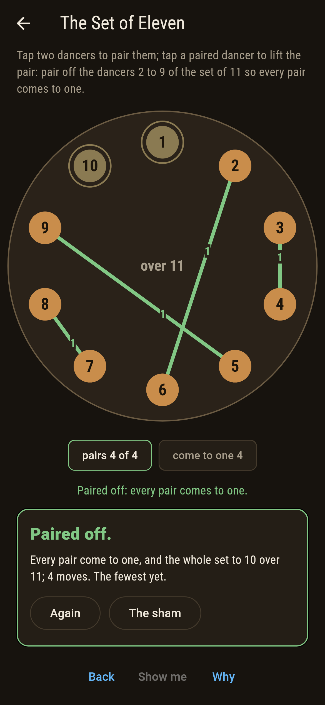
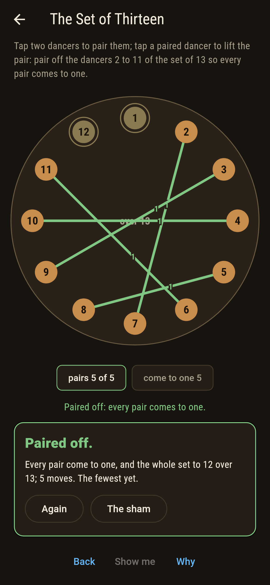
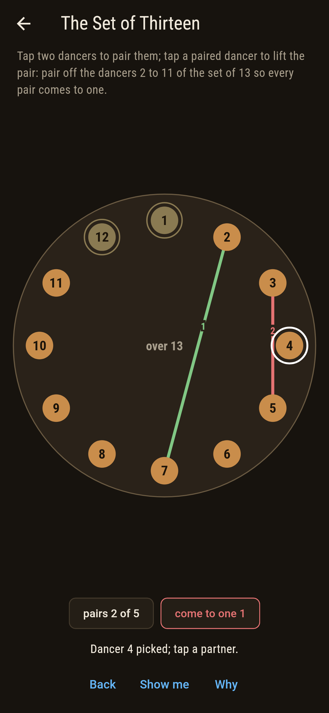
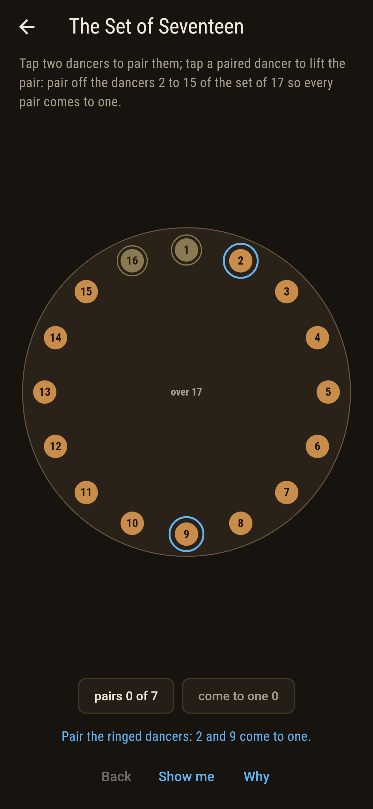
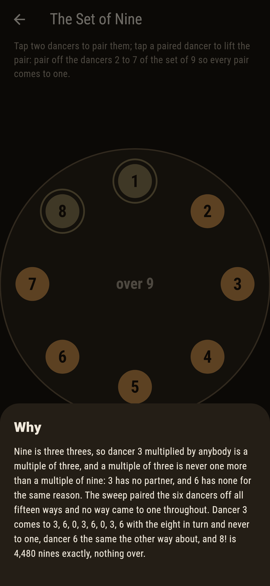

# Setwick


Dancers numbered 1 to n - 1 stand in a ring and the caller's
number is n. Two dancers partner when their numbers multiplied
come to one over n, that is, leave one when divided by n. Dancer
1 and dancer n - 1 keep to themselves, each coming to one with
itself; the rest must pair off. When the caller's number is prime
every dancer has exactly one partner and the set pairs off one
way only, and then the whole set multiplied comes to n - 1 over
n: Wilson's theorem, 1770. When it is not, some dancer shares a
factor with the caller and comes to one with nobody.

## The sets

1. **The Set of Seven** - pair off the dancers 2 to 5 of the set of 7 so every pair comes to one
2. **The Set of Eleven** - pair off the dancers 2 to 9 of the set of 11 so every pair comes to one
3. **The Set of Thirteen** - pair off the dancers 2 to 11 of the set of 13 so every pair comes to one
4. **The Set of Seventeen** - pair off the dancers 2 to 15 of the set of 17 so every pair comes to one
5. **The Set of Nine** - pair off the dancers 2 to 7 of the set of 9 so every pair comes to one

Every prime set pairs off exactly one way: one pairing of the 3,
of the 105, of the 945, of the 135,135. The Set of Nine is
labeled hopeless on its tile: dancer 3 comes to 3, 6, 0, 3, 6, 0,
3, 6 with the eight in turn and never to one, and 6 the same the
other way about, so none of its fifteen pairings lands.

## Two voices

The game never asserts what it has not computed, and it computes
everything at least twice:

* **The sweep** pairs the dancers off every way there is, two by
  two, and multiplies every pair: 3, 105, 945 and 135,135
  pairings, and 15 for the set of nine.
* **Bezout's arithmetic** finds each dancer's partner by Euclid's
  walk on the dancer and the caller's number, with no searching,
  and lands the sweep's one pairing pair for pair; a partner turns
  up exactly when the dancer shares no factor with the caller, for
  every dancer of every caller to thirty. And **Wilson's product**
  is taken whole: (n - 1)! comes to n - 1 over n for every prime n
  to thirty, to 2 for four, and to nought for every other
  composite; the notes quote 10! and 16! to the last digit.

`tool/check_sets.dart` runs the lot and refuses the bake on any
disagreement.

## The checker's ledger

What `dart run tool/check_sets.dart` printed for the build this
README shipped with, word for word:

```
every pairing of every set swept, 3 and 105 and 945 and 135,135 of them and 15 for the set of nine: exactly one lands for each prime caller and it is Bezout's, pair for pair, none lands for nine, where dancers 3 and 6 come to one with nobody, and the whole set multiplied comes to one less than the caller for every prime to thirty and to nought for every composite past four

 1 The Set of Seven     pair off the dancers 2 to 5 of the set of 7 so every pair comes to one: 1 pairing of the 3 lands it
 2 The Set of Eleven    pair off the dancers 2 to 9 of the set of 11 so every pair comes to one: 1 pairing of the 105 lands it
 3 The Set of Thirteen  pair off the dancers 2 to 11 of the set of 13 so every pair comes to one: 1 pairing of the 945 lands it
 4 The Set of Seventeen pair off the dancers 2 to 15 of the set of 17 so every pair comes to one: 1 pairing of the 135,135 lands it
 5 The Set of Nine      pair off the dancers 2 to 7 of the set of 9 so every pair comes to one: none of the 15, and the row of 3 said so first
```

## Screenshots

| The sham | The seventeen paired off | The set of nine admitted |
| --- | --- | --- |
|  |  |  |

| The seven | The eleven | The thirteen | Mid-pairing | Show me | The why |
| --- | --- | --- | --- | --- | --- |
|  |  |  |  |  |  |

Screenshots are drawn by `test/showcase_test.dart` at real phone
sizes with the app's own painter, then copied into `docs/` as they
came out; every pair in them was tapped, so nothing pictured is a
set the game could not reach. The logo and every launcher icon
come out of `test/mark_test.dart` the same way: the mark is the
set of eleven paired off.

## Building

```
flutter test          # 46 tests, the sweep among them
dart run tool/check_sets.dart
flutter build apk     # or: flutter build ios
```
