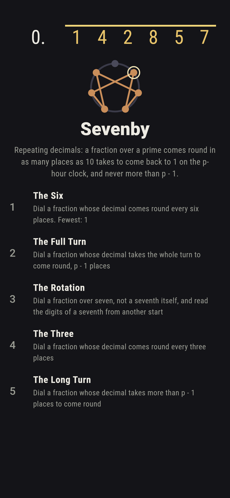
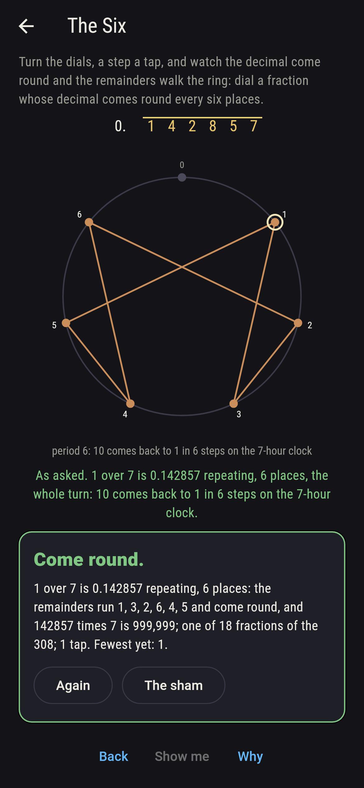
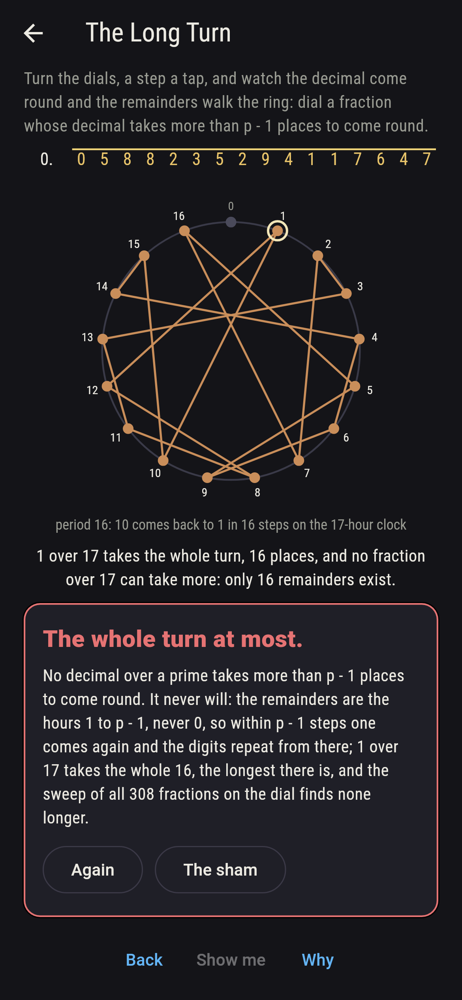
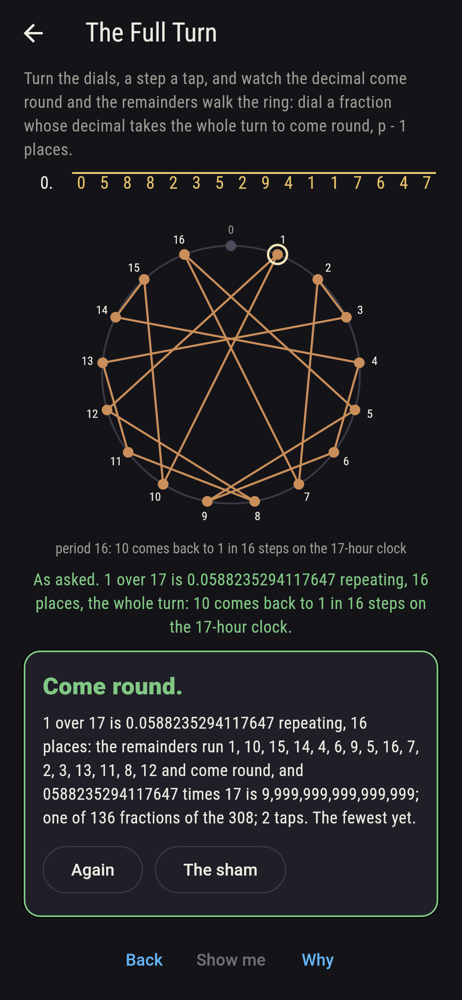
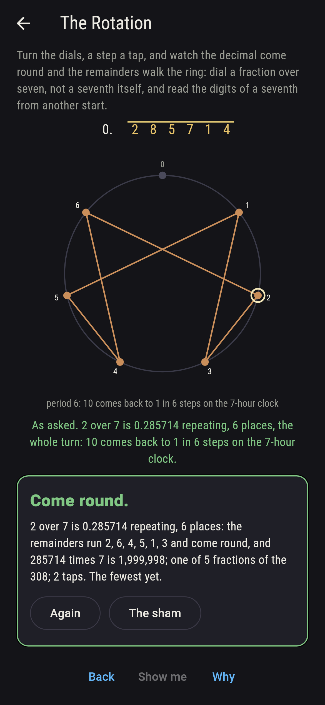
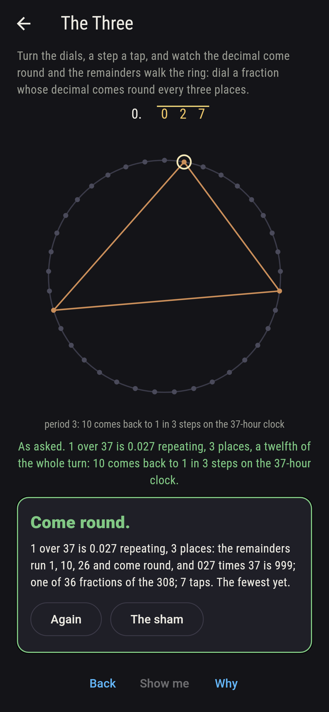
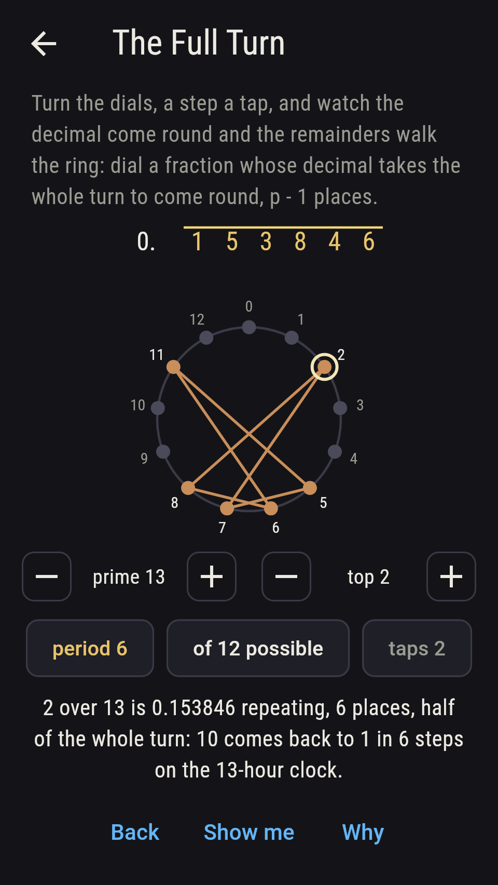
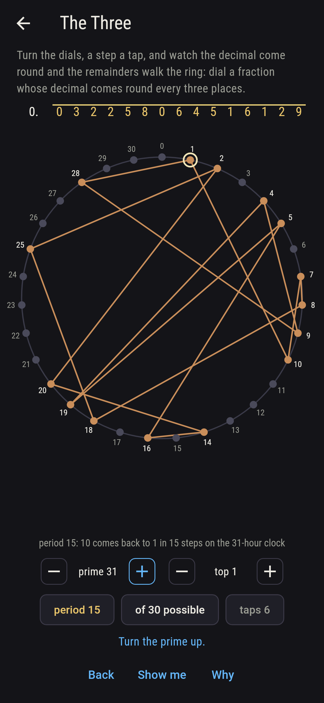
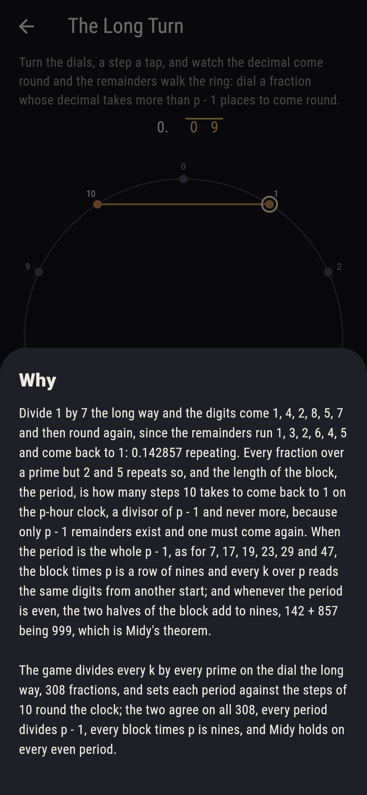

# Sevenby


Divide 1 by 7 the long way and the digits come 1, 4, 2, 8, 5, 7 and
then round again, since the remainders run 1, 3, 2, 6, 4, 5 and come
back to 1: 0.142857 repeating. Every fraction over a prime but 2 and
5 repeats so, and the length of the block, the period, is how many
steps 10 takes to come back to 1 on the p-hour clock, a divisor of
p - 1 and never more, because only p - 1 remainders exist and one
must come again. When the period is the whole p - 1, as for 7, 17,
19, 23, 29 and 47, the block times p is a row of nines and every k
over p reads the same digits from another start; and whenever the
period is even, the two halves of the block add to nines, 142 + 857
being 999, which is Midy's theorem. Turn the dials, the prime and
the number over it, and watch the decimal come round and the
remainders walk the ring. The game divides every k by every prime on
the dial the long way, 308 fractions, and sets each period against
the steps of 10 round the clock; the two agree on all 308, every
period divides p - 1, every block times p is nines, and Midy holds on
every even period.

## The asks

1. **The Six** - dial a fraction whose decimal comes round every six places
2. **The Full Turn** - dial a fraction whose decimal takes the whole turn to come round, p - 1 places
3. **The Rotation** - dial a fraction over seven, not a seventh itself, and read the digits of a seventh from another start
4. **The Three** - dial a fraction whose decimal comes round every three places
5. **The Long Turn** - dial a fraction whose decimal takes more than p - 1 places to come round

A seventh and a thirteenth both come round in six places, 0.142857
and 0.076923, eighteen fractions of the 308. Six primes on the dial
take the whole turn, 7, 17, 19, 23, 29 and 47, 136 fractions, and to
a hundred the full-turn primes are 7, 17, 19, 23, 29, 47, 59, 61 and
97. Two sevenths are 0.285714, three 0.428571, four 0.571428, five
0.714285 and six 0.857142, the digits of a seventh read round from
another start, five fractions; on a thirteenth only 1, 3, 4, 9, 10
and 12 over 13 read a thirteenth's digits round, and the other six
read 153846 round. A thirty-seventh is 0.027 repeating, three
places, and so is every k over 37, since 10 cubed is one more than
27 times 37. The Long Turn is labeled hopeless on its tile: the
remainders are the hours 1 to p - 1, so within p - 1 steps one comes
again, and the sham admits it at a full turn, the longest there is,
or after twelve taps.

## Two voices

The game never asserts what it has not computed, and it computes
everything at least twice:

* **The long division** carries out every k over p on the dial, 308
  fractions, digit by digit and remainder by remainder until a
  remainder comes again; every period on the sham is that division's,
  every block is checked to multiply by p to k rows of nines, every
  block of even length to split into halves adding to nines, and every
  k over p to read the digits of 1 over p round exactly when k is a
  remainder of 1 over p.
* **The clock** divides nothing: the period is the least divisor of
  p - 1 that brings 10 back to 1 by squaring and doubling, and it
  agrees with the division on all 308; from it the periods on the
  dial are 1, 6, 2, 6, 16, 18, 22, 28, 15, 3, 5, 21 and 46, six of
  them the whole turn, and to a hundred nine of the twenty-three odd
  primes but five take the whole turn.

`tool/check_turns.dart` runs the lot and refuses the bake on any
disagreement.

## The checker's ledger

What `dart run tool/check_turns.dart` printed for the build this
README shipped with, word for word:

```
every fraction k over p on the dial divided the long way, the thirteen odd primes from 3 to 47 but 5 and every k under each, 308 fractions, and each period set against the steps 10 takes to come back to 1 on the p-hour clock, the two agreeing on all 308; every period divides p - 1, every block of digits times p is k rows of nines, every k over p reads the digits of 1 over p from another start exactly when k is a remainder of 1 over p, and Midy holds on every even period, the two halves adding to nines; the periods are 1, 6, 2, 6, 16, 18, 22, 28, 15, 3, 5, 21 and 46 for 3, 7, 11, 13, 17, 19, 23, 29, 31, 37, 41, 43 and 47, six of them the whole turn; and to a hundred the full-turn primes are 7, 17, 19, 23, 29, 47, 59, 61 and 97, nine of the 23 odd primes but five

 1 The Six       dial a fraction whose decimal comes round every six places: 18 of the 308 fractions land it
 2 The Full Turn dial a fraction whose decimal takes the whole turn to come round, p - 1 places: 136 of the 308 fractions land it
 3 The Rotation  dial a fraction over seven, not a seventh itself, and read the digits of a seventh from another start: 5 of the 308 fractions land it
 4 The Three     dial a fraction whose decimal comes round every three places: 36 of the 308 fractions land it
 5 The Long Turn dial a fraction whose decimal takes more than p - 1 places to come round: none of the 308, and the p - 1 remainders said so first
```

## Screenshots

| The sham | The six | The long turn admitted |
| --- | --- | --- |
|  |  |  |

| The full turn | The rotation | The three | Midway, on the small phone | Show me | The why |
| --- | --- | --- | --- | --- | --- |
|  |  |  |  |  |  |

Screenshots are drawn by `test/showcase_test.dart` at real phone
sizes with the app's own painter, then copied into `docs/` as they
came out; every fraction in them was dialled by taps, so nothing
pictured is a fraction the game could not reach. The logo and every
launcher icon come out of `test/mark_test.dart` the same way: the
mark is a seventh, 0.142857 under its bar, and the six remainders
walked round the seven-hour ring.

## Building

```
flutter test          # 44 tests, the sweep among them
dart run tool/check_turns.dart
flutter build apk     # or: flutter build ios
```
