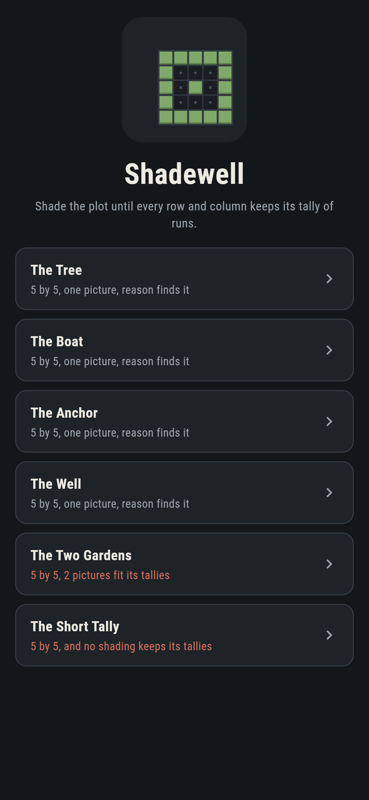
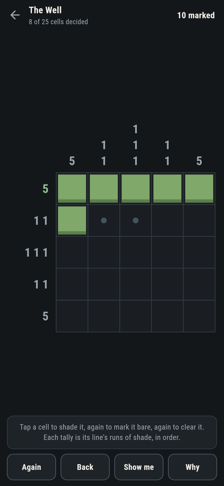
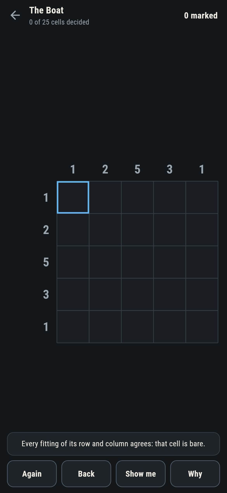
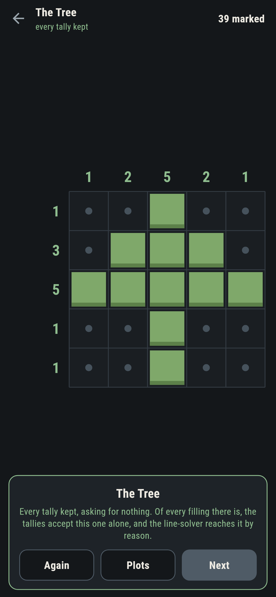
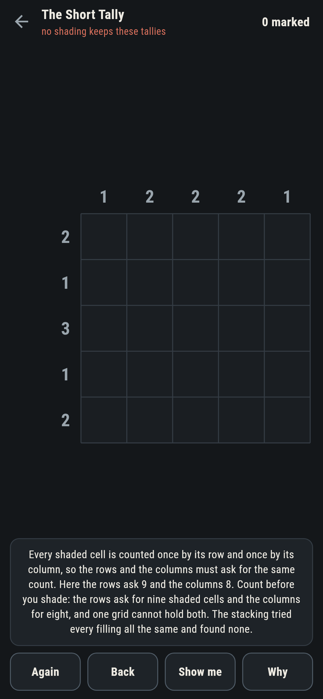
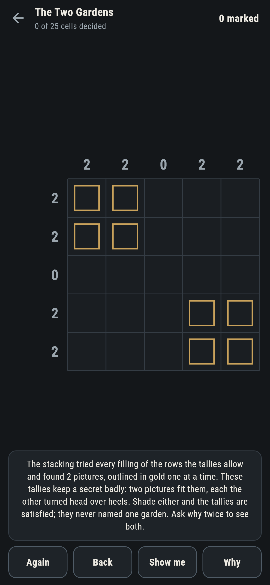

# Shadewell

A plot-shading puzzle for phones, in Flutter, for Android and iOS.

A little grid, and a tally on every row and column: the lengths of its
runs of shade, in order. Shade the plot until every tally is kept.
These are nonograms, and the game holds them to a claim most sets
never write down: the tallies must name one picture, and the suite
checks it rather than hoping.

| | | | |
|---|---|---|---|
|  |  |  |  |

## Two ways of knowing

The suite knows each plot two ways that share nothing. The stacking
tries every filling of the rows the tallies allow, pruning columns as
it goes, and counts the pictures that fit. The line-solver never
counts: it reasons one line at a time, keeping only what every
fitting of a line agrees on, until nothing new comes. On every plot
that ships one picture, the stacking finds exactly one, the
line-solver reaches the same picture cold, and the checker refuses
the bake if either says otherwise.

```
$ make plots
 1 The Tree         5 by 5  one picture, and the line-solver reaches it
 2 The Boat         5 by 5  one picture, and the line-solver reaches it
 3 The Anchor       5 by 5  one picture, and the line-solver reaches it
 4 The Well         5 by 5  one picture, and the line-solver reaches it
 5 The Two Gardens  5 by 5  2 pictures fit, and the tallies cannot tell them apart
 6 The Short Tally  5 by 5  no picture: rows ask 9, columns 8
```

## The short tally

Every shaded cell is counted once by its row and once by its column,
so the rows and the columns must ask for the same total. The Short
Tally asks nine one way and eight the other, and ships labelled in
the house tradition of maps nobody can win: the counting on the way
in, the stacking's empty sweep behind it, and any line you overfill
falls red in front of you.



## The two gardens

Tallies can also fail the other way: by naming too little. The Two
Gardens fit two pictures, each the other turned head over heels, and
the level says so before the first mark. Shade either and the tallies
are satisfied; **Why** outlines the accepted pictures in gold, one at
a time, and the finishing card owns that the clues never named one
garden.



## The live tallies

Every tally watches its line: kept turns green, and a line that no
longer fits any pattern falls red the moment the mark lands, named in
the words under the plot with **Back** waiting. **Show me** offers
only what one round of honest deduction settles from what stands, and
says which way the cell must go.

## Building

```
make deps    # fetch packages
make check   # analyze + every test
make plots   # stack every filling, run the line-solver, print the ledger
make shots   # render the screenshots and redraw the icons
make apk     # Android release build
make ios     # iOS release build (unsigned)
```

The logo and every app icon are drawn by the game's own painter in
`test/mark_test.dart`. There is no image in this repository that was not
produced by code in it.

## How it is put together

```
lib/plot/rules.dart     patterns, tallies, the stacking, the
                        line-solver
lib/plot/plot.dart      a plot: tallies, its count, its picture
lib/plot/plots.dart     the six plots that ship
lib/plot/play.dart      a plot being shaded: marks, fallen lines,
                        take-back, deduction
lib/ui/                 the painter, the screens, the mark
tool/check_plots.dart   the stackings, the solvings, the ledger above
```

The tests place runs and read tallies by hand, stack every plot
against its written count, reach every written picture by reason
alone, watch a tally fall the moment it is overfilled, shade every
unique picture home by following one deduction at a time, fill either
garden and watch both be accepted, and hold the pictures against the
real widget tree. If any of that drifts, `make check` goes red before
anything leaves the machine.
