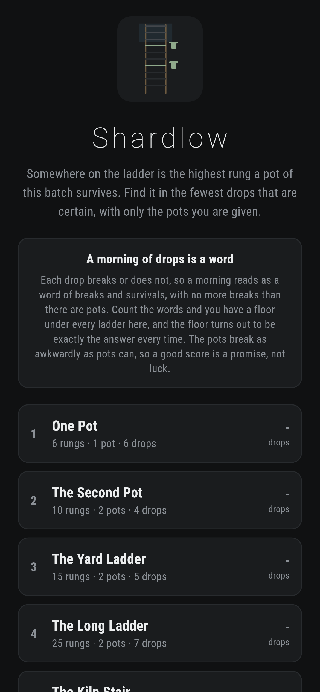
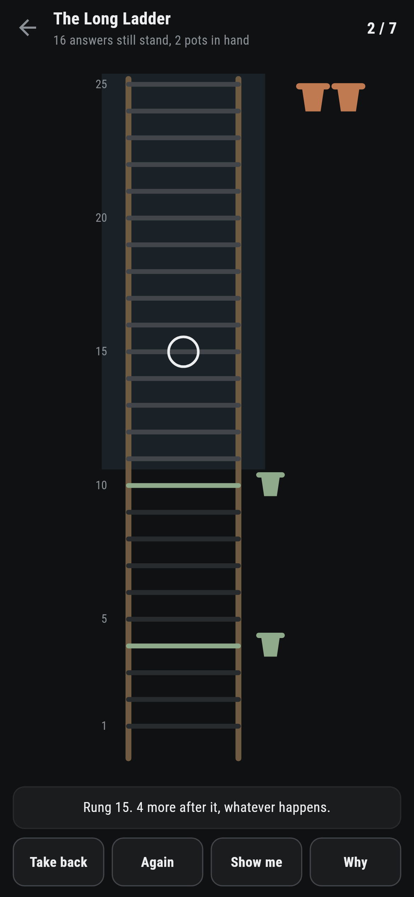
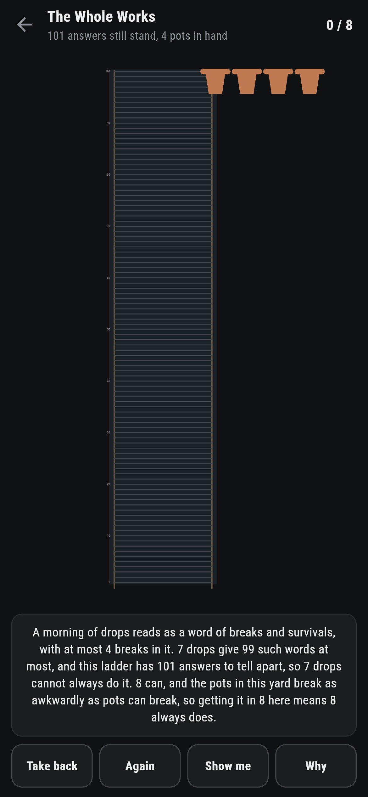
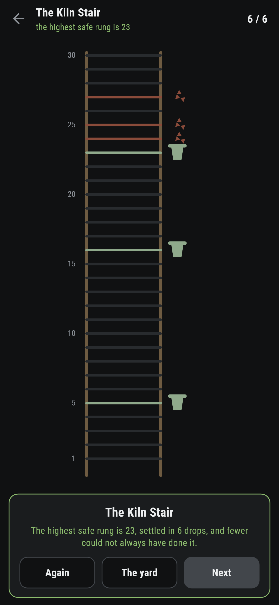
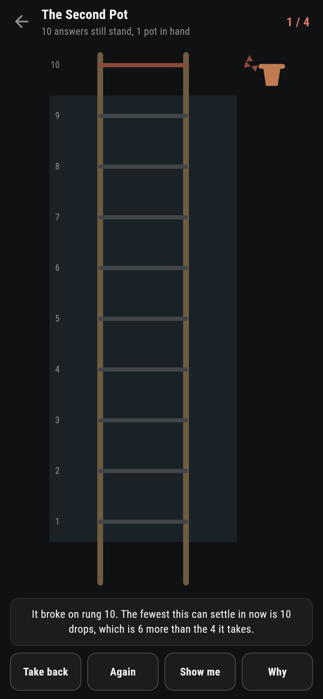

# Shardlow

A dropping puzzle for phones, in Flutter, for Android and iOS.

Somewhere on the ladder is the highest rung a pot of this batch can be dropped
from and live. Perhaps there is no such rung at all. Find out in the fewest
drops that are certain, with only the pots you are given, and a pot that
breaks is gone.

| | | | |
|---|---|---|---|
|  |  |  |  |

## A morning of drops is a word

Each drop breaks or does not, so a morning reads as a word of breaks and
survivals with no more breaks in it than there are pots. Count the words: d
drops with p pots give at most so many, and two answers that would read the
same word can never be told apart. That puts a floor under every ladder, from
counting alone.

What earns the floor its place is that it is exactly the answer. For every
ladder up to two hundred rungs and every hand up to four pots, a test holds
the counting against a search that tries every plan, and the two never part.
The famous version of this puzzle, a hundred floors and two eggs, sits at
fourteen for exactly this reason.

```
$ make ladders
 1 One Pot              6 rungs  1 pots  fewest 6  written down 6  counting says 6
 2 The Second Pot      10 rungs  2 pots  fewest 4  written down 4  counting says 4
 3 The Yard Ladder     15 rungs  2 pots  fewest 5  written down 5  counting says 5
 4 The Long Ladder     25 rungs  2 pots  fewest 7  written down 7  counting says 7
 5 The Kiln Stair      30 rungs  3 pots  fewest 6  written down 6  counting says 6
 6 The Church Tower    60 rungs  3 pots  fewest 7  written down 7  counting says 7
 7 The Whole Works    100 rungs  4 pots  fewest 8  written down 8  counting says 8

800 ladders checked against the counting; the floor is exactly the answer on every one
```

## The pots break as awkwardly as pots can

There is no batch chosen at the start. The game keeps the set of answers still
possible, and when a pot is dropped it breaks or survives so as to leave the
most work still to do. A morning finished at par is therefore a promise about
every batch there could be, not a piece of luck about one.

The one pot ladder is the lesson in miniature. With a single pot, a drop from
anywhere above the lowest unsettled rung risks leaving everything below it
unaskable, so there is nothing for it but rung by rung from the bottom. The
second pot changes the game entirely, and the counting says by exactly how
much: one pot manages a hundred rungs in a hundred drops, two pots in
fourteen.

## What the game says



Every drop is answered out loud: it broke, or it lived, and how many answers
still stand. The band where the answer might be is shaded on the ladder, a
rung that can teach nothing says so, and the moment a drop costs more than the
morning takes, the game says that too, because the table knows the value of
what is left as well as it knew the whole.

**Show me** names the rung whose worse half still settles in as few drops as
the whole can, worked out from what is possible now, so it stays right after a
greedy start.

## Running it

```
make deps     # flutter pub get
make test     # everything
make analyze
make shots    # render the screens into build/showcase, redraw the logo and icons
make ladders  # every shipped ladder, and the counting held against the search
make apk      # release APK
make ios      # release iOS build, unsigned
```

## Tests

`flutter test` runs the counting (what a run of drops can tell apart, the
floor being exactly the answer on every ladder to a hundred and twenty rungs
and four pots, one pot being a rung at a time, and the second pot being worth
almost everything), the referee keeping whichever half needs more, every
ladder that ships sitting exactly on the counting floor, and a morning at the
ladder.

Then the game through the screen: dropping, a rung that can teach nothing, a
greedy drop called out, **Take back**, **Again**, **Show me**, **Why**, the
one pot morning going rung by rung, and every ladder settled at par.

Screenshots come from `test/showcase_test.dart`, and every shard in them came
of a real drop with the referee answering for real. `test/mark_test.dart`
draws the logo, the launcher icons at every density Android asks for and every
size the iOS icon set asks for; there is no image in this repository that was
not produced by it.
