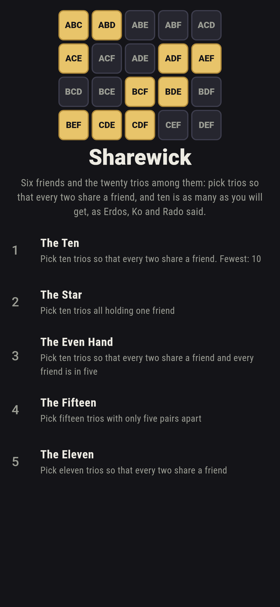
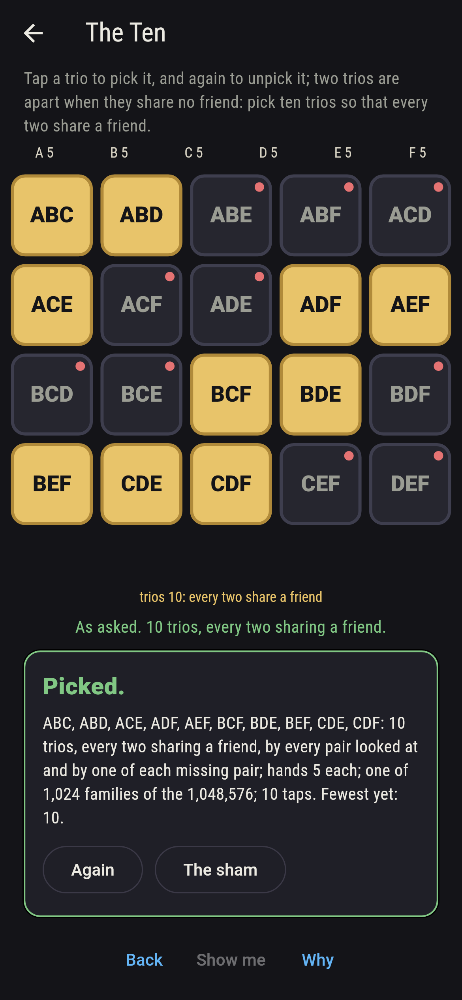
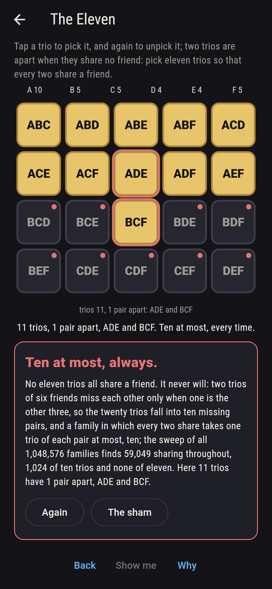
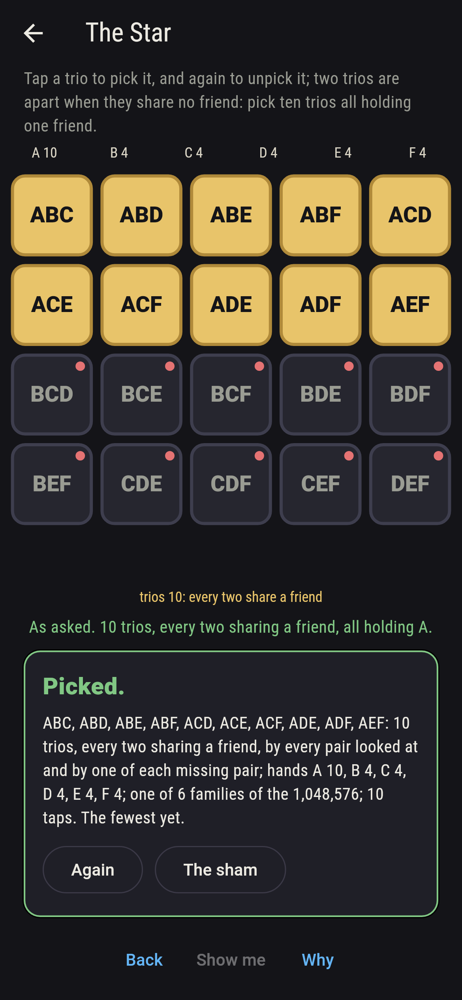
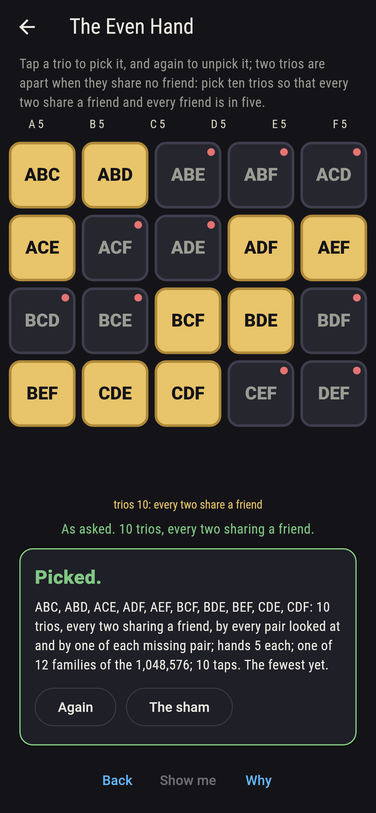
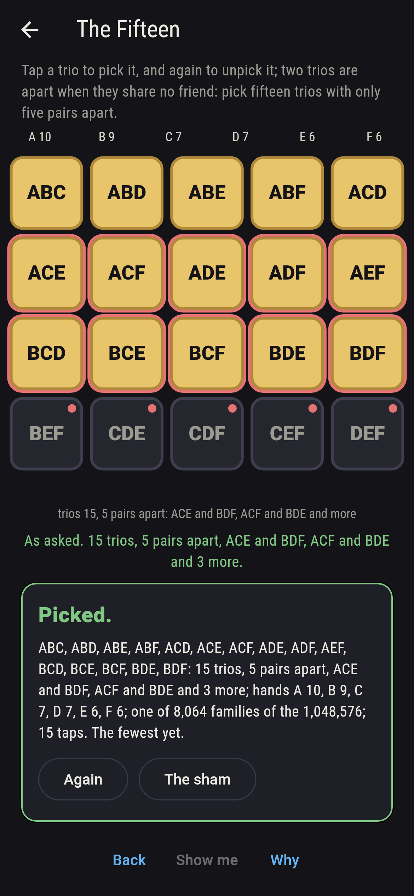
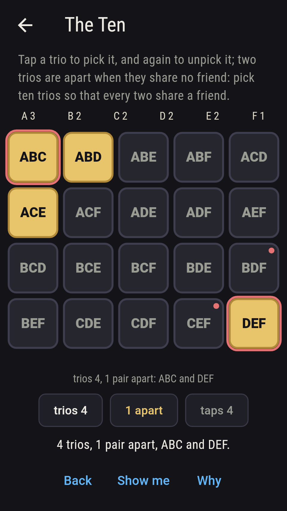
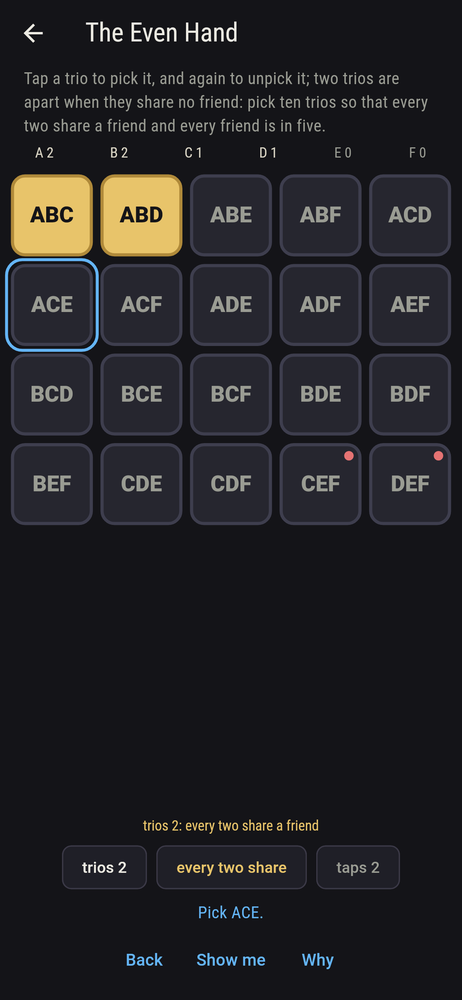
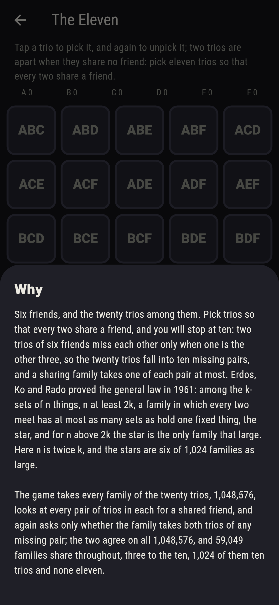

# Sharewick


Six friends, and the twenty trios among them. Pick trios so that
every two share a friend, and you will stop at ten: two trios of six
friends miss each other only when one is the other three, so the
twenty trios fall into ten missing pairs, ABC with DEF, ABD with CEF
and on, and a sharing family takes one of each pair at most. Erdos,
Ko and Rado proved the general law in 1961: among the k-sets of n
things, n at least 2k, a family in which every two meet has at most
as many sets as hold one fixed thing, the star, and for n above 2k
the star is the only family that large. Here n is twice k, and the
stars are six of 1,024 families as large. Tap a trio to pick it, and
again to unpick it. The game takes every family of the twenty trios,
1,048,576, looks at every pair of trios in each for a shared friend,
and again asks only whether the family takes both trios of any
missing pair; the two agree on all 1,048,576, and 59,049 families
share throughout, three to the ten, 1,024 of them ten trios and none
eleven.

## The asks

1. **The Ten** - pick ten trios so that every two share a friend
2. **The Star** - pick ten trios all holding one friend
3. **The Even Hand** - pick ten trios so that every two share a friend and every friend is in five
4. **The Fifteen** - pick fifteen trios with only five pairs apart
5. **The Eleven** - pick eleven trios so that every two share a friend

Of the 184,756 families of ten trios, 1,024 have every two sharing a
friend, exactly the pickings of one trio from each of the ten
missing pairs, two ways ten times over. Six of them are stars, ten
trios all holding one friend; the other 1,018 hold no friend
throughout, and 60 hold one in nine. Only twelve deal every friend
into five trios exactly, ABC, ABD, ACE, ADF, AEF, BCF, BDE, BEF, CDE
and CDF one of them, and no friend can be dealt fewer than five in a
sharing ten, since ten trios hold thirty places and no friend is in
more than ten. Fifteen trios must take both trios of five missing
pairs at least, so five pairs apart is the fewest, and 8,064
families of fifteen have five exactly. The Eleven is labeled
hopeless on its tile: the ten missing pairs said so first, and the
sweep finds no eleven trios sharing throughout; the sham admits it
after three families of eleven have shown their pairs apart, or
after thirty taps.

## Two voices

The game never asserts what it has not computed, and it computes
everything at least twice:

* **Every pair looked at** takes each family and asks of every two
  trios in it whether they share a friend; every count on the sham is
  that looking's, the pairs apart on the board are the ones it found,
  and it counts the sharing families by size, their stars, their
  hands and their fewest pairs apart.
* **One of each pair** looks at no two trios: it asks only whether a
  family takes both trios of any of the ten missing pairs, a trio and
  its other three, and it agrees with the looking on all 1,048,576
  families; the sharing families run one, twenty, 180, 960 and on,
  ten choose the size times two to it, 59,049 in all, and none of
  eleven.

`tool/check_trios.dart` runs the lot and refuses the bake on any
disagreement.

## The checker's ledger

What `dart run tool/check_trios.dart` printed for the build this
README shipped with, word for word:

```
every family of the twenty trios of six friends taken, 1,048,576, every pair of trios in each looked at for a shared friend, and each family asked again only whether it takes both trios of any of the ten missing pairs, a trio and its other three, the two agreeing on all 1,048,576: 59,049 families share throughout, three to the ten, and by size they run 1, 20, 180, 960, 3,360, 8,064, 13,440, 15,360, 11,520, 5,120 and 1,024, ten choose the size times two to it, with none of eleven or more; of the 1,024 sharing tens 6 are stars, all holding one friend, 1,018 hold no friend throughout, 60 hold one in nine, and 12 deal every friend five; no sharing nine keeps every friend to four; fifteen trios have five pairs apart at the fewest, 8,064 families of the 15,504 exactly five, and the twenty have ten

 1 The Ten       pick ten trios so that every two share a friend: 1,024 of the 1,048,576 families land it
 2 The Star      pick ten trios all holding one friend: 6 of the 1,048,576 families land it
 3 The Even Hand pick ten trios so that every two share a friend and every friend is in five: 12 of the 1,048,576 families land it
 4 The Fifteen   pick fifteen trios with only five pairs apart: 8,064 of the 1,048,576 families land it
 5 The Eleven    pick eleven trios so that every two share a friend: none of the 1,048,576, and the ten missing pairs said so first
```

## Screenshots

| The sham | The ten | The eleven admitted |
| --- | --- | --- |
|  |  |  |

| The star | The even hand | The fifteen | Midway, on the small phone | Show me | The why |
| --- | --- | --- | --- | --- | --- |
|  |  |  |  |  |  |

Screenshots are drawn by `test/showcase_test.dart` at real phone
sizes with the app's own painter, then copied into `docs/` as they
came out; every trio in them was picked by a tap, so nothing pictured
is a family the game could not reach. The logo and every launcher
icon come out of `test/mark_test.dart` the same way: the mark is the
twenty trios laid out, the even hand's ten in gold.

## Building

```
flutter test          # 44 tests, the sweep among them
dart run tool/check_trios.dart
flutter build apk     # or: flutter build ios
```
