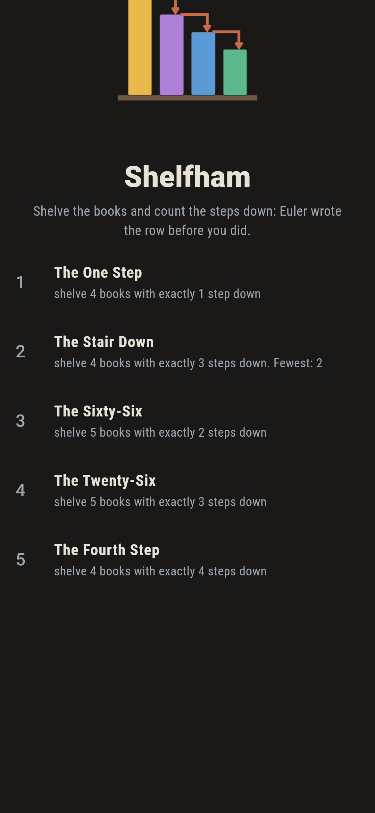
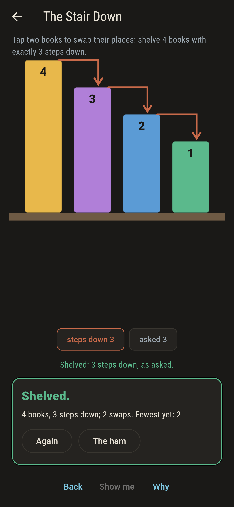
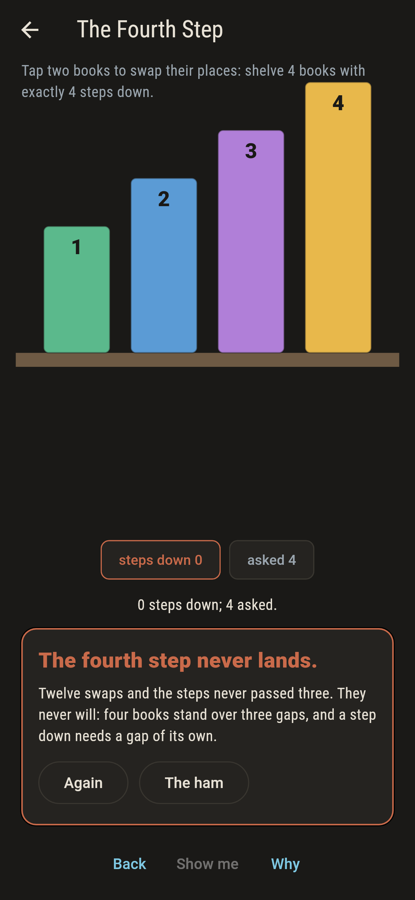
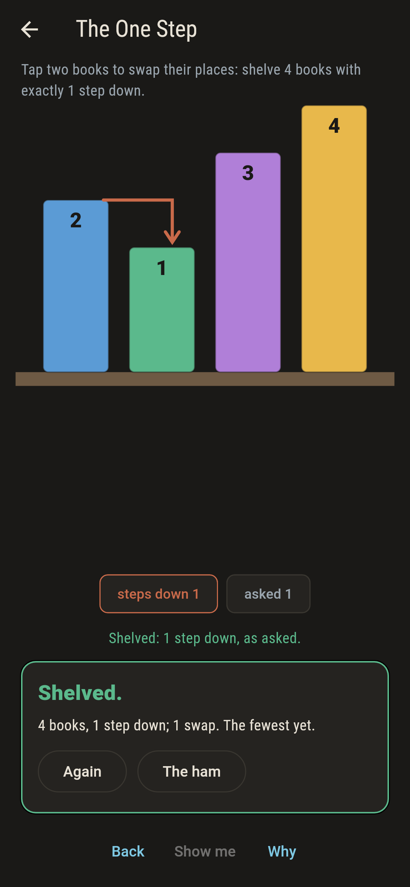
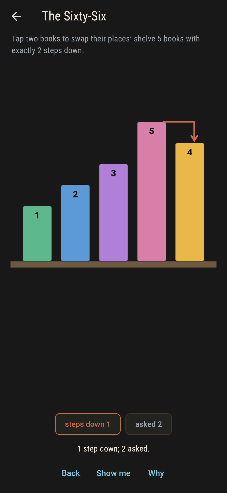
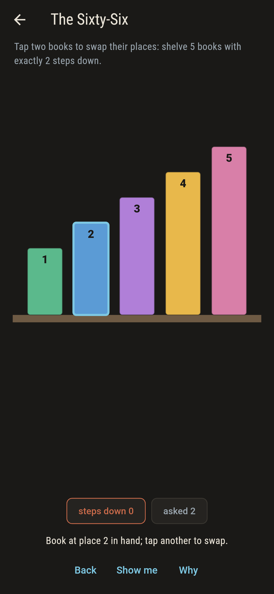
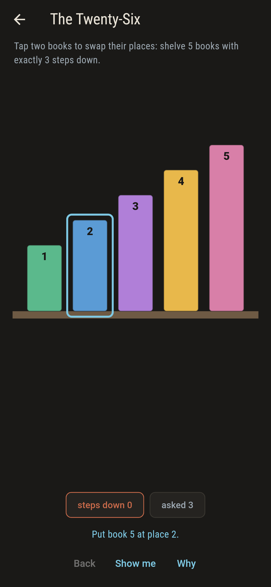
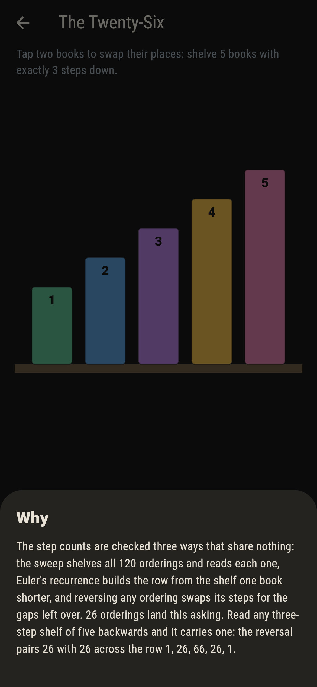

# Shelfham


Books of every height stand on a shelf, and a step down is a book
standing just before a shorter one, marked with a rust arrow in
the gap. The asking is always a count of steps, and the counts
belong to Euler: across a shelf of four the orderings split 1,
11, 11, 1, the same row read forwards or backwards, and nothing
ever steps past the last gap.

## The shelves

1. **The One Step** - shelve 4 books with exactly 1 step down
2. **The Stair Down** - shelve 4 books with exactly 3 steps down
3. **The Sixty-Six** - shelve 5 books with exactly 2 steps down
4. **The Twenty-Six** - shelve 5 books with exactly 3 steps down
5. **The Fourth Step** - shelve 4 books with exactly 4 steps down

The Stair Down has exactly one answer, the full reverse. The row
of five runs 1, 26, 66, 26, 1, and The Twenty-Six pairs with its
mirror: read any three-step shelf backwards and it carries one.
The Fourth Step asks four steps of three gaps, and the sweep
found what the arithmetic promised: nothing.

## Three voices

The game never asserts what it has not computed, and it computes
everything three ways:

* **The sweep** shelves all 24 and 120 orderings and reads the
  steps off each.
* **Euler's recurrence** builds each row from the shelf one book
  shorter, entry for entry.
* **The reversal** pairs every ordering with its mirror, swapping
  k steps for the gaps left over, which is why the rows read the
  same both ways.

`tool/check_stacks.dart` runs the lot and refuses the bake on
any disagreement.

## The checker's ledger

What `dart run tool/check_stacks.dart` printed for the build this
README shipped with, word for word:

```
every ordering of every shelf swept, 24 and 120 by size: the step counts match Euler's recurrence entry for entry, every shelf read backwards swaps its steps for the gaps left over, and the rows run 1, 11, 11, 1 and 1, 26, 66, 26, 1 with nothing past the last gap

 1 The One Step     shelve 4 books with exactly 1 step down: 11 orderings of the sweep land it
 2 The Stair Down   shelve 4 books with exactly 3 steps down: 1 ordering of the sweep lands it
 3 The Sixty-Six    shelve 5 books with exactly 2 steps down: 66 orderings of the sweep land it
 4 The Twenty-Six   shelve 5 books with exactly 3 steps down: 26 orderings of the sweep land it
 5 The Fourth Step  shelve 4 books with exactly 4 steps down: none of the 24, since four steps want a fifth book
```

## Screenshots

| The ham | The stair down | The fourth step admitted |
| --- | --- | --- |
|  |  |  |

| The one step | Mid-shelving | A book in hand | Show me | The why |
| --- | --- | --- | --- | --- |
|  |  |  |  |  |

Screenshots are drawn by `test/showcase_test.dart` at real phone
sizes with the app's own painter, then copied into `docs/` as
they came out; every book in them was swapped by taps, so nothing
pictured is a shelf the game could not reach. The logo and every
launcher icon come out of `test/mark_test.dart` the same way: the
mark is the stair down.

## Building

```
flutter test          # 46 tests, the sweep among them
dart run tool/check_stacks.dart
flutter build apk     # or: flutter build ios
```
