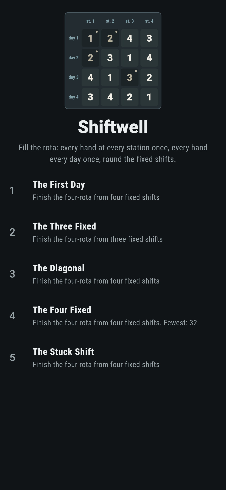
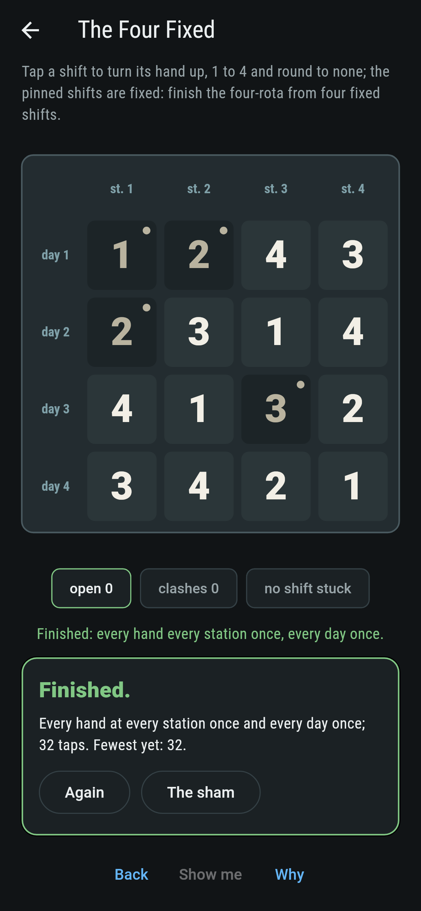
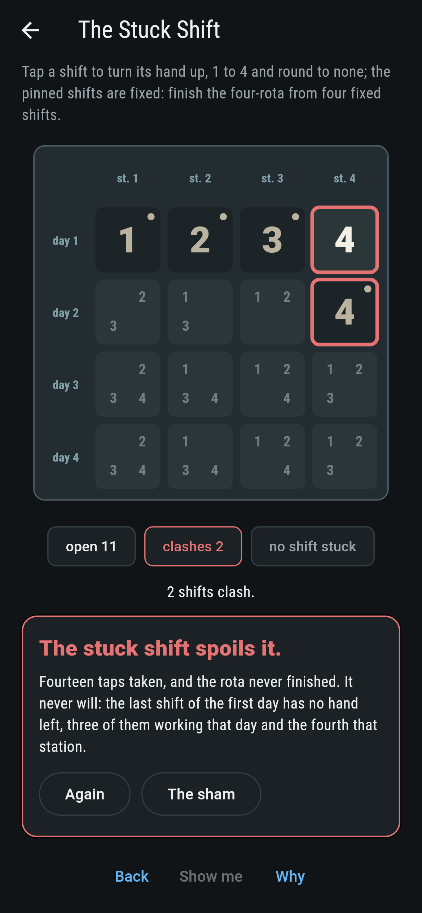
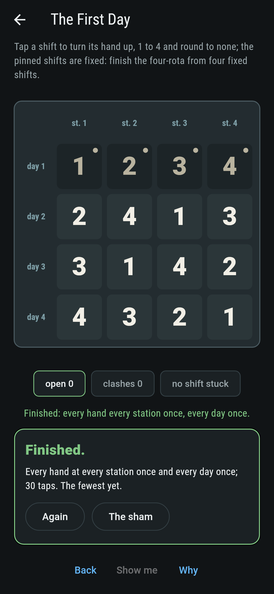
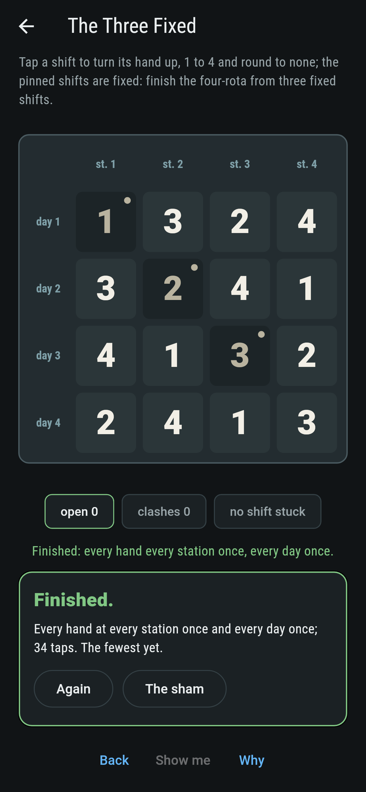
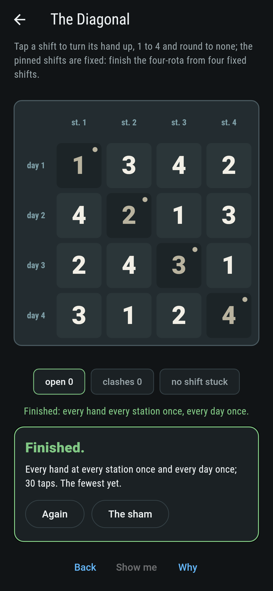
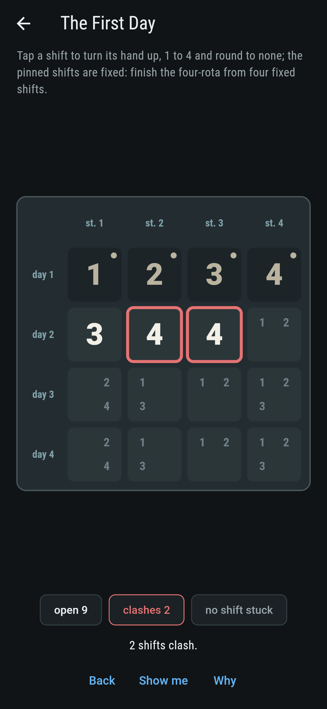
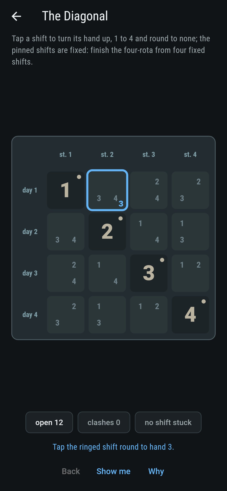
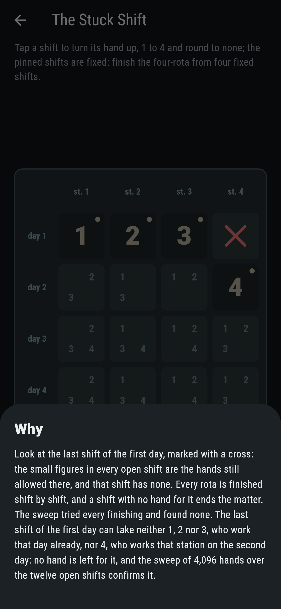

# Shiftwell


Four hands, four stations, four days. A rota gives every shift a
hand, and it is sound when no hand works two stations on one day
and no hand works one station on two days: a Latin square, with
some shifts fixed before you start. Evans asked in 1960 whether
n - 1 fixed shifts on an n by n rota can always be finished, and
Smetaniuk proved in 1981 that they can. The four-rota is small
enough to sweep whole: every sound fill of three shifts finishes,
some fills of four never do, and the one that ships hopeless is
spoilt by a single shift with no hand left for it.

## The rotas

1. **The First Day** - finish the four-rota from four fixed shifts
2. **The Three Fixed** - finish the four-rota from three fixed shifts
3. **The Diagonal** - finish the four-rota from four fixed shifts
4. **The Four Fixed** - finish the four-rota from four fixed shifts
5. **The Stuck Shift** - finish the four-rota from four fixed shifts

There are 576 rotas of four, 24 of them finishing a fixed first
day, and every one of the 25,920 sound fills of three shifts
finishes, in 8, 16 or 24 ways. Four fixed shifts can pin the rota
to one finishing, or leave two that swap days for stations, or
spoil it: 13,824 of the 239,760 sound fills of four never finish.
The Stuck Shift is labeled hopeless on its tile, and its cross is
on the slate from the first tap.

## Two voices

The game never asserts what it has not computed, and it computes
everything at least twice:

* **The sweep** finishes every rota every way it can be finished,
  the emptiest shift first, and counts; it does the same for every
  sound fill of one, two, three and four shifts on the four-rota,
  27,712 fills of three or fewer and 239,760 of four.
* **The symmetry** counts the 576 rotas of four a second way:
  renaming the hands turns any rota into one whose first day reads
  1 2 3 4, so 576 is the 24 finishings of a fixed first day times
  the 24 orders of that day, and a fixed first station gives 24 as
  well; the small figures in every open shift are the hands still
  allowed there, and the stuck shift's cross is that list found
  empty.

`tool/check_rotas.dart` runs the lot and refuses the bake on any
disagreement.

## The checker's ledger

What `dart run tool/check_rotas.dart` printed for the build this
README shipped with, word for word:

```
every finishing of every rota swept: 576 rotas of four in all, 24 from a fixed first day and 24 from a fixed first station, which is 576 over the 24 orders of the day; every one of the 25,920 sound fills of three shifts finishes, in 8, 16 or 24 ways, and the 1,792 of one or two besides, 13,824 of the 239,760 sound fills of four never do, and the stuck shift has no hand left for it, the sweep finding no finishing

 1 The First Day    finish the four-rota from four fixed shifts: 24 rotas of the sweep finish it
 2 The Three Fixed  finish the four-rota from three fixed shifts: 8 rotas of the sweep finish it
 3 The Diagonal     finish the four-rota from four fixed shifts: 2 rotas of the sweep finish it
 4 The Four Fixed   finish the four-rota from four fixed shifts: 1 rota of the sweep finishes it
 5 The Stuck Shift  finish the four-rota from four fixed shifts: none, and the stuck shift said so first
```

## Screenshots

| The sham | The four fixed finished | The stuck shift admitted |
| --- | --- | --- |
|  |  |  |

| The first day | The three fixed | The diagonal | Mid-fill | Show me | The why |
| --- | --- | --- | --- | --- | --- |
|  |  |  |  |  |  |

Screenshots are drawn by `test/showcase_test.dart` at real phone
sizes with the app's own painter, then copied into `docs/` as they
came out; every hand in them was tapped round, so nothing pictured
is a rota the game could not reach. The logo and every launcher
icon come out of `test/mark_test.dart` the same way: the mark is
the four fixed shifts finished the one way they can be.

## Building

```
flutter test          # 48 tests, the sweep among them
dart run tool/check_rotas.dart
flutter build apk     # or: flutter build ios
```
