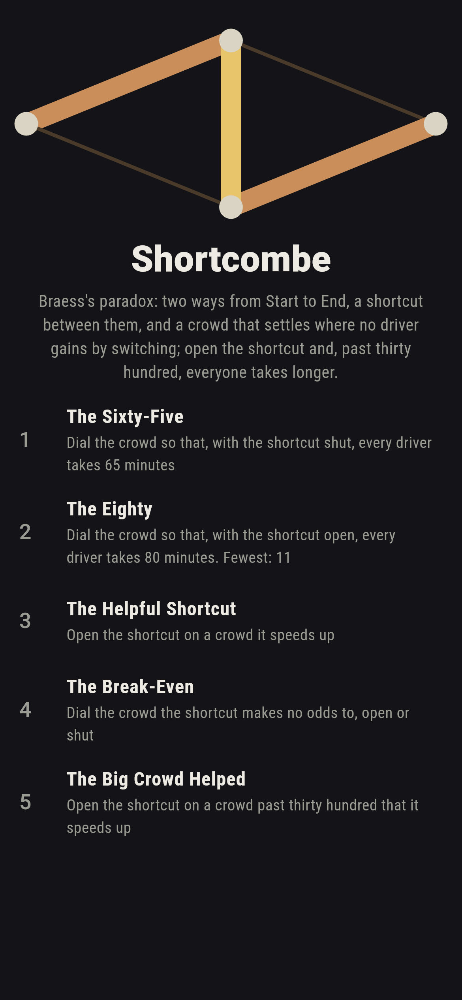
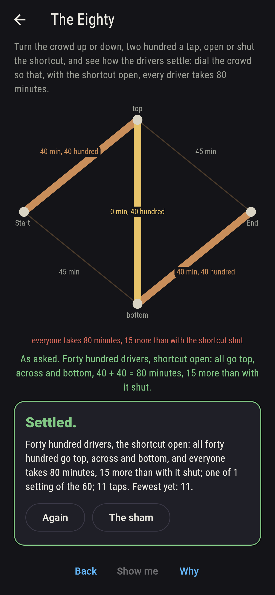
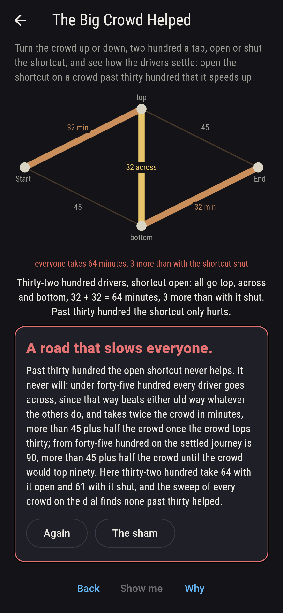
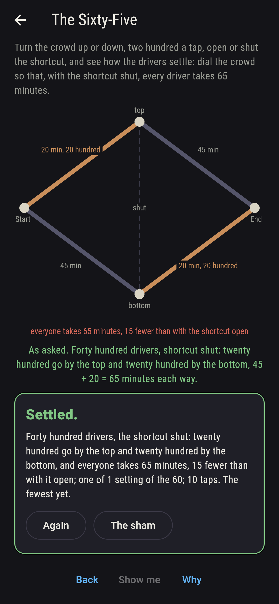
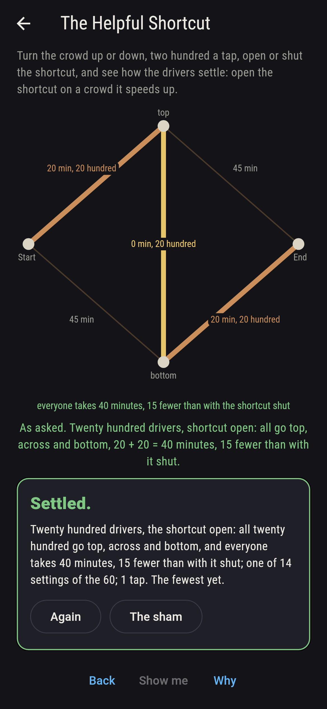
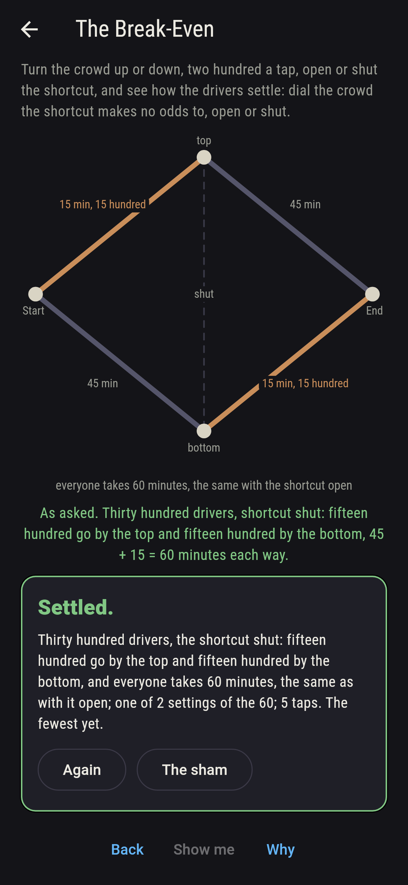
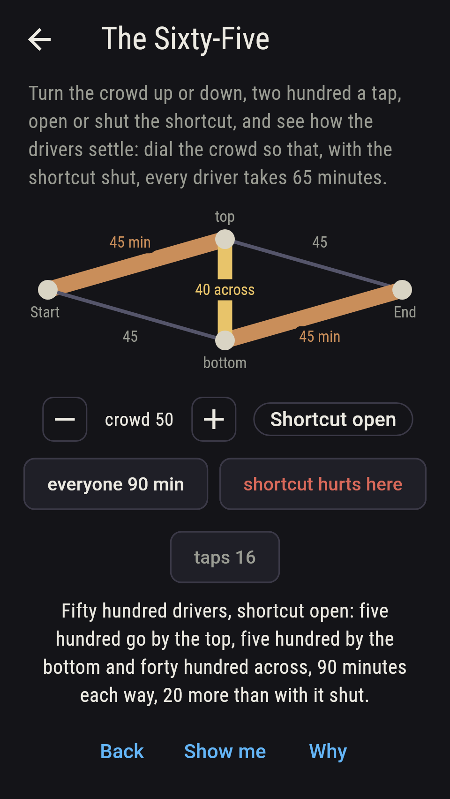
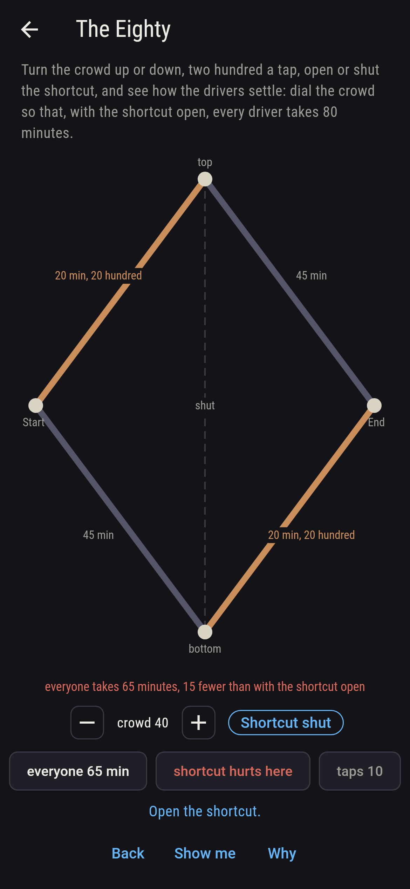
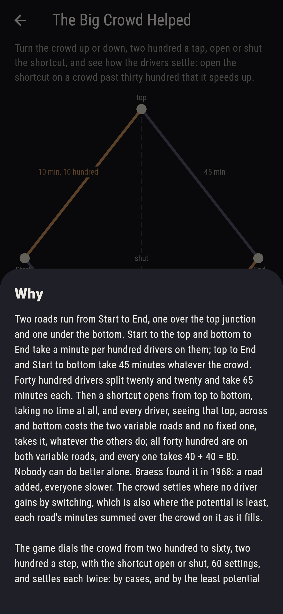

# Shortcombe


Two roads run from Start to End, one over the top junction and one
under the bottom. Start to the top and bottom to End take a minute
per hundred drivers on them; top to End and Start to bottom take 45
minutes whatever the crowd. Forty hundred drivers split twenty and
twenty and take 65 minutes each. Then a shortcut opens from top to
bottom, taking no time at all, and every driver, seeing that top,
across and bottom costs the two variable roads and no fixed one,
takes it, whatever the others do; all forty hundred are on both
variable roads, and every one takes 40 + 40 = 80. Nobody can do
better alone. Braess found it in 1968: a road added, everyone
slower. Turn the crowd up or down, two hundred a tap, open or shut
the shortcut, and see how the drivers settle. The crowd settles where
no driver gains by switching, which is also where the potential is
least, each road's minutes summed over the crowd on it as it fills;
the game settles every crowd from two hundred to sixty, open and
shut, both ways, 60 settings, and the two agree on all 60.

## The asks

1. **The Sixty-Five** - dial the crowd so that, with the shortcut shut, every driver takes 65 minutes
2. **The Eighty** - dial the crowd so that, with the shortcut open, every driver takes 80 minutes
3. **The Helpful Shortcut** - open the shortcut on a crowd it speeds up
4. **The Break-Even** - dial the crowd the shortcut makes no odds to, open or shut
5. **The Big Crowd Helped** - open the shortcut on a crowd past thirty hundred that it speeds up

With the shortcut shut the crowd splits evenly and takes 45 plus half
the crowd, 46 minutes for two hundred to 75 for sixty; forty hundred
take 65. With it open every driver under forty-five hundred goes
across and takes twice the crowd, forty hundred 80; from forty-five
hundred on the old ways come back into use until the variable roads
carry forty-five each, and everyone takes 90. The shortcut helps
under thirty hundred, two hundred taking 4 minutes instead of 46 and
twenty-eight hundred 56 instead of 59, fourteen crowds of the thirty;
at thirty it makes no odds, 60 either way; past thirty it hurts,
fifteen crowds, by 3 minutes at thirty-two hundred, 15 at forty and
22 at forty-six, the most. The Big Crowd Helped is labeled hopeless
on its tile, and the sham admits it the moment the shortcut is open
on a crowd past thirty, or after twelve taps.

## Two voices

The game never asserts what it has not computed, and it computes
everything at least twice:

* **The cases** settle the crowd by reasoning: shut, an even split;
  open, everyone across while the crowd is under forty-five hundred,
  since that way beats either old way whatever the others do, and
  past it the old ways filling until the variable roads carry
  forty-five each; every minute on the sham is that settling's, and
  on every settling every way in use is checked to take the same
  minutes and no way to take fewer, so that no driver gains by
  switching.
* **The potential** reasons about nothing: for every whole split of
  the crowd it sums each road's minutes over the crowd on it as it
  fills, x squared over two for a variable road and 45 x for a fixed
  one, and takes the split that makes the sum least; on all 60
  settings that split is the cases' own, and its own alone, and from
  it the shortcut helps 14 crowds, makes no odds to one and hurts 15.

`tool/check_roads.dart` runs the lot and refuses the bake on any
disagreement.

## The checker's ledger

What `dart run tool/check_roads.dart` printed for the build this
README shipped with, word for word:

```
every crowd from two hundred to sixty hundred, two hundred a step, settled with the shortcut shut and with it open, 60 settings, by cases and again by the least potential over every whole split of the crowd, the two agreeing on all 60 with the least split its own every time, and on every settling every way in use taking the same minutes and no way taking fewer; with the shortcut shut the crowd splits evenly and takes 45 plus half the crowd, 46 minutes for two hundred to 75 for sixty; with it open every driver under forty-five hundred goes across and takes twice the crowd, and from forty-five hundred on the settled journey is 90; the shortcut helps 14 crowds of the 30, under thirty hundred, makes no odds at thirty, 60 minutes either way, and hurts 15, by 3 minutes at thirty-two hundred, 15 at forty and 22 at forty-six, the most; forty hundred take 65 with it shut and 80 with it open

 1 The Sixty-Five       dial the crowd so that, with the shortcut shut, every driver takes 65 minutes: 1 of the 60 settings lands it
 2 The Eighty           dial the crowd so that, with the shortcut open, every driver takes 80 minutes: 1 of the 60 settings lands it
 3 The Helpful Shortcut open the shortcut on a crowd it speeds up: 14 of the 60 settings land it
 4 The Break-Even       dial the crowd the shortcut makes no odds to, open or shut: 2 of the 60 settings land it
 5 The Big Crowd Helped open the shortcut on a crowd past thirty hundred that it speeds up: none of the 60, and the way across said so first
```

## Screenshots

| The sham | The eighty | The big crowd helped admitted |
| --- | --- | --- |
|  |  |  |

| The sixty-five | The helpful shortcut | The break-even | Midway, on the small phone | Show me | The why |
| --- | --- | --- | --- | --- | --- |
|  |  |  |  |  |  |

Screenshots are drawn by `test/showcase_test.dart` at real phone
sizes with the app's own painter, then copied into `docs/` as they
came out; every setting in them was dialled by taps, so nothing
pictured is a setting the game could not reach. The logo and every
launcher icon come out of `test/mark_test.dart` the same way: the
mark is forty hundred drivers with the shortcut open, all of them
going top, across and bottom.

## Building

```
flutter test          # 44 tests, the sweep among them
dart run tool/check_roads.dart
flutter build apk     # or: flutter build ios
```
