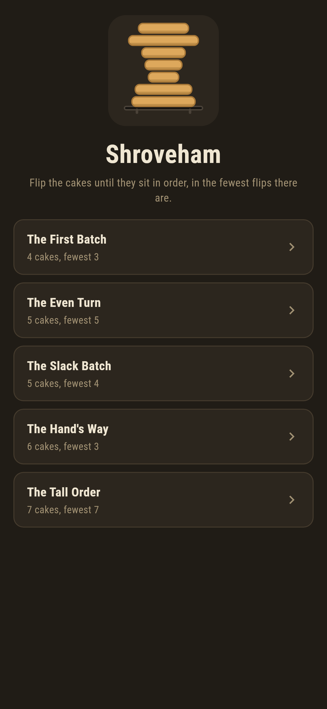
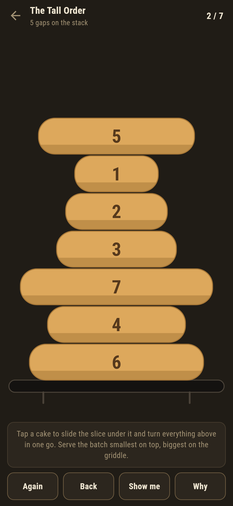
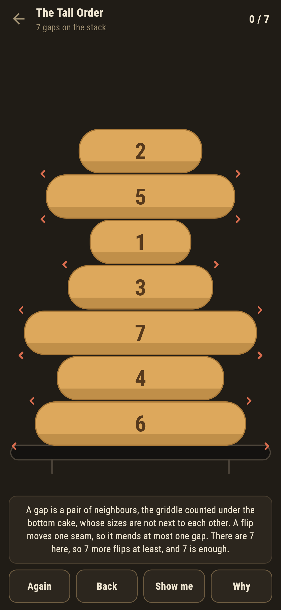
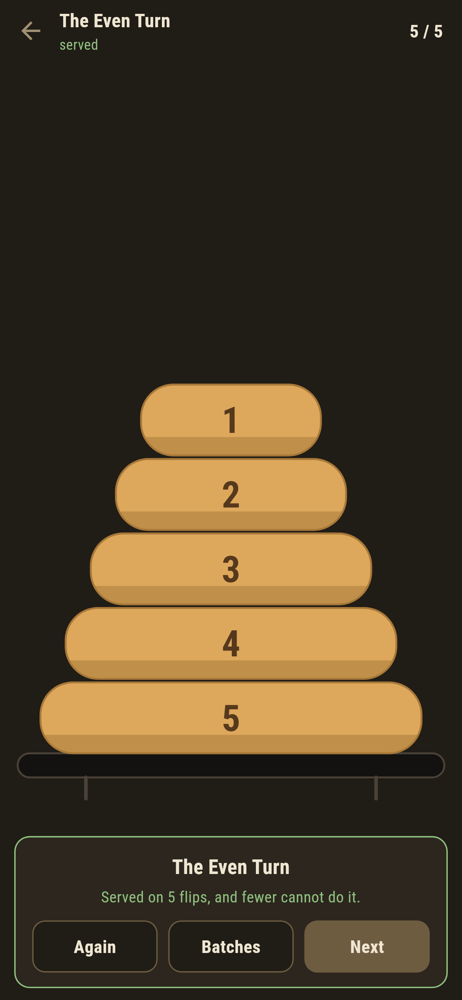
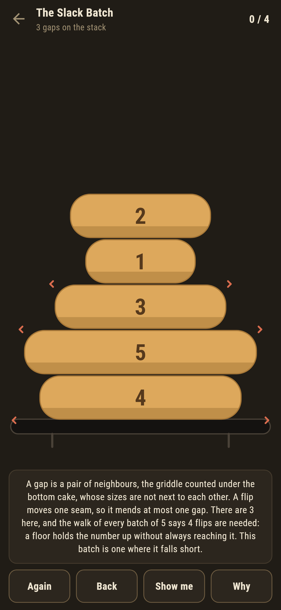
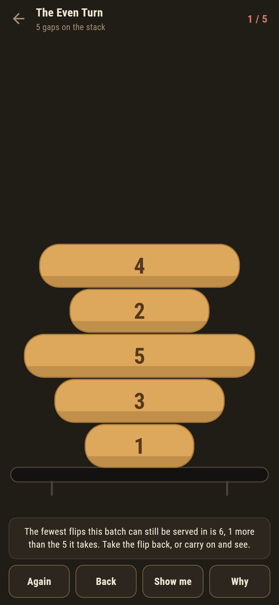

# Shroveham

A pancake sorting puzzle for phones, in Flutter, for Android and iOS.

A batch of griddle cakes has come off the iron in the wrong order. The only
move there is: slide the slice under a cake and turn everything above it
over in one go. Serve the batch smallest on top, biggest on the griddle, in
the fewest flips there are.

| | | | |
|---|---|---|---|
|  |  |  |  |

## The floor you can count on the stack

Read the stack from the griddle up, with the griddle itself counted as one
size bigger than the biggest cake. Every pair of neighbours whose sizes are
not next to each other is a gap. A flip moves exactly one seam, so it mends
at most one gap, and a served batch has none: as many flips as there are
gaps, at least. **Why** marks the gaps on the stack in front of you, and
the suite sweeps every batch of five and every slice to check that no flip
ever mends two.

The other answer is the walk: breadth first over every arrangement a batch
can reach, which is the whole of them. The ledger of every shipped batch,
from `make batches`:

```
$ make batches
 1 The First Batch 4 cakes  fewest 3  written down 3  gaps 3  the hand 3
 2 The Even Turn   5 cakes  fewest 5  written down 5  gaps 5  the hand 5
 3 The Slack Batch 5 cakes  fewest 4  written down 4  gaps 3  the hand 5
 4 The Hand's Way  6 cakes  fewest 3  written down 3  gaps 3  the hand 5
 5 The Tall Order  7 cakes  fewest 7  written down 7  gaps 7  the hand 9
```

On most of the shelf the floor is the answer. The Slack Batch ships because
it is not: its gaps say three and the walk of all 120 batches of five says
four. **Why** owns the shortfall out loud rather than papering over it,
because a floor that is sometimes slack is worth meeting where it is slack.



## The hand's way costs

Every griddle hand sorts the same way: bring the biggest stray cake to the
top, turn it down to its place, two flips a cake. It always works, and the
suite checks it never beats the walk and never spends more than two flips a
cake. On the batch named for it, it spends five where three do, and the
game does not wait for the end to say so: it keeps a live answer to the
fewest flips the batch can still be served in, and the moment a flip pushes
that number past the par the ledger goes red and the words under the
griddle say what the flip cost. A flip can lose one going nowhere or two
going backwards, and the suite pins both.



Take the flip back and the number comes down. Nothing is lost but the walk.

## Show me shows, Why explains

**Show me** slides the slice where the walk likes, and says so. **Why**
counts the gaps and either finishes the argument, when they carry the
number, or says plainly that the walk knows better here, so serving a batch
means knowing the number rather than having bumped into it.

## Building

```
make deps     # fetch packages
make check    # analyze + every test
make batches  # walk the shipped batches: fewest, gaps, the hand's way
make shots    # render the screenshots and redraw the icons
make apk      # Android release build
make ios      # iOS release build (unsigned)
```

The logo and every app icon are drawn by the game's own painter in
`test/mark_test.dart`. There is no image in this repository that was not
produced by code in it.

## How it is put together

```
lib/griddle/batch.dart     a batch: the cakes as dealt, the answer
lib/griddle/fewest.dart    the walk, the gap floor, and the hand's way
lib/griddle/batches.dart   the five batches that ship
lib/griddle/play.dart      a batch in play: flips, gaps, the live fewest
lib/ui/                    the painter, the screens, the mark
tool/check_batches.dart    the ledger above
```

The tests hold the written-down numbers against the walk, the floor against
every batch of five and six, the one-gap-a-flip argument against every
flip there is at that size, the hand against its two bounds, and the
pictures against the real widget tree. If any of that drifts, `make check`
goes red before anything leaves the machine.
