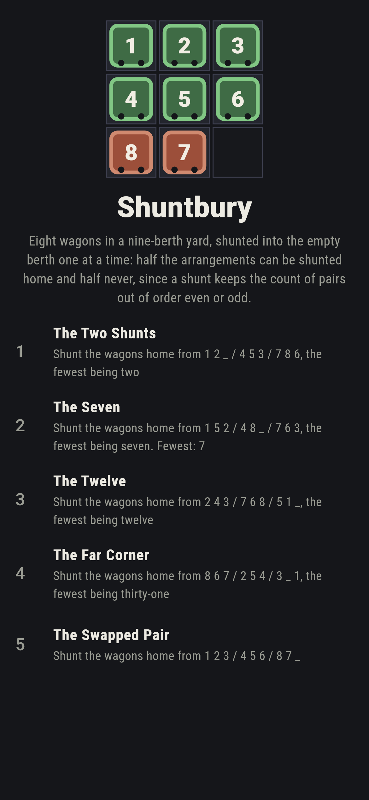
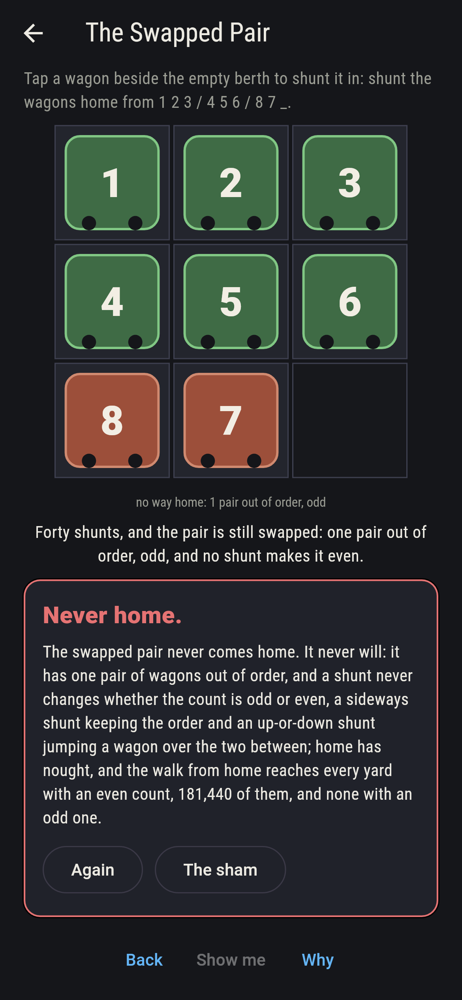
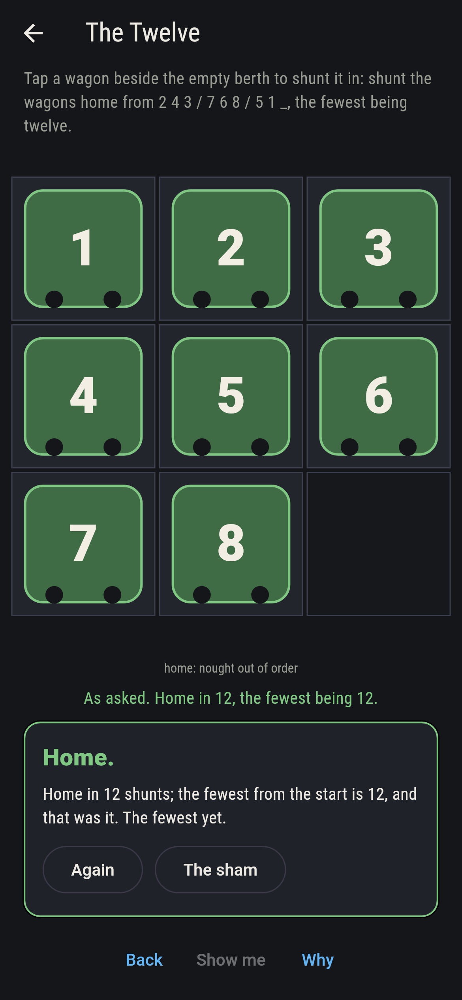
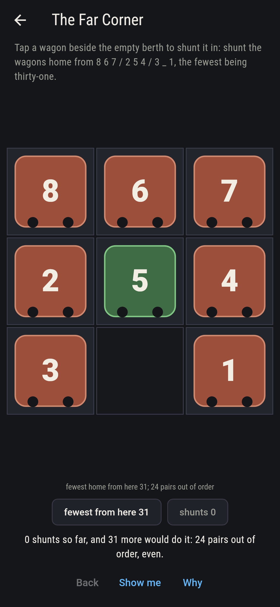
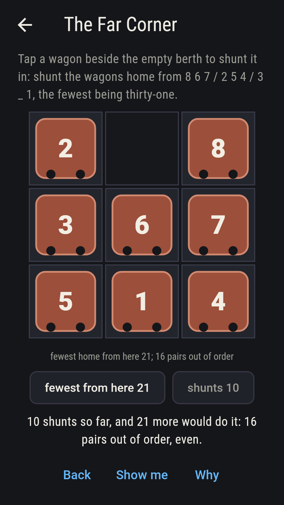
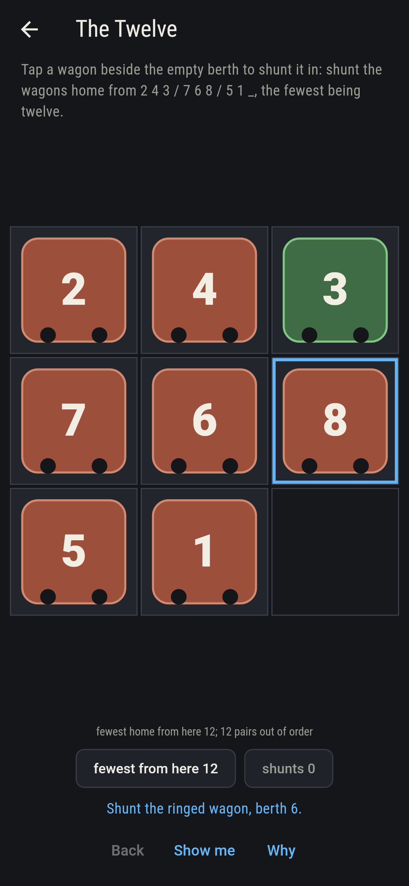
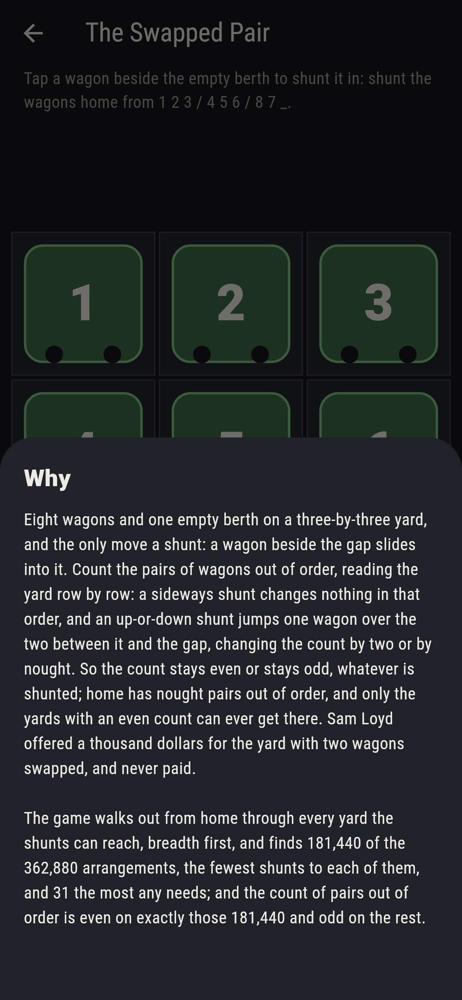

# Shuntbury


Eight wagons and one empty berth on a three-by-three yard, and the
only move a shunt: a wagon beside the gap slides into it. Count the
pairs of wagons out of order, reading the yard row by row: a
sideways shunt changes nothing in that order, and an up-or-down
shunt jumps one wagon over the two between it and the gap, changing
the count by two or by nought. So the count stays even or stays odd,
whatever is shunted; home has nought pairs out of order, and only
the yards with an even count can ever get there. Sam Loyd offered a
thousand dollars for the yard with two wagons swapped, and never
paid. The game walks out from home through every yard the shunts
can reach, breadth first, 181,440 of the 362,880 arrangements, with
the fewest shunts to each and 31 the most any needs; and the count
of pairs out of order is even on exactly those 181,440 and odd on
the rest, arrangement by arrangement.

## The asks

1. **The Two Shunts** - shunt the wagons home from 1 2 _ / 4 5 3 / 7 8 6, the fewest being two
2. **The Seven** - shunt the wagons home from 1 5 2 / 4 8 _ / 7 6 3, the fewest being seven
3. **The Twelve** - shunt the wagons home from 2 4 3 / 7 6 8 / 5 1 _, the fewest being twelve
4. **The Far Corner** - shunt the wagons home from 8 6 7 / 2 5 4 / 3 _ 1, the fewest being thirty-one
5. **The Swapped Pair** - shunt the wagons home from 1 2 3 / 4 5 6 / 8 7 _

The two shunts is one of four yards at that distance, the seven one
of 62 and the twelve one of 748; the far corner needs thirty-one,
and only two of the 181,440 yards the walk reaches sit that far,
this one and 6 4 7 / 8 5 _ / 3 2 1. The pairs out of order stand at
4, 10, 12 and 24 on the four, even every one. The Swapped Pair is
labeled hopeless on its tile: one pair out of order, odd, and no
shunt makes it even; the sham admits it after forty shunts.

## Two voices

The game never asserts what it has not computed, and it computes
everything at least twice:

* **The walk** goes out from home breadth first through every yard a
  shunt can reach, 181,440 of them, and keeps the fewest shunts to
  each; every fewest on the sham is the walk's, the show-me follows a
  shortest way home, and every shunt from every reachable yard is
  checked to move the fewest by exactly one.
* **The count of pairs out of order** is read off every one of the
  362,880 arrangements with no walk at all, and it is even on exactly
  the 181,440 the walk reaches and odd on the other 181,440; every
  shunt from every reachable yard keeps it even, which is the whole
  of the why.

`tool/check_shunts.dart` runs the lot and refuses the bake on any
disagreement.

## The checker's ledger

What `dart run tool/check_shunts.dart` printed for the build this
README shipped with, word for word:

```
every yard the shunts can reach walked out from home breadth first, 181,440 of the 362,880 arrangements of eight wagons and a gap, with the fewest shunts to each, 31 the most and two yards that far, 8 6 7 / 2 5 4 / 3 _ 1 and 6 4 7 / 8 5 _ / 3 2 1; the count of pairs out of order is even on exactly those 181,440 and odd on the other 181,440, arrangement by arrangement, and every shunt from every reachable yard keeps it even and moves the fewest by exactly one; the two shunts is one of 4 yards at that distance, the seven one of 62, the twelve one of 748, and the pairs out of order stand at 4, 10, 12 and 24 on the four asks that come home and at 1 on the swapped pair, which the walk never reaches

 1 The Two Shunts   shunt the wagons home from 1 2 _ / 4 5 3 / 7 8 6, the fewest being two: the walk from home says 2
 2 The Seven        shunt the wagons home from 1 5 2 / 4 8 _ / 7 6 3, the fewest being seven: the walk from home says 7
 3 The Twelve       shunt the wagons home from 2 4 3 / 7 6 8 / 5 1 _, the fewest being twelve: the walk from home says 12
 4 The Far Corner   shunt the wagons home from 8 6 7 / 2 5 4 / 3 _ 1, the fewest being thirty-one: the walk from home says 31
 5 The Swapped Pair shunt the wagons home from 1 2 3 / 4 5 6 / 8 7 _: never, and the odd count said so first
```

## Screenshots

| The sham | The seven | The swapped pair admitted |
| --- | --- | --- |
|  |  |  |

| The two shunts | The twelve | The far corner, as dealt | Midway, on the small phone | Show me | The why |
| --- | --- | --- | --- | --- | --- |
|  |  |  |  |  |  |

Screenshots are drawn by `test/showcase_test.dart` at real phone
sizes with the app's own painter, then copied into `docs/` as they
came out; every wagon in them was shunted by taps, so nothing
pictured is a yard the game could not reach. The logo and every
launcher icon come out of `test/mark_test.dart` the same way: the
mark is the swapped pair, home but for the 7 and the 8.

## Building

```
flutter test          # 43 tests, the walk among them
dart run tool/check_shunts.dart
flutter build apk     # or: flutter build ios
```
