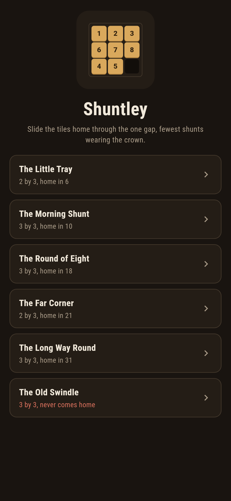
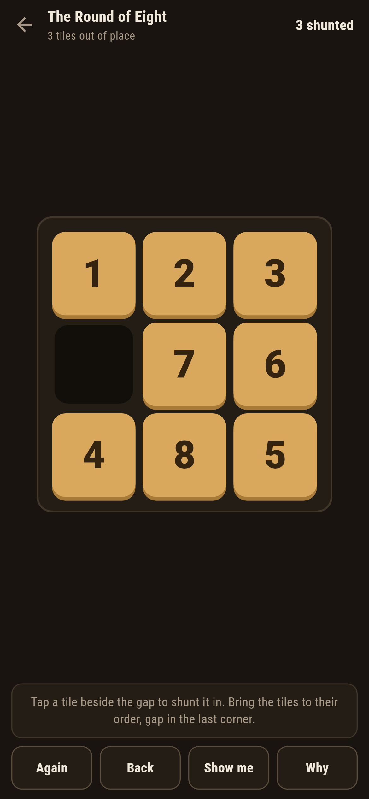
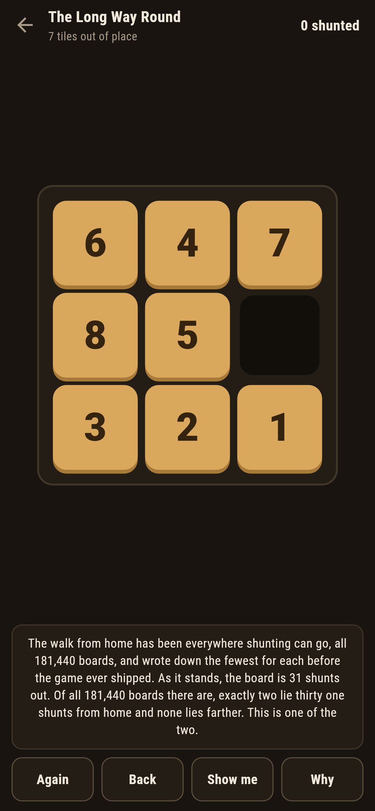
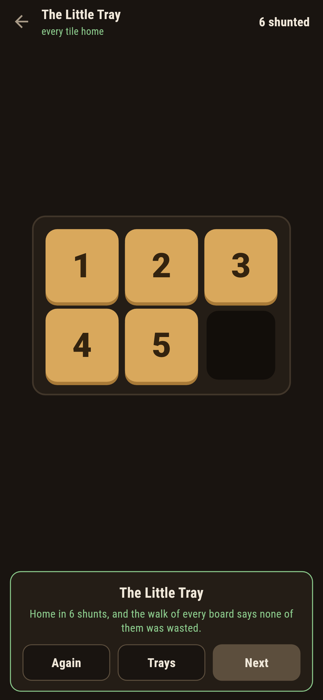
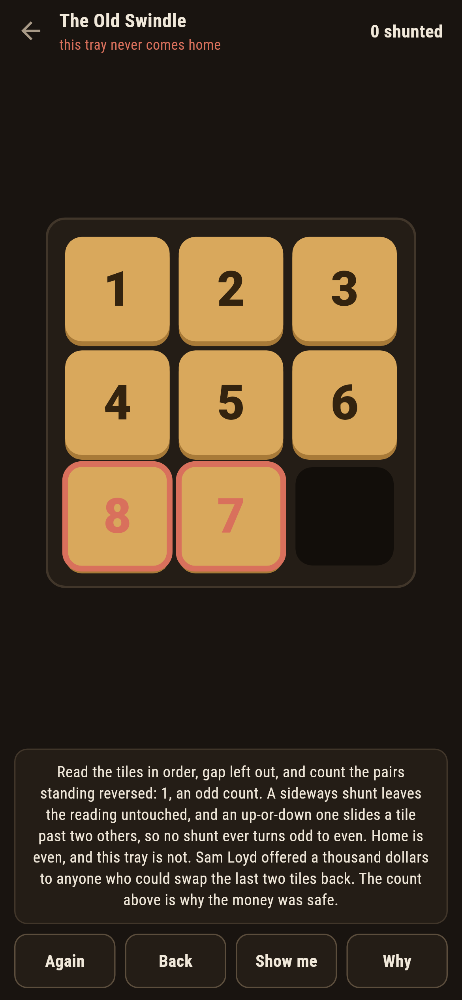
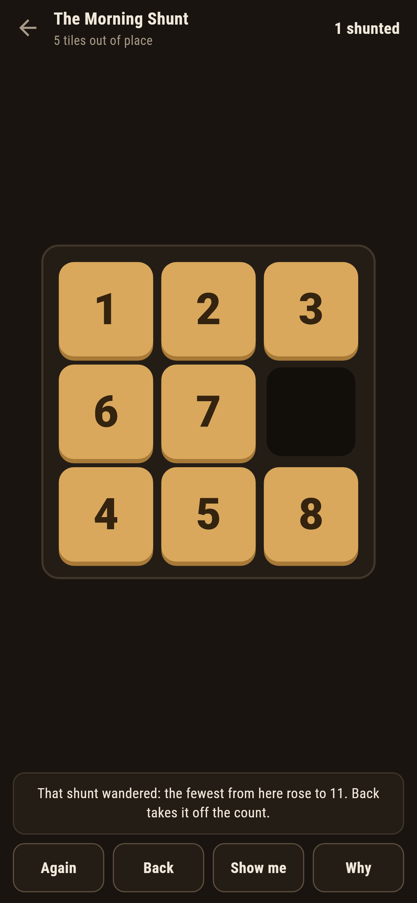

# Shuntley

A sliding-tile puzzle for phones, in Flutter, for Android and iOS.

A tray of numbered tiles with one gap. A tile beside the gap can shunt
into it; bring the tiles to their order with the gap in the last
corner. This is the fifteen puzzle cut down to a phone screen, and the
game carries its two famous facts openly: how far home can be, and
which trays can never get there at all.

| | | | |
|---|---|---|---|
|  |  |  |  |

## Two ways of knowing

The suite knows the game two ways that share nothing. A walk from the
home board, breadth first, shunts its way to every board reachable and
writes down the fewest for each; it knows nothing of parity. A pair
count reads the tiles in order, gap left out, and counts the pairs
standing reversed; it never shunts anything. On every arrangement
there is, all 720 of the little tray and all 362,880 of the eight, the
walk reaches a board exactly when its pairs count even, and the
checker refuses the bake on the first disagreement.

```
$ make trays
every arrangement of 2 by 3: the walk reaches a board exactly when its pairs count even, all 720, half of them home-comers
every arrangement of 3 by 3: the walk reaches a board exactly when its pairs count even, all 362880, half of them home-comers

 1 The Little Tray    2 by 3  home in 6
 2 The Morning Shunt  3 by 3  home in 10
 3 The Round of Eight 3 by 3  home in 18
 4 The Far Corner     2 by 3  home in 21
 5 The Long Way Round 3 by 3  home in 31
 6 The Old Swindle    3 by 3  never comes home

the farthest little-tray board lies 21 out; of the eight's 181,440 exactly two lie 31 out and none farther
```

Why the parity never moves is an argument small enough to hold in one
hand: a sideways shunt leaves the gapless reading untouched, and an
up-or-down one slides a tile past exactly two others on a three-wide
tray, so the reversed-pair count changes by an even step every time.
Home counts nought. An odd tray is dead on arrival.

## The long way round

The Long Way Round ships at thirty one shunts because nothing ships
farther: the walk of all 181,440 reachable boards bottoms out at 31,
exactly two boards lie there, and this is one of the two. The Far
Corner is the same claim for the little tray at twenty one. Both
numbers are walked fresh by the checker every time.

## The old swindle

Sam Loyd offered a thousand dollars to anyone who could swap the last
two tiles back. The money was safe, and the game ships his board in
the house tradition of maps nobody can win: **Why** rims the reversed
pair red and counts it in front of you, one pair, an odd count, and no
shunt ever turns odd to even.



## The live number

The game never refuses a legal shunt; it counts. The fewest from the
board as it stands is looked up after every touch, and a shunt that
raises it is called out the moment it lands, with **Back** waiting.
**Show me** points at a shunt that steps one nearer along a shortest
way.



## Building

```
make deps    # fetch packages
make check   # analyze + every test
make trays   # walk every arrangement both ways and print the ledger
make shots   # render the screenshots and redraw the icons
make apk     # Android release build
make ios     # iOS release build (unsigned)
```

The logo and every app icon are drawn by the game's own painter in
`test/mark_test.dart`. There is no image in this repository that was not
produced by code in it.

## How it is put together

```
lib/shunt/rules.dart    the shunt, the walk, the pair count
lib/shunt/tray.dart     a tray: a name, a deal, its numbers
lib/shunt/trays.dart    the six trays that ship
lib/shunt/play.dart     a tray being shunted: the count, take-back, the
                        live fewest
lib/ui/                 the painter, the screens, the mark
tool/check_trays.dart   the sweeps and the ledger above
```

The tests shunt tiles by hand at the walls, sweep both tray sizes
against the pair count, pin the two deepest boards and the twenty one
and thirty one they lie at, bring every winnable tray home by
following the game's own pointer, count the swindle's one reversed
pair, and hold the pictures against the real widget tree. If any of
that drifts, `make check` goes red before anything leaves the machine.
