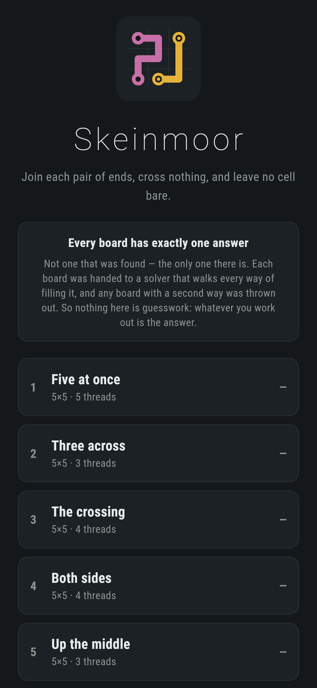
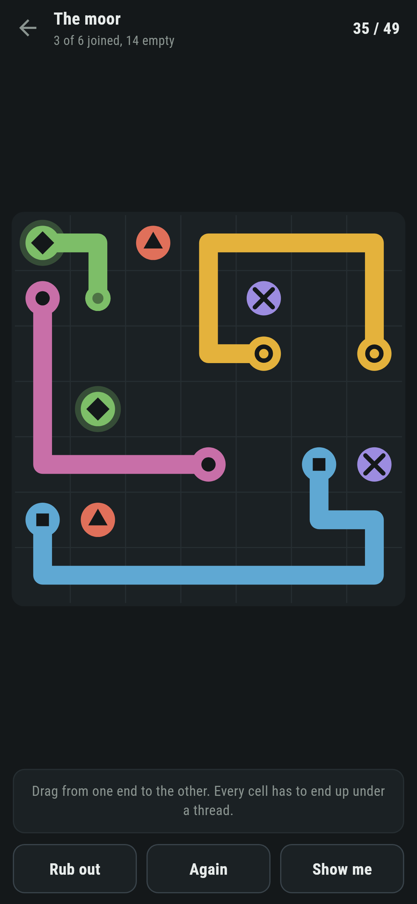
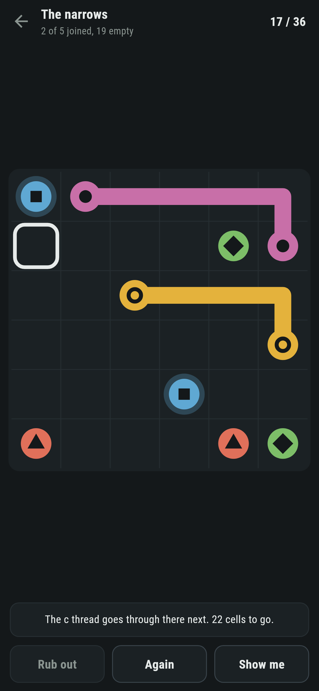
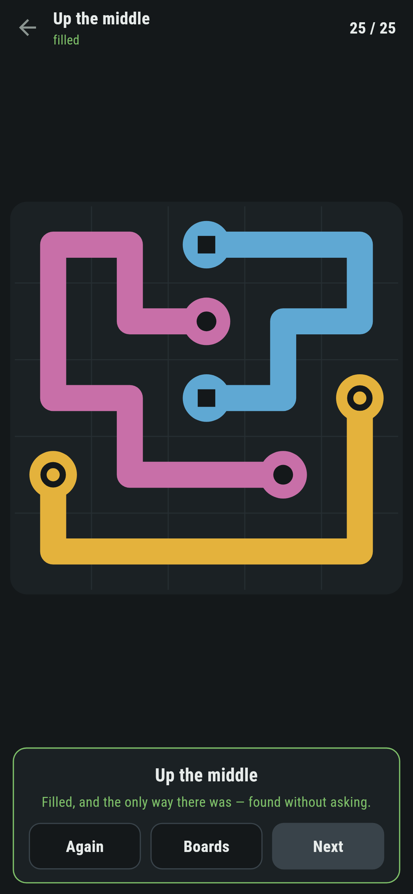
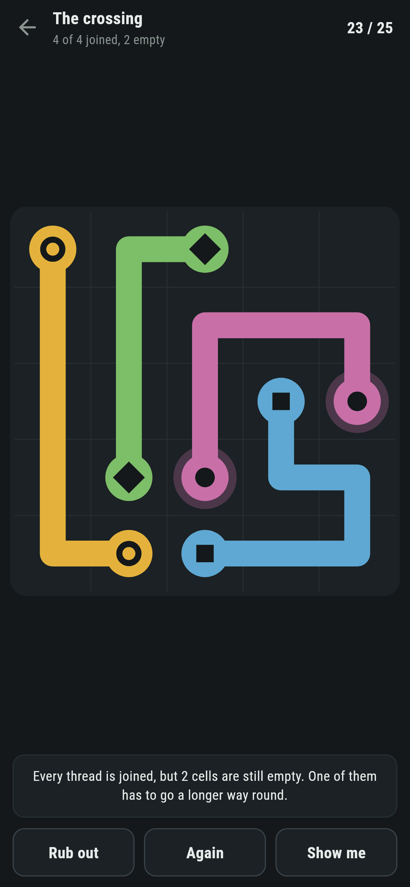

# Skeinmoor

A thread puzzle for phones, in Flutter, for Android and iOS.

Join each pair of ends without crossing anything, and leave no cell bare.
Every board has exactly one way of being filled, and that is checked rather
than hoped.

| | | | |
|---|---|---|---|
|  |  |  |  |

## Three rules, and the third one is the game

Join the two ends of each thread. Cross nothing. **Leave no cell bare.**

Drop the third rule and there is nothing here: any board can be joined up a
dozen ways, and joining it up is a straight line and a shrug. Keep it, and the
board stops being a set of separate little mazes. A thread that takes the
short way round leaves cells nobody else can reach, so where one thread goes
is decided by where all the others have to go.

That is the mistake the game exists to catch, and it says so:



> Every thread is joined, but 2 cells are still empty. One of them has to go a
> longer way round.

## Exactly one way of being filled

Not a way that was found: the only one there is. `test/thread_test.dart`
walks every way of filling each board that ships and fails if there are two:

```dart
final found = Threader(board.field).ways(enough: 3);
expect(found.count, 1,
    reason: '${board.name} has ${found.count} ways of being filled');
```

The count is of ways *and orderings*: two ways of walking the same cells count
as two, so a board that gets through has nothing at all left to choose. That
is what makes a hint honest. The one way through is worked out once when the
board opens, and **Show me** reads a cell off it rather than searching again
from a half-drawn board:

> The c thread goes through there next. 14 cells to go.

And when a thread is somewhere the answer never goes, it says that instead,
because a thread in the wrong place is in somebody else's way and no amount of
drawing elsewhere will help.

## Finding them is nearly all throwing them away

`make find` works backwards. Filling a board is easy, since threads can be
grown at random until every cell is taken, and the ends of those threads are a
puzzle whose answer is known before it is asked. Whether it is the *only* answer is what
the solver is for, and almost nothing survives it:

```
$ make find ARGS="6 4 3"
--- one way, 4 threads, 253 steps ---
        '..c..d
        '...b..
        '.dc...
        '......
        '...b..
        'a..a..
--- one way, 4 threads, 2835 steps ---
        '..b..b
        '......
        '.....d
        '..a...
        '..c..c
        '...d.a

kept 2 of 200000
```

It was asked for three and gave up after two hundred thousand tries with two.
The second of them ships as board nine. `make boards` walks all eleven:

```
 1 Five at once     5x5  5 threads  1 way      25 steps  10.9ms
 5 Up the middle    5x5  3 threads  1 way     233 steps   0.3ms
 9 Four on six      6x6  4 threads  1 way    2835 steps   4.0ms
11 The moor         7x7  6 threads  1 way     552 steps   1.1ms
```

Fewer threads on a bigger board is harder to find and harder to solve: the
count of steps the search takes is a fair guess at how much there is to work
out, and it is what the boards are ordered by.

## A thread may run alongside itself

There is no fourth rule. A thread that doubles back and lies against its own
line is allowed, and half these boards need it. The logo is one of them.

It would be cheaper not to allow it. Refusing it cuts the search down by an
order of magnitude, and the first version did refuse it. But then what the
solver counts is not what a finger can do on the screen, and "the only way"
would be a claim about a game nobody is playing. The rules the search obeys
are the rules the screen obeys, and that is worth the extra searching.

## Shape, not colour


Eight threads is more colours than anybody should have to tell apart, so the
ends carry shapes as well: a disc, a ring, a square, a diamond, a triangle, a
cross, a bar and a star. The pairing, which end goes with which, is a shape
match. Nothing in the game depends on seeing colour.

## Running it

```
make deps    # flutter pub get
make test    # everything
make analyze
make shots   # render the screens into build/showcase, redraw the logo and icons
make boards  # walk every shipped board and count the ways of filling it
make find    # look for new boards with exactly one way
make apk     # release APK
make ios     # release iOS build, unsigned
```

## Tests

`flutter test` runs the board (reading a picture into pairs of ends, which
cells touch), the solver (a small board it can fill, one it cannot, with a
draughtsboard argument for why, one with room to wander and so several ways,
and every shipped board: exactly one way, a way that really covers every cell
once, and no thread short enough to join itself on sight), and the drawing
(going on, not across corners, not onto somebody else's end, rubbing back a
cell at a time, dragging back over its own line, cutting another thread back,
drawing from either end, and finishing only when nothing is left over).

Then the game through the screen: taking hold of a thread, drawing with a
finger, dragging back, one thread cutting another, joining up, **Rub out**,
**Again**, **Show me** pointing at the next cell and at the wrong one, the
warning when every thread is joined and cells are bare, reached by really
joining them all the short way, and every board filled to the last cell.

Screenshots come from `test/showcase_test.dart`, and every cell with wool on
it in them was drawn there through the screen. `test/mark_test.dart` draws the
logo, the launcher icons at every density Android asks for and every size the
iOS icon set asks for; there is no image in this repository that was not
produced by it.
