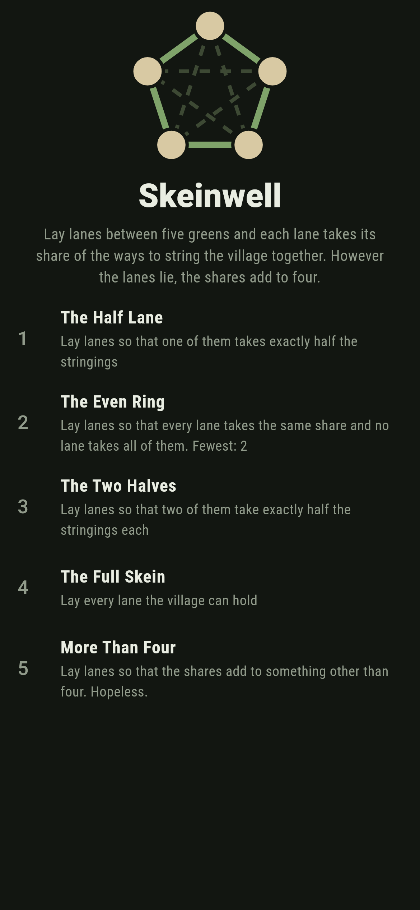
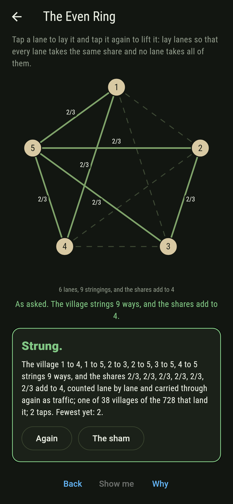
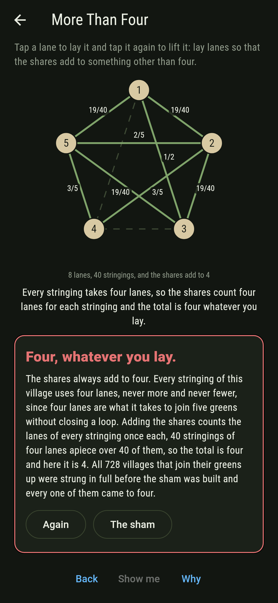
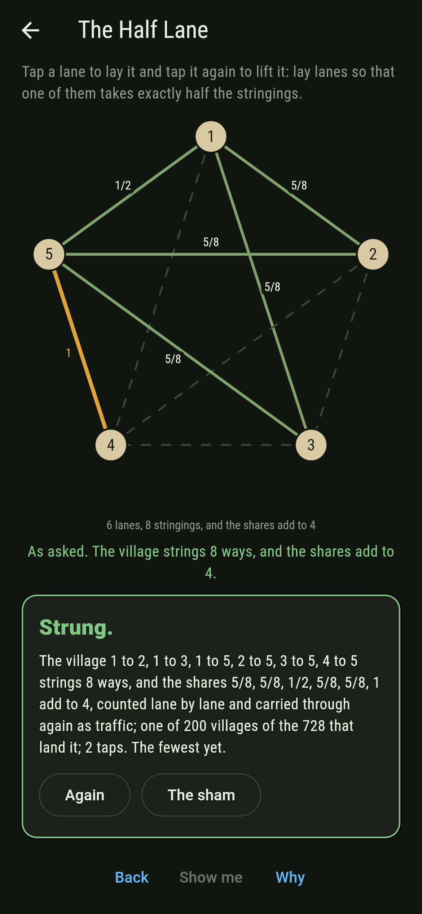
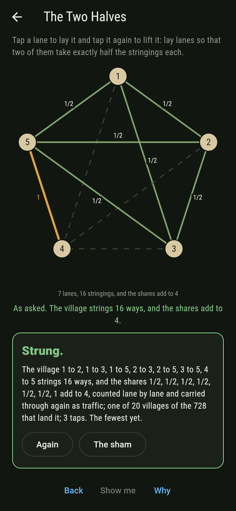
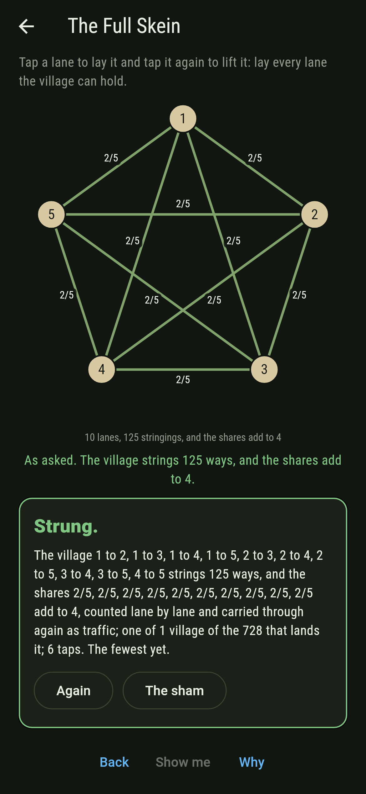
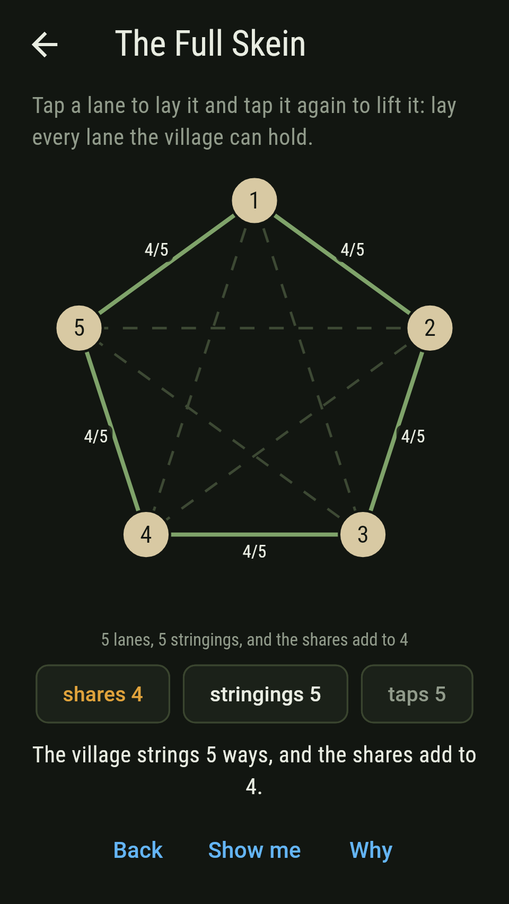
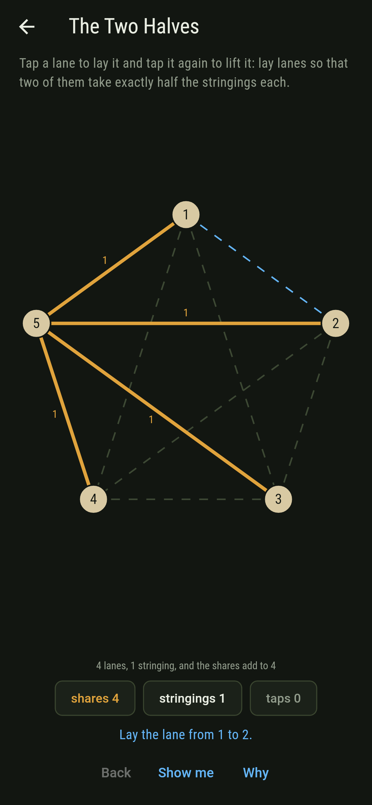
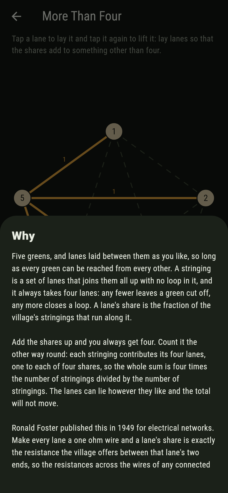

# Skeinwell


Five greens, and lanes laid between them however you like so long as
every green can still be reached. A stringing is a set of lanes that
joins them all up without closing a loop, and it always takes four
lanes. Each lane gets a share: the fraction of the village's stringings
that run along it. Tap a lane to lay it, tap it again to lift it, and
watch the shares move. They always add to four.

## The asks

1. **The Half Lane** - lay lanes so that one of them takes exactly half the stringings
2. **The Even Ring** - lay lanes so that every lane takes the same share and no lane takes all of them
3. **The Two Halves** - lay lanes so that two of them take exactly half the stringings each
4. **The Full Skein** - lay every lane the village can hold
5. **More Than Four** - lay lanes so that the shares add to something other than four

Of the 728 villages that join their greens up, 200 have a lane at
exactly a half, and every one of those has six lanes or more. 38 give
every lane the same share without giving any lane all of them: the 12
rings through all five greens at 4/5 a lane, 15 pairs of triangles
meeting at a green and 10 that join two greens to the other three, all
at 2/3, and the full skein at 2/5. 20 have two lanes or more at a half,
all of them with seven lanes, and no village of five greens gets more
than six lanes to a half at once. The full skein is one village, all
ten lanes, 125 stringings, 2/5 a lane. More Than Four is labeled
hopeless on its tile, and the card at the end of the ask says why on a
finger.

## Why it is always four

Every stringing uses four lanes. Not sometimes four: always, because
four lanes are what it takes to join five greens without closing a
loop, and any set of lanes that does that has exactly that many.

Now add the shares. A lane's share is the count of stringings running
along it divided by the count of stringings. Add those counts over all
the lanes and you have counted the lanes of every stringing once each,
four apiece, so the sum is four times the number of stringings, over
the number of stringings. Four. The lanes can lie however they like.

Ronald Foster published this in 1949, about electrical networks. Make
every lane a one ohm wire and a lane's share turns out to be exactly
the resistance the network offers between that lane's two ends, so the
resistances measured across the wires of any connected network add up
to the number of nodes less one. The board says the same thing in
whole numbers of stringings.

## Two voices

The game never asserts what it has not computed, and it computes
everything at least twice:

* **Counting** lists every stringing of the village one at a time and
  counts how many run along each lane.
* **Carrying** counts nothing. It puts a unit of traffic in at one end
  of a lane and takes it out at the other, lets it spread over every
  lane at once, and reads the difference across the lane by solving the
  network in exact fractions.

The two are set against each other on every lane of all 728 villages,
and they agree on every one.

`tool/check_skeins.dart` runs the lot and refuses the bake on any
disagreement.

## The checker's ledger

What `dart run tool/check_skeins.dart` printed for the build this
README shipped with, word for word:

```
every village the board can hold taken, all 1,024 ways the ten lanes can lie, of which 728 join every green up and 296 leave a green cut off; each of the 728 strung in full, its stringings listed one by one, and every lane's share found twice, once by counting the stringings that run along it and once by putting a unit of traffic in at one end of the lane and out at the other and reading the difference across it in exact fractions: the two agree on every lane of every village; and the shares add to 4 on all 728 of them, never once to anything else; a lane takes all the stringings exactly when lifting it cuts a green off, which happens 1,000 times over the sweep, and a lane takes exactly half 300 times, no village getting more than 6 of its lanes to a half at once, which one does: 1 to 2, 1 to 3, 1 to 4, 1 to 5, 2 to 3, 2 to 4, 3 to 4; the villages string up in 125 at 1, 150 at 3, 60 at 4, 12 at 5, 120 at 8, 15 at 9, 60 at 11, 10 at 12, 20 at 16, 10 at 20, 60 at 21, 30 at 24, 30 at 40, 15 at 45, 10 at 75, 1 at 125 ways, the 125 that string a single way being the smallest villages there are and the one that strings 125 ways being the full skein; and 38 villages give every lane the same share without giving any lane all of them: 12 rings of five at 4/5 a lane, 25 of six lanes at 2/3, being 15 pairs of triangles meeting at a green and 10 joining two greens to the other three, and the full skein at 2/5

 1 The Half Lane  lay lanes so that one of them takes exactly half the stringings: 200 of the 728 villages land it, the cheapest in 2 taps
 2 The Even Ring  lay lanes so that every lane takes the same share and no lane takes all of them: 38 of the 728 villages land it, the cheapest in 2 taps
 3 The Two Halves lay lanes so that two of them take exactly half the stringings each: 20 of the 728 villages land it, the cheapest in 3 taps
 4 The Full Skein lay every lane the village can hold: 1 of the 728 villages lands it, the cheapest in 6 taps
 5 More Than Four lay lanes so that the shares add to something other than four: none of the 728, and the four lanes of a stringing say why
```

## Screenshots

| The sham | The even ring | More than four |
| --- | --- | --- |
|  |  |  |

| The half lane | The two halves | The full skein | Midway, on the small phone | Show me | The why |
| --- | --- | --- | --- | --- | --- |
|  |  |  |  |  |  |

Screenshots are drawn by `test/showcase_test.dart` at real phone sizes
with the app's own painter, then copied into `docs/` as they came out;
every lane in them was laid by a tap on the board, so nothing pictured
is a village the game could not reach. The village across the top of
the sham shot is the mark rather than a run of taps. The logo and every launcher icon
come out of `test/mark_test.dart` the same way: the mark is the ring
that runs through all five greens, every lane taking 4/5 of the
stringings, with the lanes it does not lay drawn as dashes.

## Building

```
flutter test          # 56 tests, the sweep among them
dart run tool/check_skeins.dart
flutter build apk     # or: flutter build ios
```
