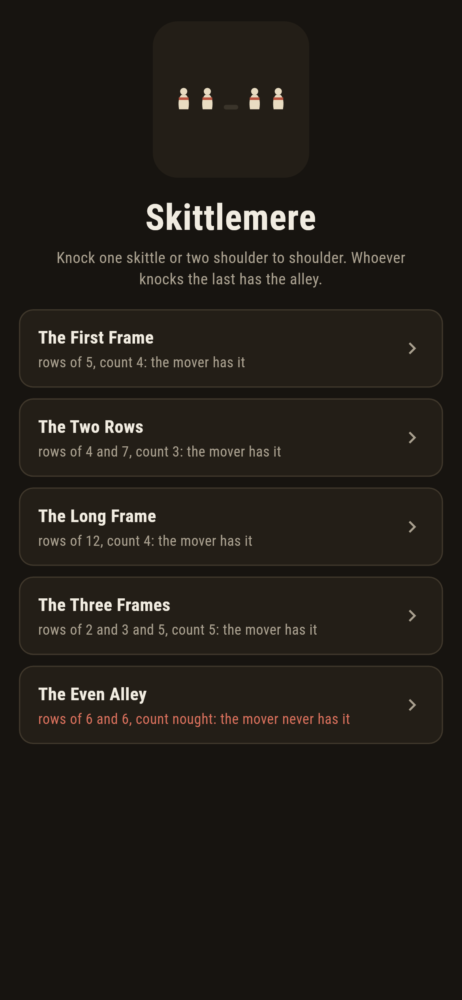
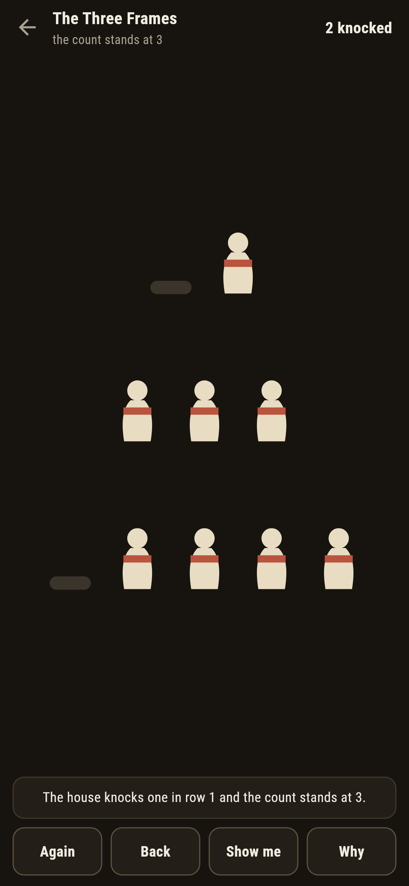
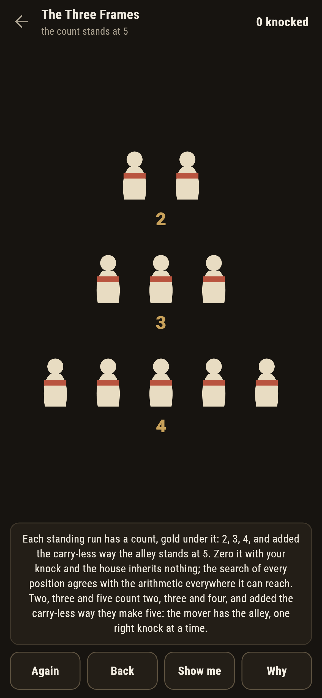
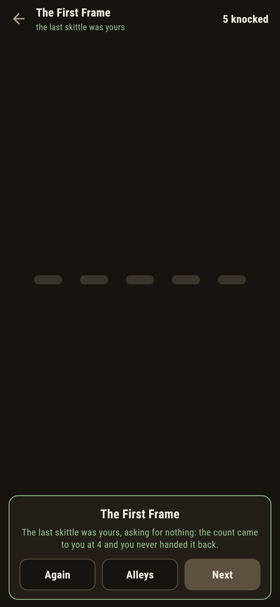
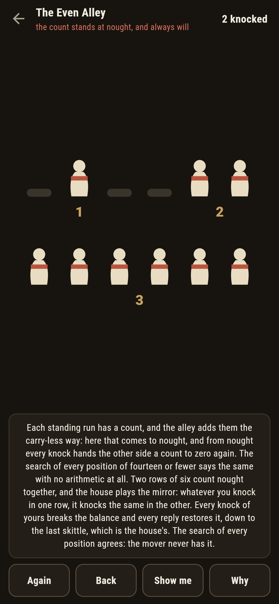
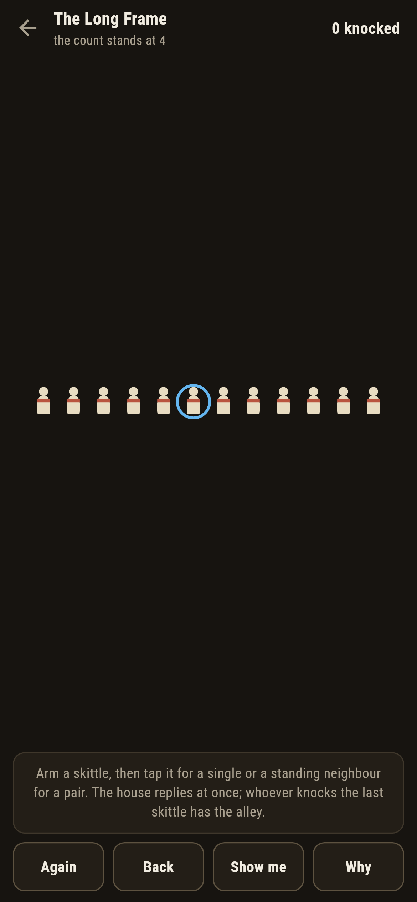

# Skittlemere

A skittle-alley game for phones, in Flutter, for Android and iOS.

Rows of skittles. A knock fells one, or two standing shoulder to
shoulder, and may split a row. Whoever knocks the last skittle has
the alley, and the house replies at once, never blundering. This is
the old game of Kayles, and the arithmetic that owns it is on the
table, not behind the counter.

| | | | |
|---|---|---|---|
|  |  |  |  |

## Two ways of knowing

Every standing run of skittles has a count, and the alley adds its
runs' counts the carry-less way; the mover has the alley exactly when
the sum is not nought. None of that is trusted: a search of every
position of fourteen or fewer skittles, 507 shapes knowing nothing
but the moves, agrees with the arithmetic on every one, and the
checker refuses the bake on the first parting. The single-row counts
run the famous limping table, periodic with period twelve from
seventy one on, and the suite recounts the stretch it ships.

```
$ make alleys
every alley of 14 or fewer skittles, 507 shapes: the search and the skittle arithmetic never part
the book table holds to fifteen, and the period of twelve holds along 71 to 200

 1 The First Frame  rows 5  count 4: the mover has it
 2 The Two Rows     rows 4/7  count 3: the mover has it
 3 The Long Frame   rows 12  count 4: the mover has it
 4 The Three Frames rows 2/3/5  count 5: the mover has it
 5 The Even Alley   rows 6/6  count nought: the mover never has it
```

## The even alley

Two rows of six count nought together, and the alley ships lost, in
the house tradition of games nobody can win. The house plays the
mirror: whatever you knock in one row, it knocks the same in the
other, every reply restoring the balance down to the last skittle,
which is the house's. The words say so before the first ball, and
the search of every position stands behind them.



## The live count

The ledger shows the alley's count as it stands, updated at every
knock, the house's included. **Why** chips each standing run with its
count in gold and speaks the sum; **Show me** points at a knock that
zeroes the count, wherever one exists, and owns it plainly when none
does.



## Building

```
make deps    # fetch packages
make check   # analyze + every test
make alleys  # recount every alley, search every position, print the ledger
make shots   # render the screenshots and redraw the icons
make apk     # Android release build
make ios     # iOS release build (unsigned)
```

The logo and every app icon are drawn by the game's own painter in
`test/mark_test.dart`. There is no image in this repository that was not
produced by code in it.

## How it is put together

```
lib/alley/rules.dart     the counts, the carry-less sum, the search
lib/alley/frame.dart     an alley: rows, its count
lib/alley/frames.dart    the five alleys that ship
lib/alley/play.dart      an alley being bowled: knocks, splits, the
                         house's reply
lib/ui/                  the painter, the screens, the mark
tool/check_frames.dart   the sweeps, the table, the ledger above
```

The tests hold the counts to the book table, sweep the search against
the arithmetic over all 507 small shapes, verify the period of
twelve along its stretch, watch the house zero every knock in the
even alley and never let first-legal play steal it, win every
winnable alley by following the zeroing knock, and hold the pictures
against the real widget tree. If any of that drifts, `make check`
goes red before anything leaves the machine.
