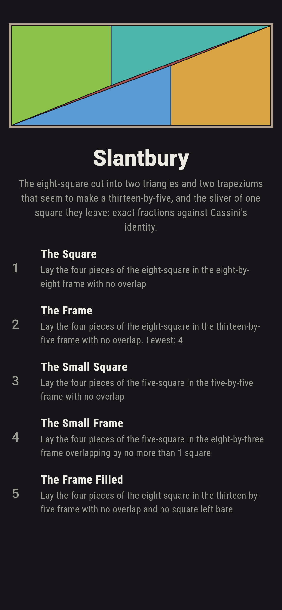
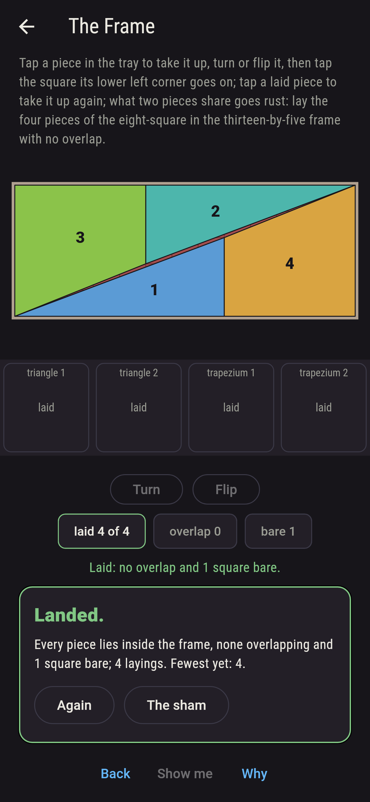
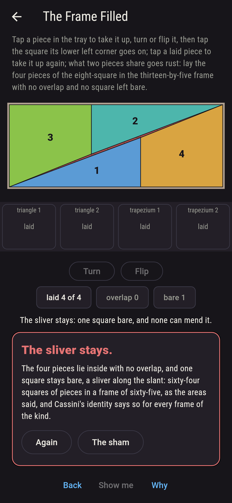
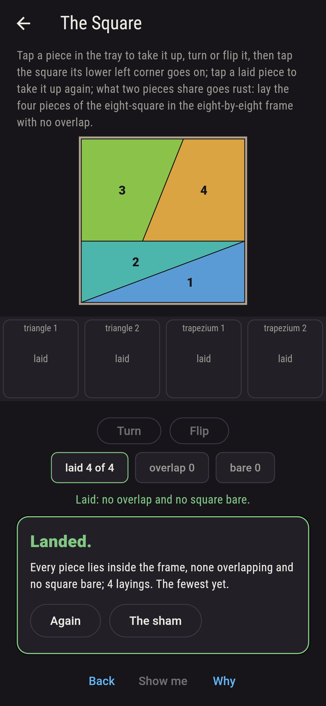
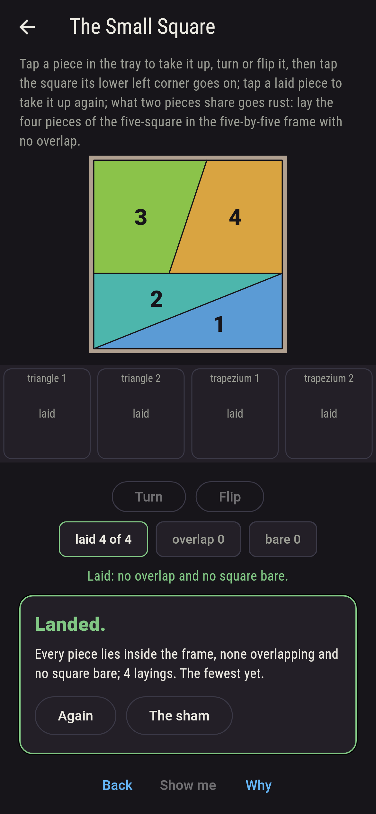
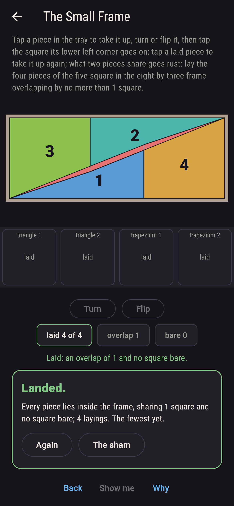
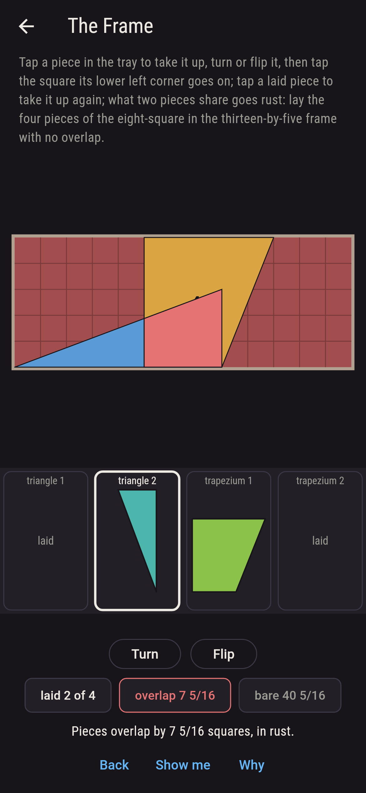
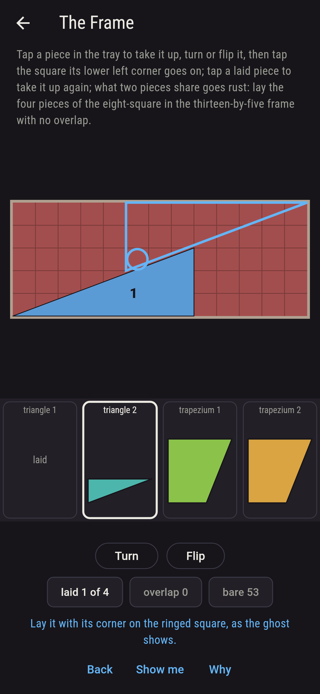
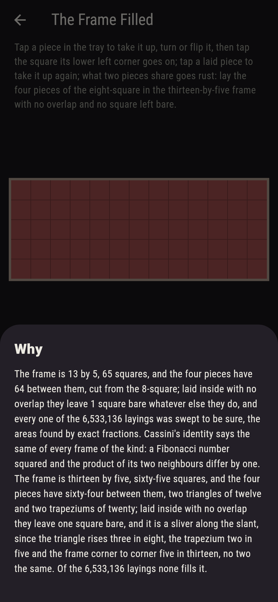

# Slantbury


The missing square. An eight-by-eight is cut into two triangles
and two trapeziums, and the four pieces, turned about, seem to make
a thirteen-by-five: sixty-four squares of pieces in a frame of
sixty-five. Tap a piece in the tray to take it up, turn or flip it,
tap the square its corner goes on, and lay the four inside the
frame; what two pieces share goes rust, and what stays bare shows
through. The pieces do lie inside with no overlap, two ways, and
each time one square stays bare, a sliver along the slant, since
the triangle rises three in eight, the trapezium two in five and
the frame corner to corner five in thirteen, no two the same. The
game finds every area by exact fractions, never by eye, sweeps
every laying of the four pieces inside every frame, and holds the
lot to Cassini's identity: a Fibonacci number squared and the
product of its two neighbours differ by one.

## The frames

1. **The Square** - lay the four pieces of the eight-square in the eight-by-eight frame with no overlap
2. **The Frame** - lay the four pieces of the eight-square in the thirteen-by-five frame with no overlap
3. **The Small Square** - lay the four pieces of the five-square in the five-by-five frame with no overlap
4. **The Small Frame** - lay the four pieces of the five-square in the eight-by-three frame overlapping by no more than 1 square
5. **The Frame Filled** - lay the four pieces of the eight-square in the thirteen-by-five frame with no overlap and no square left bare

The eight-square goes back together sixteen ways of 9,168,384; its
pieces lie in the thirteen-by-five with no overlap two ways of
6,533,136 and leave one square bare each time. The five-square goes
back sixteen ways of 1,267,776; its pieces lie in the eight-by-three
overlapping by exactly one square two ways of 559,488, twenty-five
squares of pieces in a frame of twenty-four, and by less than a
square never. The Frame Filled is labeled hopeless on its tile, and
the moment the four lie inside with no overlap the sliver shows and
the why counts the squares.

## Two voices

The game never asserts what it has not computed, and it computes
everything at least twice:

* **The geometry** is exact: every corner a fraction in lowest
  terms, every piece a convex polygon cut against every other
  (Sutherland and Hodgman, corner by corner) for the area they
  share, and the square left bare the frame less the pieces plus
  what they share; the sweep lays the four pieces every way inside
  every frame, turned and flipped, and counts the layings that meet
  each ask.
* **The arithmetic** needs no geometry: the pieces' areas add to the
  square they were cut from, the frame is the product of its two
  Fibonacci neighbours, and Cassini's identity, checked to the
  fortieth Fibonacci number, says the two differ by exactly one,
  the sign turning each step; the sliver's own area comes out one by
  the shoelace, and the three slants, three in eight, two in five
  and five in thirteen, are checked to be no two the same.

`tool/check_layings.dart` runs the lot and refuses the bake on any
disagreement.

## The checker's ledger

What `dart run tool/check_layings.dart` printed for the build this
README shipped with, word for word:

```
every laying of the four pieces inside every frame swept, turned and flipped every way, 24,061,920 layings, the area two pieces share and the square left bare found by exact fractions and never by eye: the eight-square goes back together 16 ways, its pieces lie in the thirteen-by-five with no overlap 2 ways and leave one square bare each time, a sliver along the slant, and fill it never; the five-square goes back 16 ways, its pieces lie in the eight-by-three overlapping by exactly one square 2 ways and by less than a square never; and Cassini's identity says why, a Fibonacci number squared and the product of its neighbours differing by one, checked to the fortieth: five by thirteen is sixty-four and one, three by eight is twenty-five less one, and the three slants, three in eight, two in five and five in thirteen, are no two the same

 1 The Square       lay the four pieces of the eight-square in the eight-by-eight frame with no overlap: 16 of the 9,168,384 layings land it
 2 The Frame        lay the four pieces of the eight-square in the thirteen-by-five frame with no overlap: 2 of the 6,533,136 layings land it
 3 The Small Square lay the four pieces of the five-square in the five-by-five frame with no overlap: 16 of the 1,267,776 layings land it
 4 The Small Frame  lay the four pieces of the five-square in the eight-by-three frame overlapping by no more than 1 square: 2 of the 559,488 layings land it
 5 The Frame Filled lay the four pieces of the eight-square in the thirteen-by-five frame with no overlap and no square left bare: none of the 6,533,136, and the areas said so first
```

## Screenshots

| The sham | The frame laid | The sliver shown |
| --- | --- | --- |
|  |  |  |

| The square | The small square | The small frame | Mid-laying | Show me | The why |
| --- | --- | --- | --- | --- | --- |
|  |  |  |  |  |  |

Screenshots are drawn by `test/showcase_test.dart` at real phone
sizes with the app's own painter, then copied into `docs/` as they
came out; every piece in them was laid by taps, so nothing pictured
is a frame the game could not reach. The logo and every launcher
icon come out of `test/mark_test.dart` the same way: the mark is the
four pieces laid in the thirteen-by-five, the sliver bare along the
slant.

## Building

```
flutter test          # 51 tests, the sweep among them
dart run tool/check_layings.dart
flutter build apk     # or: flutter build ios
```
