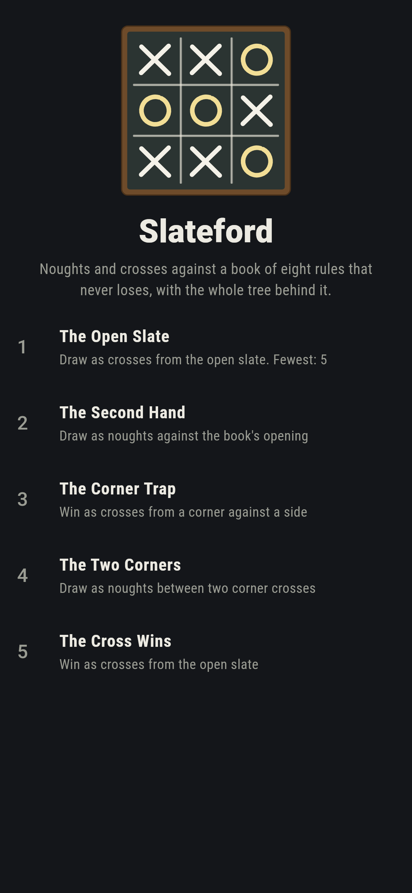
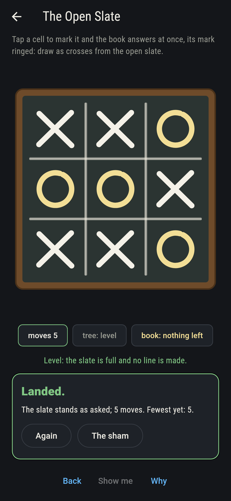
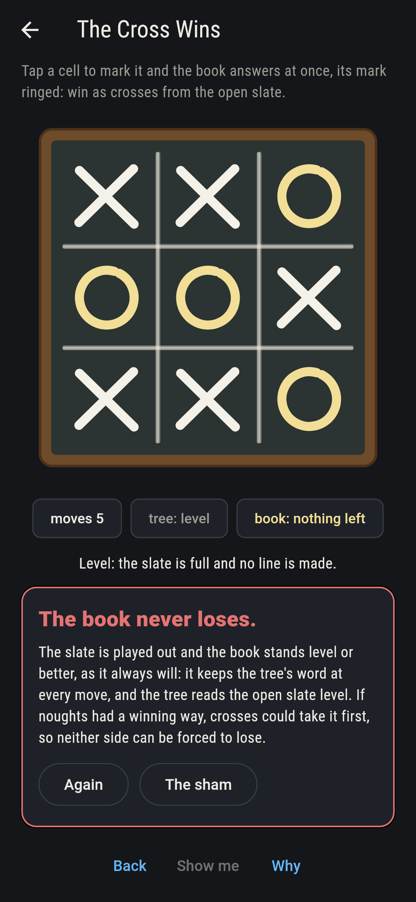
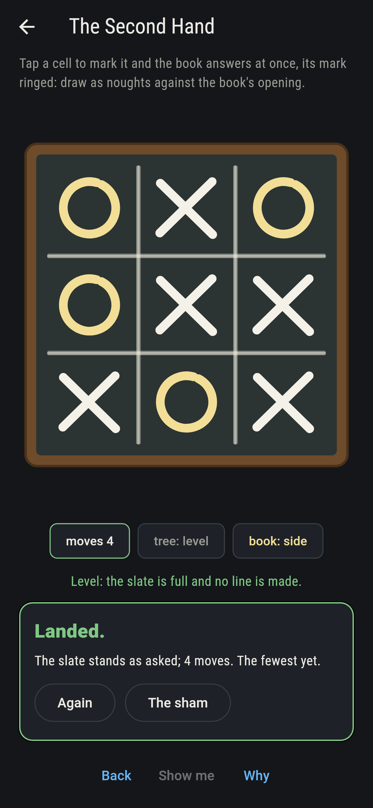
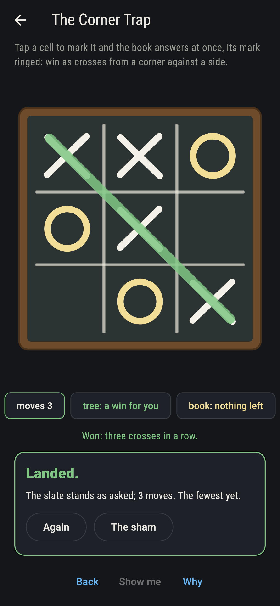
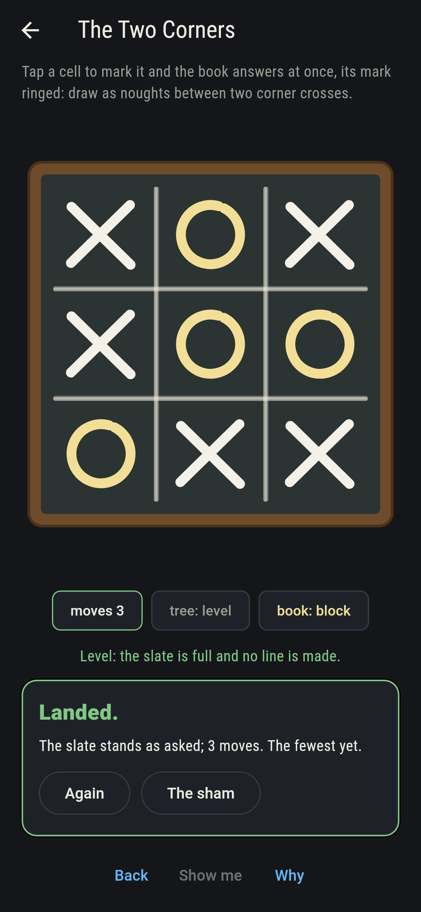
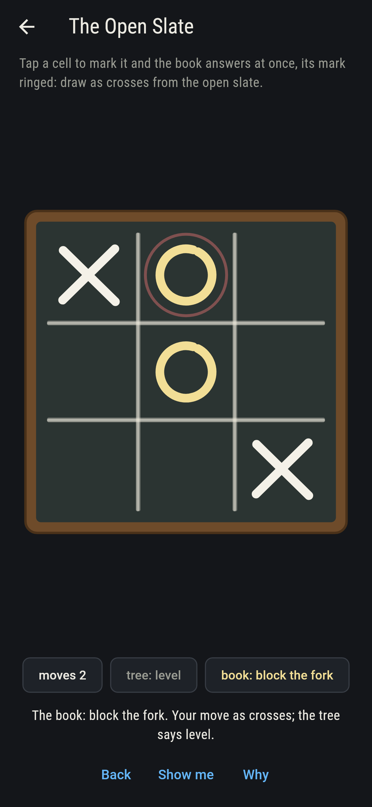
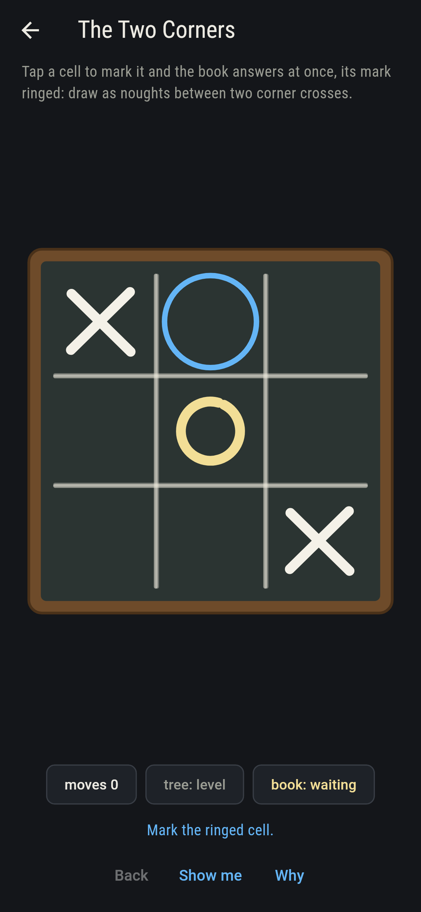
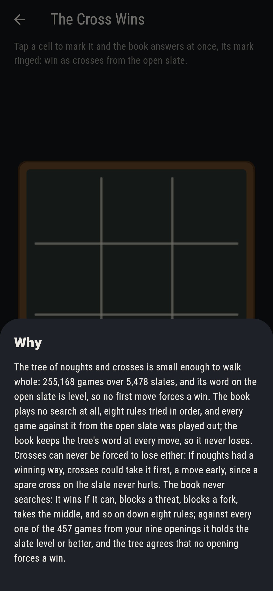

# Slateford


Noughts and crosses on a school slate, against a book. The book
is eight rules tried in order and no search at all: win if you
can, block if you must, make a fork, block a fork, take the
middle, take the corner across from theirs, take a corner, take
a side. The tree of the game is small enough to walk whole,
255,168 games over 5,478 slates, and its word on the open slate
is level: nobody can force a win. The book is held to that tree
at every move of every game against it, and never loses. Neither
side can be forced to lose, and the why says why: if noughts had
a winning way, crosses could take it first.

## The slates

1. **The Open Slate** - draw as crosses from the open slate
2. **The Second Hand** - draw as noughts against the book's opening
3. **The Corner Trap** - win as crosses from a corner against a side
4. **The Two Corners** - draw as noughts between two corner crosses
5. **The Cross Wins** - win as crosses from the open slate

Every game against the book from every start is played out: 457
from the open slate with you as crosses, 111 of them level and
none won; 140 against the book's opening in the middle, 16 level;
81 from a corner cross against a side nought, 5 of them won, all
by a fork; 28 from two corner crosses round a middle nought, 4
level, one for each side. The Cross Wins is labeled hopeless on
its tile, and the why walks the tree and steals the strategy.

## Two voices

The game never asserts what it has not computed, and it computes
everything at least twice:

* **The tree** is walked whole from the open slate, every game to
  its end, and every slate on the way is valued for the side to
  move: a win, level, or a loss with best play. The open slate
  values level; a cross in a corner leaves the noughts one saving
  reply, the middle; a cross in the middle leaves four, the
  corners.
* **The book** searches nothing. Its eight rules are played
  against every sequence of your moves from every start, and at
  each of its moves the slate after is valued by the tree: the
  value never drops, so what the tree promises, the book keeps.
  From the open slate it never loses playing either side, and the
  best you can reach against it is exactly what the tree says.

`tool/check_slates.dart` runs the lot and refuses the bake on any
disagreement.

## The checker's ledger

What `dart run tool/check_slates.dart` printed for the build this
README shipped with, word for word:

```
every game of noughts and crosses walked from the open slate, 255,168 of them over 5,478 slates, 131,184 to the crosses, 77,904 to the noughts and 46,080 level, and the book of eight rules held to the tree's word at every move of every game against it: 457 games from the open slate, none lost by the book and 111 level, 140 against its opening in the middle, none lost and 16 level; a cross in a corner leaves the noughts one saving reply, the middle, a cross in the middle leaves four, the corners, and the open slate reads level for both sides

 1 The Open Slate   draw as crosses from the open slate: 111 of the 457 games against the book land it
 2 The Second Hand  draw as noughts against the book's opening: 16 of the 140 games against the book land it
 3 The Corner Trap  win as crosses from a corner against a side: 5 of the 81 games against the book land it
 4 The Two Corners  draw as noughts between two corner crosses: 4 of the 28 games against the book land it
 5 The Cross Wins   win as crosses from the open slate: none of the 457, and the tree said so first
```

## Screenshots

| The sham | The open slate drawn | The cross wins admitted |
| --- | --- | --- |
|  |  |  |

| The second hand | The corner trap | The two corners | Mid-game | Show me | The why |
| --- | --- | --- | --- | --- | --- |
|  |  |  |  |  |  |

Screenshots are drawn by `test/showcase_test.dart` at real phone
sizes with the app's own painter, then copied into `docs/` as they
came out; every mark in them was made by a tap or by the book's
answer to one, so nothing pictured is a slate the game could not
reach. The logo and every launcher icon come out of
`test/mark_test.dart` the same way: the mark is the open slate
played level, crosses by the tree against the book, five moves
each way.

## Building

```
flutter test          # 50 tests, the tree among them
dart run tool/check_slates.dart
flutter build apk     # or: flutter build ios
```
