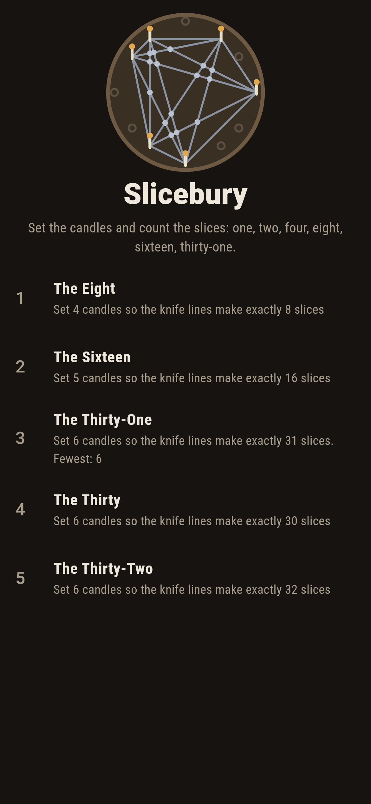
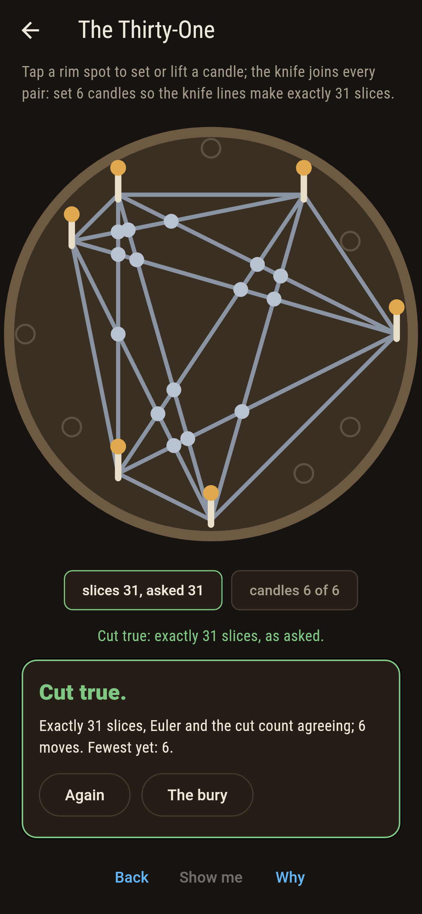
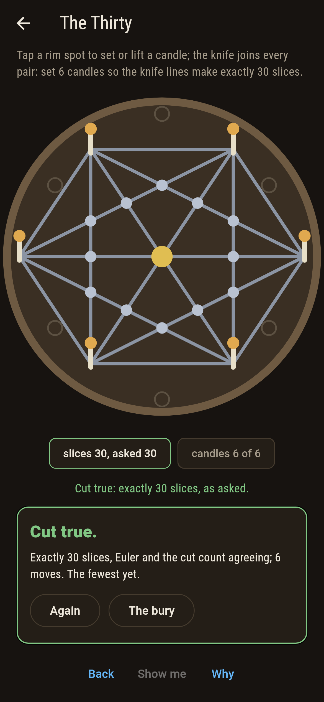
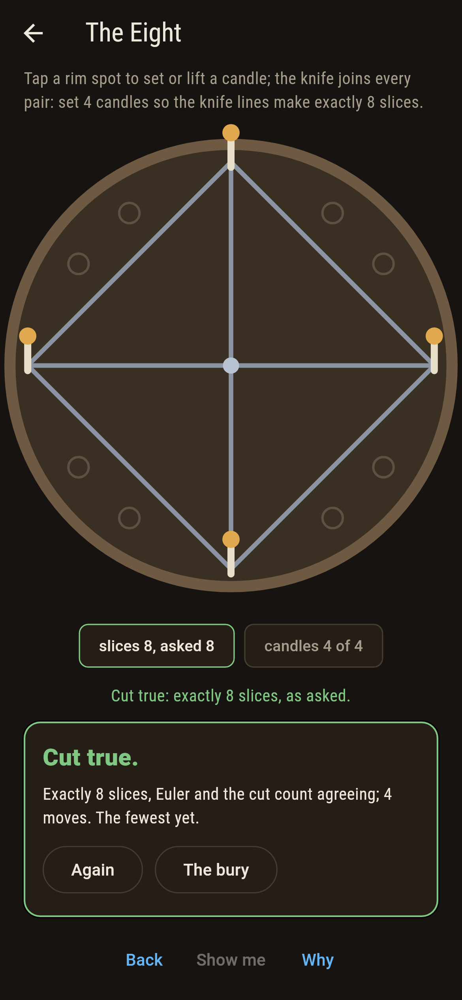
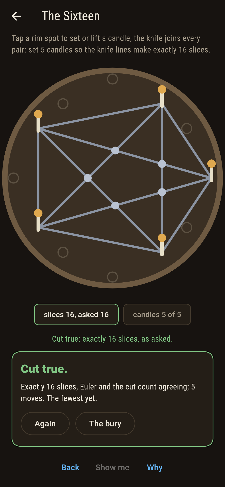
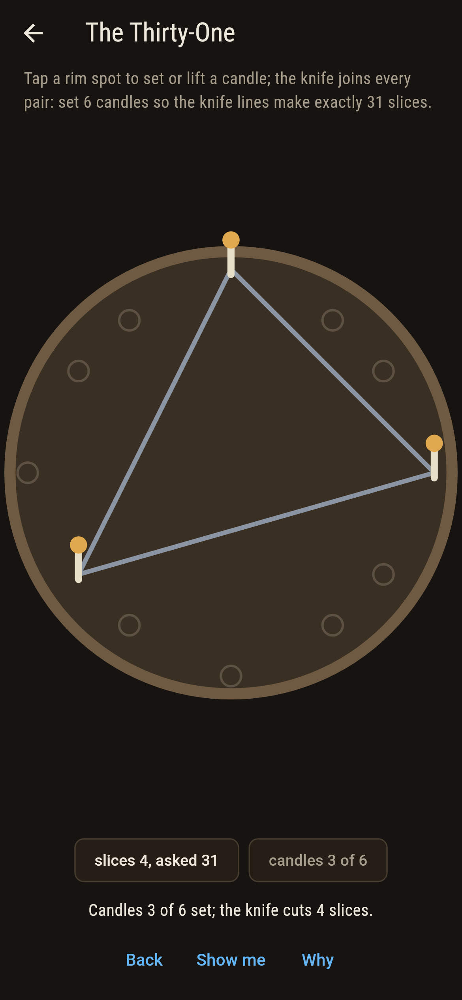
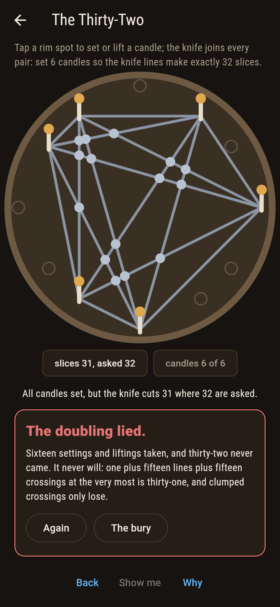
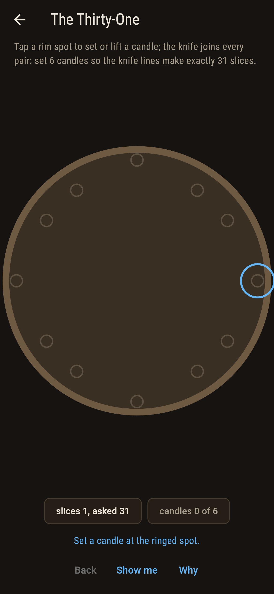
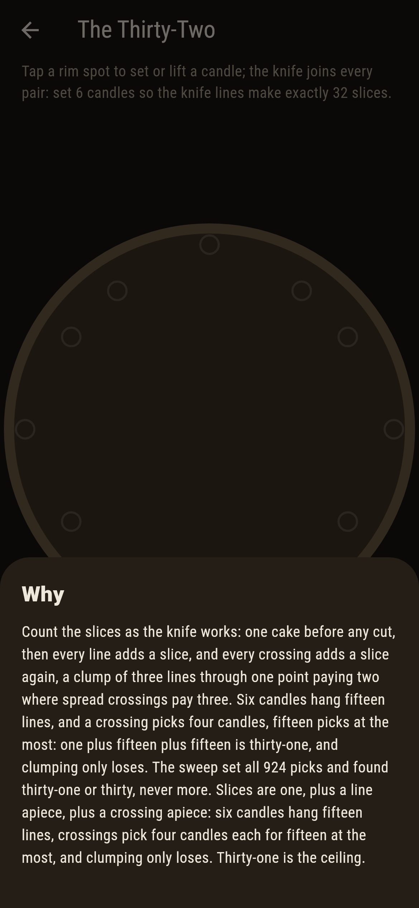

# Slicebury


Twelve candle spots round a cake, a knife line between every
pair of candles set, and the slices counted. Up to five candles
the count doubles every time: one, two, four, eight, sixteen.
Six candles never double again: thirty-one at the most, and
where three knife lines clump through one point, thirty. That
is Moser's circle, the most famous broken pattern in the book.

## The cakes

1. **The Eight** - set 4 candles so the knife lines make exactly 8 slices
2. **The Sixteen** - set 5 candles so the knife lines make exactly 16 slices
3. **The Thirty-One** - set 6 candles so the knife lines make exactly 31 slices
4. **The Thirty** - set 6 candles so the knife lines make exactly 30 slices
5. **The Thirty-Two** - set 6 candles so the knife lines make exactly 32 slices

Four and five candles land however they stand, every one of
the 495 and 792 picks, which is what makes the doubling look
like a law. Six candles break it: 856 picks cut thirty-one and
68 clump three lines through a point and cut thirty. The
Thirty-Two is labeled hopeless on its tile, and the why hands
over the cut count.

## Two voices

The game never asserts what it has not computed, and it computes
everything at least twice:

* **Euler's reckoning** counts spots and crossings, takes away
  the edges, and reads the slices off the faces, exact whole-
  number arithmetic all the way down.
* **The cut count** starts at one and pays a slice per knife
  line and a slice per crossing, clumps paying their lines
  less one. The sweep sets every pick of the rim, 2,509 of
  them across all sizes, and the two counts agree on every
  one, the general-position formula besides.

`tool/check_slices.dart` runs the lot and refuses the bake on
any disagreement.

## The checker's ledger

What `dart run tool/check_slices.dart` printed for the build
this README shipped with, word for word:

```
every pick of every cake set, 12 and 66 and 220 and 495 and 792 and 924 of them, the slices counted by Euler and by cuts and never apart: the doubling holds to sixteen at every single pick, six candles cut thirty-one or, where three lines clump through a point, thirty, and never thirty-two

 1 The Eight          set 4 candles so the knife lines make exactly 8 slices: 495 picks of the sweep land it
 2 The Sixteen        set 5 candles so the knife lines make exactly 16 slices: 792 picks of the sweep land it
 3 The Thirty-One     set 6 candles so the knife lines make exactly 31 slices: 856 picks of the sweep land it
 4 The Thirty         set 6 candles so the knife lines make exactly 30 slices: 68 picks of the sweep land it
 5 The Thirty-Two     set 6 candles so the knife lines make exactly 32 slices: none of the 924, and the ceiling said so first
```

## Screenshots

| The bury | The thirty-one | The thirty, clumped gold |
| --- | --- | --- |
|  |  |  |

| The eight | The sixteen | Mid-set | The thirty-two admitted | Show me | The why |
| --- | --- | --- | --- | --- | --- |
|  |  |  |  |  |  |

Screenshots are drawn by `test/showcase_test.dart` at real phone
sizes with the app's own painter, then copied into `docs/` as
they came out; every candle in them was tapped, so nothing
pictured is a pick the game could not reach. The logo and every
launcher icon come out of `test/mark_test.dart` the same way:
the mark is six candles cutting thirty-one, the doubling broken
on the cake itself.

## Building

```
flutter test          # 46 tests, the sweep among them
dart run tool/check_slices.dart
flutter build apk     # or: flutter build ios
```
