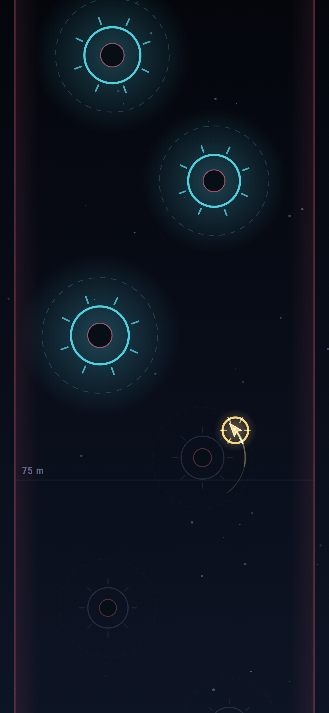
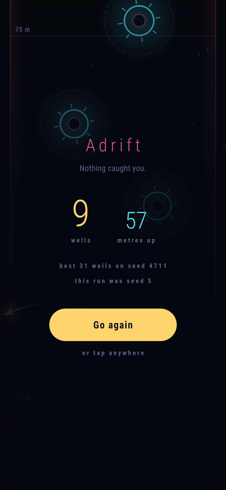

# Slingwell

A one-thumb arcade game for phones, in Flutter, for Android and iOS.

A craft swings round a gravity well. Tap and it lets go, flying off at a
tangent and falling as it goes. Catch the next well, swing again, and climb as
far as you can. The run ends when nothing catches you: off the side of the
playfield, or nine metres below the highest point you reached.

The score is wells caught. The number beside it is how far up you got, which
is the one players actually try to beat. Both are kept with the seed the run
was played on, so a record is a run you can go back to.

| | | |
|---|---|---|
|  |  |  |

## How it is put together

The simulation is in `lib/sim/` and knows nothing about frames, clocks or
screens. A run advances by `World.step(tapped:)`, a fixed 1/120 of a second at
a time, and it is a pure function of its seed and the steps the player tapped
on. That is what makes a run reproducible from a `Replay`, and what lets the
tests say what the game is: tapping blindly scores under five, aiming well
scores over forty and climbs hundreds of metres.

Positions are in metres. The view decides how big a metre is, which is the
only place a screen size gets in.

Driving that from a real clock is the subtle part and it lives in
`FixedStepClock` in `lib/ui/game_loop.dart`. A frame is never exactly a step
long, so the clock accumulates the elapsed time in whole microseconds and
spends it on as many fixed steps as it covers, keeping the remainder for the
next frame. The step is never stretched to fit the frame: that is what makes a
game behave differently on a fast phone. One frame can make up at most a
quarter of a second, so coming back from a long pause loses world time rather
than teleporting the craft and ending a run nobody saw, and the frame the app
comes back on is dropped entirely.

Everything is drawn by one `CustomPainter`. There is no art to load.

## Building it

Flutter 3.44.8, Dart 3.12. The Makefile puts the SDK on the path, so the
targets work without one on the shell's.

    make deps      # flutter pub get
    make analyze   # flutter analyze
    make test      # flutter test
    make all       # analyze and test, which is what to run before a commit
    make apk       # flutter build apk --debug, and needs an Android SDK

The iOS build needs a Mac:

    flutter build ios --simulator --debug

## Screenshots

`make shots` draws the real widget tree at real phone sizes and writes the
frames to `build/showcase`: a swing, a release, a climb, a run thrown away,
the title, a run on the glass with the score on it, and the card that ends
one. It needs no device and takes a couple of seconds, which makes it the
fastest way to see what a change did to the look of the game. The suite writes
them as it runs, so they are always of the code as it stands.

Pictures of the game on a device need a device. No emulator is published for
this machine's architecture and there is no CI here to borrow one from, so
`integration_test/screenshot_test.dart` is driven by hand. On a machine with a
phone or a simulator attached:

    flutter drive --driver=test_driver/integration_test.dart \
      --target=integration_test/screenshot_test.dart -d DEVICE

which leaves them in `build/screenshots`.

## Where things are

    lib/sim/world.dart       Vec, Well, Ending, World: the rules, and the only
                             thing that decides what a run is worth
    lib/sim/replay.dart      A run as a seed and the steps it was tapped on
    lib/best_run.dart        The best score and the seed it happened on
    lib/ui/game_loop.dart    The fixed-step clock, and the run being played
    lib/ui/game_view.dart    The one place a real clock exists, and the glass
                             the player taps
    lib/ui/world_painter.dart  Everything on screen
    lib/ui/camera.dart       Metres to pixels, and the only opinion about how
                             much of the world fits
    lib/ui/game_screen.dart  Title, run, and the card at the end
    test/                    The rules, the clock, the screens, and a fit test
                             across phone shapes and text sizes
