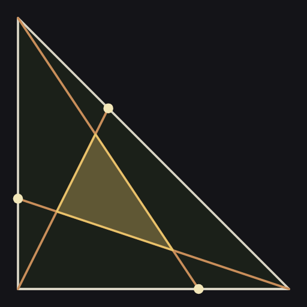
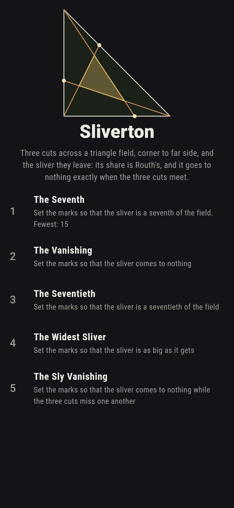
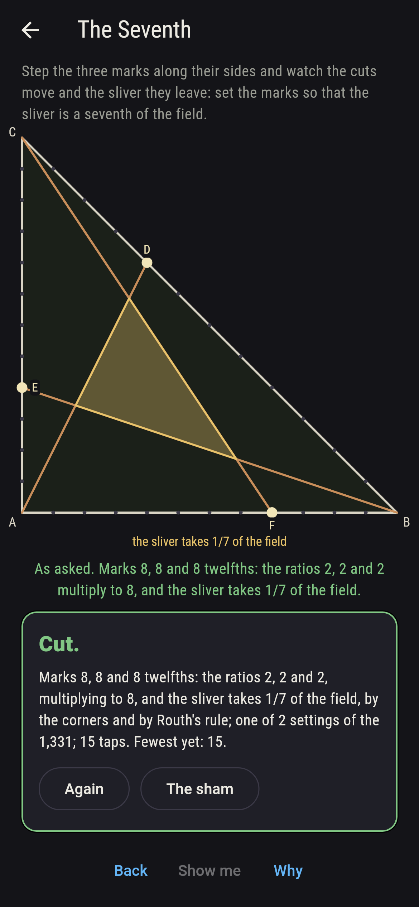
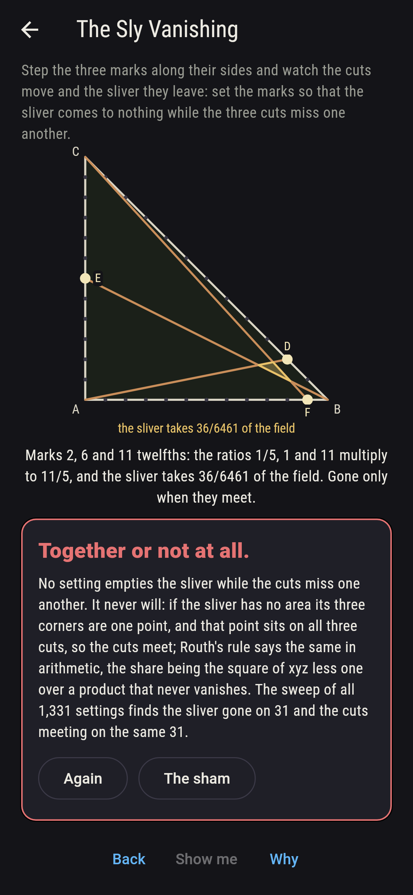
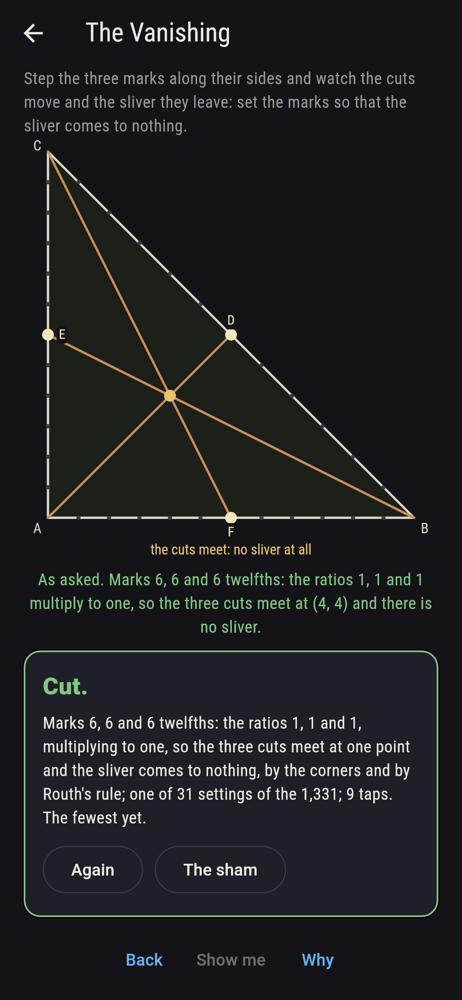
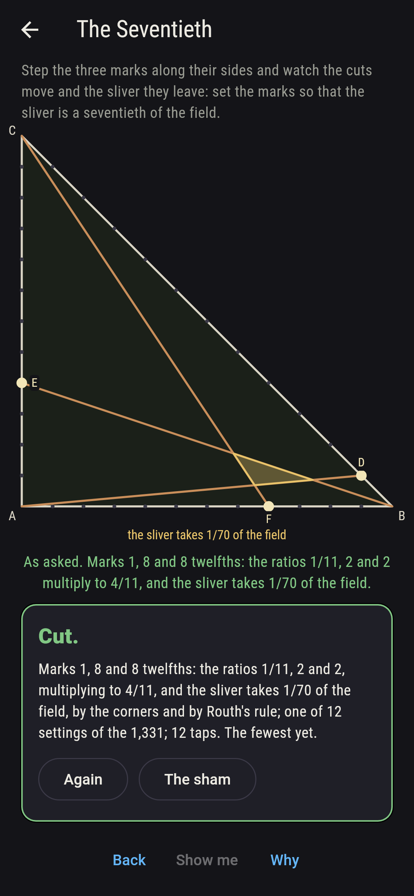
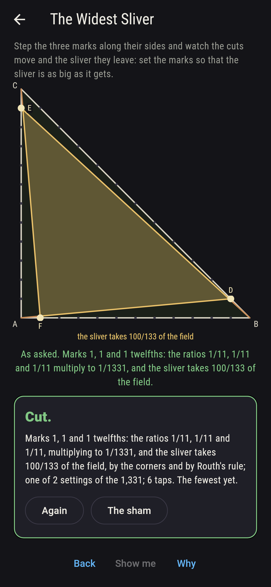
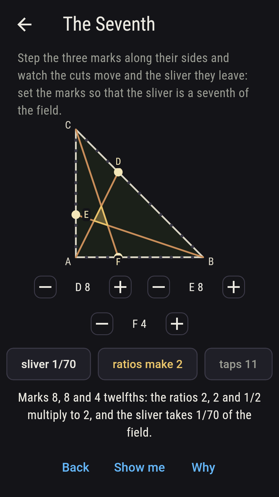
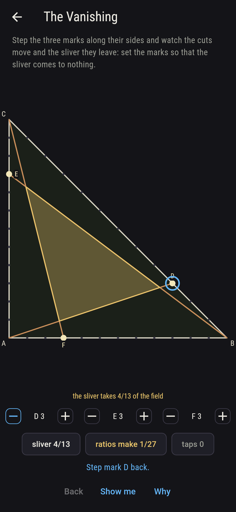
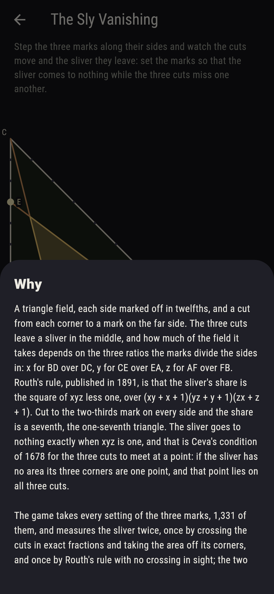

# Sliverton



A triangle field with every side marked off in twelfths, and a cut
from each corner to a mark on the far side: A to D on BC, B to E on
CA, C to F on AB. The three cuts cross each other in three places
and leave a sliver in the middle, and how much of the field that
sliver takes depends only on the ratios the marks divide the sides
in. Call them x for BD over DC, y for CE over EA, z for AF over FB.
Routh's rule, from Edward Routh's statics treatise of 1891, is that
the sliver's share is the square of xyz less one, over
(xy + x + 1)(yz + y + 1)(zx + z + 1). Cut to the two-thirds mark on
every side and the share comes to a seventh, which is the old
one-seventh triangle. Step the three marks along their sides and
watch the cuts and the sliver move with them. The game takes every
setting of the marks, 1,331 of them, and measures the sliver twice,
once by crossing the cuts in exact fractions and taking the area off
its three corners and once by Routh's rule with no crossing in
sight; the two agree on all 1,331.

## The asks

1. **The Seventh** - set the marks so that the sliver is a seventh of the field
2. **The Vanishing** - set the marks so that the sliver comes to nothing
3. **The Seventieth** - set the marks so that the sliver is a seventieth of the field
4. **The Widest Sliver** - set the marks so that the sliver is as big as it gets
5. **The Sly Vanishing** - set the marks so that the sliver comes to nothing while the three cuts miss one another

A seventh comes on two settings of the 1,331: the marks 8, 8 and 8,
where every ratio is two, and the marks 4, 4 and 4, where every
ratio is a half. The share is the same either way, since swapping
every x for its reciprocal leaves Routh's fraction alone. The sliver
goes to nothing on 31 settings, and those are exactly the ones where
the three cuts meet at a point, which is what Ceva wrote down in
1678: the ratios multiply to one. The plainest of the 31 is the
middle marks, 6, 6 and 6, the three cuts meeting at the middle of
the field. A seventieth comes on 12 settings and a
two-hundred-and-tenth on 12 as well. The sliver is widest at 100
parts in 133, a little over three quarters of the field, when every
mark sits one twelfth along or every mark eleven; 40 settings leave
half the field or more, 282 leave less than a hundredth, the
thinnest of all a 74,338th from the marks 4, 7 and 7, and 219
different shares come up in all. The Sly Vanishing is labeled
hopeless on its tile, and the reason is one a finger can follow: if
the sliver has no area then its three corners are one point, and
that point sits on all three cuts, so the cuts meet. Routh's rule
says the same in arithmetic, since its bottom never vanishes and its
top only does when xyz is one. The sham admits it once three
settings have shown the cuts meeting with the sliver gone, or after
twenty taps.

## Two voices

The game never asserts what it has not computed, and it computes
everything at least twice:

* **The corners** know nothing of Routh. Each cut is a line through
  a corner and a mark, each pair of cuts is crossed in exact
  fractions, and the sliver's area comes off its three corners by
  the shoelace, divided by the field's own 144. Every count on the
  sham is that voice's.
* **Routh's rule** never crosses a line. It takes the three ratios
  as fractions, multiplies them, and works the share out of
  (xyz - 1)² over (xy + x + 1)(yz + y + 1)(zx + z + 1). It agrees
  with the corners on all 1,331 settings.

The pairing of that denominator is easy to get wrong, and the two
voices are what caught it: an earlier arrangement of the factors
agreed with the corners on 371 settings and disagreed on 960.

`tool/check_slivers.dart` runs the lot and refuses the bake on any
disagreement.

## The checker's ledger

What `dart run tool/check_slivers.dart` printed for the build this
README shipped with, word for word:

```
every setting of the three marks taken, 1,331, and the sliver measured twice, once by crossing the cuts in exact fractions and taking the area off its three corners and once by Routh's rule, the square of xyz less one over (xy + x + 1)(yz + y + 1)(zx + z + 1), the two agreeing on all 1,331: every corner of every sliver lies on both the cuts that made it, and no sliver takes the whole field or less than none; the sliver comes to nothing on 31 settings and the three cuts meet on the same 31, so the sly vanishing never happens; the sliver is a seventh on 2 settings, the marks 8, 8 and 8 and the marks 4, 4 and 4, a seventieth on 12 and a two-hundred-and-tenth on 12; it is widest at 100 parts in 133 on 2 settings, every mark one twelfth along or every mark eleven, 40 settings leave half the field or more and 282 leave less than a hundredth, the thinnest a 74,338th from the marks 4, 7 and 7, and 219 different shares come up in all

 1 The Seventh       set the marks so that the sliver is a seventh of the field: 2 of the 1,331 settings land it
 2 The Vanishing     set the marks so that the sliver comes to nothing: 31 of the 1,331 settings land it
 3 The Seventieth    set the marks so that the sliver is a seventieth of the field: 12 of the 1,331 settings land it
 4 The Widest Sliver set the marks so that the sliver is as big as it gets: 2 of the 1,331 settings land it
 5 The Sly Vanishing set the marks so that the sliver comes to nothing while the three cuts miss one another: none of the 1,331, and the corners said so first
```

## Screenshots

| The sham | The seventh | The sly vanishing admitted |
| --- | --- | --- |
|  |  |  |

| The vanishing | The seventieth | The widest sliver | Midway, on the small phone | Show me | The why |
| --- | --- | --- | --- | --- | --- |
|  |  |  |  |  |  |

Screenshots are drawn by `test/showcase_test.dart` at real phone
sizes with the app's own painter, then copied into `docs/` as they
came out; every mark in them was stepped there on its dial, so
nothing pictured is a setting the game could not reach. The logo and
every launcher icon come out of `test/mark_test.dart` the same way:
the mark is the marks 8, 8 and 8, whose sliver has its corners at
(12/7, 24/7), (48/7, 12/7) and (24/7, 48/7) and takes a seventh of
the field.

## Building

```
flutter test          # 44 tests, the sweep among them
dart run tool/check_slivers.dart
flutter build apk     # or: flutter build ios
```
