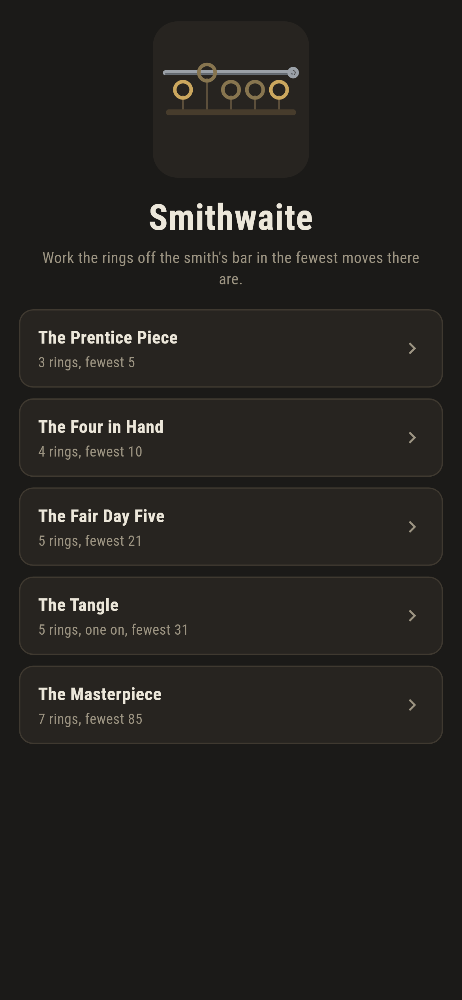
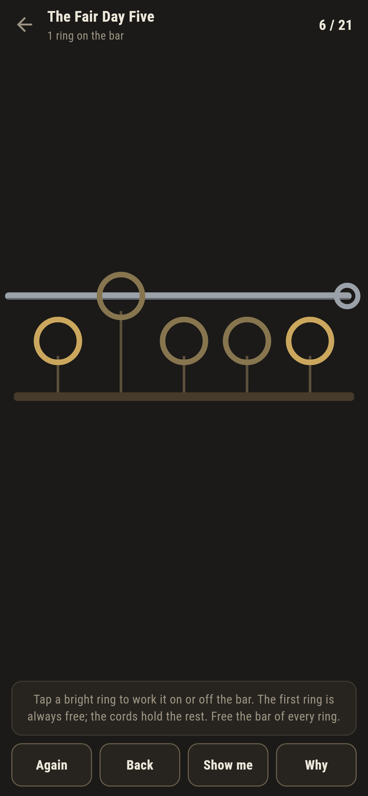
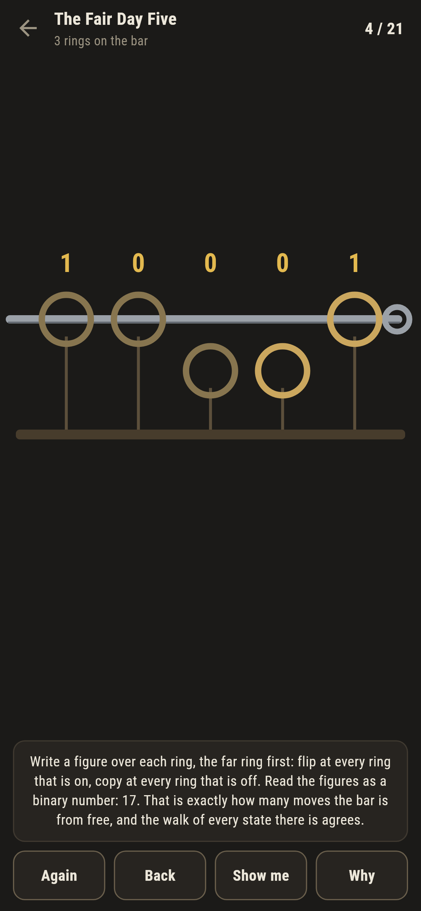
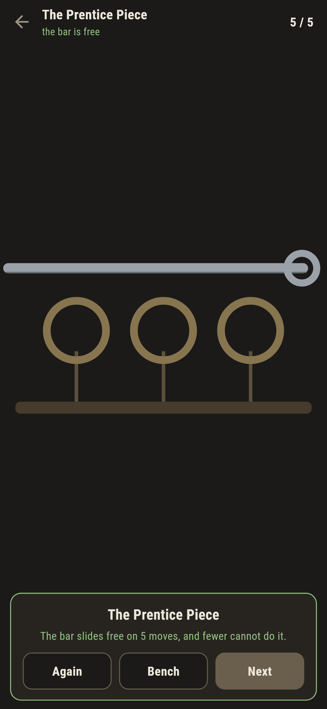
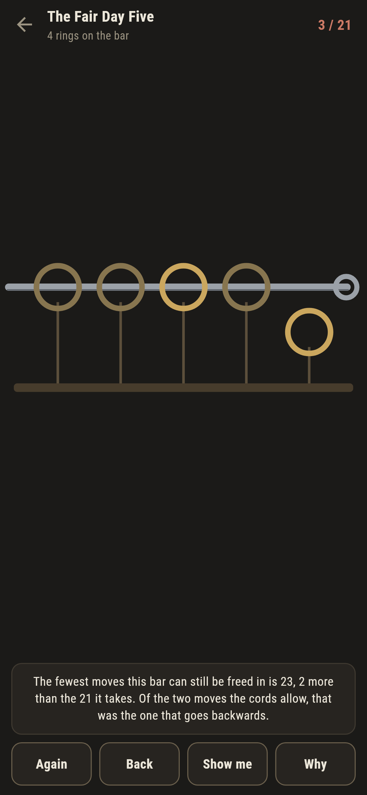
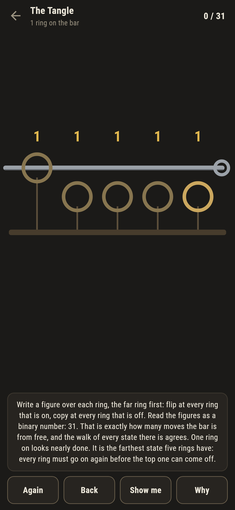

# Smithwaite

A tavern rings puzzle for phones, in Flutter, for Android and iOS.

The smith forged a run of rings onto a bar, each tied by its cord. The
first ring comes on or off whenever you like; any other ring moves only
when the ring just before it is on and every ring before that is off. Work
every ring off and the bar slides free.

| | | | |
|---|---|---|---|
|  |  |  |  |

## Two moves at most, and one goes forward

Count the moves the cords allow from any position and there are never more
than two. The suite counts them on every state there is: exactly two
everywhere, except at the freed bar and at one other state, the two ends.
The whole puzzle is a single path, walked forward or walked back, and that
is why a wrong move is never a detour here: it is the one step backwards,
it costs exactly two, and the game says so the moment it is made.



## The smith counts without playing

How far is the bar from free? The walk answers by breadth first search
over every state. The smith answers by reading the rings: write a figure
over each ring, the far ring first, flipping at every ring that is on and
copying at every ring that is off, then read the figures as a binary
number. That is the whole calculation, and it is exact:

```
$ make rings
the walk and the smith agree on every state of nine rings: 512 states

 1 The Prentice Piece 3 rings  fewest 5  the smith says 5  written down 5
 2 The Four in Hand   4 rings  fewest 10  the smith says 10  written down 10
 3 The Fair Day Five  5 rings  fewest 21  the smith says 21  written down 21
 4 The Tangle         5 rings  fewest 31  the smith says 31  written down 31
 5 The Masterpiece    7 rings  fewest 85  the smith says 85  written down 85
```

The pattern of rings is a Gray code and the figures are its decoding, but
nothing asks you to take that on faith: **Why** writes the figures over
the rings in front of you, live, wherever the puzzle stands, and the suite
lays the smith's count over the walk on every state of three to nine
rings.


## The Tangle

One puzzle is handed over with a single ring on, the top one, and it looks
nearly done. It is the farthest state five rings have: thirty one moves,
ten more than the whole puzzle from every ring on, because every ring must
go back on before the top one can come off. The smith's figures say so at
a glance, one flip and then all copies: 11111. Fewer rings on the bar does
not mean nearer the end, and this puzzle is the proof you play.



## Building

```
make deps    # fetch packages
make check   # analyze + every test
make rings   # prove the smith's count against the walk, walk the puzzles
make shots   # render the screenshots and redraw the icons
make apk     # Android release build
make ios     # iOS release build (unsigned)
```

The logo and every app icon are drawn by the game's own painter in
`test/mark_test.dart`. There is no image in this repository that was not
produced by code in it.

## How it is put together

```
lib/forge/puzzle.dart    a puzzle: rings, how it is handed over, the answer
lib/forge/fewest.dart    the walk, the moves, and the smith's count
lib/forge/puzzles.dart   the five puzzles that ship
lib/forge/play.dart      a puzzle in hand: moves, the live fewest
lib/ui/                  the painter, the screens, the mark
tool/check_puzzles.dart  the ledger above
```

The tests hold the smith's count against the walk on every state of three
to nine rings, count the neighbours of every state to prove the puzzle is
one path with two ends, pin the wrong move's cost at exactly two, check
every written-down par, and hold the pictures against the real widget
tree. If any of that drifts, `make check` goes red before anything leaves
the machine.
