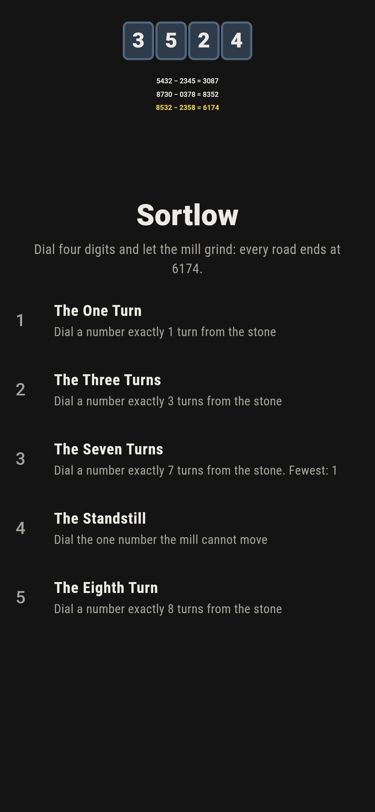
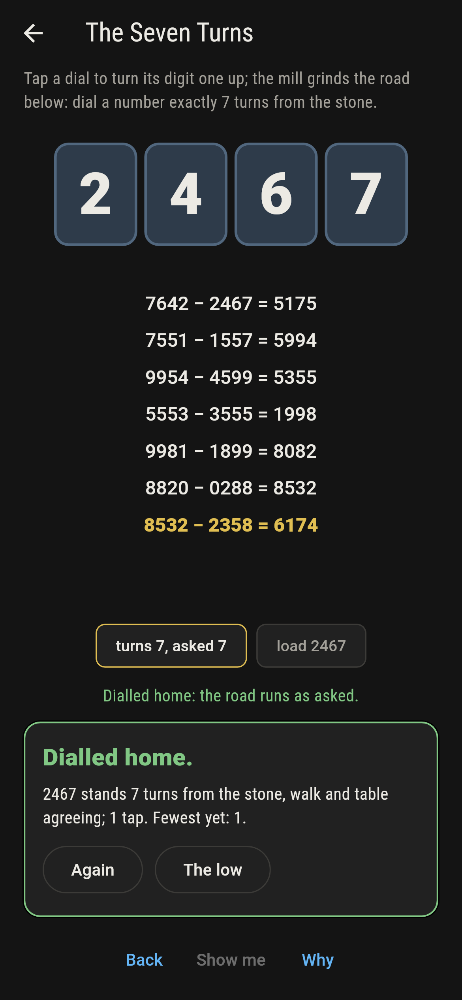
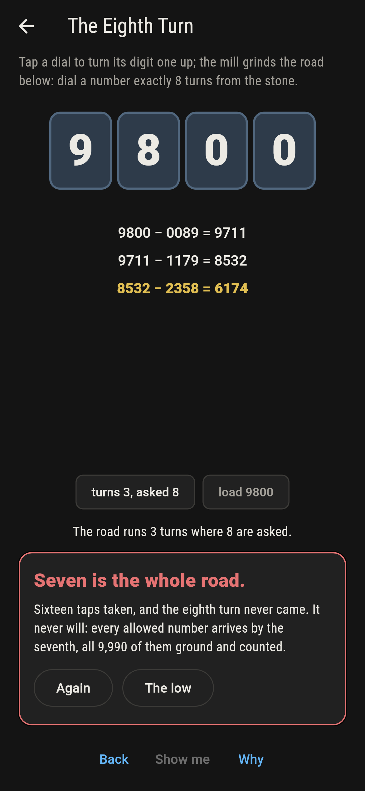
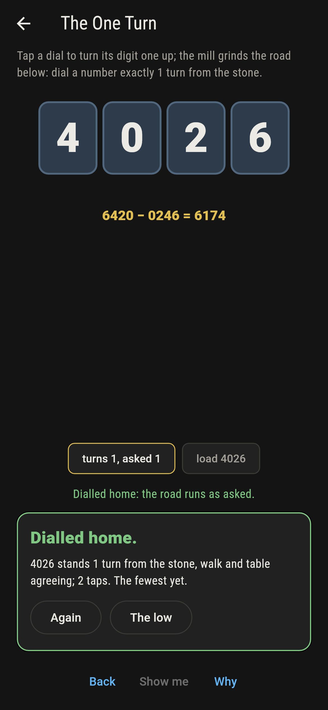
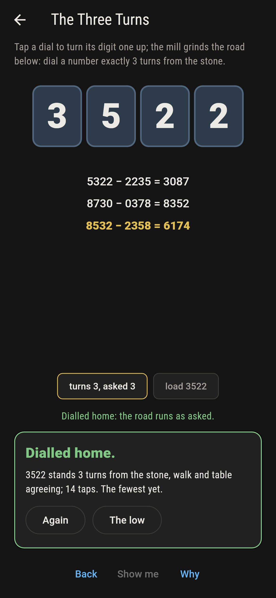
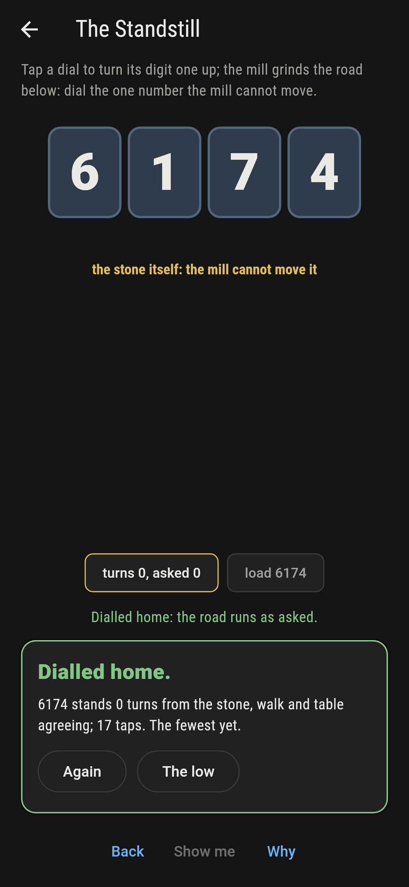
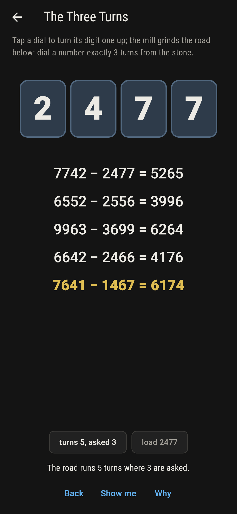
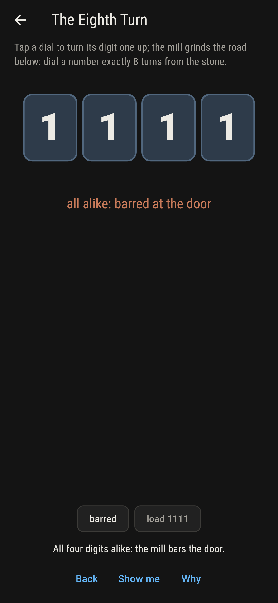
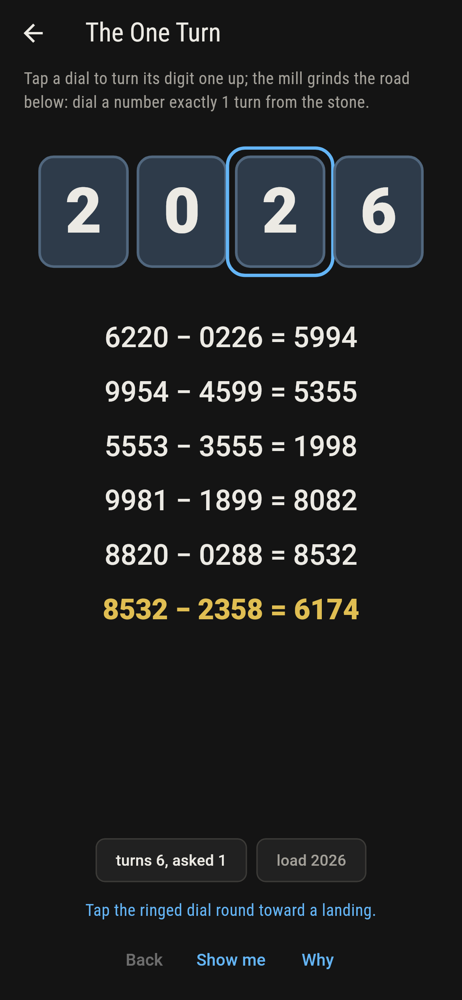
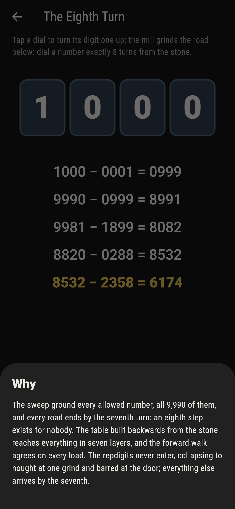

# Sortlow


Dial four digits and the mill grinds: biggest arrangement less
smallest, turn upon turn. Kaprekar's discovery is that every
four-digit number whose digits vary arrives at 6174, and by the
seventh turn at the latest; 6174 alone stands still, and the
ten repdigits collapse to nought and are barred at the door.

## The loads

1. **The One Turn** - dial a number exactly 1 turn from the stone
2. **The Three Turns** - dial a number exactly 3 turns from the stone
3. **The Seven Turns** - dial a number exactly 7 turns from the stone
4. **The Standstill** - dial the one number the mill cannot move
5. **The Eighth Turn** - dial a number exactly 8 turns from the stone

Three turns is the commonest road home, twenty-four hundred
loads strong, and seven is the mill's whole reach, walked full
by 2,184. The smallest one-turn load is a surprise: twenty-six,
worn as 0026, whose one grind is 6200 less 26. The Standstill
has exactly one answer, and The Eighth Turn is labeled hopeless
on its tile: every allowed number arrives by the seventh.

## Two voices

The game never asserts what it has not computed, and it computes
everything at least twice:

* **The walk** grinds the road forward, arrangement by
  arrangement, and draws every line of it on the screen as the
  dials turn.
* **The table** is built backwards from 6174 itself, layer by
  layer, with no walking in it. The sweep grinds all 9,990
  allowed loads and the two measures never differ; the lone
  standstill and the barred repdigits are held besides.

`tool/check_roads.dart` runs the lot and refuses the bake on
any disagreement.

## The checker's ledger

What `dart run tool/check_roads.dart` printed for the build
this README shipped with, word for word:

```
every load ground, all 9,990 four-digit numbers whose digits vary: the forward walk and the table built backwards from the stone agree on every one, every road ends by the seventh turn, 6174 alone stands still, and the ten repdigits collapse to nought at one grind

 1 The One Turn       dial a number exactly 1 turn from the stone: 383 loads of the sweep land it
 2 The Three Turns    dial a number exactly 3 turns from the stone: 2400 loads of the sweep land it
 3 The Seven Turns    dial a number exactly 7 turns from the stone: 2184 loads of the sweep land it
 4 The Standstill     dial the one number the mill cannot move: 1 load of the sweep lands it
 5 The Eighth Turn    dial a number exactly 8 turns from the stone: none of the 9,990, and the seventh turn said so first
```

## Screenshots

| The low | The seven turns | The eighth turn admitted |
| --- | --- | --- |
|  |  |  |

| The one turn | The three turns | The standstill | Mid-dial | The barred door | Show me | The why |
| --- | --- | --- | --- | --- | --- | --- |
|  |  |  |  |  |  |  |

Screenshots are drawn by `test/showcase_test.dart` at real phone
sizes with the app's own painter, then copied into `docs/` as
they came out; every dial in them was tapped, so nothing
pictured is a load the game could not reach. The logo and every
launcher icon come out of `test/mark_test.dart` the same way:
the mark is the classic road of 3524, three grinds to the
stone.

## Building

```
flutter test          # 47 tests, the sweep among them
dart run tool/check_roads.dart
flutter build apk     # or: flutter build ios
```
