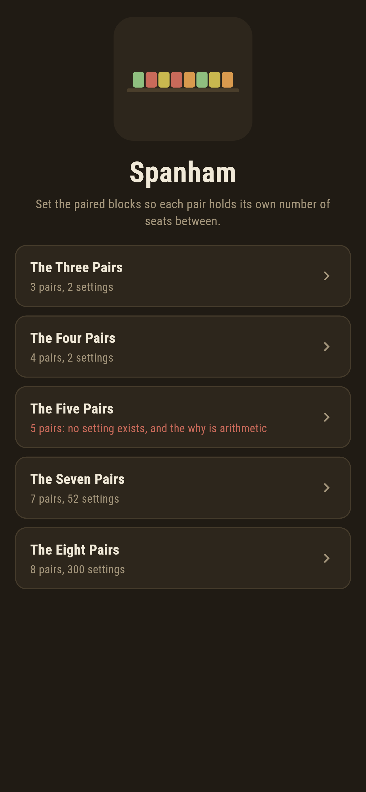
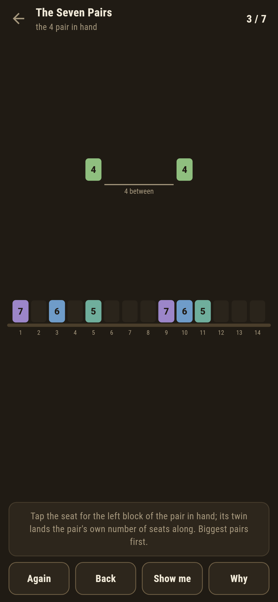
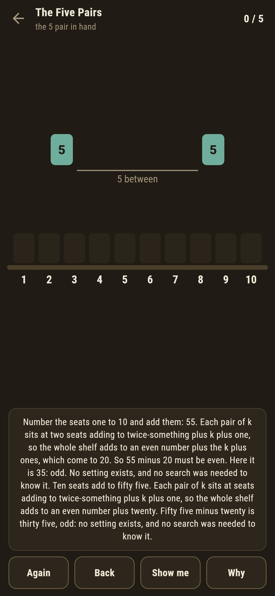
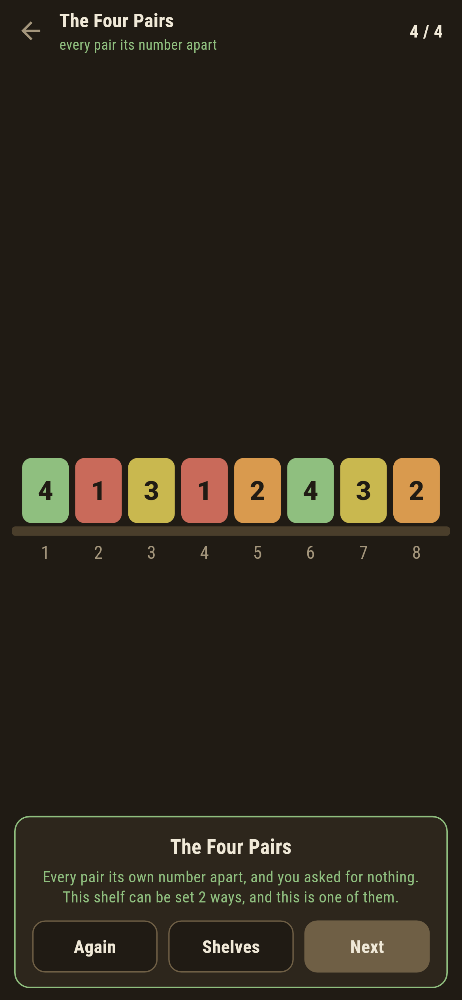
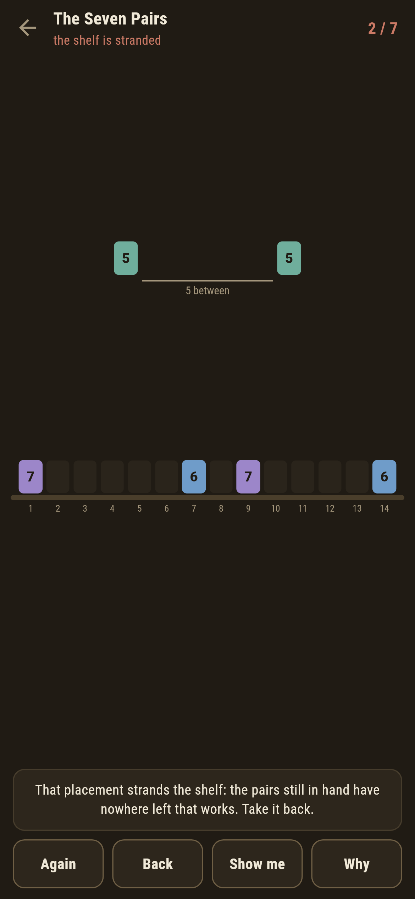

# Spanham

A block-spacing puzzle for phones, in Flutter, for Android and iOS.

Two blocks of each number stand in a row of seats, and the rule is the
number itself: the pair of ones hold one seat between them, the pair of
twos two, the pair of k exactly k. Set every pair at once and the shelf
is made. Some shelves cannot be made at all, and the proof is arithmetic
you can do on your fingers.

| | | | |
|---|---|---|---|
|  |  |  |  |

## The arithmetic on the seat numbers

Number the seats one to 2n and add them all: call it S. The two blocks
of k sit at some seat p and at seat p + k + 1, which together add to
2p + k + 1: twice-something, plus k plus one. Sum over every pair and
the shelf's total is an even number plus the sum of the k + 1's, so S
minus that sum must be even.

For five pairs, the seats add to 55 and the k + 1's add to 20; the
difference is 35, odd, and no setting exists. No search was needed, and
the game does the arithmetic for the exact shelf in front of you when
you ask why. This is Langford's problem, and the parity falls odd
exactly when n leaves one or two on division by four, which the suite
sweeps to twenty pairs against a search that knows nothing of parity:

```
$ make shelves
the arithmetic and the search agree on every shelf to twelve pairs

 1 The Three Pairs  3 pairs  2 settings  written down 2
 2 The Four Pairs   4 pairs  2 settings  written down 2
 3 The Five Pairs   5 pairs  no setting at all  written down 0
 4 The Seven Pairs  7 pairs  52 settings  written down 52
 5 The Eight Pairs  8 pairs  300 settings  written down 300
```


## The counts are the counts

Fifty two settings of seven pairs, three hundred of eight, mirror images
counted apart, and the suite checks the mirrors really are all there:
reverse any setting and the reversal is in the list. Every setting found
is verified pair by pair, each holding exactly its number of seats.

## Stranding is known at once

Pairs go down biggest first, and the game keeps a live answer to whether
the rest can still fit. Set a pair somewhere that leaves the ones in
hand no room and the ledger goes red the moment it lands, with Back to
lift it again. Show me points at a seat the search has checked through
to the end.



## Building

```
make deps     # fetch packages
make check    # analyze + every test
make shelves  # the arithmetic against the search, then the ledger
make shots    # render the screenshots and redraw the icons
make apk      # Android release build
make ios      # iOS release build (unsigned)
```

The logo and every app icon are drawn by the game's own painter in
`test/mark_test.dart`. There is no image in this repository that was not
produced by code in it.

## How it is put together

```
lib/row/level.dart      a shelf: pairs, possibility, the count of ways
lib/row/fewest.dart     the parity arithmetic and the backtracking search
lib/row/levels.dart     the five shelves that ship
lib/row/play.dart       a shelf being set: seats, the live answer
lib/ui/                 the painter, the screens, the mark
tool/check_levels.dart  the ledger above
```

The tests hold the arithmetic against the search at every size to
twelve, sweep the parity rule to twenty, verify every found setting pair
by pair, check the mirror pairs, and hold the pictures against the real
widget tree. If any of that drifts, `make check` goes red before
anything leaves the machine.
