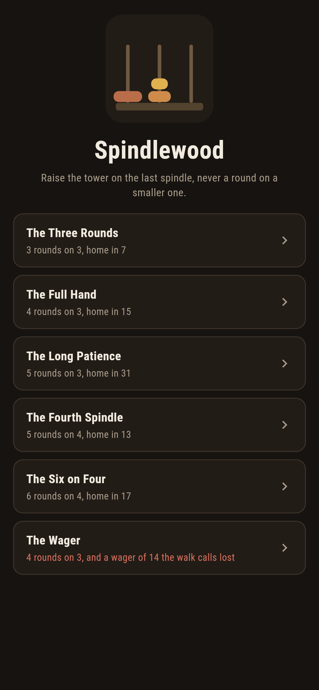
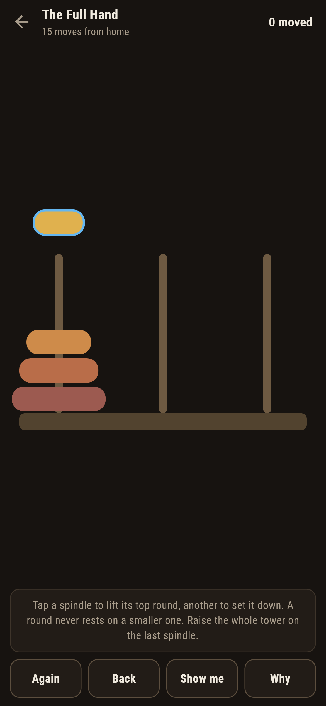
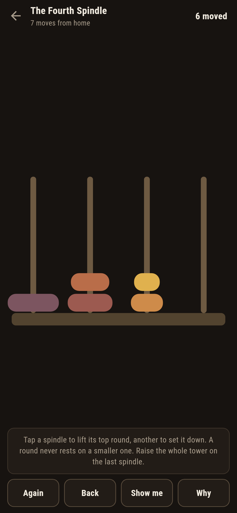
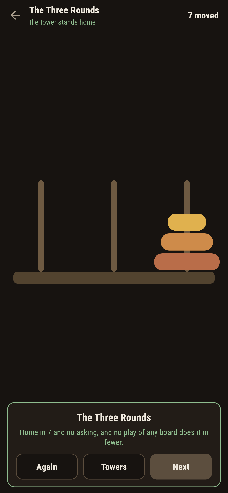
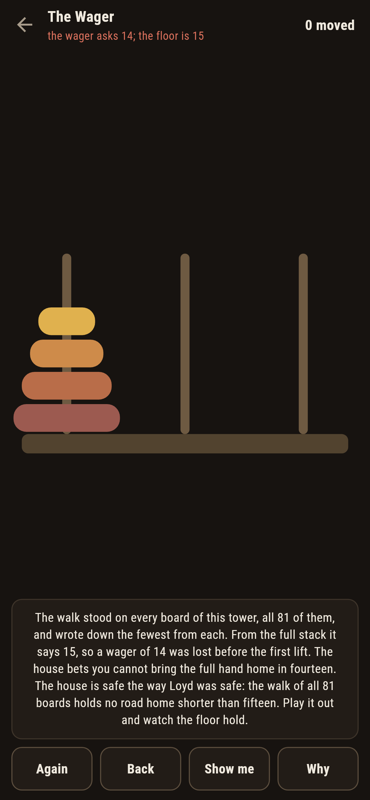
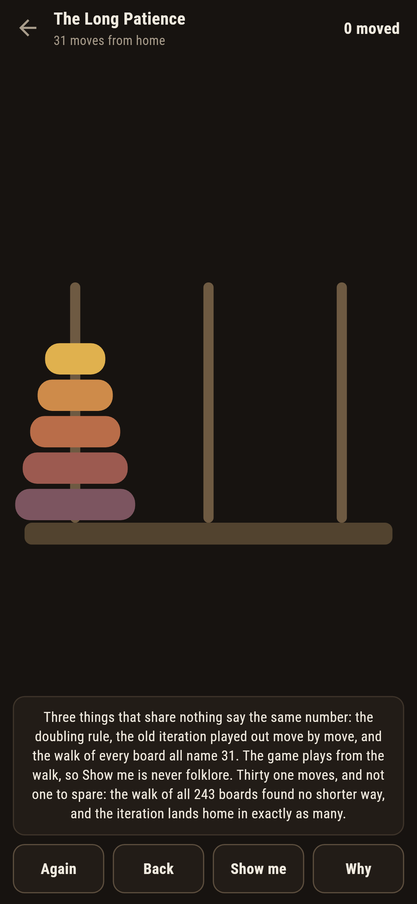

# Spindlewood

A tower puzzle for phones, in Flutter, for Android and iOS.

Rounds stacked on a spindle, smallest on top. Move them one at a time,
never a round on a smaller one, until the whole tower stands on the
last spindle. The oldest puzzle in the drawer, and the game treats its
famous numbers the house way: nothing is recited, everything is
walked.

| | | | |
|---|---|---|---|
|  |  |  |  |

## Three ways of knowing

On three spindles the suite knows the fewest three ways that share
nothing. The doubling rule says two to the rounds, less one. The old
iteration, smallest round stepping round its cycle every other move,
is executed move by legal move and lands home in exactly that many.
And a walk from home stands on every board there is and writes down
the fewest from each. All three agree on every job that ships, and
the game plays from the walk, so **Show me** is never folklore.

```
$ make towers
 1 The Three Rounds   3 rounds on 3  27 boards walked  home in 7, no board knows shorter
 2 The Full Hand      4 rounds on 3  81 boards walked  home in 15, no board knows shorter
 3 The Long Patience  5 rounds on 3  243 boards walked  home in 31, no board knows shorter
 4 The Fourth Spindle 5 rounds on 4  1024 boards walked  home in 13, no board knows shorter
 5 The Six on Four    6 rounds on 4  4096 boards walked  home in 17, no board knows shorter
 6 The Wager          4 rounds on 3  81 boards walked  floor 15, the wager of 14 unmeetable
```

## The fourth spindle

A fourth spindle cuts thirty one moves to thirteen, and the counting
is the leapfrog reckoning: carry some rounds aside, move the rest by
the doubling rule, carry the aside back on, best split taken. That
reckoning was conjectured in 1941 and proved right for four spindles
only in 2014; this suite does not lean on either year. It walks every
board of the shipped four-spindle jobs, 1,024 and 4,096 of them, and
the reckoning and the walk name the same floor both times.

## The wager

The house bets you cannot raise the full hand in fourteen, and ships
the bet as a level, in the house tradition of games nobody can win.
The tower itself comes home fine; the wager never does. The walk of
all 81 boards holds no road home shorter than fifteen, the ledger
says so before the first lift, and the card at the end hands you the
proof you just walked.



## The live number

The fewest moves from the board as it stands is looked up after every
move, and a move that raises it is called out the moment it lands,
with **Back** waiting. **Why** speaks whichever voices the job has,
the walk always among them.



## Building

```
make deps    # fetch packages
make check   # analyze + every test
make towers  # walk every board against the reckonings, print the ledger
make shots   # render the screenshots and redraw the icons
make apk     # Android release build
make ios     # iOS release build (unsigned)
```

The logo and every app icon are drawn by the game's own painter in
`test/mark_test.dart`. There is no image in this repository that was not
produced by code in it.

## How it is put together

```
lib/tower/rules.dart       boards, moves, the walk, the doubling rule,
                           the leapfrog reckoning, the iteration
lib/tower/spindle.dart     a job: spindles, rounds, its numbers
lib/tower/spindles.dart    the six jobs that ship
lib/tower/play.dart        a tower being raised: lifting, landing,
                           take-back, the live fewest
lib/ui/                    the painter, the screens, the mark
tool/check_spindles.dart   the walks, the reckonings, the ledger above
```

The tests move rounds by hand at the walls, meet the doubling rule,
the leapfrog reckoning and the iteration on the walk, pin the wager
under its floor, raise every tower by following the game's own
pointer, and hold the pictures against the real widget tree. If any
of that drifts, `make check` goes red before anything leaves the
machine.
