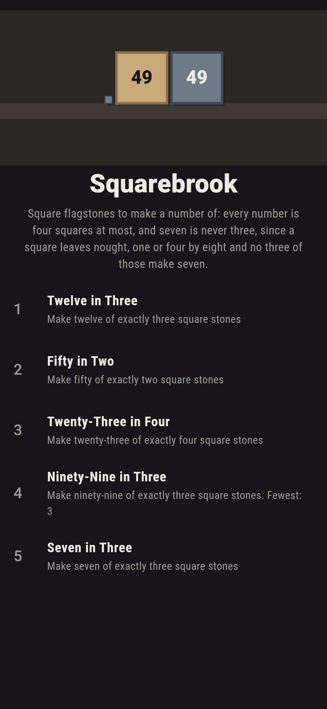
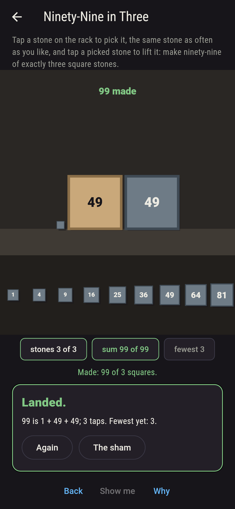
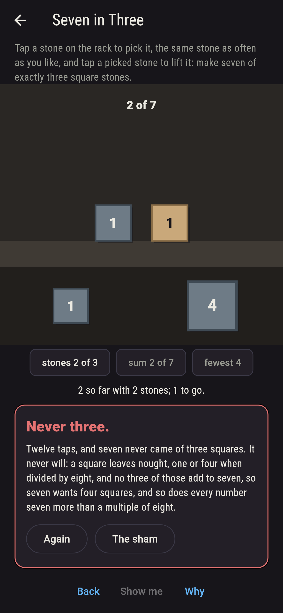
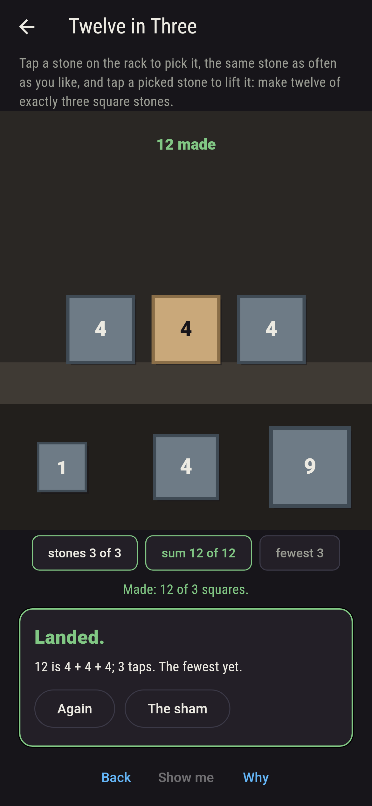
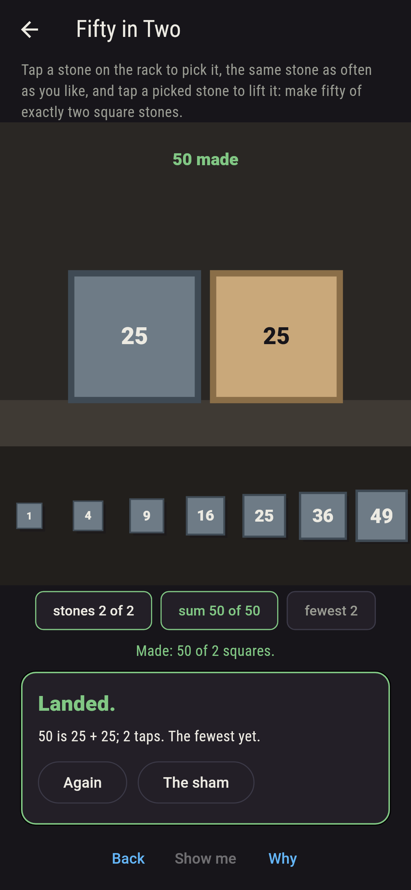
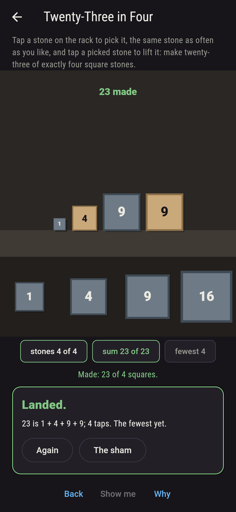
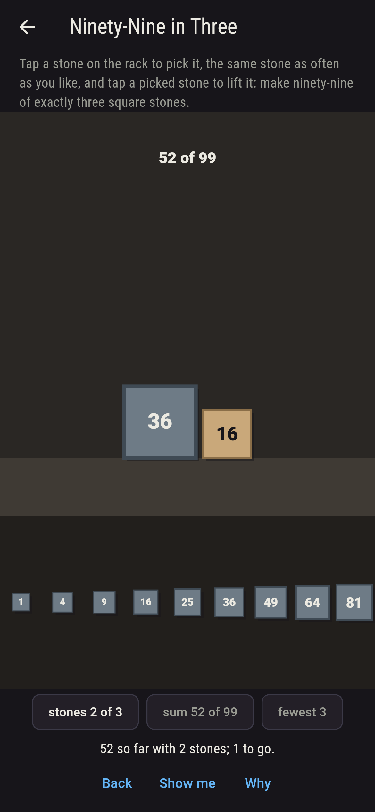
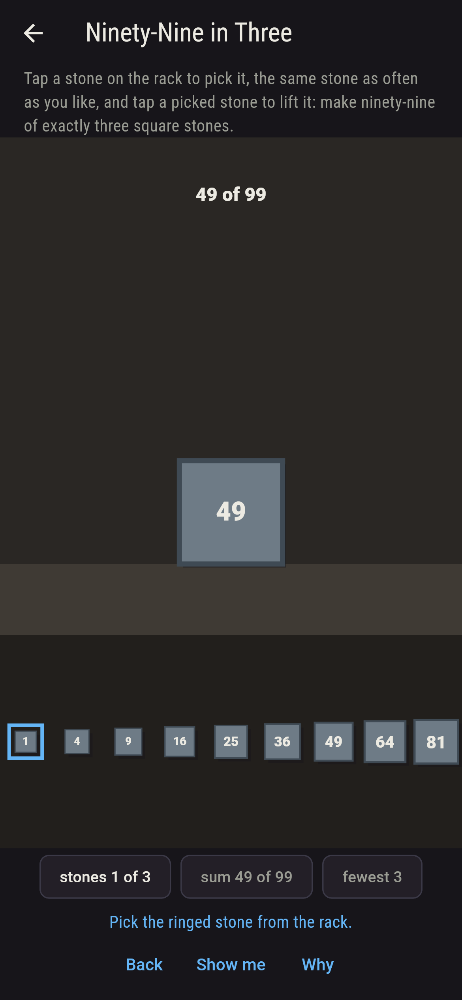
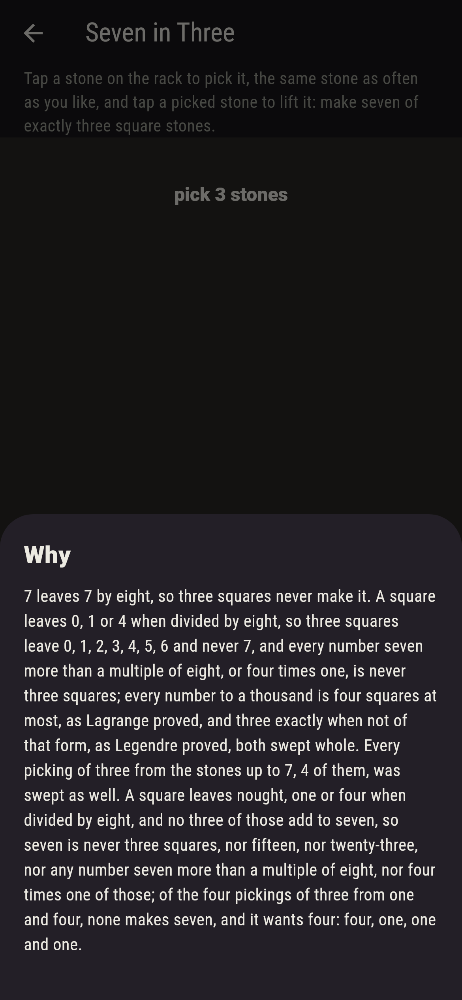

# Squarebrook


Square flagstones in a mason's yard, one, four, nine, sixteen and
up, and a number to make of them: tap a stone on the rack to pick
it, the same stone as often as you like, and the stones picked stand
on the ground each as big as its number. Every number is four
squares at most, as Lagrange proved in 1770, and most are three, but
seven is never three, nor fifteen, nor twenty-three, nor any number
seven more than a multiple of eight or four times one: a square
leaves nought, one or four when divided by eight, and no three of
those add to seven, which is Legendre's three-square theorem in
its plainest case. The game sweeps every picking of stones for every
number on the sham, and makes every number to a thousand with the
fewest squares, holding both theorems to the sweep.

## The numbers

1. **Twelve in Three** - make twelve of exactly three square stones
2. **Fifty in Two** - make fifty of exactly two square stones
3. **Twenty-Three in Four** - make twenty-three of exactly four square stones
4. **Ninety-Nine in Three** - make ninety-nine of exactly three square stones
5. **Seven in Three** - make seven of exactly three square stones

Twelve is four and four and four, one picking of ten; fifty is one
and forty-nine or twenty-five and twenty-five, two of twenty-eight,
the smallest number that is two squares two ways; twenty-three is
nine, nine, four and one, one of thirty-five, and never three;
ninety-nine is three squares three ways of 165. Seven in Three is
labeled hopeless on its tile, and the why counts by eight.

## Two voices

The game never asserts what it has not computed, and it computes
everything at least twice:

* **The sweep** picks the stones every way, repeats allowed, for
  every number on the sham, and counts the pickings that make it;
  and for every number from one to a thousand it finds the fewest
  squares that make the number by trying one, two, three and four.
  Every count on the sham is that sweep's.
* **Eight** needs no sweep: a square leaves 0, 1 or 4 when divided
  by eight, checked for every square to a hundred, and the leavings
  three squares can have are worked out from those, never 7; the
  sweep's fewest is then held to Legendre's law on every number to
  a thousand, three squares sufficing exactly when the number is not
  four to a power times seven more than a multiple of eight, and to
  Lagrange's, four sufficing always.

`tool/check_pickings.dart` runs the lot and refuses the bake on any
disagreement.

## The checker's ledger

What `dart run tool/check_pickings.dart` printed for the build this
README shipped with, word for word:

```
every picking of stones swept for the numbers on the sham, and every number from one to a thousand made with the fewest squares by the sweep: four squares suffice for all thousand, as Lagrange said, and three suffice for 835 of them, exactly the numbers not four to a power times seven more than a multiple of eight, as Legendre said, the first that want four being 7, 15, 23, 28, 31, 39, 47, 55; a square leaves 0, 1 or 4 by eight, and three of those never leave 7; twelve is three squares 1 way of 10, fifty two squares 2 ways of 28, twenty-three four 1 way of 35, ninety-nine three 3 ways of 165, and seven three squares never

 1 Twelve in Three      make twelve of exactly three square stones: 1 of the 10 pickings makes it
 2 Fifty in Two         make fifty of exactly two square stones: 2 of the 28 pickings make it
 3 Twenty-Three in Four make twenty-three of exactly four square stones: 1 of the 35 pickings makes it
 4 Ninety-Nine in Three make ninety-nine of exactly three square stones: 3 of the 165 pickings make it
 5 Seven in Three       make seven of exactly three square stones: none of the 4, and eight said so first
```

## Screenshots

| The sham | Ninety-nine made | Seven admitted |
| --- | --- | --- |
|  |  |  |

| Twelve | Fifty | Twenty-three | Mid-making | Show me | The why |
| --- | --- | --- | --- | --- | --- |
|  |  |  |  |  |  |

Screenshots are drawn by `test/showcase_test.dart` at real phone
sizes with the app's own painter, then copied into `docs/` as they
came out; every stone in them was picked by a tap, so nothing
pictured is a yard the game could not reach. The logo and every
launcher icon come out of `test/mark_test.dart` the same way: the
mark is ninety-nine made of three squares, one, forty-nine and
forty-nine.

## Building

```
flutter test          # 44 tests, the sweep among them
dart run tool/check_pickings.dart
flutter build apk     # or: flutter build ios
```
