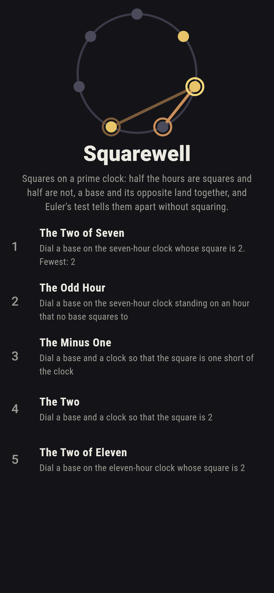
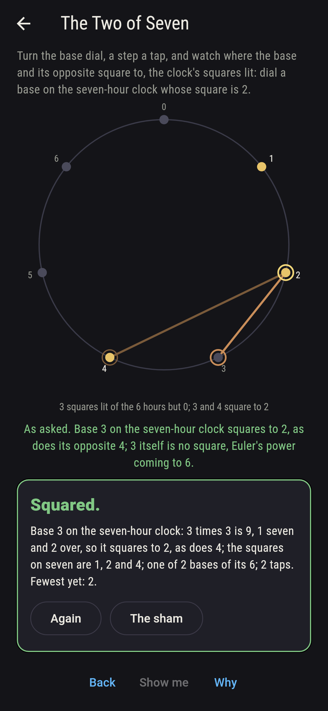
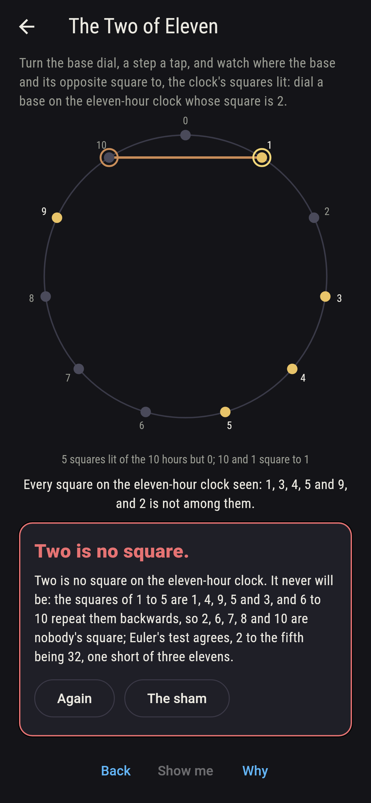
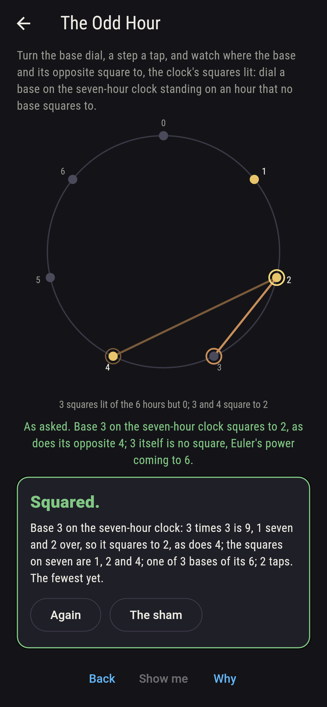
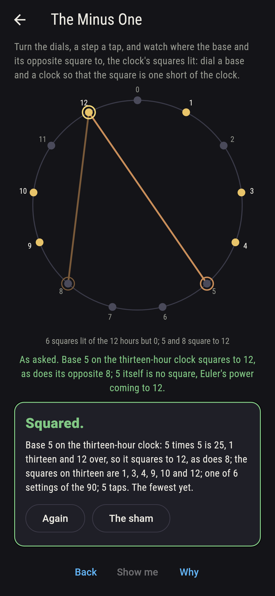
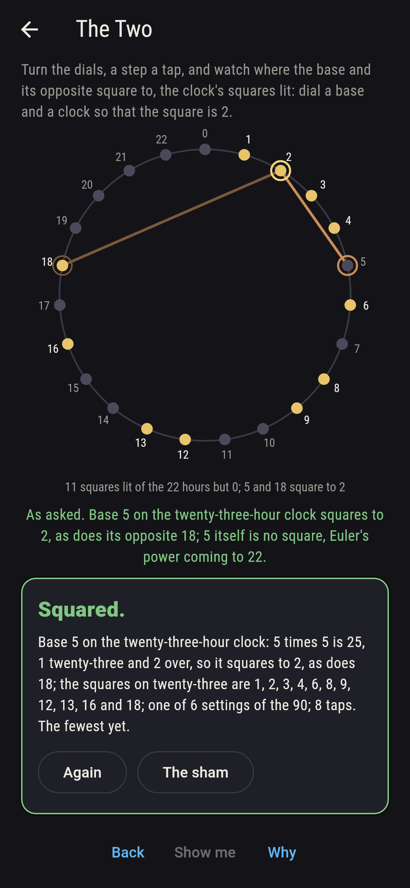
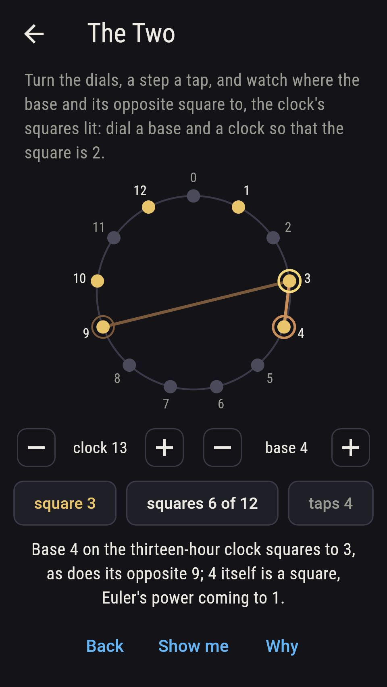
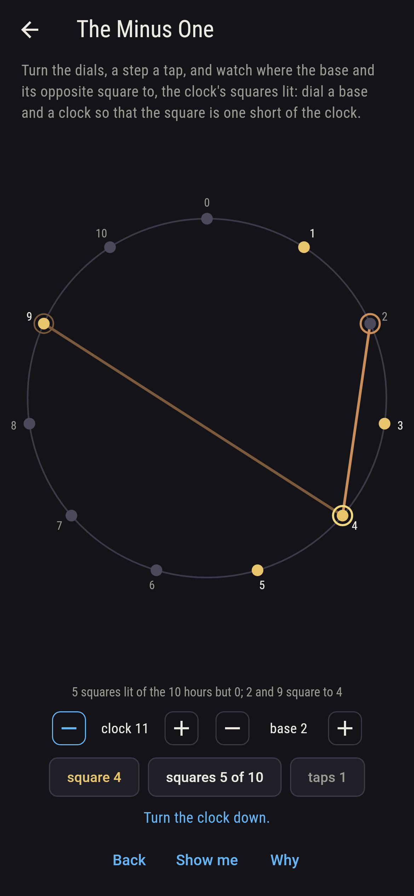
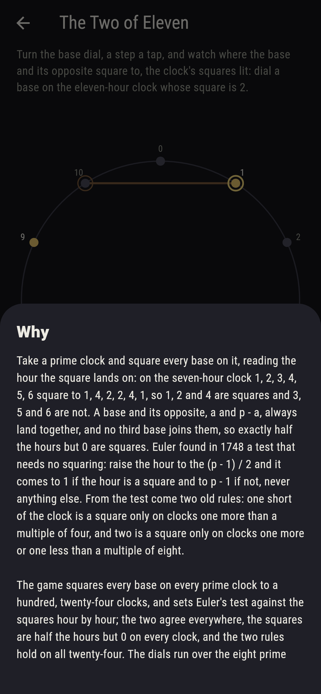

# Squarewell


Take a prime clock and square every base on it, reading the hour the
square lands on: on the seven-hour clock 1, 2, 3, 4, 5, 6 square to
1, 4, 2, 2, 4, 1, so 1, 2 and 4 are squares and 3, 5 and 6 are not.
A base and its opposite, a and p - a, always land together, and no
third base joins them, so exactly half the hours but 0 are squares.
Euler found in 1748 a test that needs no squaring: raise the hour to
the (p - 1) / 2 and it comes to 1 if the hour is a square and to
p - 1 if not, never anything else. From the test come two old rules:
one short of the clock is a square only on clocks one more than a
multiple of four, and two is a square only on clocks one more or one
less than a multiple of eight. Turn the dials and watch where the
base and its opposite square to, the clock's squares lit. The game
squares every base on every prime clock to a hundred, twenty-four
clocks, and sets Euler's test against the squares hour by hour; the
two agree everywhere, the squares are half the hours but 0 on every
clock, and the two rules hold on all twenty-four.

## The asks

1. **The Two of Seven** - dial a base on the seven-hour clock whose square is 2
2. **The Odd Hour** - dial a base on the seven-hour clock standing on an hour that no base squares to
3. **The Minus One** - dial a base and a clock so that the square is one short of the clock
4. **The Two** - dial a base and a clock so that the square is 2
5. **The Two of Eleven** - dial a base on the eleven-hour clock whose square is 2

On seven, 3 and 4 square to 2, and 3, 5 and 6 are nobody's square,
three of the six. One short of the clock is a square only on 5, 13
and 17 of the eight clocks on the dial, six settings of the 90, 2 and
3 on five, 5 and 8 on thirteen, 4 and 13 on seventeen; two only on 7,
17 and 23, six settings again, 3 and 4 on seven, 6 and 11 on
seventeen, 5 and 18 on twenty-three. The Two of Eleven is labeled
hopeless on its tile: the squares on eleven are 1, 4, 9, 5 and 3,
the squares of 1 to 5, and 6 to 10 repeat them backwards, so 2 is
nobody's square, and Euler's test agrees, 2 to the fifth being 32,
one short of three elevens; the sham admits it once every base has
been tried, or after twelve taps.

## Two voices

The game never asserts what it has not computed, and it computes
everything at least twice:

* **The squares** are taken outright: every base on every prime clock
  to a hundred squared and its hour read, 1,034 hours on twenty-four
  clocks, and every count on the sham is that sweep's; on each clock
  the squares come to exactly half the hours but 0, and every square
  is reached by a base and its opposite and by no other.
* **Euler's test** squares nothing: each hour raised to the
  (p - 1) / 2 by squaring and doubling, and read as 1 or as one short
  of the clock, never anything else; it names the same squares on
  every clock, and from it the two rules are checked on all
  twenty-four, minus one a square exactly on the clocks one more than
  a multiple of four, eleven of them, and two exactly on those one
  more or one less than a multiple of eight, eleven again.

`tool/check_squares.dart` runs the lot and refuses the bake on any
disagreement.

## The checker's ledger

What `dart run tool/check_squares.dart` printed for the build this
README shipped with, word for word:

```
every base on every prime clock to a hundred squared, 24 clocks and 1,034 hours, and Euler's test set against the squares hour by hour, the two agreeing on every hour, the test's power coming to 1 or one short of the clock and never anything else, and the squares making exactly half the hours but 0 on every clock, each square reached by a base and its opposite and by no other; one short of the clock is a square on exactly the clocks one more than a multiple of four, 11 of the 24, 5, 13, 17 and 29 first, and two on exactly the clocks one more or one less than a multiple of eight, 11 of the 24, 7, 17, 23 and 31 first; on the dials, the eight prime clocks from three to twenty-three, 90 settings, seven has the squares 1, 2 and 4, with 3 and 4 squaring to 2, and eleven the squares 1, 3, 4, 5 and 9, with 2 nobody's square

 1 The Two of Seven  dial a base on the seven-hour clock whose square is 2: 2 of its 6 bases land it
 2 The Odd Hour      dial a base on the seven-hour clock standing on an hour that no base squares to: 3 of its 6 bases land it
 3 The Minus One     dial a base and a clock so that the square is one short of the clock: 6 of the 90 settings land it
 4 The Two           dial a base and a clock so that the square is 2: 6 of the 90 settings land it
 5 The Two of Eleven dial a base on the eleven-hour clock whose square is 2: none of its 10 bases, and the five squares said so first
```

## Screenshots

| The sham | The two of seven | The two of eleven admitted |
| --- | --- | --- |
|  |  |  |

| The odd hour | The minus one | The two | Midway, on the small phone | Show me | The why |
| --- | --- | --- | --- | --- | --- |
|  |  |  |  |  |  |

Screenshots are drawn by `test/showcase_test.dart` at real phone
sizes with the app's own painter, then copied into `docs/` as they
came out; every setting in them was made by taps on the dials, so
nothing pictured is a setting the game could not reach. The logo and
every launcher icon come out of `test/mark_test.dart` the same way:
the mark is the seven-hour clock with its three squares lit and the
base 3, with its opposite 4, landing on 2.

## Building

```
flutter test          # 45 tests, the sweep among them
dart run tool/check_squares.dart
flutter build apk     # or: flutter build ios
```
