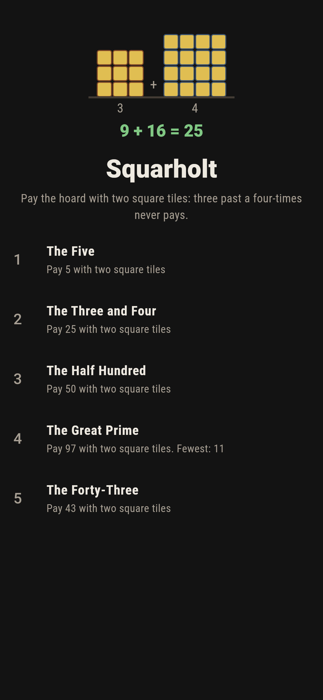
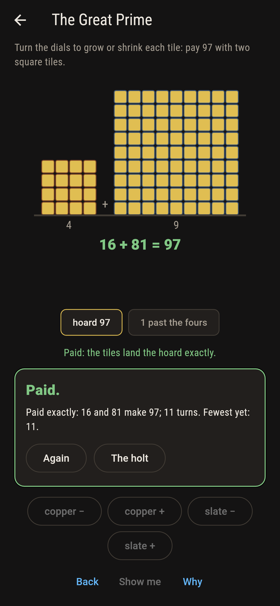
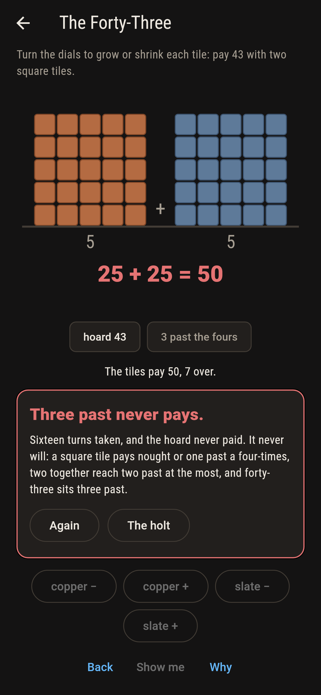
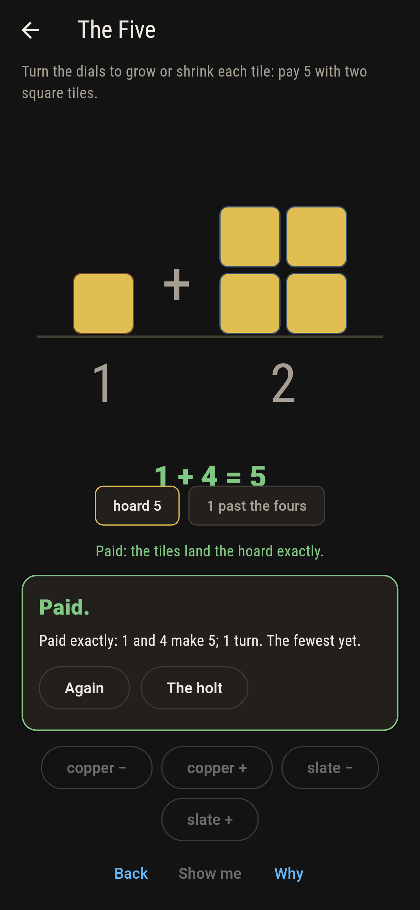
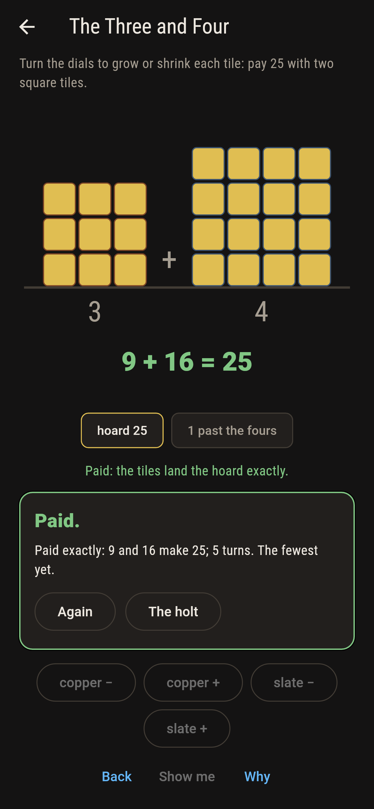
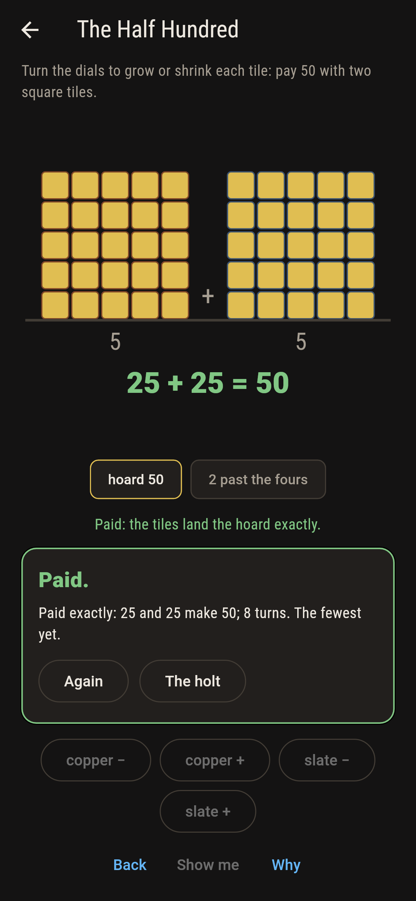
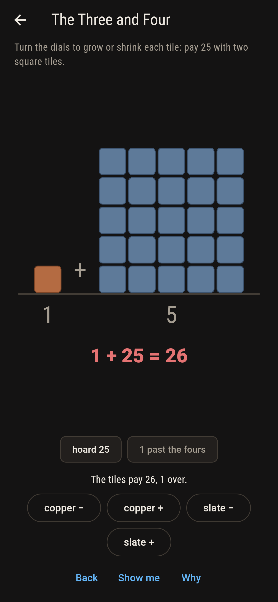
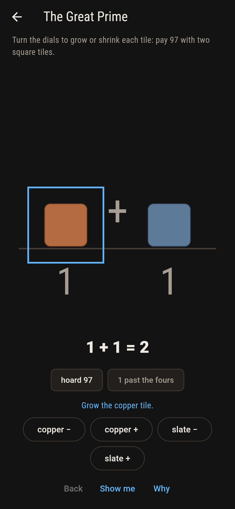
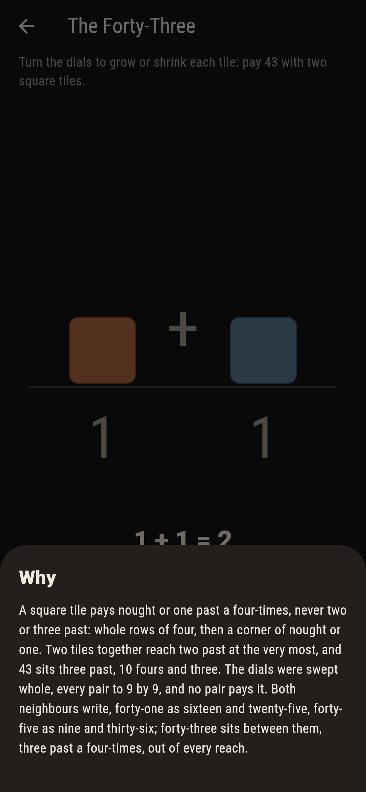

# Squarholt


A hoard to pay and two square tiles to pay it with: dial each
tile wider or narrower until the squares sum to the hoard
exactly. Fermat's law says a prime one past a four-times always
pays, one way only; the remainder law says three past a
four-times never pays at all, and the reason fits on a thumb:
a square ends at nought or one past a four-times, and two of
them reach two past at the most.

## The hoards

1. **The Five** - pay 5 with two square tiles
2. **The Three and Four** - pay 25 with two square tiles
3. **The Half Hundred** - pay 50 with two square tiles
4. **The Great Prime** - pay 97 with two square tiles
5. **The Forty-Three** - pay 43 with two square tiles

The Five is the smallest hoard two tiles of different sizes
pay. The Three and Four is the oldest right angle in the book,
and twenty-five takes no other pair. The Half Hundred pays two
ways, one of them the twins, and both fall out of five times
ten by the old identity, one per sign. The Great Prime is the
last prime under a hundred that Fermat promises, and The
Forty-Three is labeled hopeless on its tile: the remainder
said so before the dials ever turned.

## Two voices

The game never asserts what it has not computed, and it computes
everything at least twice:

* **The sweep** dials every pair of tiles there is and reads
  every writing off outright, hoard by hoard to two hundred.
* **The remainder** reads with no searching at all: squares
  pay nought or one past a four-times, so three past is barred
  outright. Brahmagupta's identity makes a third voice on the
  composite hoards, building both writings of fifty and of
  sixty-five from their factors, one per sign.

`tool/check_hoards.dart` runs the lot, Fermat's one-writing law
over every prime one past a four-times under a hundred
included, and refuses the bake on any disagreement.

## The checker's ledger

What `dart run tool/check_hoards.dart` printed for the build
this README shipped with, word for word:

```
every pair of tiles dialled and every hoard to two hundred read for its remainder: three past a four-times never writes, every prime one past a four-times under a hundred writes exactly once, and the old identity builds the half hundred and sixty-five from their factors, one writing per sign

 1 The Five           pay 5 with two square tiles: 1 writing on the dials lands it
 2 The Three and Four pay 25 with two square tiles: 1 writing on the dials lands it
 3 The Half Hundred   pay 50 with two square tiles: 2 writings on the dials land it
 4 The Great Prime    pay 97 with two square tiles: 1 writing on the dials lands it
 5 The Forty-Three    pay 43 with two square tiles: none, and the remainder said so before the dials turned
```

## Screenshots

| The holt | The great prime | The forty-three admitted |
| --- | --- | --- |
|  |  |  |

| The five | The three and four | The half hundred | Overpaid | Show me | The why |
| --- | --- | --- | --- | --- | --- |
|  |  |  |  |  |  |

Screenshots are drawn by `test/showcase_test.dart` at real phone
sizes with the app's own painter, then copied into `docs/` as
they came out; every dial in them was turned, so nothing
pictured is a pair of tiles the game could not reach. The logo
and every launcher icon come out of `test/mark_test.dart` the
same way: the mark is three and four paying twenty-five, gone
gold.

## Building

```
flutter test          # 44 tests, the sweep among them
dart run tool/check_hoards.dart
flutter build apk     # or: flutter build ios
```
