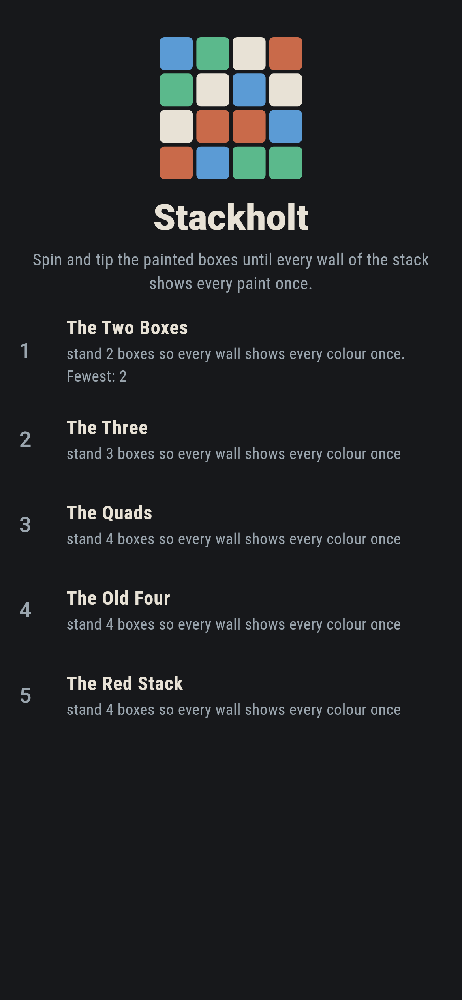
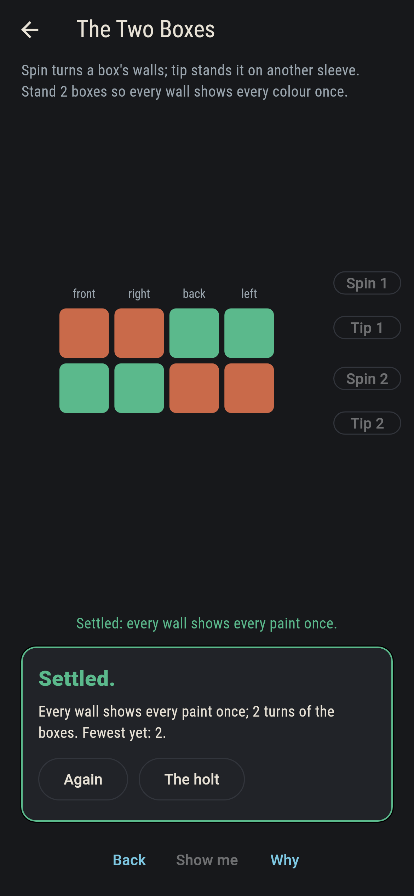
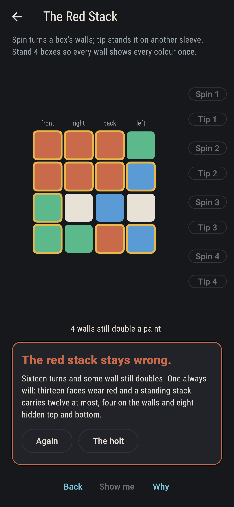
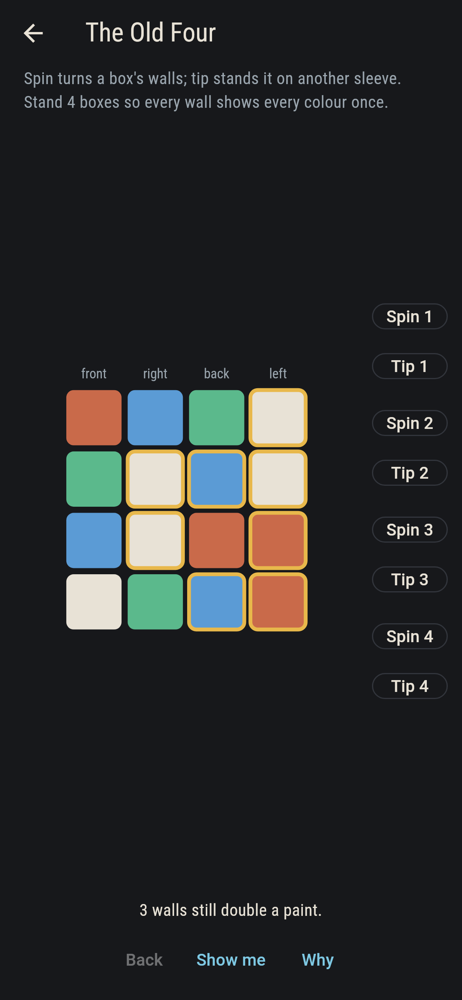
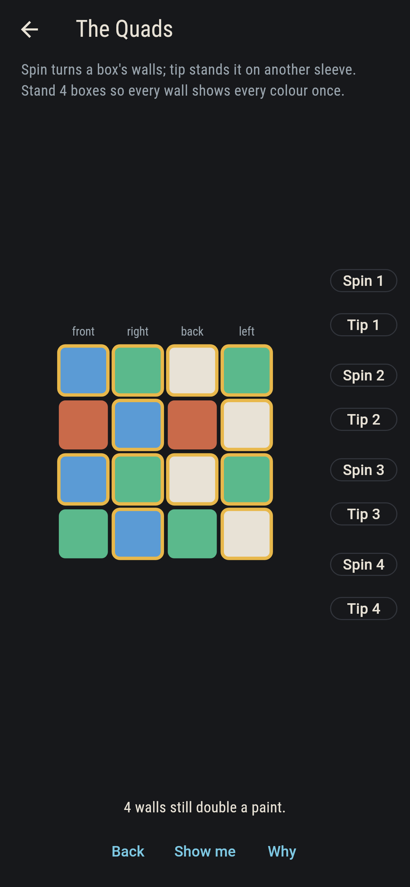
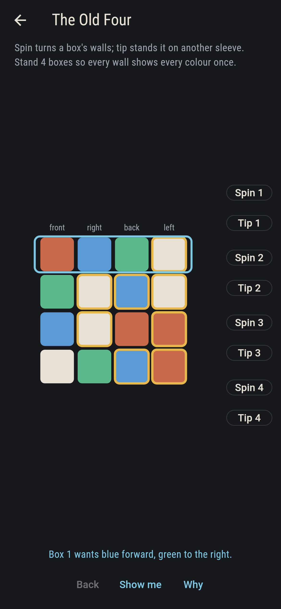
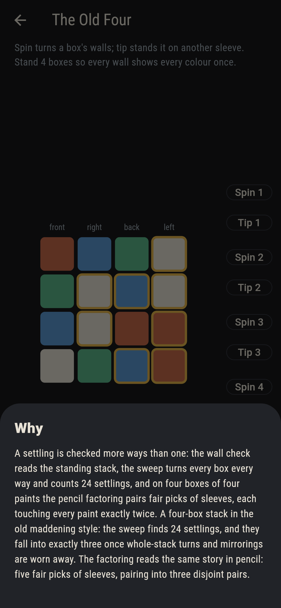

# Stackholt


Four painted boxes, four paints, one stack: spin and tip the
boxes until every wall of the stack shows every paint once. This
is the old maddening four-box puzzle with its counting laid bare:
the game knows every settling of every stack it ships, and the
one stack that cannot settle tells you why in a sentence you can
check on one hand.

## The stacks

1. **The Two Boxes** - stand 2 boxes so every wall shows every colour once
2. **The Three** - stand 3 boxes so every wall shows every colour once
3. **The Quads** - stand 4 boxes so every wall shows every colour once
4. **The Old Four** - stand 4 boxes so every wall shows every colour once
5. **The Red Stack** - stand 4 boxes so every wall shows every colour once

The Quads are four boxes painted exactly alike, and the stack
still settles 96 ways: alike boxes need not stand alike. The Old
Four settles 24 ways that wear down to three once whole-stack
turns and mirrorings go. The Red Stack never settles: thirteen
faces wear red, and a standing stack of four carries a colour on
twelve faces at most, one on each wall and eight hidden top and
bottom.

## The voices

The game never asserts what it has not computed, and it computes
everything more ways than one:

* **The wall check** reads the standing stack, wall by wall, and
  rings every doubled face.
* **The sweep** turns every box every way and counts the
  settlings: 4, 48, 96, 24 and none.
* **The factoring** walks the pencil-and-paper road on the
  four-box stacks: fair picks of sleeves touching every paint
  exactly twice, paired disjointly. The Old Four has five fair
  picks pairing into three factorings; the Red Stack has none.
* **The count** on the hopeless stack: thirteen red faces,
  twelve places a standing stack can put a colour.

`tool/check_stacks.dart` runs the lot, including the class count
under whole-stack turns and mirrorings, and refuses the bake on
any disagreement.

## The checker's ledger

What `dart run tool/check_stacks.dart` printed for the build this
README shipped with, word for word:

```
every stack swept standing by standing: the wall check, the sweep and the pencil factoring never part, the old four settles 24 ways that wear down to three once whole-stack turns and mirrorings go, its five fair picks pair into three pencil factorings, and the red stack is doomed by a count on one hand, thirteen red faces where a standing stack carries twelve

 1 The Two Boxes  stand 2 boxes so every wall shows every colour once: 4 settlings by the sweep
 2 The Three      stand 3 boxes so every wall shows every colour once: 48 settlings by the sweep
 3 The Quads      stand 4 boxes so every wall shows every colour once: 96 settlings by the sweep
 4 The Old Four   stand 4 boxes so every wall shows every colour once: 24 settlings by the sweep
 5 The Red Stack  stand 4 boxes so every wall shows every colour once: none, by the count, the factoring and the sweep all three
```

## Screenshots

| The holt | The two boxes settled | The red stack admitted |
| --- | --- | --- |
|  |  |  |

| The old four opening | The quads mid-turn | Show me | The why |
| --- | --- | --- | --- |
|  |  |  |  |

Screenshots are drawn by `test/showcase_test.dart` at real phone
sizes with the app's own painter, then copied into `docs/` as they
came out; every box in them was turned by its buttons, so nothing
pictured is a stack the game could not reach. The logo and every
launcher icon come out of `test/mark_test.dart` the same way: the
mark is the old four settled.

## Building

```
flutter test          # 42 tests, the sweep among them
dart run tool/check_stacks.dart
flutter build apk     # or: flutter build ios
```
