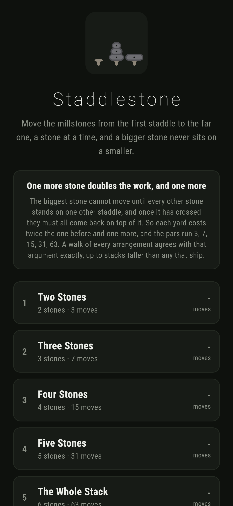
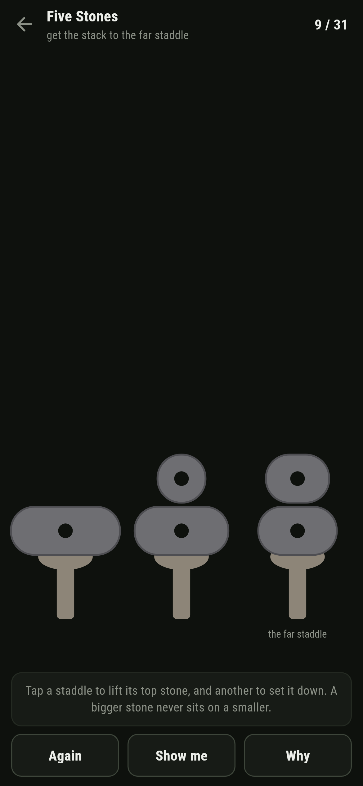
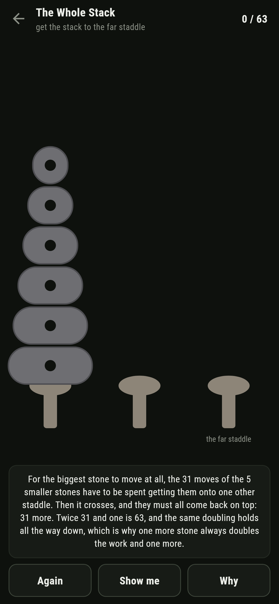
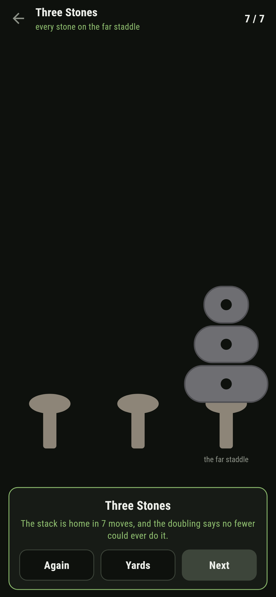
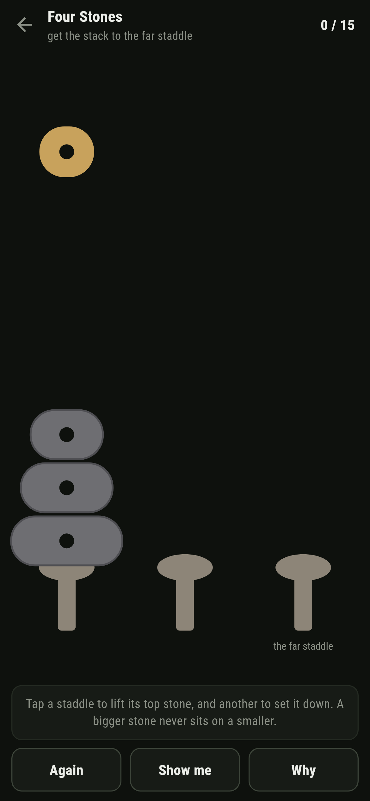

# Staddlestone

A stacking puzzle for phones, in Flutter, for Android and iOS.

Three staddle stones stand in the yard, and the millstones are piled on the
first. Move them to the far staddle a stone at a time, and a bigger stone
never sits on a smaller. Everybody has met this puzzle; the point of this
build is that it proves its numbers rather than reciting them.

| | | | |
|---|---|---|---|
|  |  |  |  |

## One more stone doubles the work, and one more

The biggest stone cannot move until every stone above it stands on one other
staddle, which costs at least what the smaller pile costs. Then it crosses.
Then the smaller pile must come back on top of it, at least the same again.
So each yard costs at least twice the one before and one more, and one stone
costs one: the pars run 3, 7, 15, 31, 63.

That is an argument, and the game does not rest on it alone. A walk outwards
from the finished yard visits every arrangement the stones can stand in and
writes the true distance against each. The argument and the walk agree for
every count of stones to nine, which is further than any yard that ships.

```
$ make yards
 1 Two Stones       2 stones     9 standings  walked  3  doubling says  3  written down  3  3ms
 2 Three Stones     3 stones    27 standings  walked  7  doubling says  7  written down  7  1ms
 3 Four Stones      4 stones    81 standings  walked 15  doubling says 15  written down 15  0ms
 4 Five Stones      5 stones   243 standings  walked 31  doubling says 31  written down 31  1ms
 5 The Whole Stack  6 stones   729 standings  walked 63  doubling says 63  written down 63  1ms
   7 stones off the book: walked 127, doubling says 127
   8 stones off the book: walked 255, doubling says 255
   9 stones off the book: walked 511, doubling says 511
```

The walk earns its keep twice over. It is why **Show me** is exact from any
position, not only the start, and it taught me something writing the tests: a
wasted move here costs one, not two. The single stone moves form a triangle,
so a wrong move can leave the distance exactly where it was, and the test that
assumed otherwise failed until the table put it right.

## The half way moment

On a shortest way, the biggest stone reaches the far staddle at exactly move
two to the stones less one, with one fewer than that still to go. The game
says so out loud when it happens, because that moment is the doubling argument
made visible: half the work was spent clearing the road, and the little
stones must all now come back on top.



## Running it

```
make deps    # flutter pub get
make test    # everything
make analyze
make shots   # render the screens into build/showcase, redraw the logo and icons
make yards   # every shipped yard, and the doubling against the walk to nine stones
make apk     # release APK
make ios     # release iOS build, unsigned
```

## Tests

`flutter test` runs the standing (tops, the sitting rule, packing without
loss), the walk against the doubling for every count of stones to nine, every
distance being a real shortest way over every arrangement of the four stone
yard, every yard that ships, each par being twice the last and one, and a
yard being worked: lifting, setting down, putting back, the refusals, the
wasted move that costs one, and the biggest stone coming home exactly half
way.

Then the game through the screen: the same moves by tapping staddles, the big
stone's crossing called out with the count, **Again**, **Show me**, **Why**,
and every yard worked at par.

Screenshots come from `test/showcase_test.dart`, and every stone in them was
moved by tapping staddles. `test/mark_test.dart` draws the logo, the launcher
icons at every density Android asks for and every size the iOS icon set asks
for; there is no image in this repository that was not produced by it.
