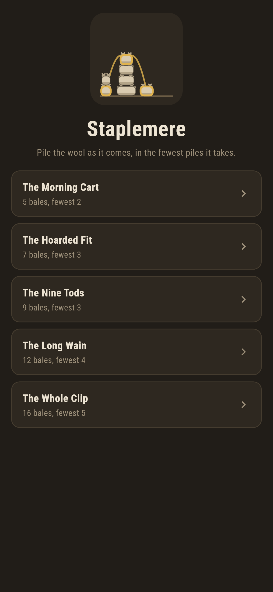
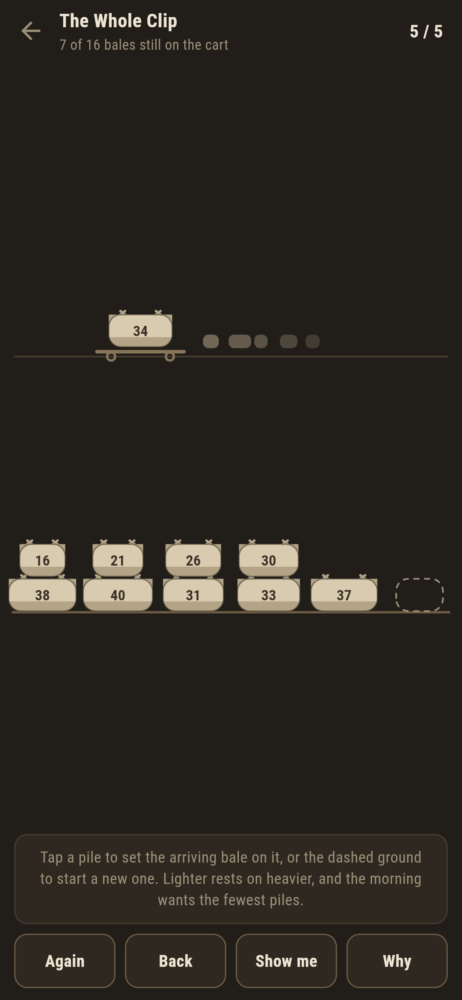
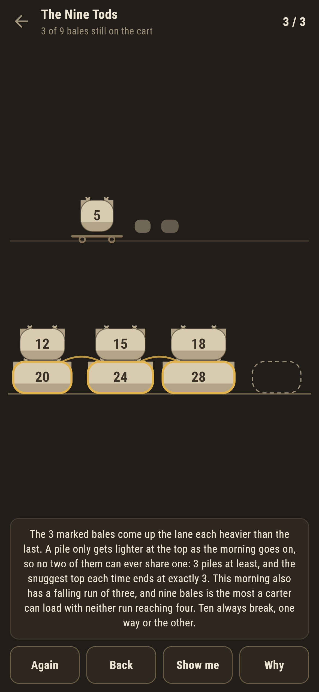
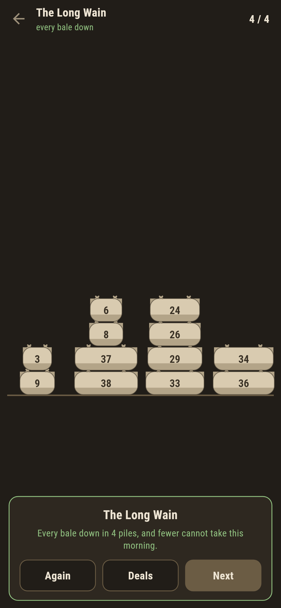
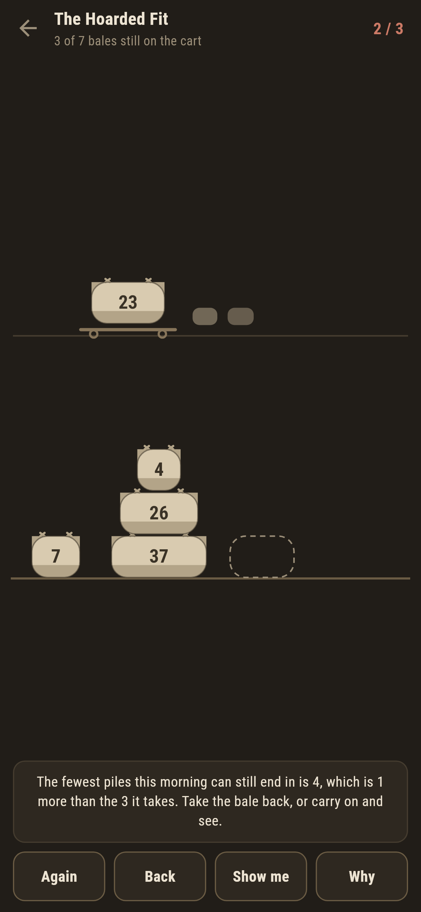

# Staplemere

A wool yard puzzle for phones, in Flutter, for Android and iOS.

The bales come up the lane one at a time, weighed in tods, in an order the
carter chose. A bale may rest on the ground or on a heavier bale, never on a
lighter one: wool crushes. Set every bale down in the fewest piles the
morning allows.

| | | | |
|---|---|---|---|
|  |  |  |  |

## The fewest piles is a theorem

The answer is the longest run of bales that come up the lane each heavier
than the last. That run is a floor you can check by eye: a pile's top only
gets lighter as the morning goes on, so once one bale of the run is down,
every later, heavier bale of the run needs a pile of its own. **Why** draws
the run in gold on the yard in front of you, and no two gold bales ever
share a pile, however the morning was played.

The other direction is a rule: set each bale on the snuggest top that can
take it, the lightest one still heavier than the bale, and the morning ends
in exactly that many piles. Piles read from the ground up as falling runs,
so a finished yard is a partition of the morning into falling runs, and the
fewest parts equalling the longest rising run is Dilworth's theorem standing
in a farmyard.

Neither claim is trusted here. The ledger of every shipped deal, from
`make deals`:

```
$ make deals
 1 The Morning Cart    5 bales  fewest 2  written down 2  thread 2  best fit 2  hoarding 3  falling 3
 2 The Hoarded Fit     7 bales  fewest 3  written down 3  thread 3  best fit 3  hoarding 4  falling 4
 3 The Nine Tods       9 bales  fewest 3  written down 3  thread 3  best fit 3  hoarding 3  falling 3
 4 The Long Wain      12 bales  fewest 4  written down 4  thread 4  best fit 4  hoarding 5  falling 7
 5 The Whole Clip     16 bales  fewest 5  written down 5  thread 5  best fit 5  hoarding 6  falling 6
```

`fewest` is brute force over every legal way to play the morning,
remembering nothing but the pile tops, which is all the future can see. The
suite holds thread, best fit and brute force against each other on all 720
orderings of six bales and on three hundred bigger mornings made up at
random, and they never part.

## Hoarding the snug fit costs

The tempting thought is the other one: keep the snug top free, it might be
needed by something closer to its weight, and set the bale on the heaviest
top instead. On every deal built for it that ends one pile over, and the
game does not wait for the end to say so. It keeps a live answer to the
fewest piles the morning can still end in, given what is already standing,
and the moment a placement pushes that number up the ledger goes red and
the words under the yard say what the placement cost.



The live number is not advice. A test plays two hundred mornings to random
part-way points and holds it against brute force from exactly there.

Take the bale back and the number comes down. Nothing is lost but the walk.

## Nine bales is a boundary

The Nine Tods is three falling loads of three rising bales: its longest
rising run is three, and its longest falling run is three as well. Nine is
the most bales a carter can load with neither run reaching four; ten always
break, one way or the other. The suite sweeps all 120 orderings of five
bales for the same boundary one size down, where a run of three is already
forced, and five hundred random mornings of ten for the break at four.

## Show me shows, Why explains

**Show me** points at the snuggest top and says why snug is right: it
leaves every heavier top still standing for what comes later. **Why** draws
the gold thread and counts it, so finishing a deal means knowing the number
rather than having bumped into it.

## Building

```
make deps    # fetch packages
make check   # analyze + every test
make deals   # walk the shipped deals: fewest three ways, hoarding, runs
make shots   # render the screenshots and redraw the icons
make apk     # Android release build
make ios     # iOS release build (unsigned)
```

The logo and every app icon are drawn by the game's own painter in
`test/mark_test.dart`. There is no image in this repository that was not
produced by code in it.

## How it is put together

```
lib/yard/deal.dart     a morning: the bales in arrival order, the answer
lib/yard/fewest.dart   the thread, best fit, and brute force over pile tops
lib/yard/deals.dart    the five deals that ship
lib/yard/play.dart     a morning in progress: piles, cart, live fewest
lib/ui/                the painter, the screens, the mark
tool/find_deals.dart   digs up deals where hoarding costs
tool/check_deals.dart  the ledger above
```

The tests hold the written-down numbers against all three answers, the
live number against brute force from part-played mornings, the gold thread
against every way of playing, the boundary against every ordering it can
sweep, and the pictures against the real widget tree. If any of that
drifts, `make check` goes red before anything leaves the machine.
