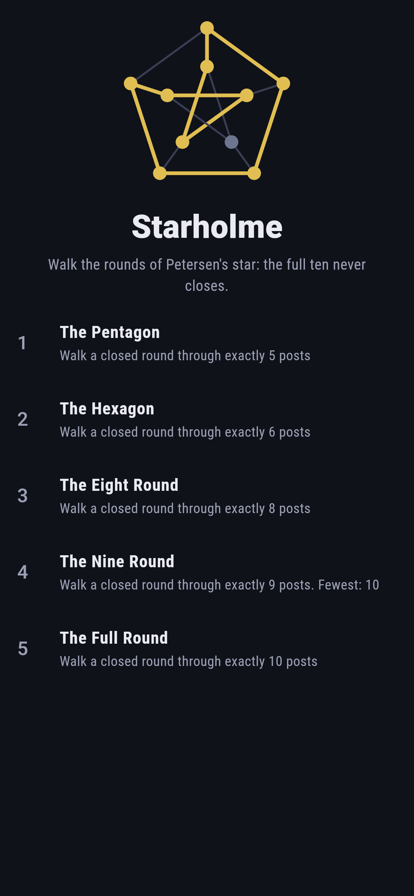
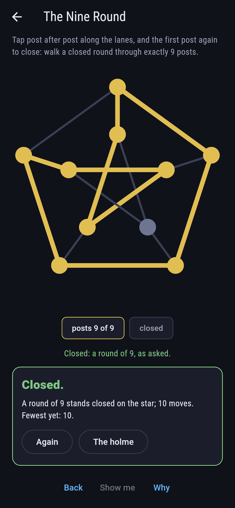
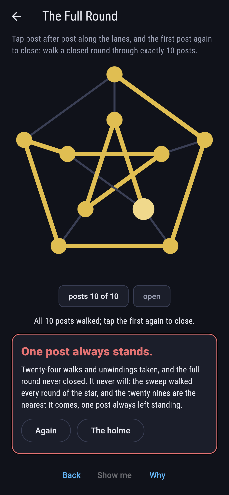
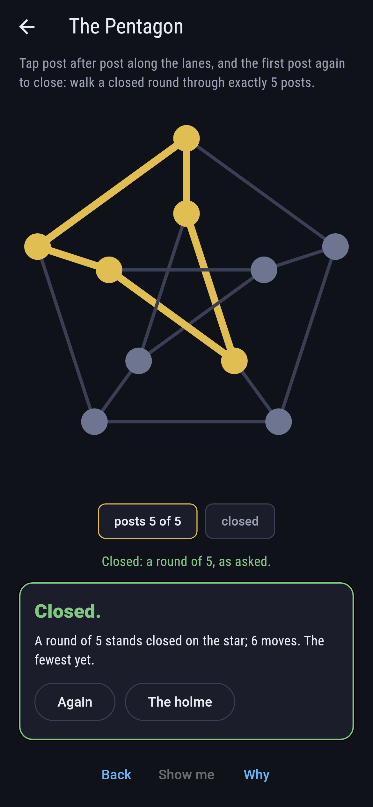
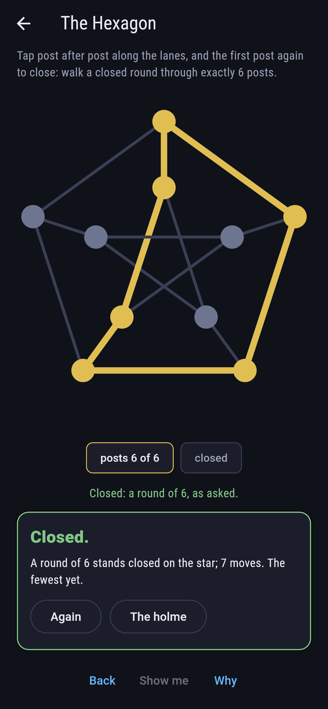
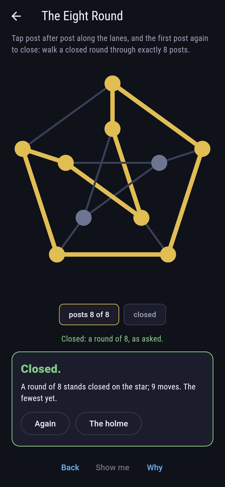
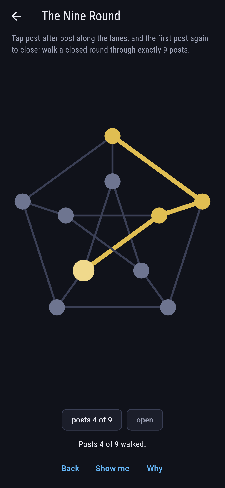
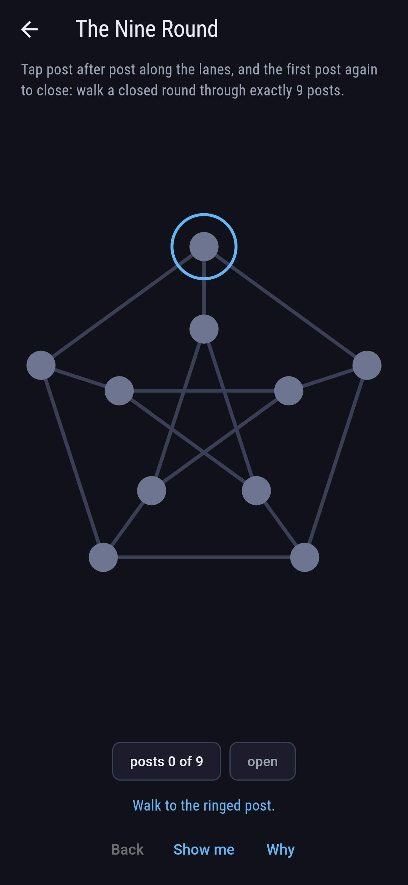
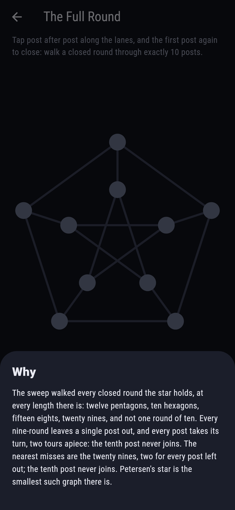

# Starholme


Ten posts, five on the outer ring and five on the inner star,
a spoke joining each pair: Petersen's graph, the most famous
counterexample in graph theory. Walk closed rounds along its
lanes. Twelve pentagons stand, ten hexagons, fifteen eights and
twenty nines; never a seven-round, and never the full ten. Yet
drop any one post and exactly two nine-post tours remain.

## The tours

1. **The Pentagon** - walk a closed round through exactly 5 posts
2. **The Hexagon** - walk a closed round through exactly 6 posts
3. **The Eight Round** - walk a closed round through exactly 8 posts
4. **The Nine Round** - walk a closed round through exactly 9 posts
5. **The Full Round** - walk a closed round through exactly 10 posts

Five is the star's shortest round and seven is nobody's: the
census jumps from hexagons straight to eights. Every eight
leaves out a pair of posts that shares a lane, one eight per
lane. Every nine leaves out exactly one post, two tours apiece
across all ten. The Full Round is labeled hopeless on its tile:
all ten posts can be walked as an open trail, but the closing
lane never exists.

## Two voices

The game never asserts what it has not computed, and it computes
everything at least twice:

* **The walk** checks itself lane by lane as it goes, refusing
  strangers and revisits, and closes only on a sound round.
* **The census** sweeps every closed round of the star at
  every length, five through ten, and pins the counts whole,
  the two-per-left-out-post law of the nines and the
  one-per-lane law of the eights included.

`tool/check_rounds.dart` runs the lot and refuses the bake on
any disagreement.

## The checker's ledger

What `dart run tool/check_rounds.dart` printed for the build
this README shipped with, word for word:

```
every closed round of the star walked at every length: twelve pentagons, ten hexagons, fifteen eights and twenty nines, never a seven-round and never the full ten, the nines splitting two apiece over the ten posts left out, and every eight leaving out a pair that shares a lane

 1 The Pentagon       walk a closed round through exactly 5 posts: 12 rounds of the sweep stand
 2 The Hexagon        walk a closed round through exactly 6 posts: 10 rounds of the sweep stand
 3 The Eight Round    walk a closed round through exactly 8 posts: 15 rounds of the sweep stand
 4 The Nine Round     walk a closed round through exactly 9 posts: 20 rounds of the sweep stand
 5 The Full Round     walk a closed round through exactly 10 posts: none at all, and the twenty nines are the nearest misses
```

## Screenshots

| The holme | The nine round | The full round admitted |
| --- | --- | --- |
|  |  |  |

| The pentagon | The hexagon | The eight round | Mid-round | Show me | The why |
| --- | --- | --- | --- | --- | --- |
|  |  |  |  |  |  |

Screenshots are drawn by `test/showcase_test.dart` at real phone
sizes with the app's own painter, then copied into `docs/` as
they came out; every step in them was tapped, so nothing
pictured is a round the game could not reach. The logo and
every launcher icon come out of `test/mark_test.dart` the same
way: the mark is a nine-round in gold, one post standing out
alone.

## Building

```
flutter test          # 44 tests, the sweep among them
dart run tool/check_rounds.dart
flutter build apk     # or: flutter build ios
```
