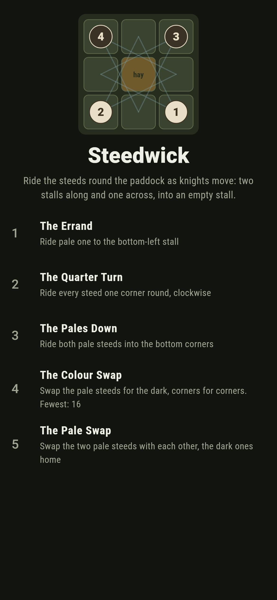
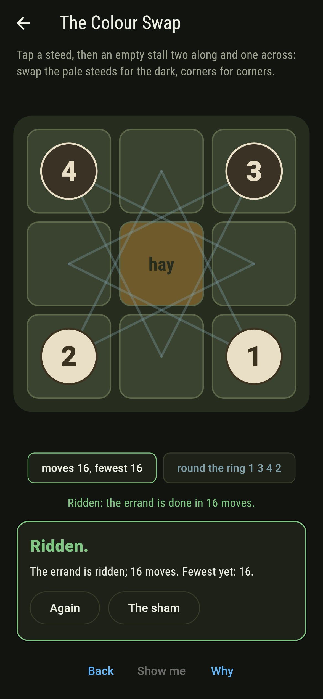
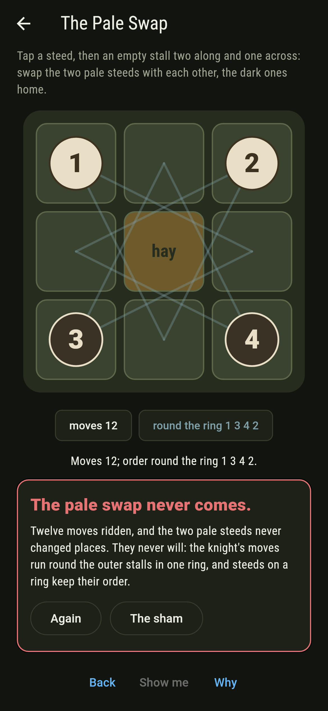
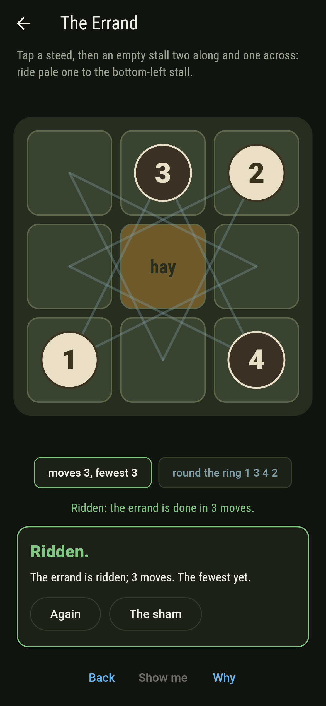
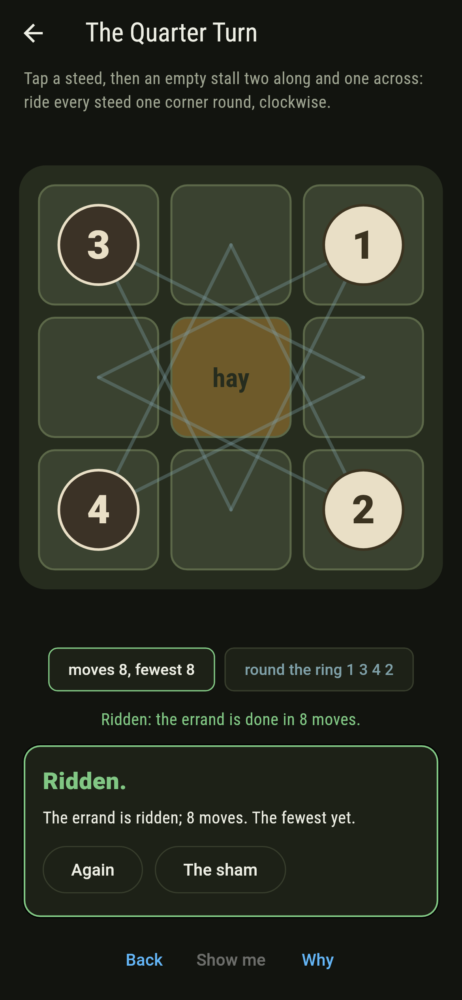
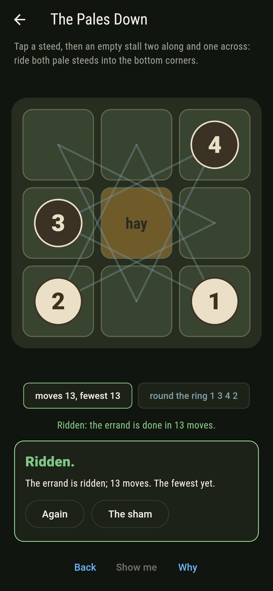
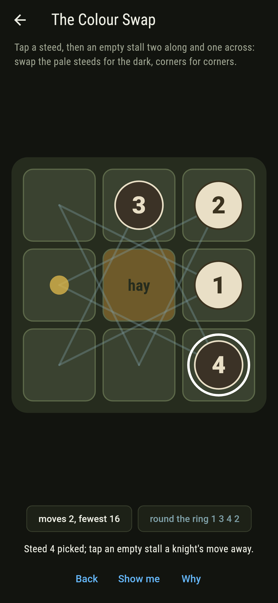
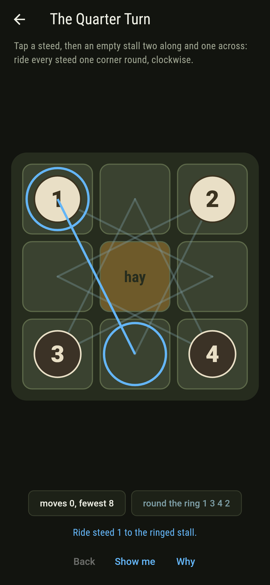
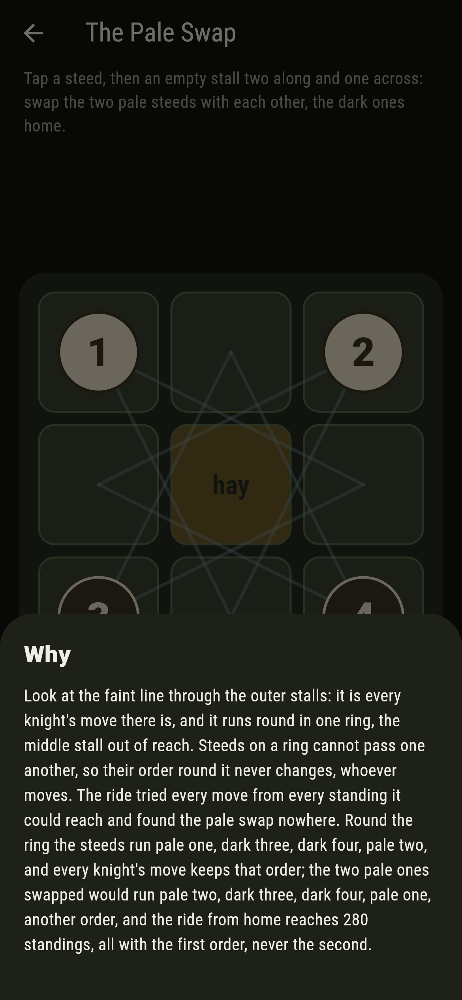

# Steedwick


Nine stalls in a square, four steeds in the corners, two pale at
the top and two dark at the bottom, and a steed moves as a knight
does: two stalls along and one across, into an empty stall.
Guarini set the puzzle in 1512: swap the pale for the dark. It
takes sixteen moves. The reason it can be done at all, and the
reason the two pale steeds can never change places with each
other, is one and the same: a knight's moves on the eight outer
stalls run round in a single ring, and steeds on a ring cannot
pass one another, so their order round it never changes.

## The errands

1. **The Errand** - ride pale one to the bottom-left stall
2. **The Quarter Turn** - ride every steed one corner round, clockwise
3. **The Pales Down** - ride both pale steeds into the bottom corners
4. **The Colour Swap** - swap the pale steeds for the dark, corners for corners
5. **The Pale Swap** - swap the two pale steeds with each other, the dark ones home

The errand takes three moves, the quarter turn eight, the pales
down thirteen and the colour swap sixteen, which is as far from
home as any standing lies; the swap comes out one way only, each
steed in the corner across from its own. The Pale Swap is labeled
hopeless on its tile, and the why walks the ring.

## Two voices

The game never asserts what it has not computed, and it computes
everything at least twice:

* **The ride** walks every standing a knight can reach from home,
  280 of them, with the fewest moves to each and every fewest ride
  counted, and every move from every reached standing.
* **The ring** is the knight's moves themselves, checked to run
  round the outer stalls in one ring with the middle out of reach;
  it says which of the 1,680 standings can be reached at all, those
  keeping home's order round it, pale one, dark three, dark four,
  pale two, and the ride reaches exactly those, every move keeping
  the order.

`tool/check_paddocks.dart` runs the lot and refuses the bake on
any disagreement.

## The checker's ledger

What `dart run tool/check_paddocks.dart` printed for the build this
README shipped with, word for word:

```
every standing ridden to from home, 280 of the 1,680, and they are exactly the standings that keep home's order round the ring, pale one, dark three, dark four, pale two, since a knight's moves on the outer stalls run round in one ring and every move keeps the order: pale one reaches the bottom-left in 3, the quarter turn takes 8, both pales down 13, Guarini's colour swap 16 and one way only, sixteen being as far as any standing lies, and the pale swap is never reached

 1 The Errand        ride pale one to the bottom-left stall: 3 moves at the fewest, 2 fewest rides
 2 The Quarter Turn  ride every steed one corner round, clockwise: 8 moves at the fewest, 1,088 fewest rides
 3 The Pales Down    ride both pale steeds into the bottom corners: 13 moves at the fewest, 71,680 fewest rides
 4 The Colour Swap   swap the pale steeds for the dark, corners for corners: 16 moves at the fewest, 4,726,784 fewest rides
 5 The Pale Swap     swap the two pale steeds with each other, the dark ones home: never, and the ring said so first
```

## Screenshots

| The sham | The colour swap ridden | The pale swap admitted |
| --- | --- | --- |
|  |  |  |

| The errand | The quarter turn | The pales down | Mid-ride | Show me | The why |
| --- | --- | --- | --- | --- | --- |
|  |  |  |  |  |  |

Screenshots are drawn by `test/showcase_test.dart` at real phone
sizes with the app's own painter, then copied into `docs/` as they
came out; every move in them was tapped, so nothing pictured is a
standing the game could not reach. The logo and every launcher
icon come out of `test/mark_test.dart` the same way: the mark is
the colour swap done, the knight's ring through the stalls.

## Building

```
flutter test          # 45 tests, the ride among them
dart run tool/check_paddocks.dart
flutter build apk     # or: flutter build ios
```
