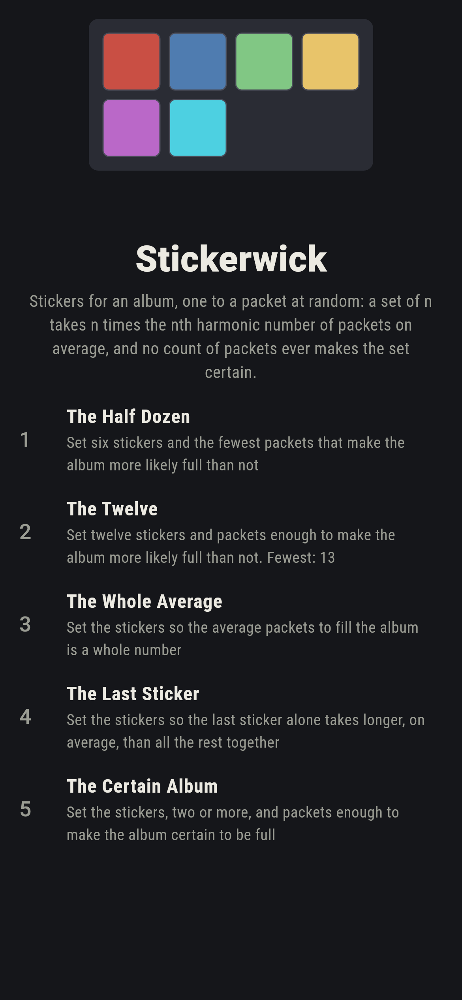
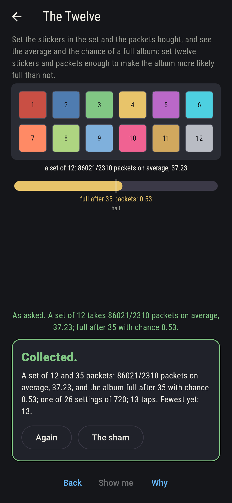
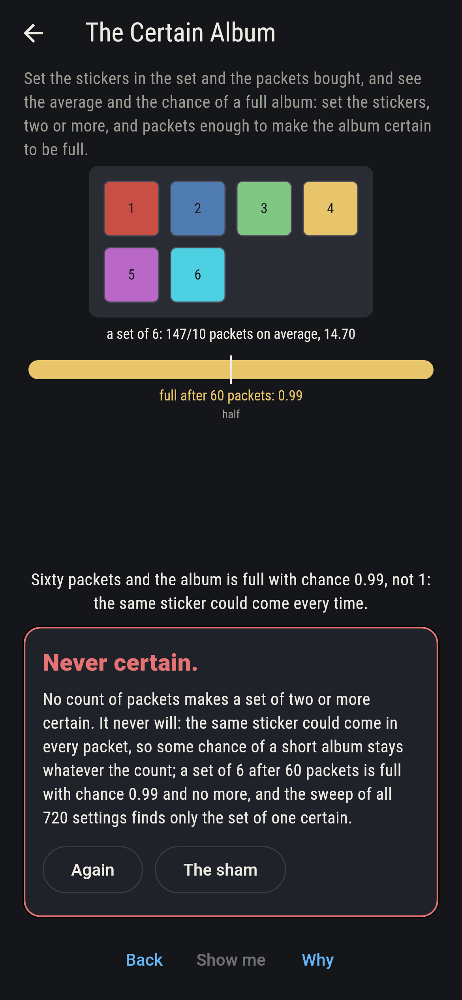
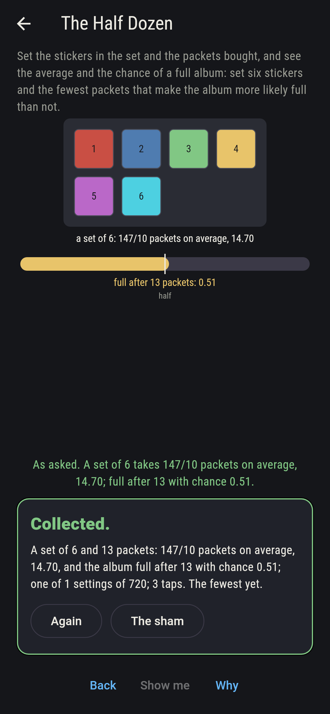
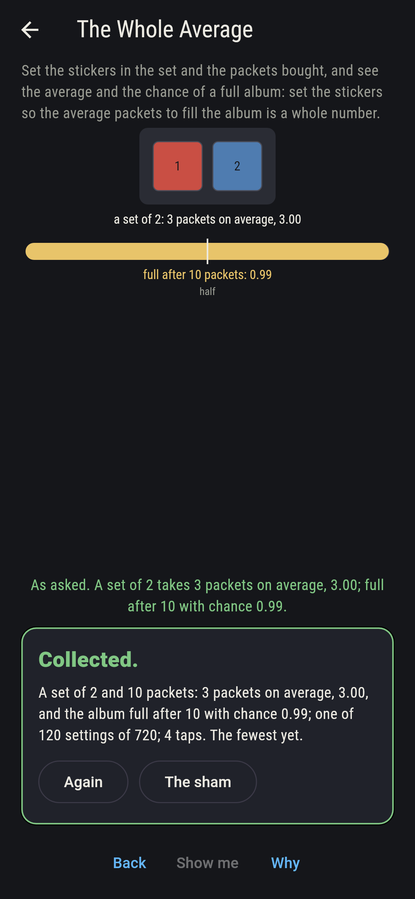
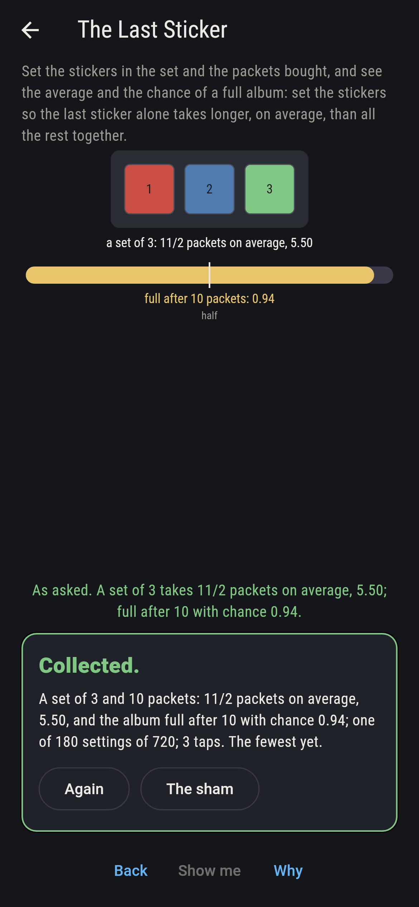
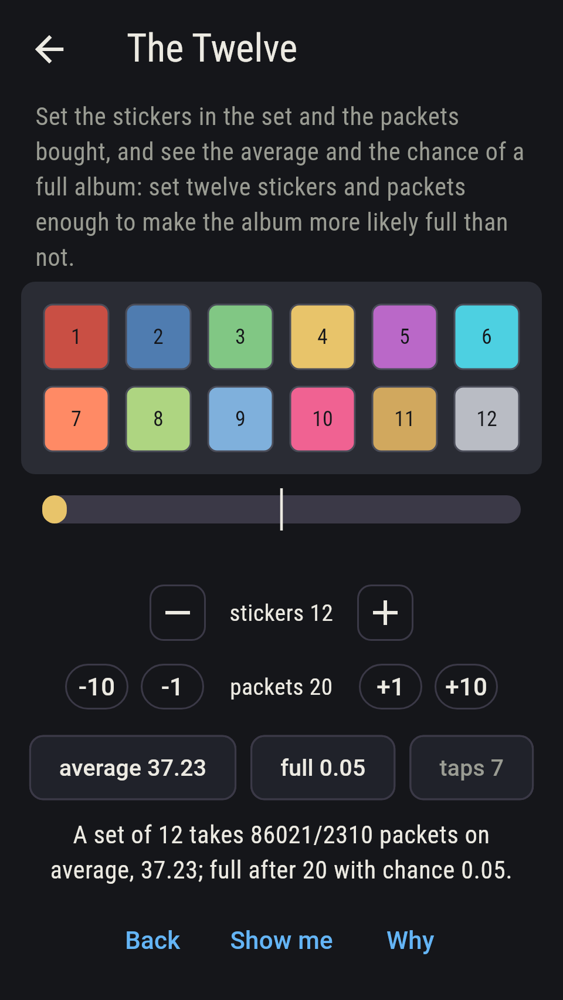
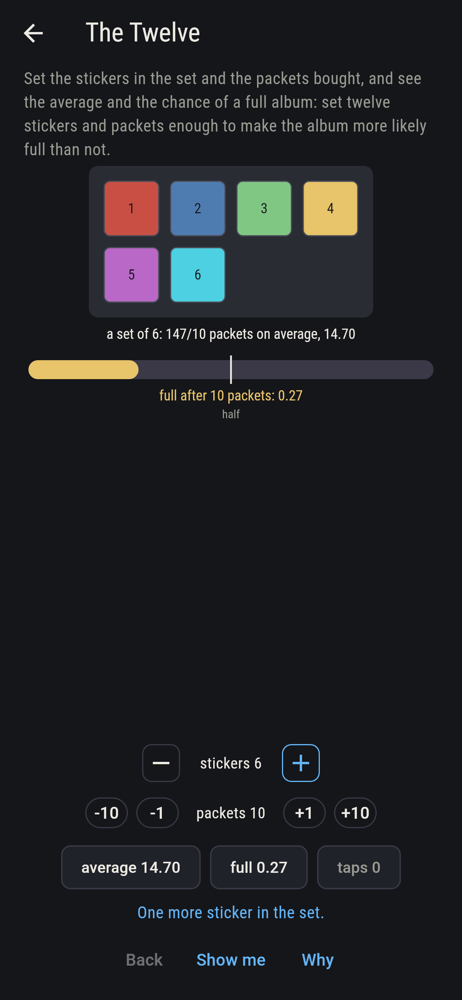
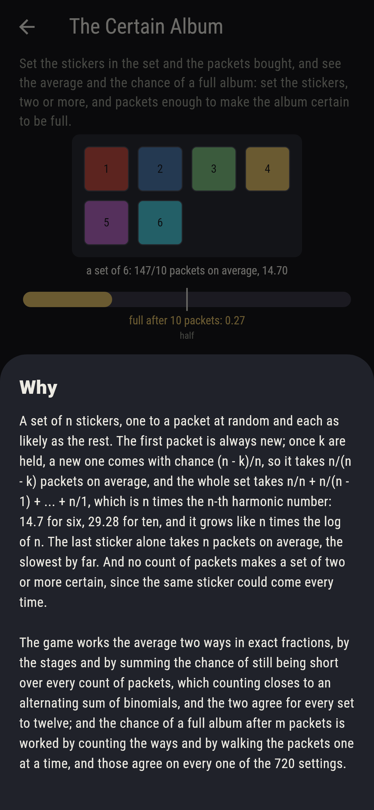

# Stickerwick


Stickers for an album, one to a packet at random and each as likely
as the rest. The first packet is always new; once k are held, a new
one comes with chance (n - k)/n, so it takes n/(n - k) packets on
average, and the whole set takes n/n + n/(n - 1) + ... + n/1, which
is n times the n-th harmonic number: 14.7 for six, 29.28 for ten, and
it grows like n times the log of n. The last sticker alone takes n
packets on average, the slowest by far. And no count of packets makes
a set of two or more certain, since the same sticker could come every
time. Set the stickers in the set and the packets bought and see the
average and the chance of a full album; the game works the average
two ways in exact fractions and the chance two ways, and the voices
agree on every one of the 720 settings.

## The asks

1. **The Half Dozen** - set six stickers and the fewest packets that make the album more likely full than not
2. **The Twelve** - set twelve stickers and packets enough to make the album more likely full than not
3. **The Whole Average** - set the stickers so the average packets to fill the album is a whole number
4. **The Last Sticker** - set the stickers so the last sticker alone takes longer, on average, than all the rest together
5. **The Certain Album** - set the stickers, two or more, and packets enough to make the album certain to be full

A set of six takes 147/10 packets on average but is more likely full
than not from the thirteenth packet, 0.51 to 0.43 after twelve; a
set of twelve takes 86,021/2,310 and turns more likely full than not
at thirty-five, so packets 35 to 60 land it, 26 settings; only sets
of one and two average a whole number of packets, 1 and 3; and the
last sticker outweighs the rest for sets of one to three, 3 to 5/2
for three, and not from four, 4 to 13/3. The Certain Album is labeled
hopeless on its tile: a set of six after sixty packets is short one
time in ten thousand, and never never; the sham admits it the moment
sixty packets are set.

## Two voices

The game never asserts what it has not computed, and it computes
everything at least twice:

* **The stages and the counting** give the average as the sum of
  n/(n - k) over the stickers held, and the chance of a full album
  after m packets by counting the ways with the signs turning, sum
  over j of (-1)^j C(n, j) ((n - j)/n)^m, both in exact fractions;
  every count on the sham is that sweep's, medians and all.
* **The tail and the walk** are the second voices: the average as the
  chance of still being short summed over every count of packets,
  which closes to n/j times C(n, j) with the signs turning, agreeing
  with the stages for every set to twelve; and the chance of a full
  album by walking the packets one at a time through the count held,
  agreeing with the counting on all 720 settings, never falling as the
  packets grow, certain for one sticker and never for two or more.

`tool/check_albums.dart` runs the lot and refuses the bake on any
disagreement.

## The checker's ledger

What `dart run tool/check_albums.dart` printed for the build this
README shipped with, word for word:

```
every set of one to twelve stickers worked in exact fractions, its average packets by the stages and by the tail summed, and the two agree on all twelve: 1, 3, 11/2, 25/3, 137/12, 147/10, 363/20, 761/35, 7,129/280, 7,381/252, 83,711/2,520 and 86,021/2,310, whole for one and two alone; the chance of a full album after every count of packets to sixty worked by counting the ways and by walking the packets, agreeing on all 720 settings, never falling as the packets grow, certain for one sticker and never for two or more, a set of six short after sixty packets one time in ten thousand; the album turns more likely full than not at 1, 2, 5, 7, 10, 13, 17, 20, 23, 27, 31 and 35 packets for sets of one to twelve, six being 0.51 at thirteen and 0.43 at twelve; and the last sticker outweighs the rest for sets of one to three, 3 to 5/2 for three, and not from four, 4 to 13/3

 1 The Half Dozen     set six stickers and the fewest packets that make the album more likely full than not: 1 of the 720 settings lands it
 2 The Twelve         set twelve stickers and packets enough to make the album more likely full than not: 26 of the 720 settings land it
 3 The Whole Average  set the stickers so the average packets to fill the album is a whole number: 120 of the 720 settings land it
 4 The Last Sticker   set the stickers so the last sticker alone takes longer, on average, than all the rest together: 180 of the 720 settings land it
 5 The Certain Album  set the stickers, two or more, and packets enough to make the album certain to be full: none of the 720, and the same sticker again said so first
```

## Screenshots

| The sham | The twelve | The certain album admitted |
| --- | --- | --- |
|  |  |  |

| The half dozen | The whole average | The last sticker | Midway, on the small phone | Show me | The why |
| --- | --- | --- | --- | --- | --- |
|  |  |  |  |  |  |

Screenshots are drawn by `test/showcase_test.dart` at real phone
sizes with the app's own painter, then copied into `docs/` as they
came out; every dial in them was set by taps, so nothing pictured is
a setting the game could not reach. The logo and every launcher icon
come out of `test/mark_test.dart` the same way: the mark is the album
page of six stickers.

## Building

```
flutter test          # 43 tests, the sweep among them
dart run tool/check_albums.dart
flutter build apk     # or: flutter build ios
```
