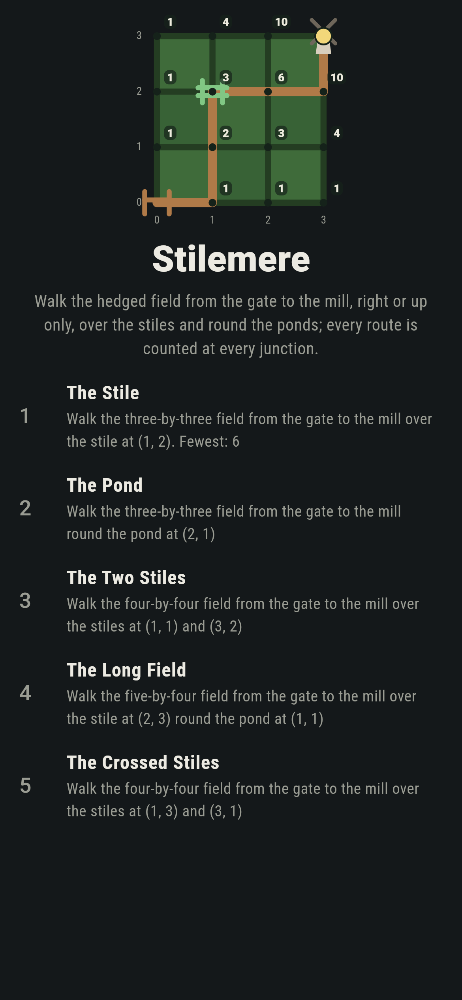
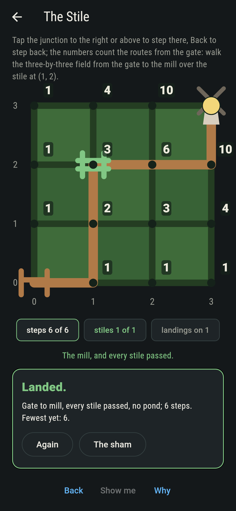
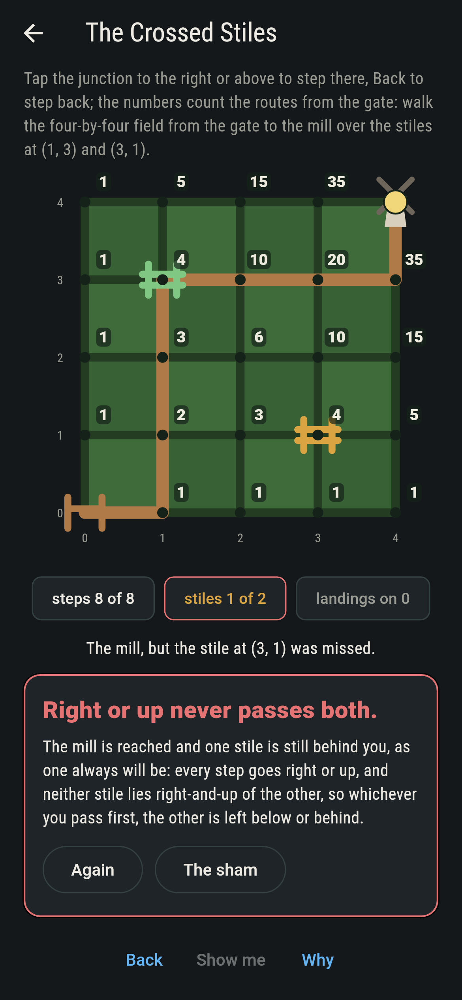
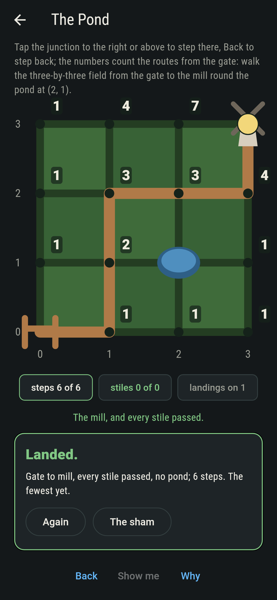
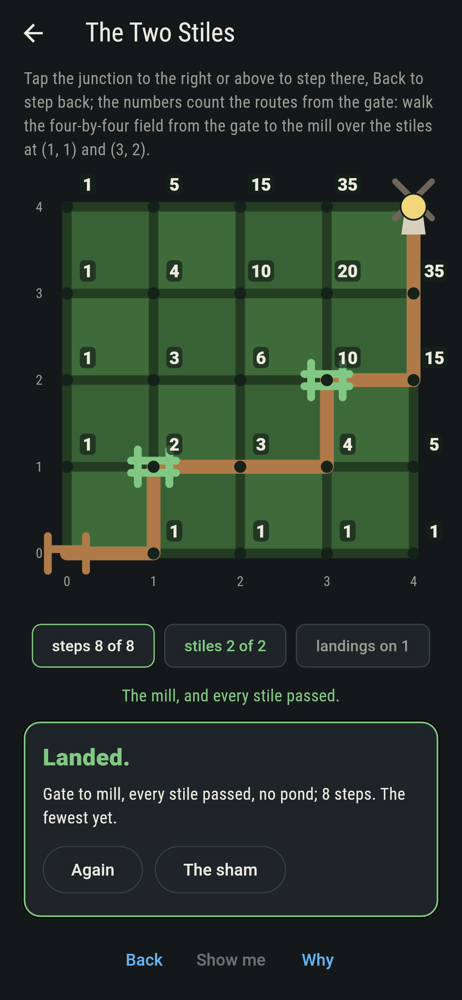
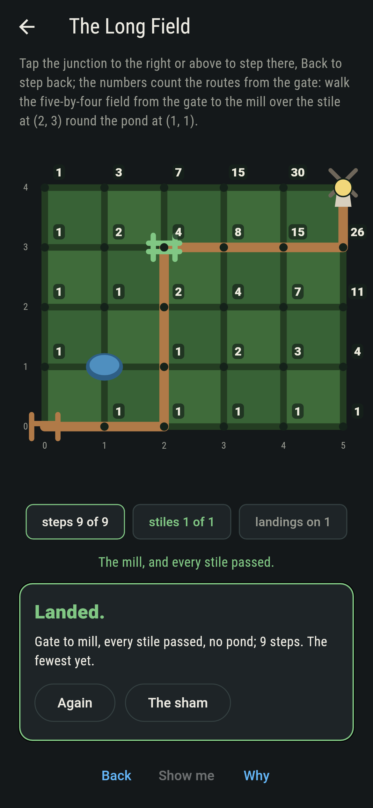
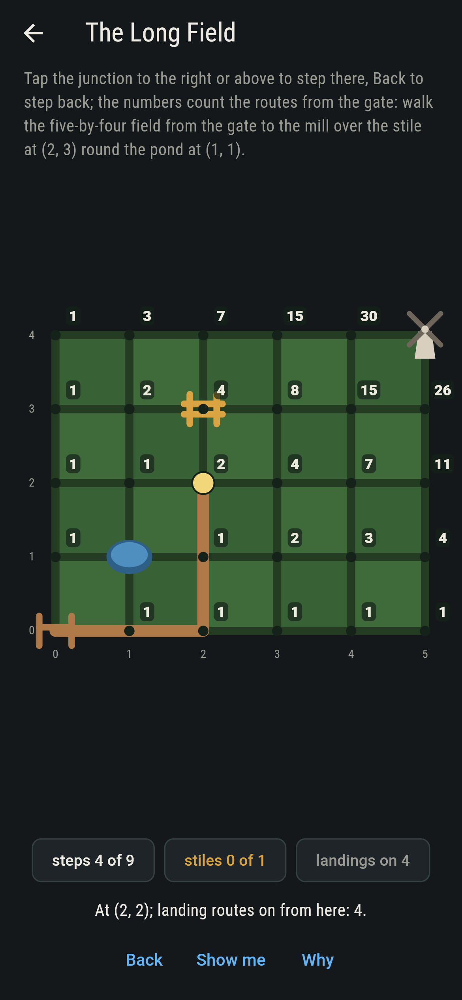
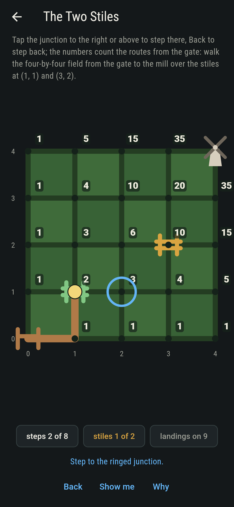
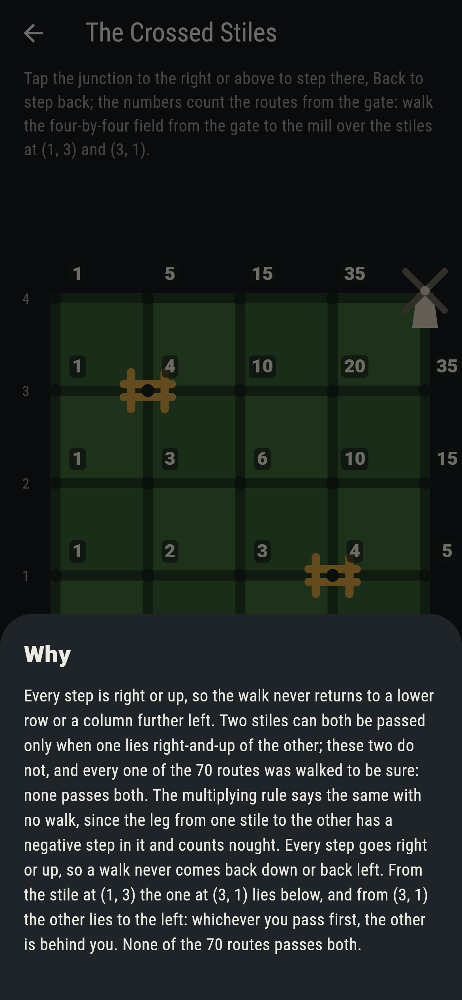

# Stilemere


A hedged field, the gate at the bottom left corner and the mill at
the top right, and every step along the hedges goes right or up.
The routes from gate to mill are the ways of choosing which steps
go right, so many steps choose so many, and Pascal's rule counts
them junction by junction: the routes to a junction are the routes
to the one left of it plus the routes to the one below. The
numbers on the field are that count, live, with the ponds struck
out. A stile the walk must pass multiplies the two legs; two
stiles neither of which lies right-and-up of the other can never
both be passed, and the why says why in one line.

## The fields

1. **The Stile** - walk the three-by-three field from the gate to the mill over the stile at (1, 2)
2. **The Pond** - walk the three-by-three field from the gate to the mill round the pond at (2, 1)
3. **The Two Stiles** - walk the four-by-four field from the gate to the mill over the stiles at (1, 1) and (3, 2)
4. **The Long Field** - walk the five-by-four field from the gate to the mill over the stile at (2, 3) round the pond at (1, 1)
5. **The Crossed Stiles** - walk the four-by-four field from the gate to the mill over the stiles at (1, 3) and (3, 1)

Twenty routes cross the three-by-three, 9 of them over the stile
at (1, 2), 3 ways there and 3 on, and 11 round the pond at (2, 1);
70 cross the four-by-four, 18 over both stiles, 2 times 3 times 3;
126 cross the five-by-four, and 16 pass the stile at (2, 3) dry,
4 ways to it round the pond and 4 on. The Crossed Stiles is
labeled hopeless on its tile: from either stile the other lies
below or to the left, and the walk never goes back.

## Two voices

The game never asserts what it has not computed, and it computes
everything at least twice:

* **The walk** takes every route of every field, gate to mill,
  and checks it against the stiles and the ponds; every count on
  the sham is that walk's.
* **Pascal's rule and the binomial** count with no walk: the rule
  adds, at every junction, the routes to the junction on its left
  and the one below, ponds struck out, and it is run forwards from
  the gate and backwards from the mill; the binomial counts a leg
  with no ponds as so many steps, choose which go right, and the
  legs over a stile multiply. On every open field to eight by
  eight the three agree at every junction, and on every level the
  walk agrees with whichever of them applies.

`tool/check_walks.dart` runs the lot and refuses the bake on any
disagreement.

## The checker's ledger

What `dart run tool/check_walks.dart` printed for the build this
README shipped with, word for word:

```
every route of every field walked, and the count read three ways that agree, by the walk, by Pascal's rule at every junction and by the binomial, on every open field to eight by eight, 64 fields, with the routes over a stile the product of the two legs at every one of 1,936 stiles, the routes round a pond Pascal's rule with the pond struck out, and two stiles neither right-and-up of the other never both passed, 100 such pairs walked on the four-by-four

 1 The Stile          walk the three-by-three field from the gate to the mill over the stile at (1, 2): 9 of the 20 routes land it
 2 The Pond           walk the three-by-three field from the gate to the mill round the pond at (2, 1): 11 of the 20 routes land it
 3 The Two Stiles     walk the four-by-four field from the gate to the mill over the stiles at (1, 1) and (3, 2): 18 of the 70 routes land it
 4 The Long Field     walk the five-by-four field from the gate to the mill over the stile at (2, 3) round the pond at (1, 1): 16 of the 126 routes land it
 5 The Crossed Stiles walk the four-by-four field from the gate to the mill over the stiles at (1, 3) and (3, 1): none of the 70, and right-or-up said so first
```

## Screenshots

| The sham | The stile passed | The crossed stiles admitted |
| --- | --- | --- |
|  |  |  |

| The pond | The two stiles | The long field | Mid-walk | Show me | The why |
| --- | --- | --- | --- | --- | --- |
|  |  |  |  |  |  |

Screenshots are drawn by `test/showcase_test.dart` at real phone
sizes with the app's own painter, then copied into `docs/` as they
came out; every step in them was taken by a tap, so nothing
pictured is a walk the game could not reach. The logo and every
launcher icon come out of `test/mark_test.dart` the same way: the
mark is the three-by-three field walked over its stile, the
counts on every junction.

## Building

```
flutter test          # 46 tests, the walk among them
dart run tool/check_walks.dart
flutter build apk     # or: flutter build ios
```
