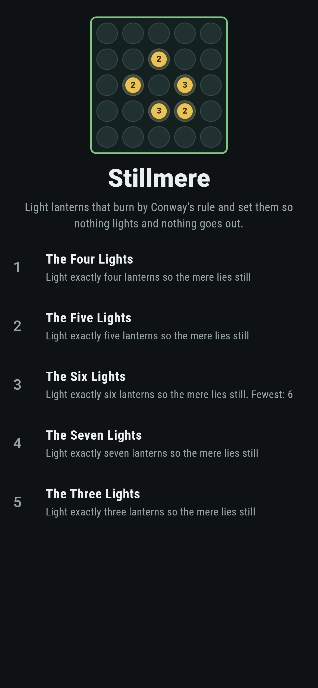
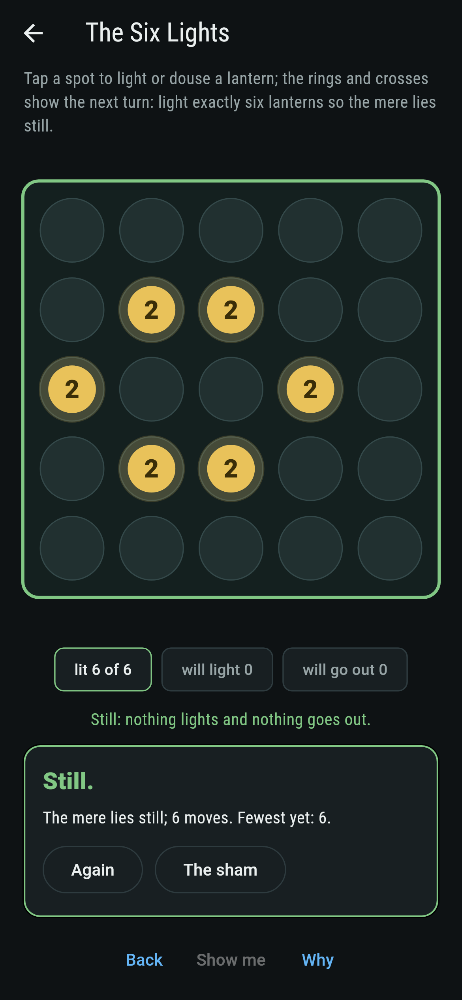
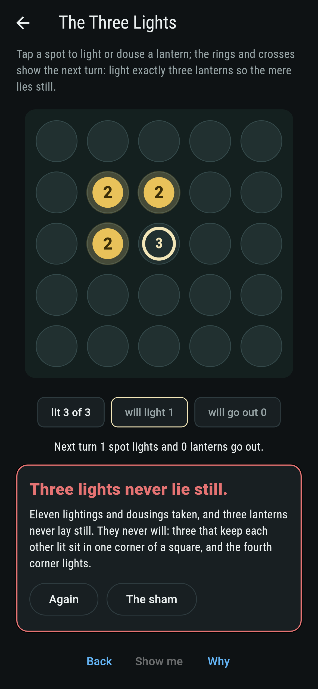
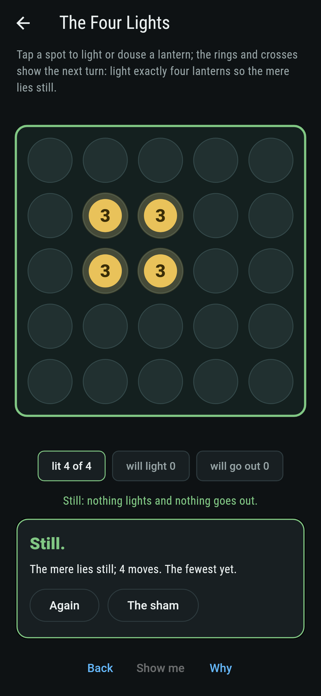
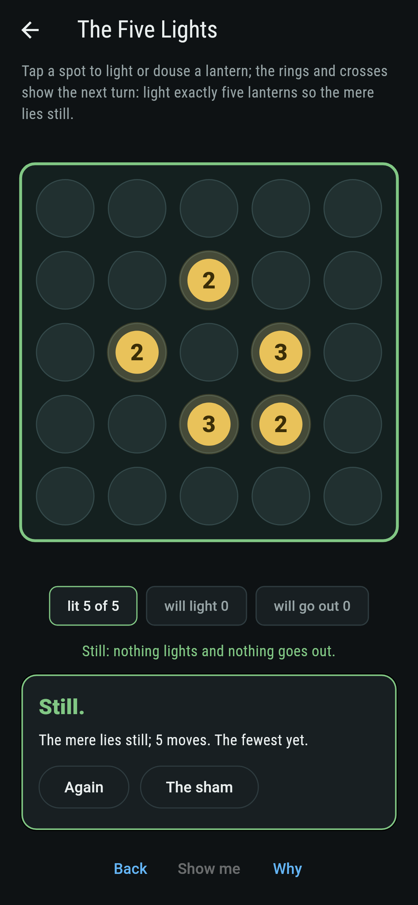
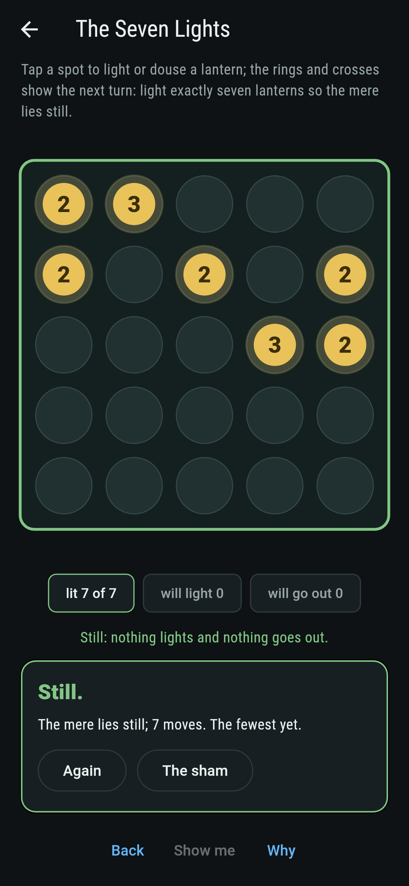
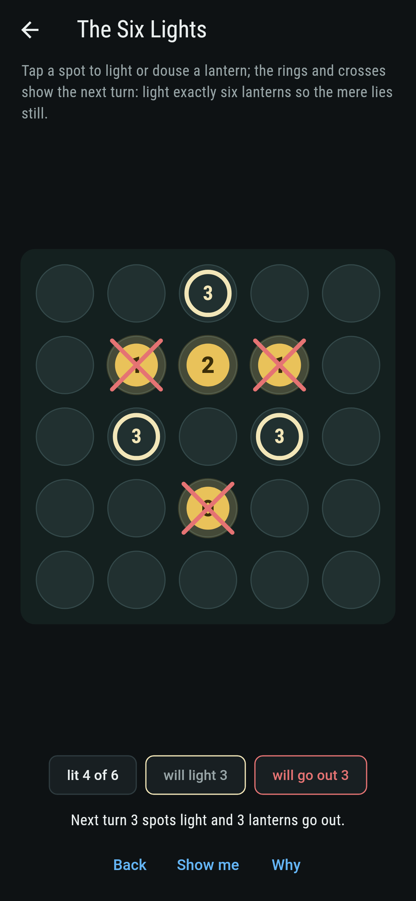
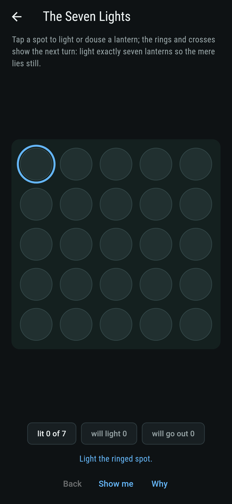
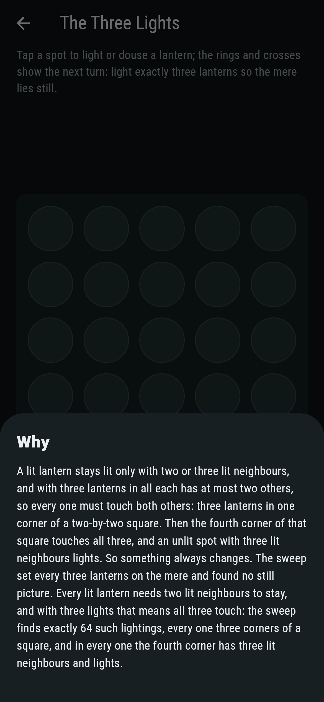

# Stillmere


Lanterns on the mere burn by Conway's rule of 1970: a lit lantern
stays lit when two or three of its eight neighbours are lit, and
goes out otherwise; an unlit spot lights when exactly three of its
neighbours are lit. The picture lies still when nothing changes.
Four lights lie still two ways, the block and the tub; five one
way, the boat; and three lights never lie still, because each
needs two lit neighbours, so the three sit in one corner of a
square, and the fourth corner has three lit neighbours and lights.

## The lightings

1. **The Four Lights** - light exactly four lanterns so the mere lies still
2. **The Five Lights** - light exactly five lanterns so the mere lies still
3. **The Six Lights** - light exactly six lanterns so the mere lies still
4. **The Seven Lights** - light exactly seven lanterns so the mere lies still
5. **The Three Lights** - light exactly three lanterns so the mere lies still

Four lie still 25 ways on the mere, sixteen blocks and nine tubs;
five 36 ways, the boat in its four turnings; six 94 ways in
fourteen shapes, the beehive, the ship, the snake, the barge and
the carrier among them; seven 76 ways in twenty shapes. The Three
Lights is labeled hopeless on its tile, and the fourth corner is
ringed on the mere the moment the three touch.

## Two voices

The game never asserts what it has not computed, and it computes
everything at least twice:

* **The sweep** lights every set of that many lanterns on the mere
  and runs the rule on the whole plane, so a light at the edge can
  wake a spot beyond it, and counts the pictures that lie still.
* **The shapes** slide each still lighting to the corner and count
  it once, so the block and the tub are seen to be the only fours
  and the boat the only five; and for three lights the argument is
  run as arithmetic, every lighting where each light has two lit
  neighbours found to be three corners of a square, 64 of them, and
  every one found to light the fourth.

`tool/check_lights.dart` runs the lot and refuses the bake on any
disagreement.

## The checker's ledger

What `dart run tool/check_lights.dart` printed for the build this
README shipped with, word for word:

```
every lighting of the mere swept for four, five, six and seven lanterns and the rule run on the whole plane: four lie still 25 ways in two shapes, sixteen blocks and nine tubs, five 36 ways in the boat's four turnings, six 94 ways in fourteen shapes and seven 76 ways in twenty; three lanterns never lie still, since the lightings where every light has two lit neighbours, 64 of them, are all three corners of a square and every one lights the fourth

 1 The Four Lights   light exactly four lanterns so the mere lies still: 25 lightings of the sweep lie still, 2 shapes
 2 The Five Lights   light exactly five lanterns so the mere lies still: 36 lightings of the sweep lie still, 4 shapes
 3 The Six Lights    light exactly six lanterns so the mere lies still: 94 lightings of the sweep lie still, 14 shapes
 4 The Seven Lights  light exactly seven lanterns so the mere lies still: 76 lightings of the sweep lie still, 20 shapes
 5 The Three Lights  light exactly three lanterns so the mere lies still: none, and the fourth corner said so first
```

## Screenshots

| The sham | The six lights still | The three lights admitted |
| --- | --- | --- |
|  |  |  |

| The four lights | The five lights | The seven lights | Mid-lighting | Show me | The why |
| --- | --- | --- | --- | --- | --- |
|  |  |  |  |  |  |

Screenshots are drawn by `test/showcase_test.dart` at real phone
sizes with the app's own painter, then copied into `docs/` as they
came out; every lantern in them was tapped, so nothing pictured is
a mere the game could not reach. The logo and every launcher icon
come out of `test/mark_test.dart` the same way: the mark is the
boat, five lanterns lying still.

## Building

```
flutter test          # 45 tests, the sweep among them
dart run tool/check_lights.dart
flutter build apk     # or: flutter build ios
```
