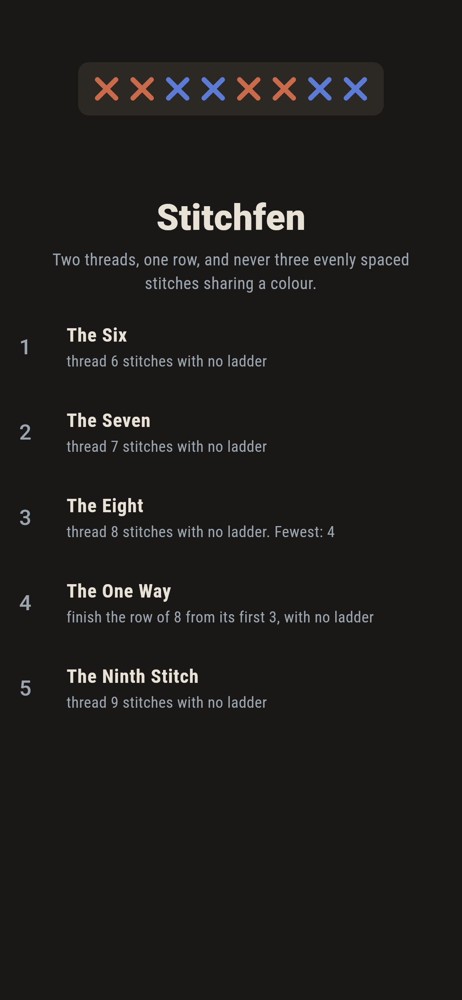
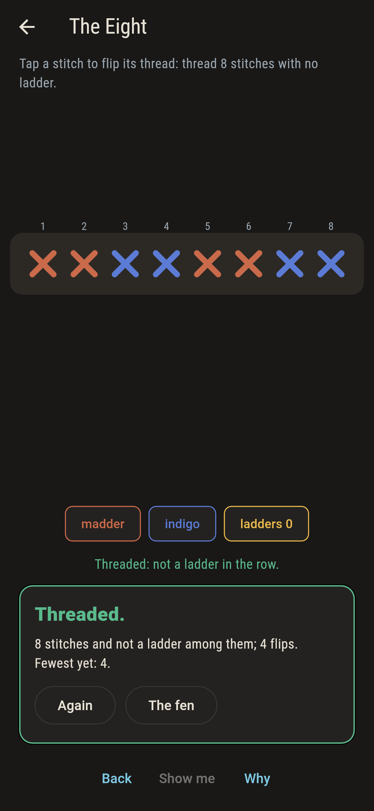
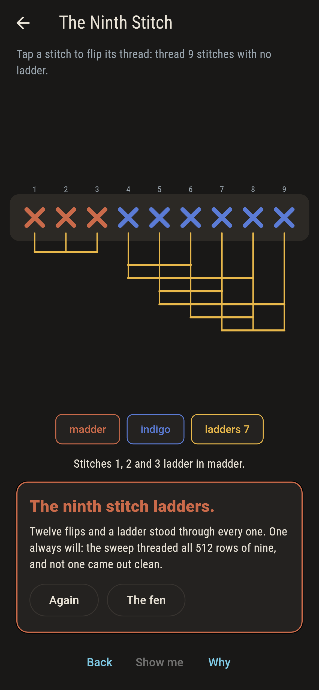
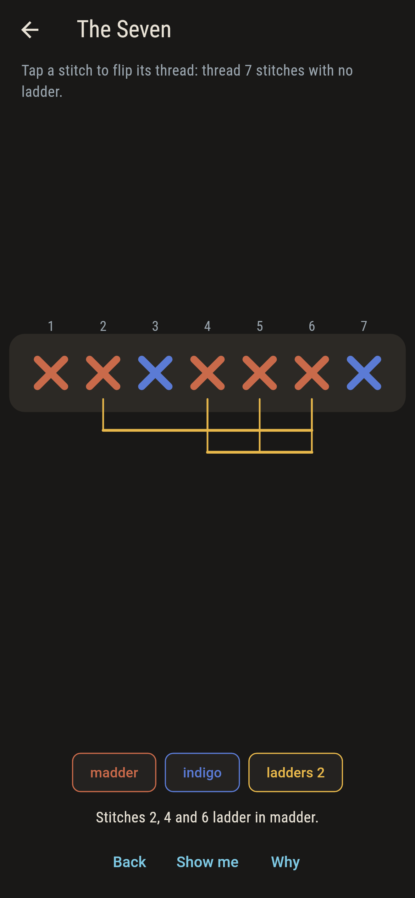
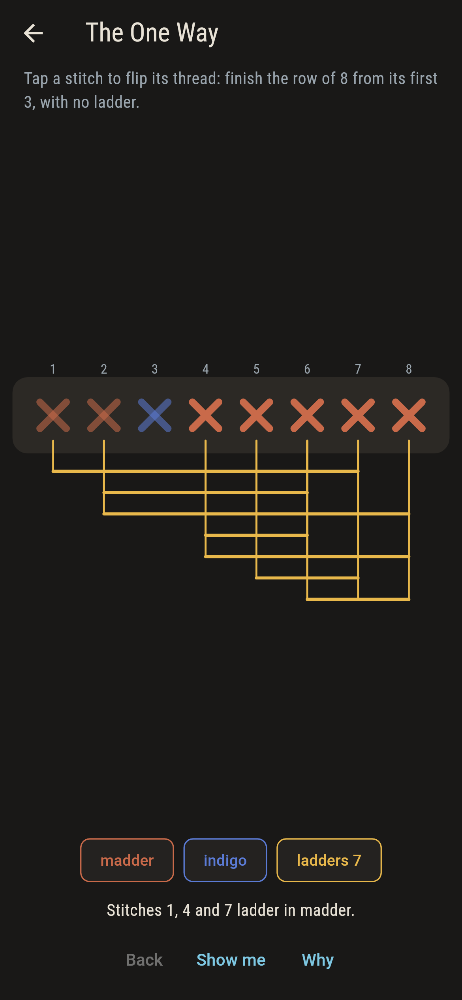
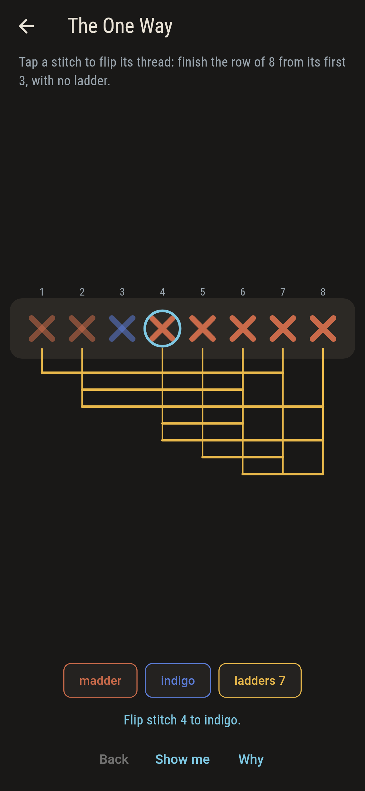
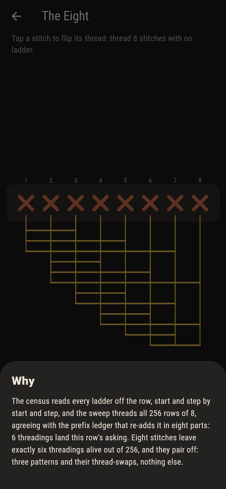

# Stitchfen


A sampler row in two threads, madder and indigo, and one rule:
never three evenly spaced stitches sharing a thread. Such a
triple is a ladder, and the game brackets every one under the row
as you stitch. Eight stitches leave exactly six threadings alive.
The ninth kills them all, which is where van der Waerden's
theorem begins.

## The rows

1. **The Six** - thread 6 stitches with no ladder
2. **The Seven** - thread 7 stitches with no ladder
3. **The Eight** - thread 8 stitches with no ladder
4. **The One Way** - finish the row of 8 from its first 3, with no ladder
5. **The Ninth Stitch** - thread 9 stitches with no ladder

The field thins fast: 20 threadings of six, 16 of seven, 6 of
eight, none at all of nine. The six eights pair off, three
patterns and their thread-swaps, and at eight stitches every
three-stitch beginning finishes at most one way: The One Way
fixes three and the other five are forced to the last stitch.

## Two voices and a ledger

The game never asserts what it has not computed, and it computes
everything at least twice:

* **The census** reads every ladder off the row, start and step
  by start and step, and brackets each one on the cloth.
* **The sweep** threads every row there is, 64 to 512 by size,
  and counts the survivors.
* **The prefix ledger** re-adds the sweep in eight parts, by
  first three stitches, and the parts must sum to the whole.

`tool/check_samplers.dart` runs the lot, including the
thread-swap pairing and the forced completions, and refuses the
bake on any disagreement.

## The checker's ledger

What `dart run tool/check_samplers.dart` printed for the build
this README shipped with, word for word:

```
every threading of every row swept, 64 to 512 by size, the census agreeing with the prefix ledger on each: six, seven and eight stitches leave 20, 16 and 6 rows alive, the six eights pair off under a thread-swap, every three-stitch beginning finishes at most one way, and nine stitches leave nothing

 1 The Six            thread 6 stitches with no ladder: 20 threadings of the sweep land it
 2 The Seven          thread 7 stitches with no ladder: 16 threadings of the sweep land it
 3 The Eight          thread 8 stitches with no ladder: 6 threadings of the sweep land it
 4 The One Way        finish the row of 8 from its first 3, with no ladder: 1 threading of the sweep lands it
 5 The Ninth Stitch   thread 9 stitches with no ladder: none of the 512, and no cleverness was ever going to help
```

## Screenshots

| The fen | The eight threaded | The ninth stitch admitted |
| --- | --- | --- |
|  |  |  |

| Ladders bracketed | The one way | Show me | The why |
| --- | --- | --- | --- |
|  |  |  |  |

Screenshots are drawn by `test/showcase_test.dart` at real phone
sizes with the app's own painter, then copied into `docs/` as
they came out; every stitch in them was flipped by taps, so
nothing pictured is a row the game could not reach. The logo and
every launcher icon come out of `test/mark_test.dart` the same
way: the mark is one of the six eights.

## Building

```
flutter test          # 45 tests, the sweep among them
dart run tool/check_samplers.dart
flutter build apk     # or: flutter build ios
```
