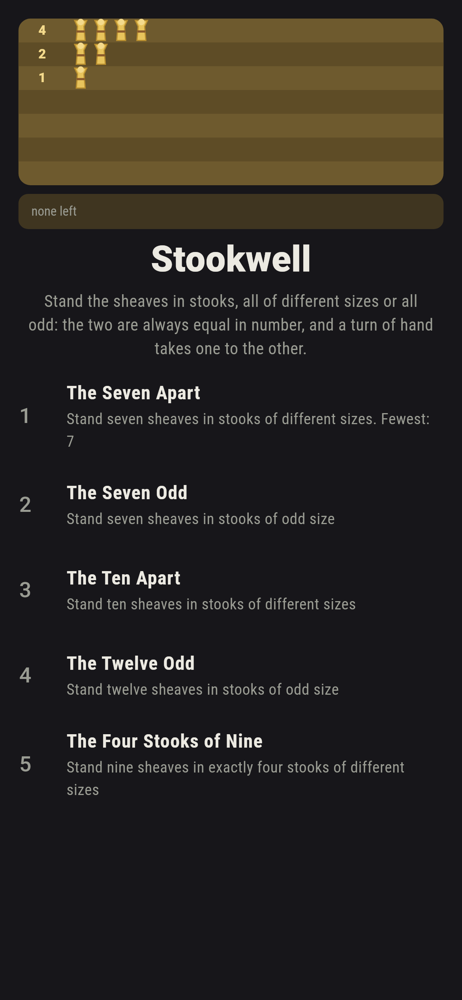
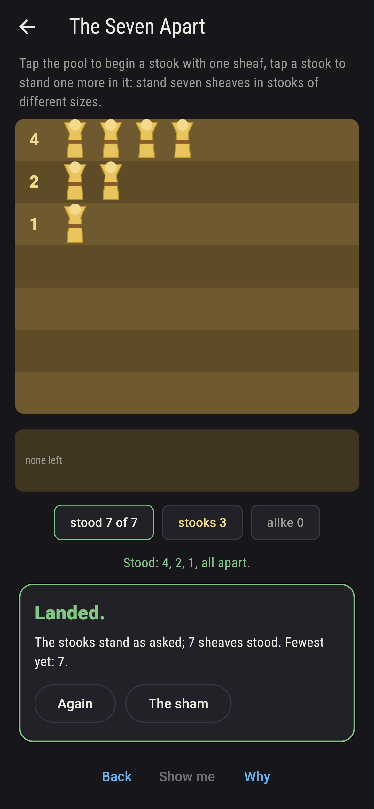
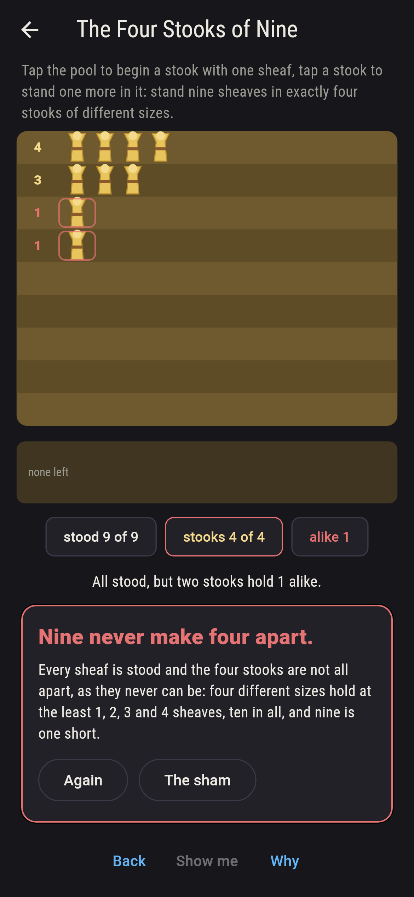
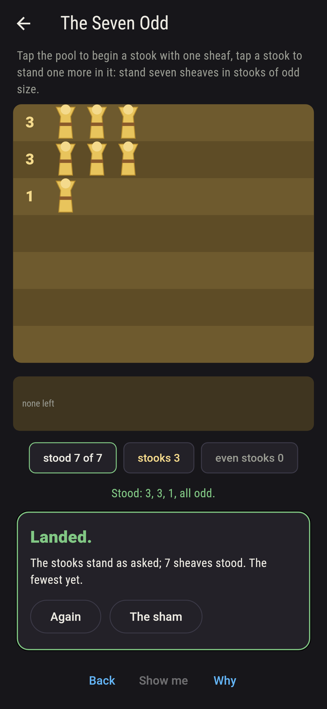
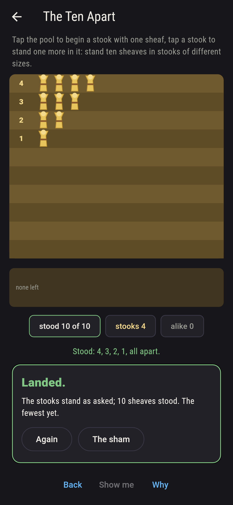
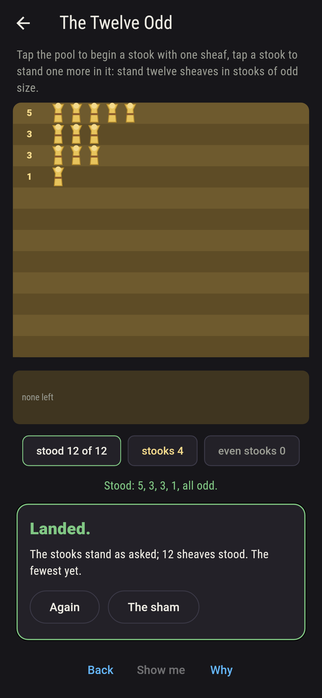
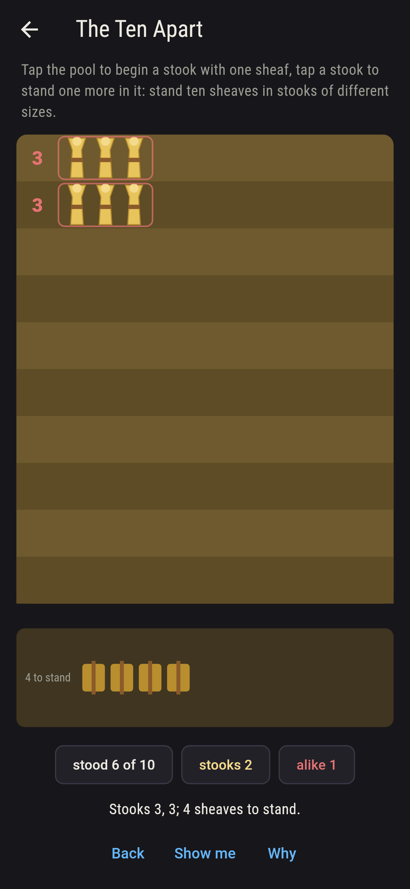
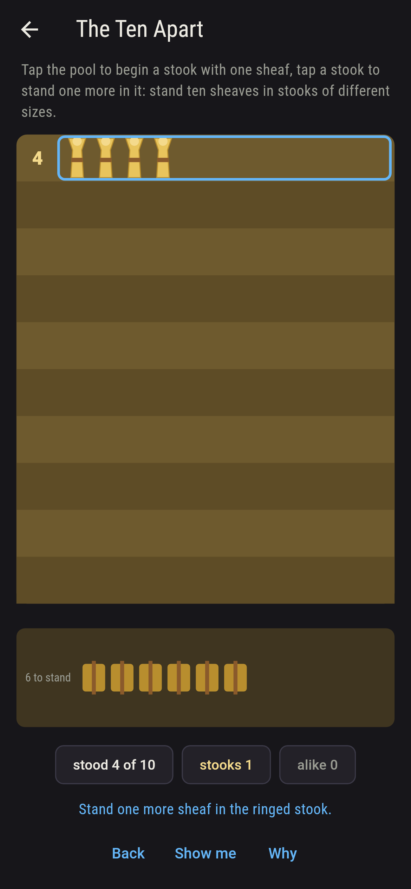
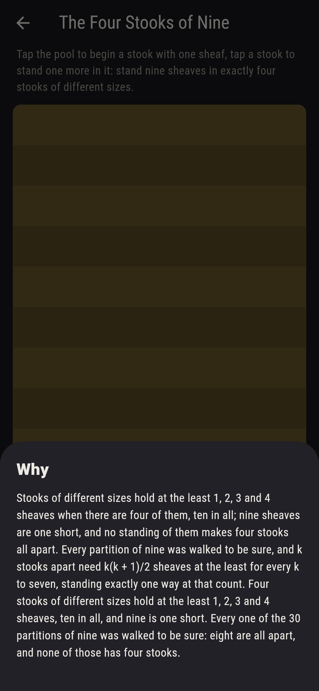

# Stookwell


Sheaves at harvest, to be stood in stooks: tap the pool to begin
a stook with one sheaf, tap a stook to stand another in it, until
every sheaf is up. A standing is a partition of the harvest, and
two kinds are asked for here: stooks all of different sizes, and
stooks all of odd size. Euler found in 1748 that for any harvest
there are exactly as many of the one as of the other, and
Glaisher later showed why with a turn of the hand: pair off equal
stooks into double ones until none match, and a standing all odd
becomes one all apart, and back again. Every partition of every
harvest to thirty is walked, and the two products that Euler
wrote down agree to sixty.

## The harvests

1. **The Seven Apart** - stand seven sheaves in stooks of different sizes
2. **The Seven Odd** - stand seven sheaves in stooks of odd size
3. **The Ten Apart** - stand ten sheaves in stooks of different sizes
4. **The Twelve Odd** - stand twelve sheaves in stooks of odd size
5. **The Four Stooks of Nine** - stand nine sheaves in exactly four stooks of different sizes

Seven sheaves stand fifteen ways, five of them all apart and five
all odd; ten stand 42 ways, ten and ten; twelve stand 77 ways,
fifteen and fifteen. The Four Stooks of Nine is labeled hopeless
on its tile: four stooks of different sizes hold 1, 2, 3 and 4 at
the least, ten sheaves, and nine is one short.

## Two voices

The game never asserts what it has not computed, and it computes
everything at least twice:

* **The walk** takes every partition of the harvest and counts
  those that meet the ask, and it takes every partition of every
  harvest to thirty and finds the stooks all apart level with the
  stooks all odd at every one.
* **Euler's products** count with no walk: (1 + x)(1 + x squared)
  (1 + x cubed)... multiplied out counts the standings all apart,
  and 1 over (1 - x)(1 - x cubed)(1 - x to the fifth)... counts
  the standings all odd, and the two series agree with the walk
  and with each other to sixty sheaves. **Glaisher's turn** is
  taken both ways on every partition to twenty-five, odd to apart
  and apart to odd, and always comes back to where it started.

`tool/check_stooks.dart` runs the lot and refuses the bake on any
disagreement.

## The checker's ledger

What `dart run tool/check_stooks.dart` printed for the build this
README shipped with, word for word:

```
every partition of every harvest to thirty sheaves walked, 28,628 of them, and the stooks all apart counted level with the stooks all odd at every harvest, as Euler says, the two products (1 + x^k) over every k and 1/(1 - x^k) over odd k agreeing with the walk and with each other to sixty sheaves, 10,880 ways each at sixty; Glaisher's turn taken both ways on every one of 1,806 partitions to twenty-five and always coming back to itself; and k stooks apart never standing in fewer than k(k + 1)/2 sheaves, one way at exactly that, for k to seven

 1 The Seven Apart        stand seven sheaves in stooks of different sizes: 5 of the 15 partitions land it
 2 The Seven Odd          stand seven sheaves in stooks of odd size: 5 of the 15 partitions land it
 3 The Ten Apart          stand ten sheaves in stooks of different sizes: 10 of the 42 partitions land it
 4 The Twelve Odd         stand twelve sheaves in stooks of odd size: 15 of the 77 partitions land it
 5 The Four Stooks of Nine stand nine sheaves in exactly four stooks of different sizes: none of the 30, and 1 + 2 + 3 + 4 said so first
```

## Screenshots

| The sham | The seven apart | The four stooks of nine admitted |
| --- | --- | --- |
|  |  |  |

| The seven odd | The ten apart | The twelve odd | Mid-stooking | Show me | The why |
| --- | --- | --- | --- | --- | --- |
|  |  |  |  |  |  |

Screenshots are drawn by `test/showcase_test.dart` at real phone
sizes with the app's own painter, then copied into `docs/` as they
came out; every sheaf in them was stood by a tap, so nothing
pictured is a standing the game could not reach. The logo and
every launcher icon come out of `test/mark_test.dart` the same
way: the mark is seven sheaves in stooks of 4, 2 and 1, all apart,
which is where Glaisher's turn sends seven ones.

## Building

```
flutter test          # 44 tests, the walk among them
dart run tool/check_stooks.dart
flutter build apk     # or: flutter build ios
```
