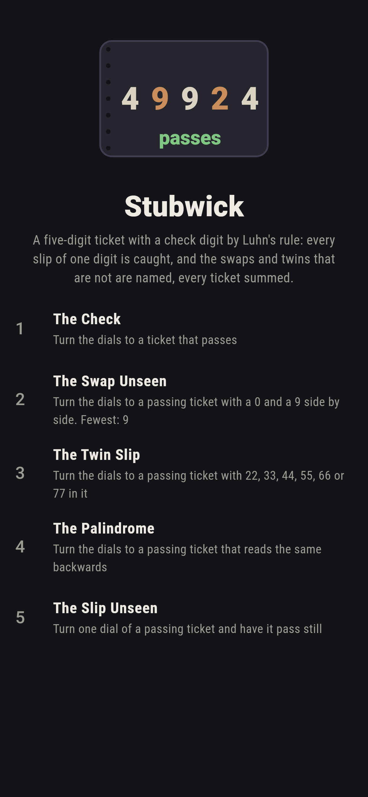
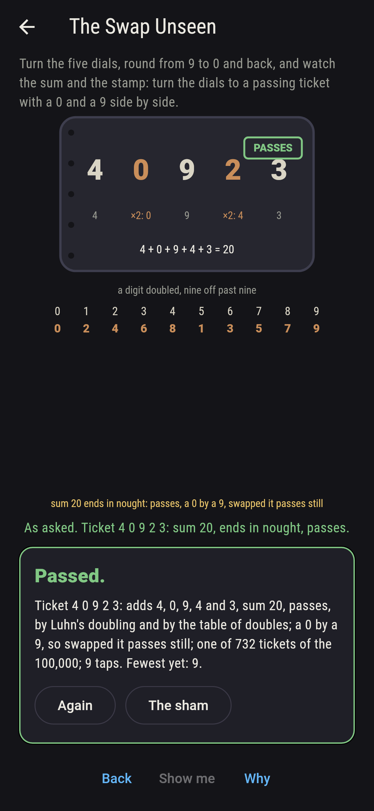
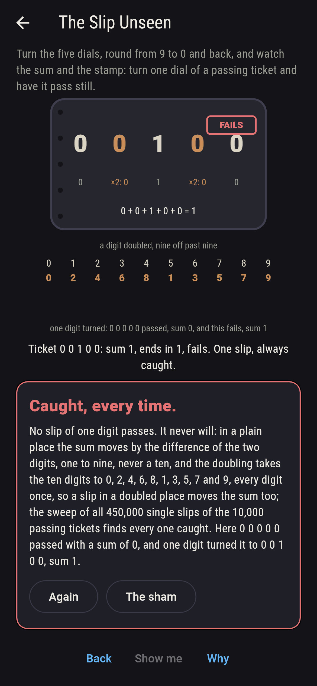
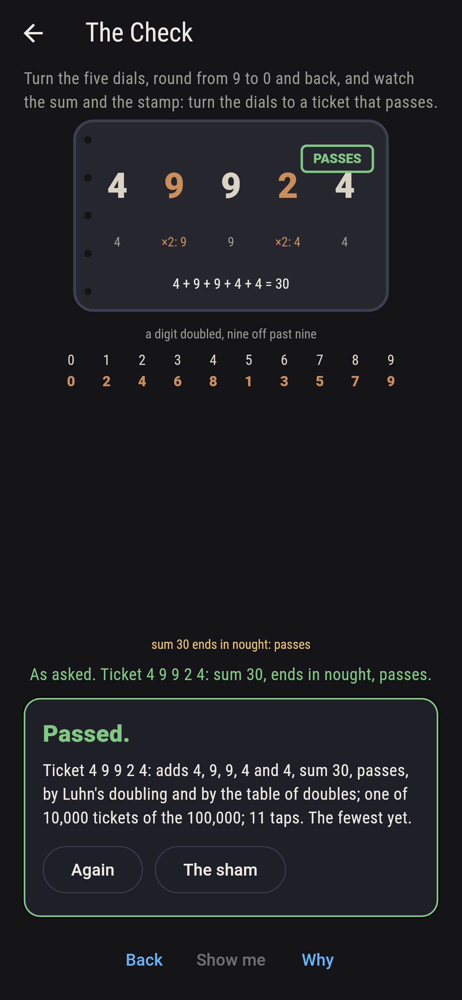
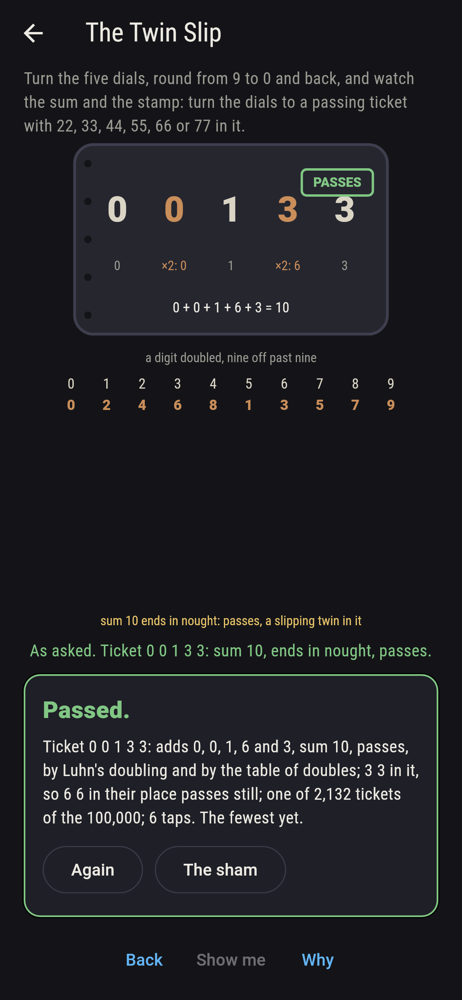
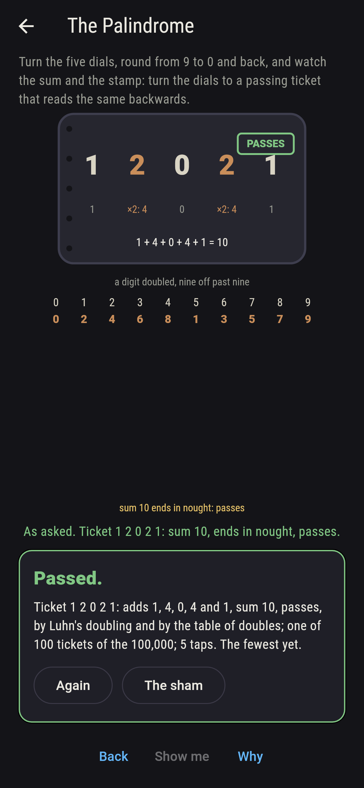
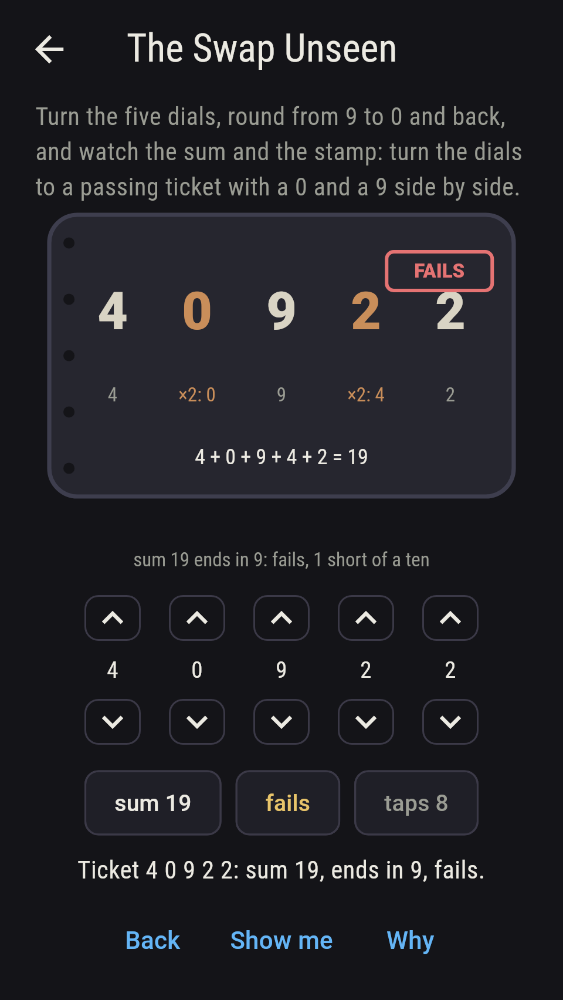
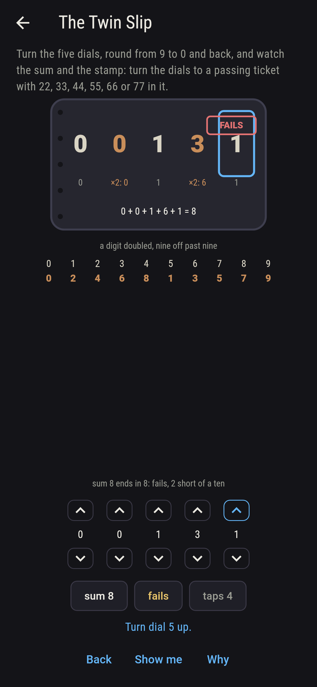
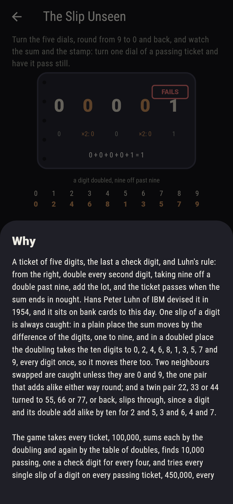

# Stubwick


A ticket of five digits, the last a check digit, and Luhn's rule:
from the right, double every second digit, taking nine off a double
past nine, add the lot, and the ticket passes when the sum ends in
nought. Hans Peter Luhn of IBM devised it in 1954, and it sits on
bank cards to this day. One slip of a digit is always caught: in a
plain place the sum moves by the difference of the digits, one to
nine, and in a doubled place the doubling takes the ten digits to 0,
2, 4, 6, 8, 1, 3, 5, 7 and 9, every digit once, so it moves there
too. Two neighbours swapped are caught unless they are 0 and 9, the
one pair that adds alike either way round; and a twin pair 22, 33 or
44 turned to 55, 66 or 77, or back, slips through, since a digit and
its double add alike by ten for 2 and 5, 3 and 6, 4 and 7. Turn the
five dials and watch the sum and the stamp. The game takes every
ticket, 100,000, sums each by the doubling and again by the table of
doubles, finds 10,000 passing, one a check digit for every four, and
tries every single slip of a digit on every passing ticket, 450,000,
every swap of unlike neighbours, 36,000, and every turn of a twin
pair, 36,000: no slip passes, 800 swaps do, all of a 0 and a 9, and
2,400 twin turns do, all of the three kinds, and the table says why.

## The asks

1. **The Check** - turn the dials to a ticket that passes
2. **The Swap Unseen** - turn the dials to a passing ticket with a 0 and a 9 side by side
3. **The Twin Slip** - turn the dials to a passing ticket with 22, 33, 44, 55, 66 or 77 in it
4. **The Palindrome** - turn the dials to a passing ticket that reads the same backwards
5. **The Slip Unseen** - turn one dial of a passing ticket and have it pass still

Of the 100,000 tickets, 10,000 pass, one for every run of the first
four digits, since the check digit that brings the sum to a ten is
one and only one; 4 9 9 2 4 adds 4, 9, 9, 4 and 4, thirty, and
passes. Swap two neighbouring digits of a passing ticket and it
fails unless they are 0 and 9: of the 36,000 swaps of unlike
neighbours in passing tickets, 800 pass, every one a 0 and a 9, and
732 passing tickets hold such a pair. A digit and its double add 0,
3, 6, 9, 2, 6, 9, 2, 5 and 8 by ten for 0 to 9, so 2 and 5 add
alike, 3 and 6, and 4 and 7: of the 36,000 turns of twin pairs in
passing tickets, 2,400 pass, 800 a kind, and 2,132 passing tickets
hold such a twin. A hundred passing tickets read the same backwards,
one for every a and b of the shape a b c b a, and 0 0 0 0 0 alone is
one digit throughout. The Slip Unseen is labeled hopeless on its
tile: the table of doubles said so first, and the sweep of all
450,000 single slips finds every one caught; the sham admits it
after three slips from passing tickets, or after twenty taps.

## Two voices

The game never asserts what it has not computed, and it computes
everything at least twice:

* **The doubling** sums every ticket as Luhn wrote it, twice each
  second digit from the right, nine off past nine, and stamps it;
  every stamp on the board is that sum's, and it tries every slip,
  swap and twin turn on every passing ticket and counts what passes.
* **The table** sums nothing by doubling: it takes the ten doubles
  0, 2, 4, 6, 8, 1, 3, 5, 7 and 9 as a list, agrees with the doubling
  on every ticket, and reads off the list what the sweep must find,
  every digit doubling to a different digit, so no slip passes, only
  0 and 9 adding alike either way round, so only that swap passes,
  and 2 with 5, 3 with 6 and 4 with 7 adding alike with their
  doubles, so only those twins slip.

`tool/check_tickets.dart` runs the lot and refuses the bake on any
disagreement.

## The checker's ledger

What `dart run tool/check_tickets.dart` printed for the build this
README shipped with, word for word:

```
every ticket of five digits taken, 100,000, and summed by Luhn's doubling from the right and again by the table of doubles, 0, 2, 4, 6, 8, 1, 3, 5, 7 and 9, the two agreeing on all: 10,000 pass, one check digit for every run of four; every single slip of a digit on every passing ticket tried, 450,000, and every one caught, as the table says it must be, no two digits doubling alike; every swap of two unlike neighbours tried, 36,000, and 800 pass, every one a 0 and a 9, the one pair the table lets through; every twin pair turned to another, 36,000, and 2,400 pass, 22 with 55, 33 with 66 and 44 with 77 either way, the three the table names, 800 a kind; 732 passing tickets hold a 0 by a 9, 2,132 a slipping twin, 100 read the same backwards and 0 0 0 0 0 alone is one digit throughout; 4 9 9 2 4 adds 4, 9, 9, 4 and 4, thirty, and passes

 1 The Check       turn the dials to a ticket that passes: 10,000 of the 100,000 tickets land it
 2 The Swap Unseen turn the dials to a passing ticket with a 0 and a 9 side by side: 732 of the 100,000 tickets land it
 3 The Twin Slip   turn the dials to a passing ticket with 22, 33, 44, 55, 66 or 77 in it: 2,132 of the 100,000 tickets land it
 4 The Palindrome  turn the dials to a passing ticket that reads the same backwards: 100 of the 100,000 tickets land it
 5 The Slip Unseen turn one dial of a passing ticket and have it pass still: none of the 100,000, and the table of doubles said so first
```

## Screenshots

| The sham | The swap unseen | The slip unseen admitted |
| --- | --- | --- |
|  |  |  |

| The check | The twin slip | The palindrome | Midway, on the small phone | Show me | The why |
| --- | --- | --- | --- | --- | --- |
|  |  |  |  |  |  |

Screenshots are drawn by `test/showcase_test.dart` at real phone
sizes with the app's own painter, then copied into `docs/` as they
came out; every ticket in them was reached by the dials, so nothing
pictured is a ticket the game could not reach. The logo and every
launcher icon come out of `test/mark_test.dart` the same way: the
mark is the ticket 4 9 9 2 4 on its stub, passing.

## Building

```
flutter test          # 44 tests, the sweep among them
dart run tool/check_tickets.dart
flutter build apk     # or: flutter build ios
```
