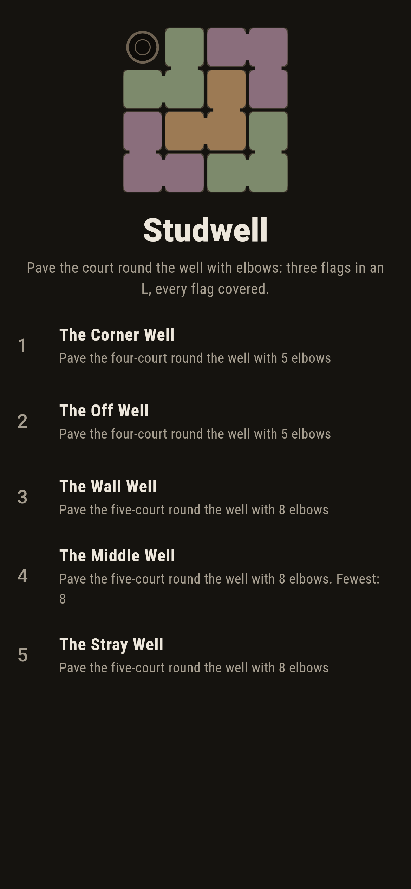
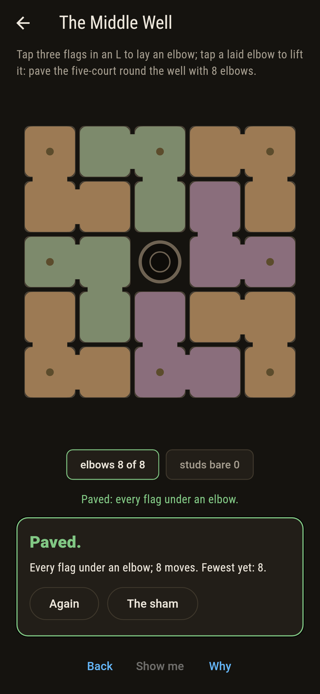
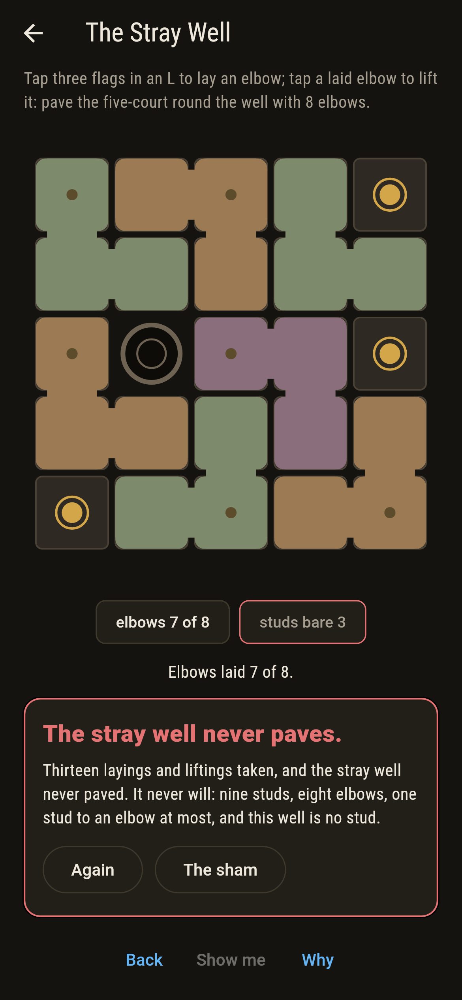
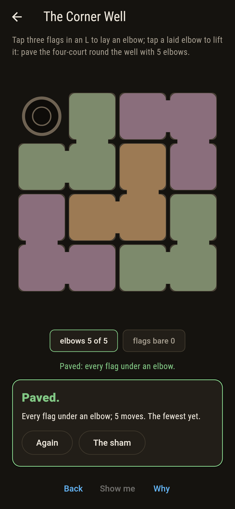
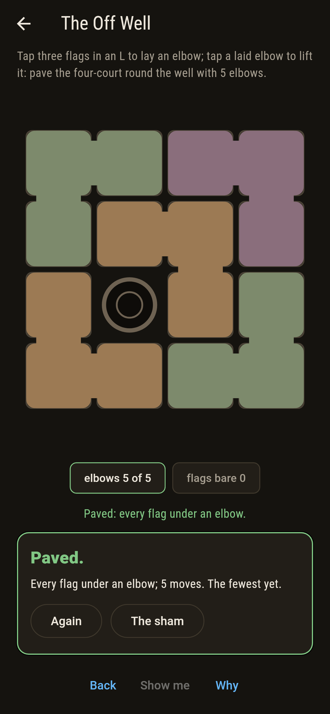
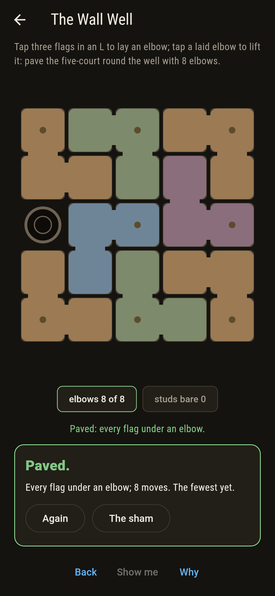
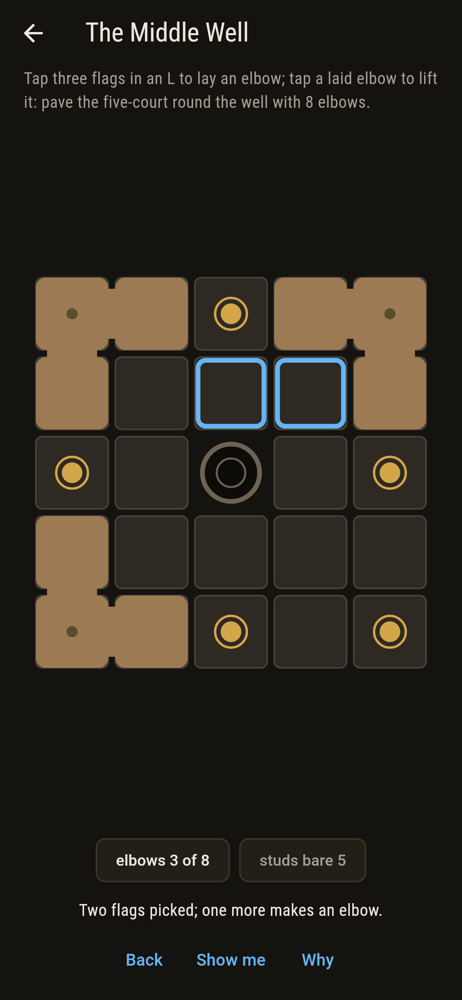
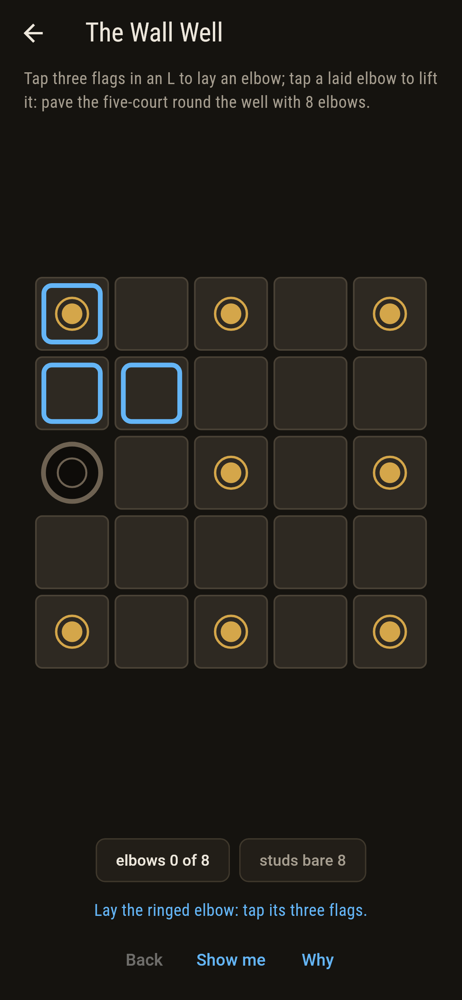
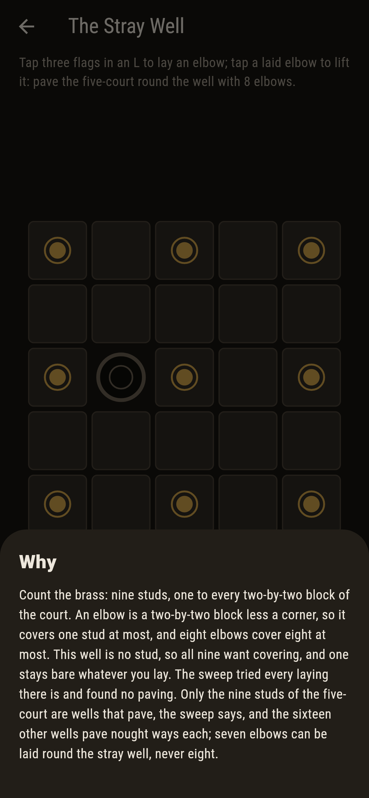

# Studwell


A square court of flagstones with a well in it, and elbows to
pave it with: three flags in an L, a two-by-two block less one
corner. Tap three flags to lay an elbow, tap an elbow to lift it,
and cover every flag but the well. The four-court paves round any
well at all, one way each. The five-court paves only where the
well sits on a stud, and the studs are drawn in brass so you can
count them: nine studs, eight elbows, one stud to an elbow at
most.

## The courts

1. **The Corner Well** - pave the four-court round the well with 5 elbows
2. **The Off Well** - pave the four-court round the well with 5 elbows
3. **The Wall Well** - pave the five-court round the well with 8 elbows
4. **The Middle Well** - pave the five-court round the well with 8 elbows
5. **The Stray Well** - pave the five-court round the well with 8 elbows

Every one of the sixteen wells of the four-court paves exactly
once, and Golomb's quartering builds that one paving with no
searching: one elbow at the crossing of the quarters, then one in
each quarter. On the five-court a wall well paves 16 ways, a
corner 8 and the middle 32, and the sixteen wells off the studs
pave nought ways each. The Stray Well is labeled hopeless on its
tile, and the why counts the brass.

## Two voices

The game never asserts what it has not computed, and it computes
everything at least twice:

* **The sweep** lays every paving there is, first bare flag
  first, on every well of both courts: 1 for each of the sixteen
  wells of four, and 8, 16, 32 or nought on the twenty-five wells
  of five.
* **The quartering** builds a paving of the four-court round any
  well with no searching, and lays the sweep's own paving elbow
  for elbow at all sixteen wells; **the studs** are one to every
  two-by-two block, so an elbow covers one at most, checked over
  every elbow the five-court holds, and the sweep lands exactly on
  the nine stud wells and nowhere else. Seven elbows are laid
  round the stray well and read for overlap, and eight would be a
  paving, of which there are none.

`tool/check_courts.dart` runs the lot and refuses the bake on any
disagreement.

## The checker's ledger

What `dart run tool/check_courts.dart` printed for the build this
README shipped with, word for word:

```
every paving of every court swept: the four-court paves round each of its sixteen wells exactly once and Golomb's quartering lays the same sixteen pavings elbow for elbow, while on the five-court an elbow covers at most one of the nine studs, so the eight elbows land only where the well is a stud, 8 ways at a corner, 16 on a wall and 32 in the middle, and nought at the sixteen other wells, seven elbows being the most the stray well takes

 1 The Corner Well  pave the four-court round the well with 5 elbows: 1 paving of the sweep lands it
 2 The Off Well     pave the four-court round the well with 5 elbows: 1 paving of the sweep lands it
 3 The Wall Well    pave the five-court round the well with 8 elbows: 16 pavings of the sweep land it
 4 The Middle Well  pave the five-court round the well with 8 elbows: 32 pavings of the sweep land it
 5 The Stray Well   pave the five-court round the well with 8 elbows: none, and the nine studs said so first
```

## Screenshots

| The sham | The middle well paved | The stray well admitted |
| --- | --- | --- |
|  |  |  |

| The corner well | The off well | The wall well | Mid-paving | Show me | The why |
| --- | --- | --- | --- | --- | --- |
|  |  |  |  |  |  |

Screenshots are drawn by `test/showcase_test.dart` at real phone
sizes with the app's own painter, then copied into `docs/` as they
came out; every elbow in them was laid by three taps, so nothing
pictured is a court the game could not reach. The logo and every
launcher icon come out of `test/mark_test.dart` the same way: the
mark is the four-court paved round its corner well by the
quartering.

## Building

```
flutter test          # 54 tests, the sweep among them
dart run tool/check_courts.dart
flutter build apk     # or: flutter build ios
```
