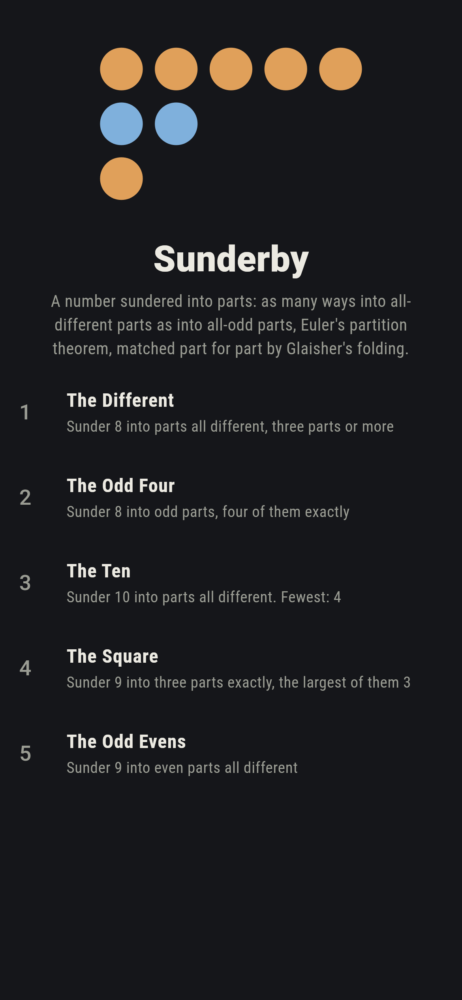
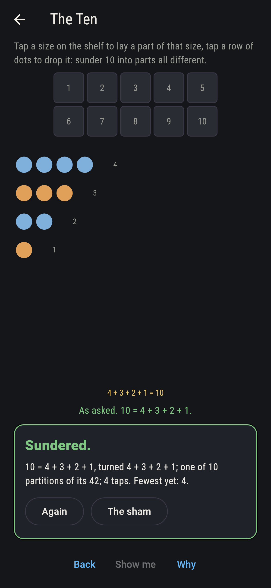
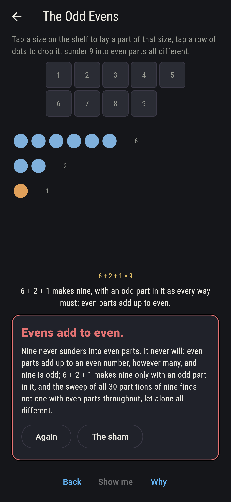
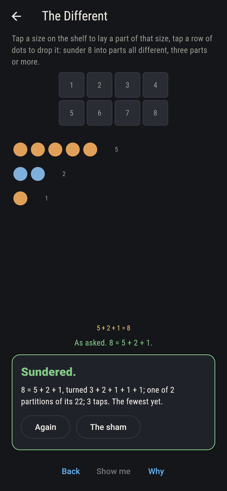
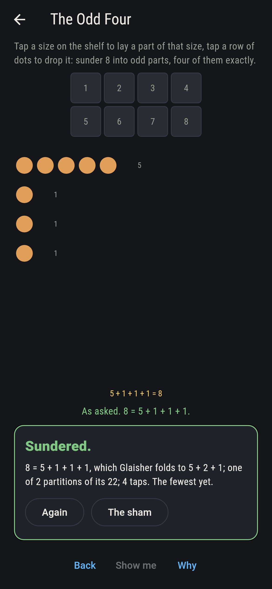
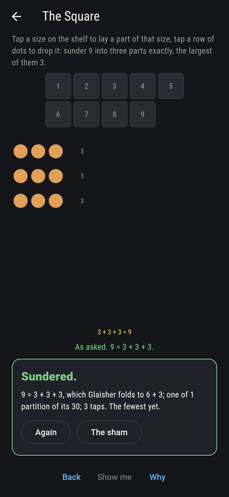
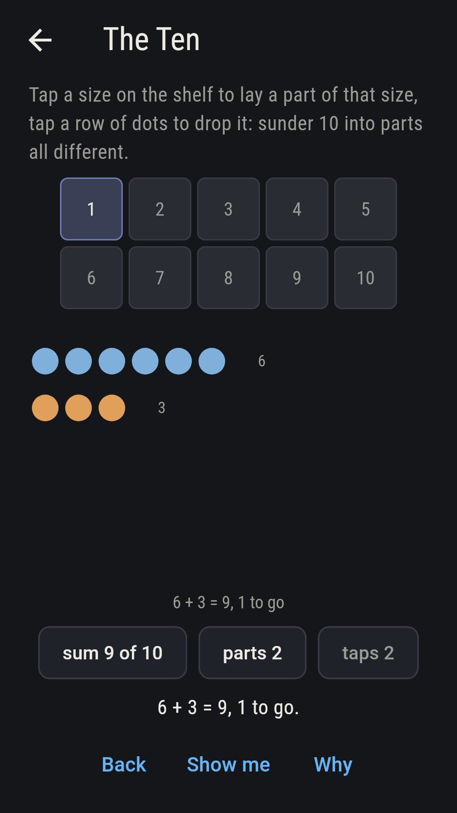
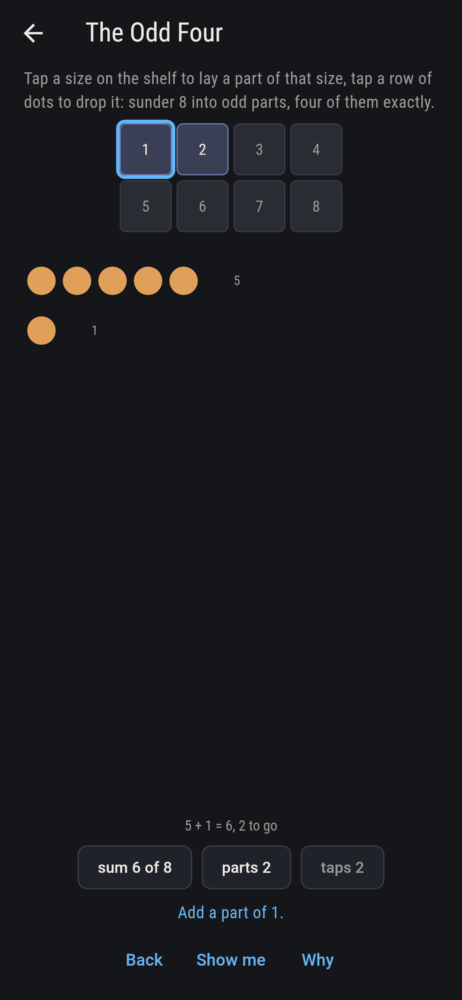
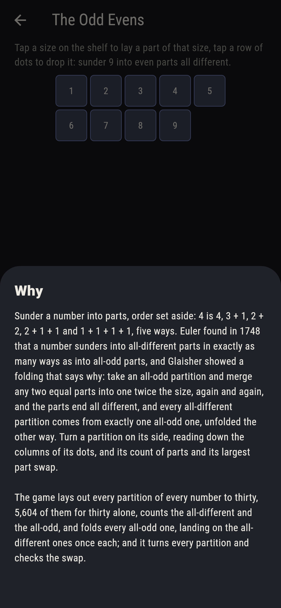

# Sunderby


Sunder a number into parts, the order set aside, and count the ways:
4 is 4, 3 + 1, 2 + 2, 2 + 1 + 1 and 1 + 1 + 1 + 1, five of them.
Euler found in 1748 that a number sunders into parts all different in
exactly as many ways as into parts all odd, and Glaisher's folding
says why: take an all-odd partition, merge any two equal parts into
one part twice the size, and go on until no two are alike, and the
parts end all different, 5 + 1 + 1 + 1 folding to 5 + 2 + 1 and 3 +
3 + 1 + 1 to 6 + 2; unfold the other way and every all-different
partition comes from exactly one all-odd one. Turn a partition on
its side, reading down the columns of its rows of dots, and its
count of parts and its largest part swap, so a number sunders into
k parts as many ways as into parts no bigger than k. Tap a size on
the shelf to lay a part, tap a row of dots to drop it, and make the
number asked of the kind asked. The game lays out every partition of
every number to thirty, 28,628 of them and 5,604 for thirty alone,
counts the all-different and the all-odd on each and finds them
equal, 296 and 296 at the top, folds every all-odd partition and
lands on the all-different ones once each, and turns every partition
and checks the swap.

## The asks

1. **The Different** - sunder 8 into parts all different, three parts or more
2. **The Odd Four** - sunder 8 into odd parts, four of them exactly
3. **The Ten** - sunder 10 into parts all different
4. **The Square** - sunder 9 into three parts exactly, the largest of them 3
5. **The Odd Evens** - sunder 9 into even parts all different

Eight sunders into all-different parts six ways of its 22, and two
of them have three parts or more, 5 + 2 + 1 and 4 + 3 + 1; into odd
parts eight sunders six ways too, as Euler said it must, and two of
those have four parts, 5 + 1 + 1 + 1 and 3 + 3 + 1 + 1, which fold to
5 + 2 + 1 and 6 + 2. Ten sunders into all-different parts ten ways
of its 42, and into all-odd parts ten ways, and 4 + 3 + 2 + 1 among
them is its own turning. Nine into three parts with the largest 3 is
3 + 3 + 3 alone, one of its 30, and it too turns into itself. The
Odd Evens is labeled hopeless on its tile: even parts add up to an
even number, however many, and nine is odd, so none of its 30
partitions has even parts throughout, let alone all different, while
eight sunders into different even parts two ways, 8 and 6 + 2, and
ten three, 10, 8 + 2 and 6 + 4; the sham admits it the moment nine
is made whole, with the odd part every way must carry.

## Two voices

The game never asserts what it has not computed, and it computes
everything at least twice:

* **The sweep** lays out every partition of every number from 1 to
  30, largest part first, 28,628 in all, and counts the all-different
  and the all-odd on each; every count on the sham is that sweep's,
  and Euler's equality is checked on all thirty numbers, 1, 1, 2, 2,
  3, 4, 5, 6, 8, 10, 12, 15 for one to twelve and 296 for thirty.
* **The folding** counts nothing: it takes every all-odd partition
  of every number, merges equal parts pairwise until none are alike,
  and checks that the results are all different and land on the
  all-different partitions of that number exactly once each, which is
  the whole of the why; and the turning reads every partition down
  its columns, checks that count of parts and largest part swap, and
  turns it back to itself.

`tool/check_parts.dart` runs the lot and refuses the bake on any
disagreement.

## The checker's ledger

What `dart run tool/check_parts.dart` printed for the build this
README shipped with, word for word:

```
every partition of every number to thirty laid out, 28,628 in all and 5,604 for thirty alone, and on every number the all-different partitions and the all-odd ones come to the same count, 1, 1, 2, 2, 3, 4, 5, 6, 8, 10, 12, 15 from one to twelve and 296 for thirty; every all-odd partition folds by Glaisher's merging of equal parts into an all-different one, and the foldings land on the all-different partitions once each, on every number; every partition turned swaps its count of parts for its largest part and turns back to itself, so k parts and largest part k come in equal numbers for every k; and no odd number to thirty sunders into even parts, while eight does so into different ones two ways and ten three

 1 The Different sunder 8 into parts all different, three parts or more: 2 of its 22 partitions land it
 2 The Odd Four  sunder 8 into odd parts, four of them exactly: 2 of its 22 partitions land it
 3 The Ten       sunder 10 into parts all different: 10 of its 42 partitions land it
 4 The Square    sunder 9 into three parts exactly, the largest of them 3: 1 of its 30 partitions lands it
 5 The Odd Evens sunder 9 into even parts all different: none of its 30, and the even sum said so first
```

## Screenshots

| The sham | The ten | The odd evens admitted |
| --- | --- | --- |
|  |  |  |

| The different | The odd four | The square | Midway, on the small phone | Show me | The why |
| --- | --- | --- | --- | --- | --- |
|  |  |  |  |  |  |

Screenshots are drawn by `test/showcase_test.dart` at real phone
sizes with the app's own painter, then copied into `docs/` as they
came out; every part in them was laid by a tap, so nothing pictured
is a sundering the game could not reach. The logo and every launcher
icon come out of `test/mark_test.dart` the same way: the mark is the
dots of 5 + 2 + 1, eight sundered into three different parts, which
is 5 + 1 + 1 + 1 folded.

## Building

```
flutter test          # 48 tests, the sweep among them
dart run tool/check_parts.dart
flutter build apk     # or: flutter build ios
```
