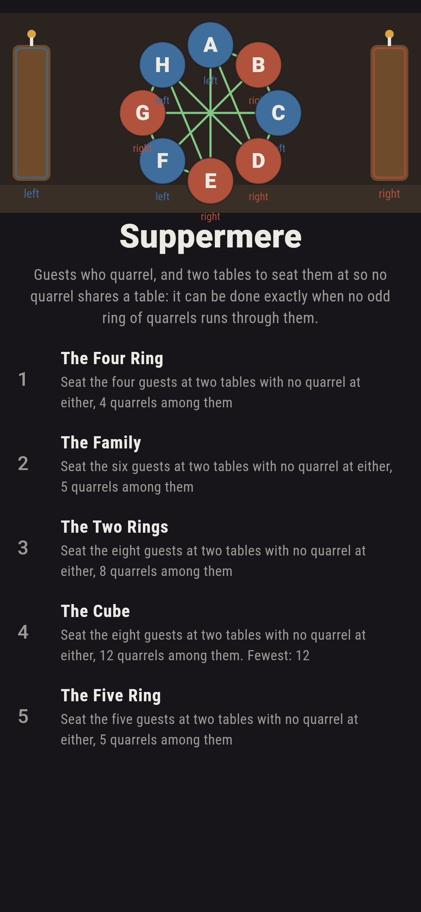
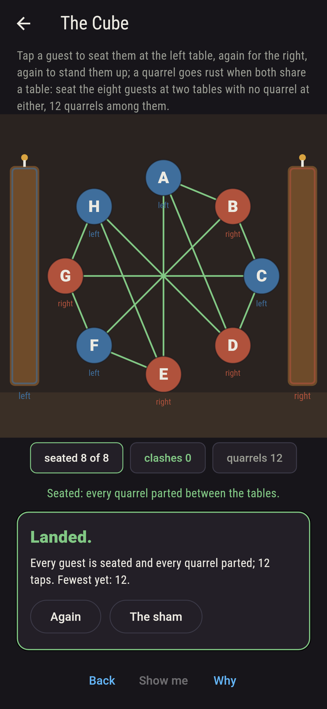
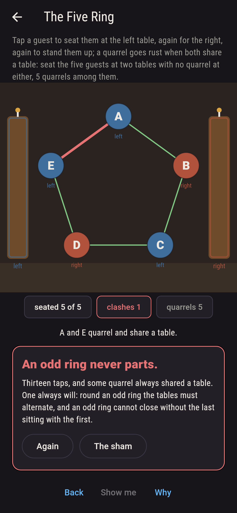
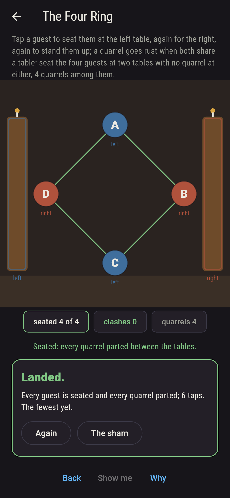
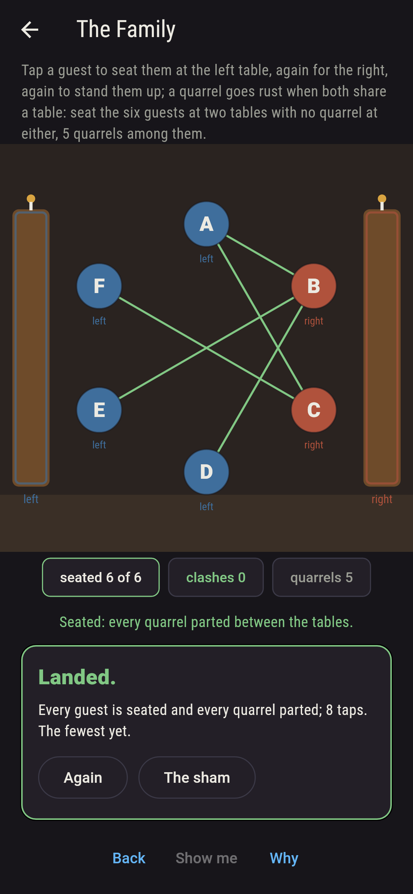
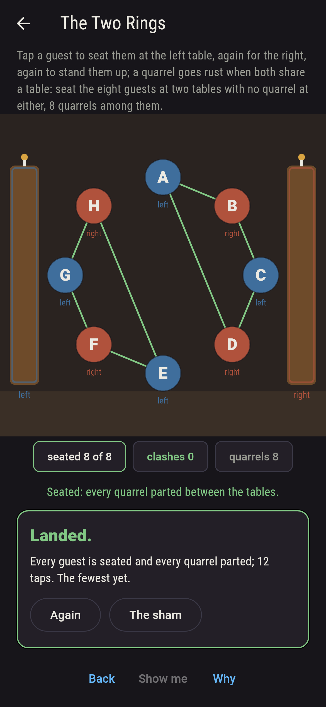
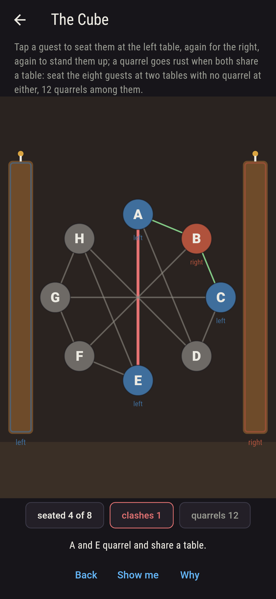
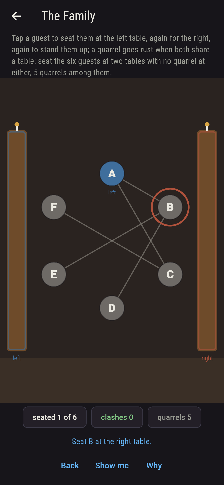
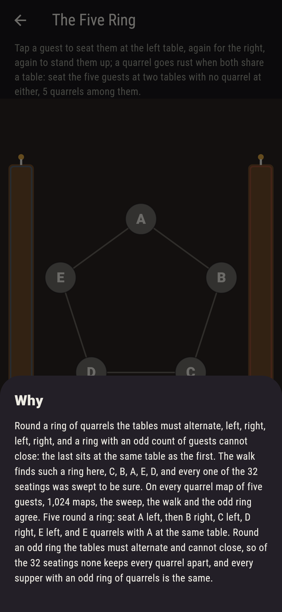

# Suppermere


A supper with two long tables, and guests who quarrel: no two who
quarrel may share a table. Tap a guest for the left table, again
for the right; every quarrel is strung between its two guests, and
goes rust when they sit together. Konig showed in 1936 when this
can be done: exactly when no odd ring of quarrels runs through the
guests, since round a ring the tables must alternate, and an odd
ring cannot close without the last sitting with the first. A walk
seats any hall that has no odd ring, the first guest of each party
left and every quarreller across, and every seating of every
supper here is swept; on all 1,024 quarrel maps of five guests the
sweep, the walk and the odd ring agree.

## The suppers

1. **The Four Ring** - seat the four guests at two tables with no quarrel at either, 4 quarrels among them
2. **The Family** - seat the six guests at two tables with no quarrel at either, 5 quarrels among them
3. **The Two Rings** - seat the eight guests at two tables with no quarrel at either, 8 quarrels among them
4. **The Cube** - seat the eight guests at two tables with no quarrel at either, 12 quarrels among them
5. **The Five Ring** - seat the five guests at two tables with no quarrel at either, 5 quarrels among them

The four ring seats two ways of sixteen; the family two ways of
64; the two rings four of 256, two for each party; the cube two of
256. Every supper with no odd ring seats two ways for each party.
The Five Ring is labeled hopeless on its tile, and the why names
the ring.

## Two voices

The game never asserts what it has not computed, and it computes
everything at least twice:

* **The sweep** seats the guests every way, two tables apiece, and
  keeps the seatings with no quarrel at a table; every count on
  the sham is that sweep's.
* **The walk** seats with no sweep, the first guest of each party
  left and every quarreller of a seated guest across, and where it
  clashes it traces the odd ring back; on every supper here and on
  every quarrel map of five guests the walk lands exactly when the
  sweep finds a seating, exactly when no odd ring is found, and the
  seatings then number two to the power of the parties.

`tool/check_seatings.dart` runs the lot and refuses the bake on
any disagreement.

## The checker's ledger

What `dart run tool/check_seatings.dart` printed for the build
this README shipped with, word for word:

```
every seating of every supper swept, and every quarrel map of five guests taken whole, 1,024 maps: the sweep finds a seating exactly when the walk seats every guest across from every quarreller, exactly when no odd ring of quarrels is found, 376 maps of the 1,024, and where it does the seatings number two to the power of the parties; every ring found is odd and made of quarrels; the four ring seats 2 ways of 16, the family 2 of 64, the two rings 4 of 256, the cube 2 of 256, and the five ring none of 32

 1 The Four Ring seat the four guests at two tables with no quarrel at either, 4 quarrels among them: 2 of the 16 seatings land it
 2 The Family    seat the six guests at two tables with no quarrel at either, 5 quarrels among them: 2 of the 64 seatings land it
 3 The Two Rings seat the eight guests at two tables with no quarrel at either, 8 quarrels among them: 4 of the 256 seatings land it
 4 The Cube      seat the eight guests at two tables with no quarrel at either, 12 quarrels among them: 2 of the 256 seatings land it
 5 The Five Ring seat the five guests at two tables with no quarrel at either, 5 quarrels among them: none of the 32, and the odd ring said so first
```

## Screenshots

| The sham | The cube seated | The five ring admitted |
| --- | --- | --- |
|  |  |  |

| The four ring | The family | The two rings | Mid-seating | Show me | The why |
| --- | --- | --- | --- | --- | --- |
|  |  |  |  |  |  |

Screenshots are drawn by `test/showcase_test.dart` at real phone
sizes with the app's own painter, then copied into `docs/` as they
came out; every guest in them was seated by taps, so nothing
pictured is a hall the game could not reach. The logo and every
launcher icon come out of `test/mark_test.dart` the same way: the
mark is the cube seated, eight guests across from every quarreller.

## Building

```
flutter test          # 43 tests, the sweep among them
dart run tool/check_seatings.dart
flutter build apk     # or: flutter build ios
```
