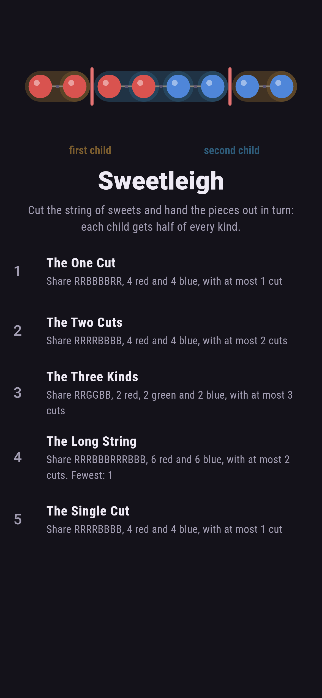
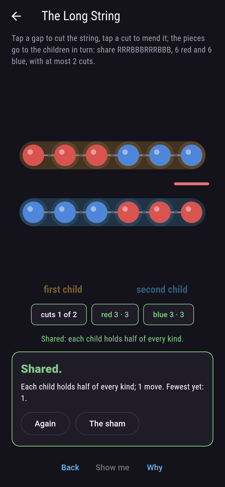
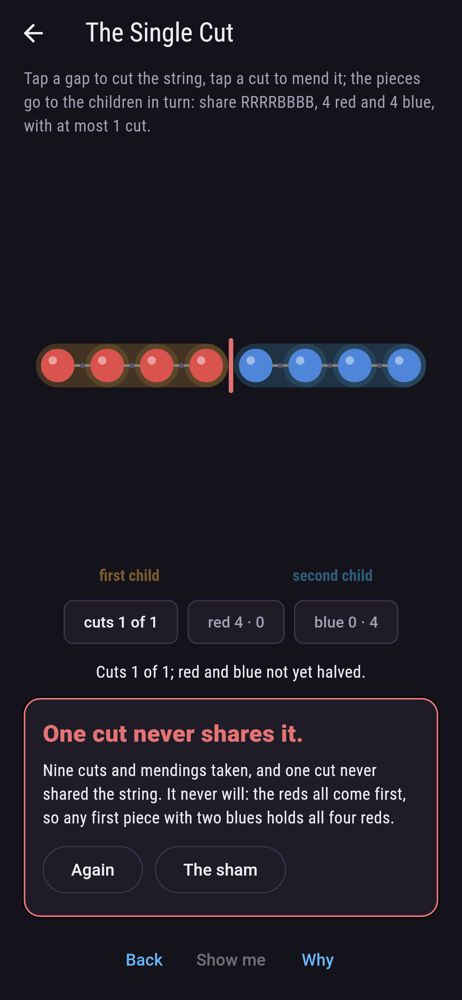
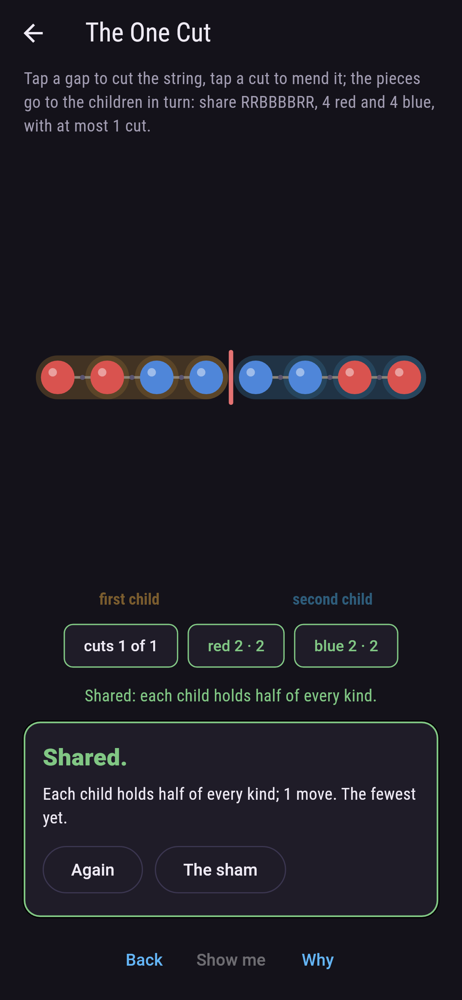
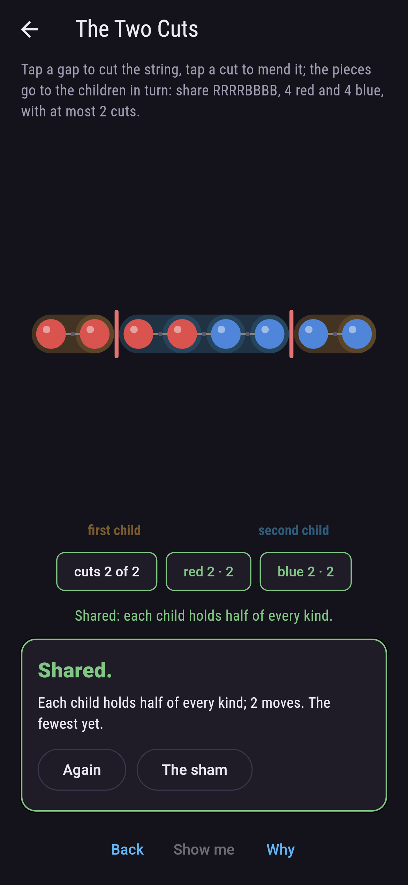
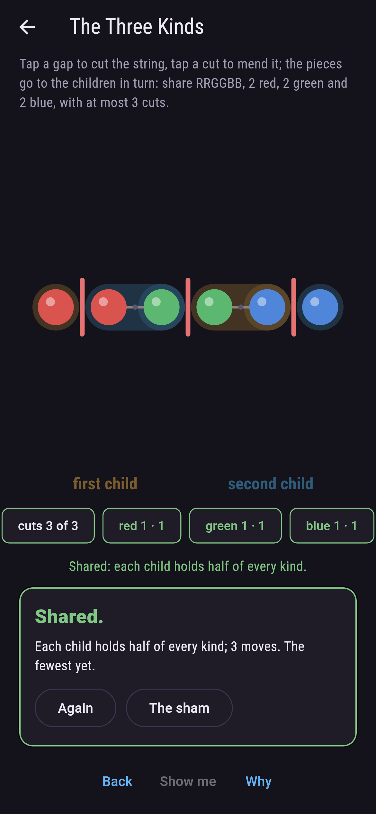
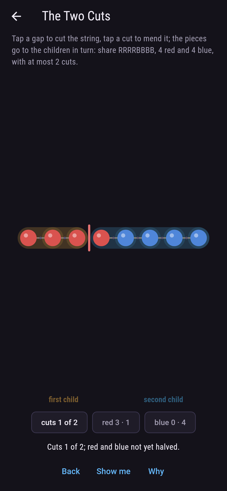
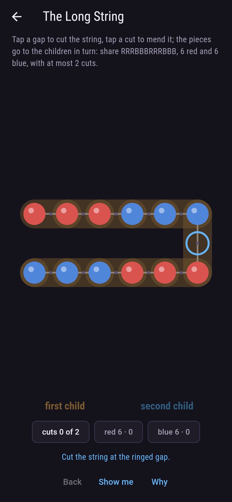
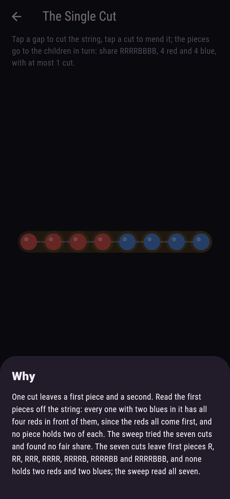

# Sweetleigh


Sweets on a string, an even count of every kind, and two children
to share them. Cut the string in a few places and hand the pieces
out in turn, first child, second child, first child again; the
share is fair when each child holds half of every kind. The
necklace theorem says as many cuts as there are kinds always
suffice, and for two kinds the proof is a window you can slide
with your thumb. Some strings need every one of those cuts, and
reds-then-blues is one: one cut never shares it.

## The shares

1. **The One Cut** - share RRBBBBRR, 4 red and 4 blue, with at most 1 cut
2. **The Two Cuts** - share RRRRBBBB, 4 red and 4 blue, with at most 2 cuts
3. **The Three Kinds** - share RRGGBB, 2 red, 2 green and 2 blue, with at most 3 cuts
4. **The Long String** - share RRRBBBRRRBBB, 6 red and 6 blue, with at most 2 cuts
5. **The Single Cut** - share RRRRBBBB, 4 red and 4 blue, with at most 1 cut

Of the 70 strings of four reds and four blues, 36 share with one
cut and 34 need two, and every one shares with two; of the 924
strings of six and six, 400 and 524. Three kinds may need three
cuts, and RRGGBB does, since any three sweets in a row of it hold
two of a kind; of the 90 strings of two, two and two, 36 share
with one cut, 42 need two and 12 need three. The Single Cut is
labeled hopeless on its tile, and the why reads its seven first
pieces off the string.

## Two voices

The game never asserts what it has not computed, and it computes
everything at least twice:

* **The sweep** tries every set of cuts allowed and hands every
  piece out in turn, and it sweeps every string of each size, all
  70 and 924 and 90 of them, for the fewest cuts each needs.
* **The window** is the theorem for two kinds, built and not
  searched: slide a piece half the string long from one end to the
  other and count the reds in it; the count moves by one at most
  each step and ends where the other half began, so somewhere it
  is exactly half, and the two cuts round it share the string. It
  is built for every string of four and four and of six and six,
  and shares fairly every time.

`tool/check_strings.dart` runs the lot and refuses the bake on any
disagreement.

## The checker's ledger

What `dart run tool/check_strings.dart` printed for the build this
README shipped with, word for word:

```
every set of cuts of every string swept and every piece handed out in turn: two kinds share with two cuts on all 70 strings of four and four and all 924 of six and six, the sliding window built for each, 36 and 400 of them sharing with one cut and 34 and 524 needing two; three kinds share with three cuts on all 90 strings of two, two and two, 36 with one, 42 with two, 12 needing three; and reds-then-blues holds all four reds in any first piece with two blues, so one cut never shares it and the middle window does

 1 The One Cut      share RRBBBBRR, 4 red and 4 blue, with at most 1 cut: 1 set of cuts of the sweep lands it
 2 The Two Cuts     share RRRRBBBB, 4 red and 4 blue, with at most 2 cuts: 1 set of cuts of the sweep lands it
 3 The Three Kinds  share RRGGBB, 2 red, 2 green and 2 blue, with at most 3 cuts: 1 set of cuts of the sweep lands it
 4 The Long String  share RRRBBBRRRBBB, 6 red and 6 blue, with at most 2 cuts: 6 sets of cuts of the sweep land it
 5 The Single Cut   share RRRRBBBB, 4 red and 4 blue, with at most 1 cut: none of the seven, and the first pieces said so
```

## Screenshots

| The sham | The long string shared | The single cut admitted |
| --- | --- | --- |
|  |  |  |

| The one cut | The two cuts | The three kinds | Mid-cut | Show me | The why |
| --- | --- | --- | --- | --- | --- |
|  |  |  |  |  |  |

Screenshots are drawn by `test/showcase_test.dart` at real phone
sizes with the app's own painter, then copied into `docs/` as they
came out; every cut in them was tapped, so nothing pictured is a
share the game could not reach. The logo and every launcher icon
come out of `test/mark_test.dart` the same way: the mark is
reds-then-blues shared by the window, two cuts round the middle
four.

## Building

```
flutter test          # 46 tests, the sweep among them
dart run tool/check_strings.dart
flutter build apk     # or: flutter build ios
```
