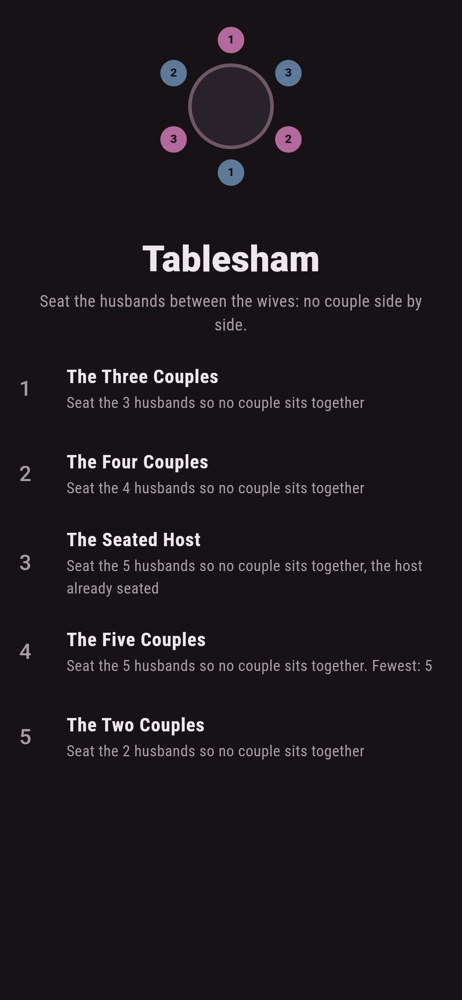
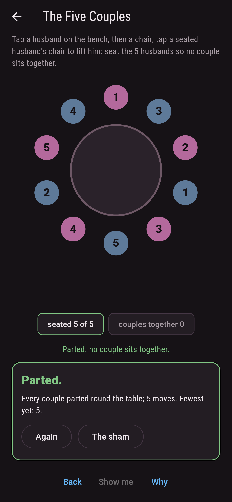
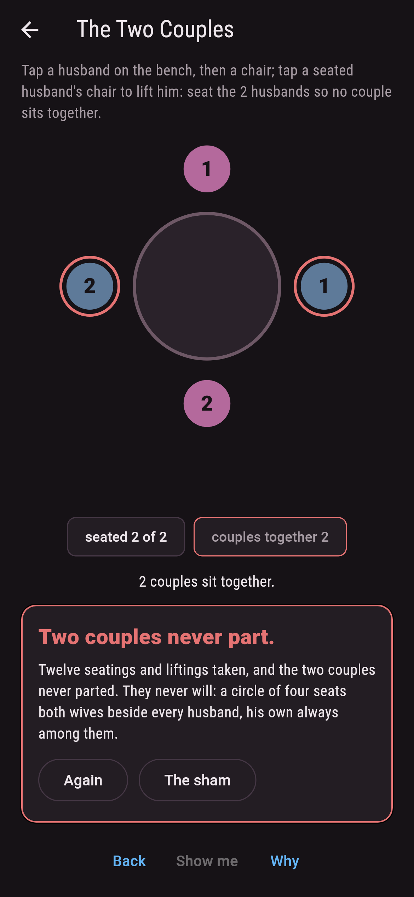
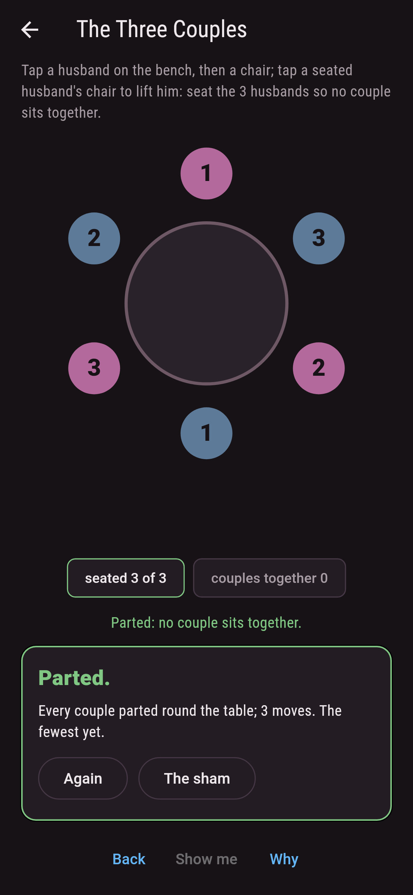
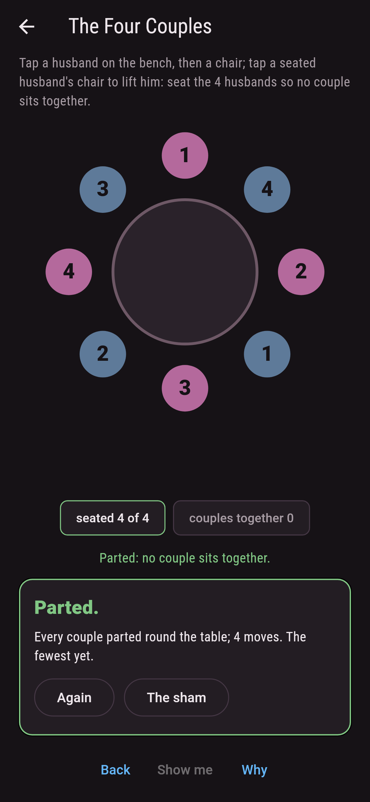
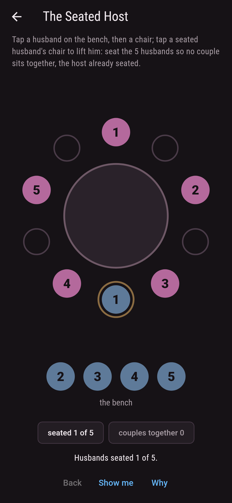
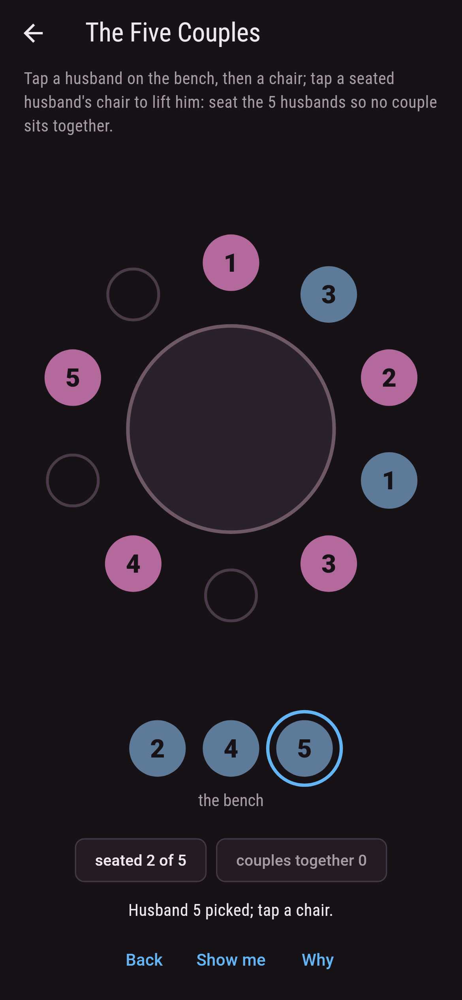
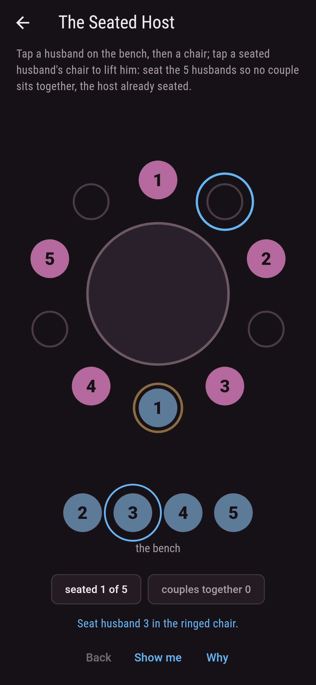
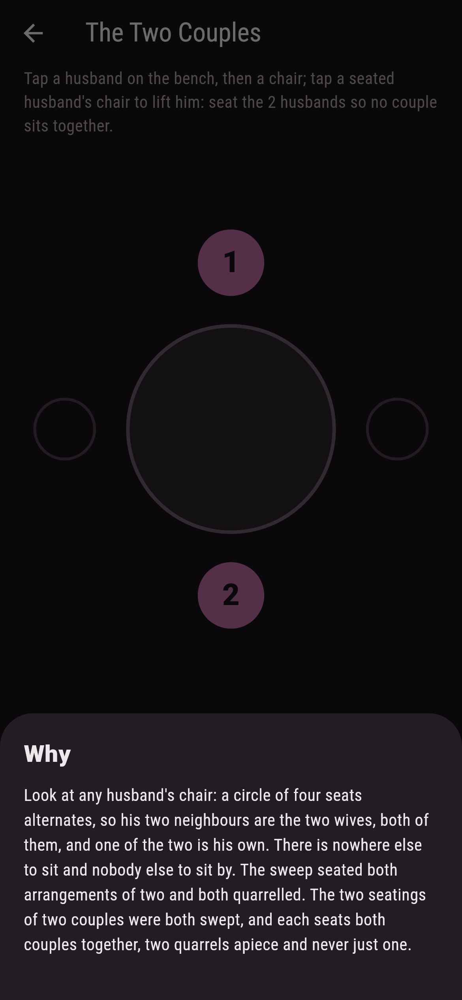

# Tablesham


Couples round a table, the wives already seated at every other
chair, the husbands waiting on a bench: seat them between the
wives so that no couple sits side by side. Three couples manage
it exactly one way, four manage two, five manage thirteen. Two
couples never manage it, and the table shows why: a circle of
four seats both wives beside every husband, his own among them.

## The parties

1. **The Three Couples** - seat the 3 husbands so no couple sits together
2. **The Four Couples** - seat the 4 husbands so no couple sits together
3. **The Seated Host** - seat the 5 husbands so no couple sits together, the host already seated
4. **The Five Couples** - seat the 5 husbands so no couple sits together
5. **The Two Couples** - seat the 2 husbands so no couple sits together

The one seating of three turns the whole table one way, every
husband three seats round from his wife. The two seatings of
four are mirrors of one another, the table turned three seats
one way or the other. Five couples part thirteen ways, three of
them whole-table turns, and holding the host in his chair
narrows the thirteen to five. The Two Couples is labeled
hopeless on its tile, and the why walks the circle of four.

## Two voices

The game never asserts what it has not computed, and it computes
everything at least twice:

* **The sweep** seats every husband every way and reads the
  neighbours off the circle: 2, 6, 24 and 120 seatings, and
  every party's count is the sweep's.
* **Touchard's arithmetic** lands the same counts with no
  searching at all, falls and rises over the couples parted,
  and the two never disagree at any size shipped. The
  whole-table turns are counted twice as well, once by reading
  every landing and once by building each turn on its own; the
  pair of four are checked as mirrors; and both seatings of two
  are read for their quarrels, two apiece.

`tool/check_tables.dart` runs the lot and refuses the bake on
any disagreement.

## The checker's ledger

What `dart run tool/check_tables.dart` printed for the build
this README shipped with, word for word:

```
every seating of every table swept and held to Touchard's arithmetic, falls and rises over the couples parted: nought ways for two couples, one for three, two for four, thirteen for five, and five once the host is held in his chair; the whole-table turns counted both ways too, one and two and three of them, the pair of four read as mirrors, and both seatings of two quarrel twice over

 1 The Three Couples  seat the 3 husbands so no couple sits together: 1 seating of the sweep lands it
 2 The Four Couples   seat the 4 husbands so no couple sits together: 2 seatings of the sweep land it
 3 The Seated Host    seat the 5 husbands so no couple sits together, the host already seated: 5 seatings of the sweep land it
 4 The Five Couples   seat the 5 husbands so no couple sits together: 13 seatings of the sweep land it
 5 The Two Couples    seat the 2 husbands so no couple sits together: none of the two, and the circle of four said so first
```

## Screenshots

| The sham | The five couples parted | The two couples admitted |
| --- | --- | --- |
|  |  |  |

| The three couples | The four couples | The seated host | Mid-seating | Show me | The why |
| --- | --- | --- | --- | --- | --- |
|  |  |  |  |  |  |

Screenshots are drawn by `test/showcase_test.dart` at real phone
sizes with the app's own painter, then copied into `docs/` as
they came out; every husband in them was picked and seated by a
tap, so nothing pictured is a table the game could not reach.
The logo and every launcher icon come out of `test/mark_test.dart`
the same way: the mark is the one seating of three couples.

## Building

```
flutter test          # 49 tests, the sweep among them
dart run tool/check_tables.dart
flutter build apk     # or: flutter build ios
```
