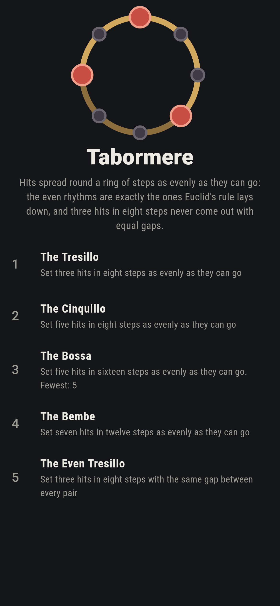
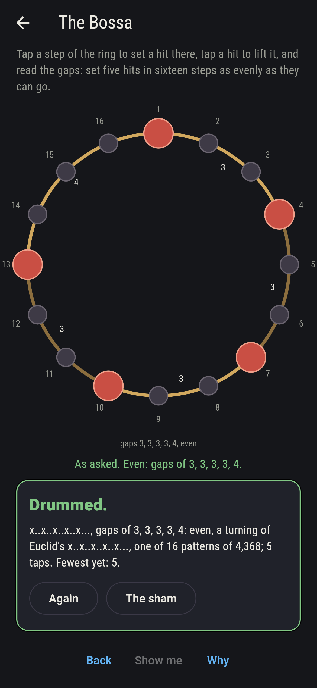
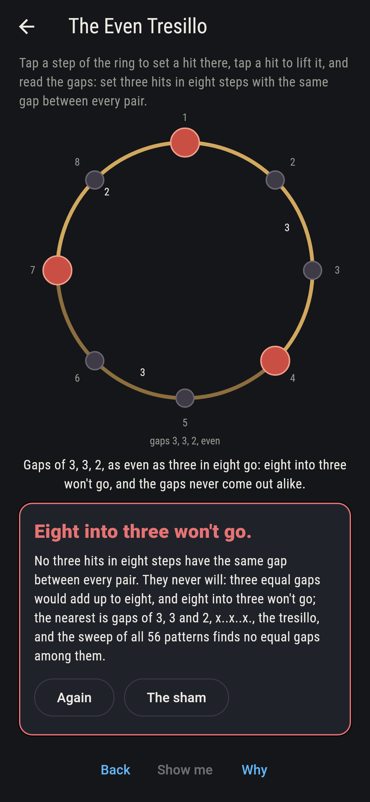
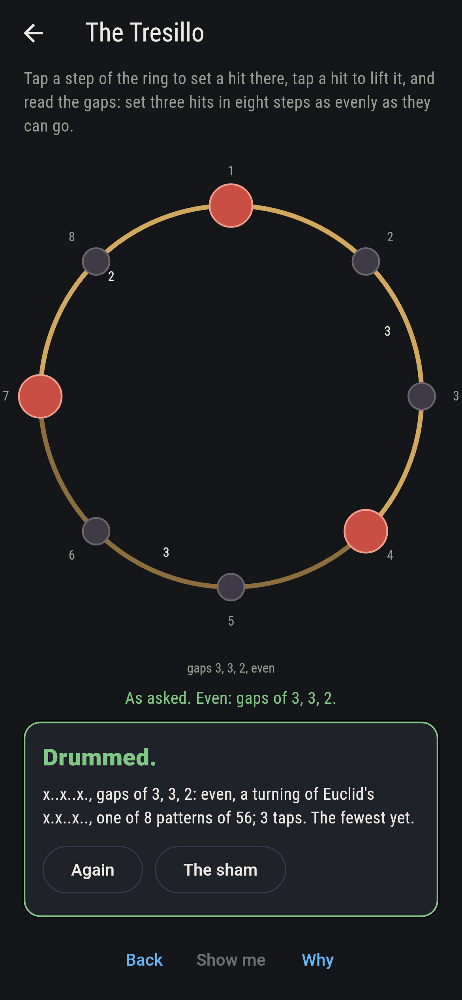
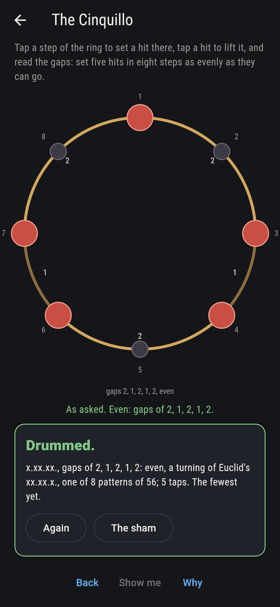
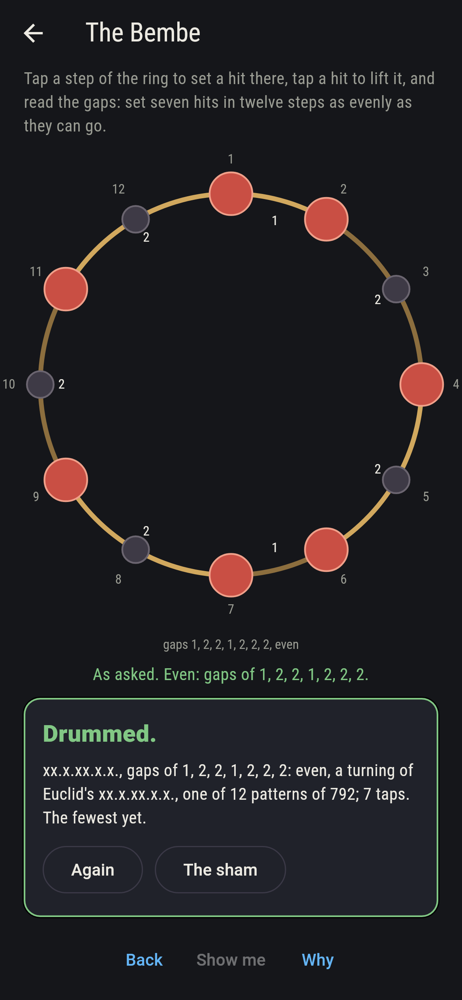
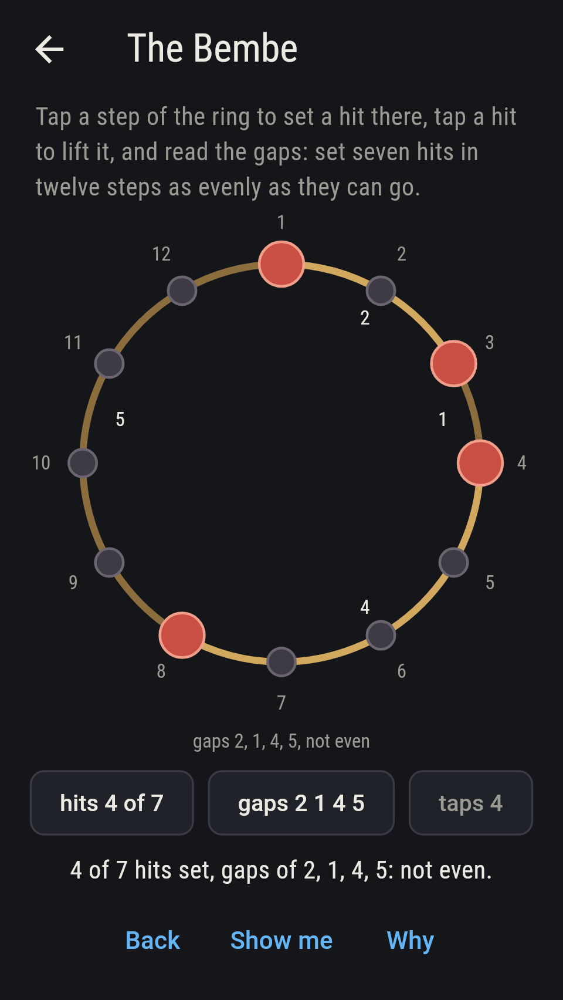
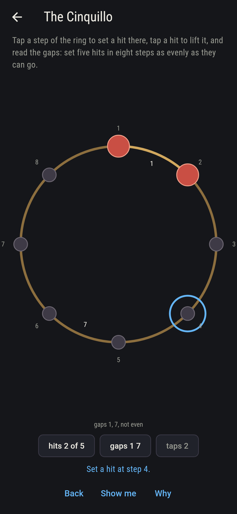
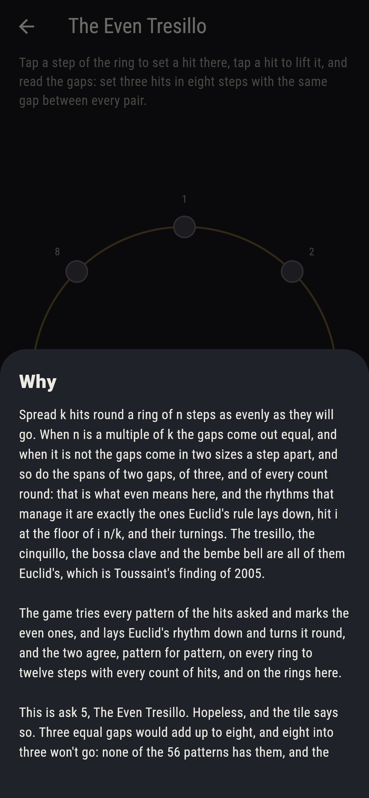

# Tabormere


Hits spread round a ring of steps as evenly as they can go. When the
steps are a multiple of the hits the gaps come out equal, and when
they are not the gaps come in two sizes a step apart, and so do the
spans of two gaps, of three, and of every count round: that is what
even means here, and the rhythms that manage it are exactly the ones
Euclid's rule lays down, hit i at the floor of i n/k, and their
turnings. The tresillo, the cinquillo, the bossa clave and the bembe
bell are all of them Euclid's, which is Toussaint's finding of 2005.
Tap the steps of the ring to set hits and read the gaps. Every
pattern of every ring to twelve steps with every count of hits is
tried, 8,190 patterns, and the even ones are exactly Euclid's rhythm
and its turnings on every ring.

## The asks

1. **The Tresillo** - set three hits in eight steps as evenly as they can go
2. **The Cinquillo** - set five hits in eight steps as evenly as they can go
3. **The Bossa** - set five hits in sixteen steps as evenly as they can go
4. **The Bembe** - set seven hits in twelve steps as evenly as they can go
5. **The Even Tresillo** - set three hits in eight steps with the same gap between every pair

Three in eight go evenly as x..x..x. and its turnings, gaps of 3, 3
and 2, eight patterns of the 56, Euclid's own being x.x..x..; five in
eight as x.xx.xx., eight of 56; five in sixteen as x..x..x...x..x..,
sixteen of 4,368, gaps of 3, 3, 4, 3 and 3; seven in twelve as
x.xx.x.xx.x., twelve of 792. The Even Tresillo is labeled hopeless on
its tile: three equal gaps would add up to eight, and eight into
three won't go; the sham admits it the moment the tresillo itself is
set, gaps of 3, 3 and 2, the nearest there is.

## Two voices

The game never asserts what it has not computed, and it computes
everything at least twice:

* **The sweep** tries every pattern of the hits asked on the ring
  asked, and every pattern of every ring to twelve steps with every
  count of hits, 90 rings and 8,190 patterns, reading the gaps of each
  and the spans of two, three and more gaps round, and marks the even
  ones, 474 in all; every count on the sham is the sweep's.
* **Euclid's rule** lays one rhythm down with no sweep, hit i at the
  floor of i n/k, and its turnings number n over the greatest common
  divisor of n and k; on every one of the 90 rings the even patterns
  of the sweep are exactly Euclid's rhythm and its turnings, pattern
  for pattern, and equal gaps come exactly when the hits divide the
  steps.

`tool/check_rhythms.dart` runs the lot and refuses the bake on any
disagreement.

## The checker's ledger

What `dart run tool/check_rhythms.dart` printed for the build this
README shipped with, word for word:

```
every pattern of every ring to twelve steps with every count of hits tried, 90 rings and 8,190 patterns, and the even ones, 474 in all, are exactly Euclid's rhythm and its turnings on every ring, n over the greatest common divisor of n and k of them, with equal gaps exactly when the hits divide the steps; on the rings here three in eight go evenly 8 ways of 56, x.x..x.. and its turnings with gaps of 3, 3 and 2, five in eight 8 ways of 56, xx.xx.x. with gaps of 2, 1, 2, 1 and 2, five in sixteen 16 ways of 4,368, x..x..x..x..x... with gaps of 3, 3, 4, 3 and 3, and seven in twelve 12 ways of 792, xx.x.xx.x.x. with gaps of 2, 1, 2, 2, 1, 2 and 2; and no pattern of three in eight has equal gaps, while three in nine, x..x..x.., has them three ways

 1 The Tresillo       set three hits in eight steps as evenly as they can go: 8 of the 56 patterns land it
 2 The Cinquillo      set five hits in eight steps as evenly as they can go: 8 of the 56 patterns land it
 3 The Bossa          set five hits in sixteen steps as evenly as they can go: 16 of the 4,368 patterns land it
 4 The Bembe          set seven hits in twelve steps as evenly as they can go: 12 of the 792 patterns land it
 5 The Even Tresillo  set three hits in eight steps with the same gap between every pair: none of the 56, and eight into three said so first
```

## Screenshots

| The sham | The bossa | The even tresillo admitted |
| --- | --- | --- |
|  |  |  |

| The tresillo | The cinquillo | The bembe | Midway, on the small phone | Show me | The why |
| --- | --- | --- | --- | --- | --- |
|  |  |  |  |  |  |

Screenshots are drawn by `test/showcase_test.dart` at real phone
sizes with the app's own painter, then copied into `docs/` as they
came out; every hit in them was set by a tap, so nothing pictured is
a rhythm the game could not reach. The logo and every launcher icon
come out of `test/mark_test.dart` the same way: the mark is the
tresillo, three hits in eight steps.

## Building

```
flutter test          # 45 tests, the sweep among them
dart run tool/check_rhythms.dart
flutter build apk     # or: flutter build ios
```
