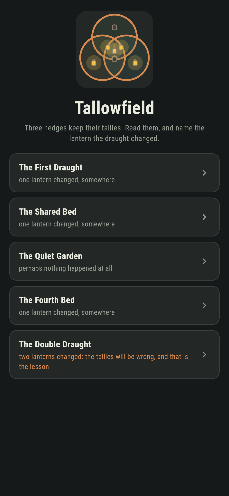
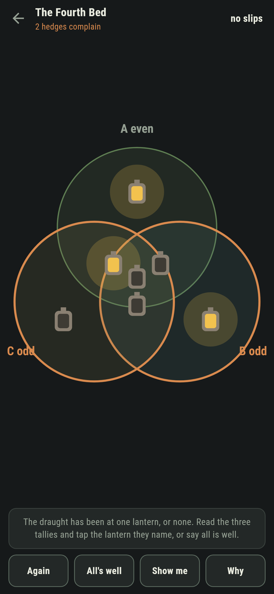
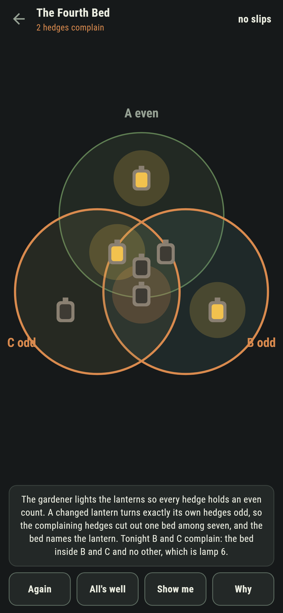
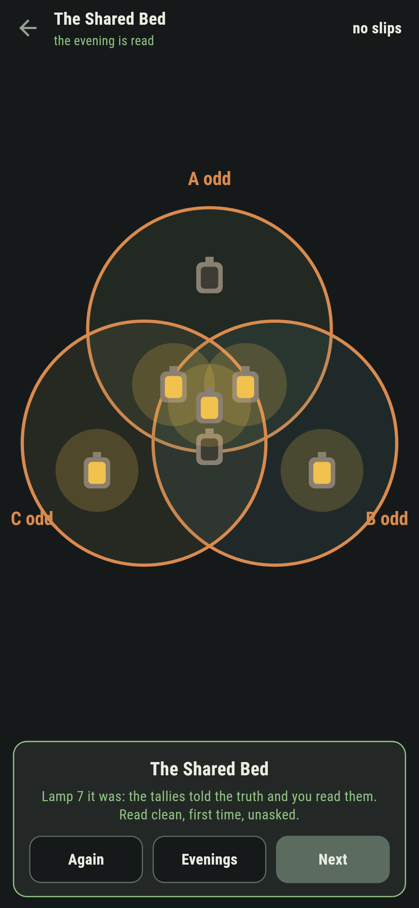
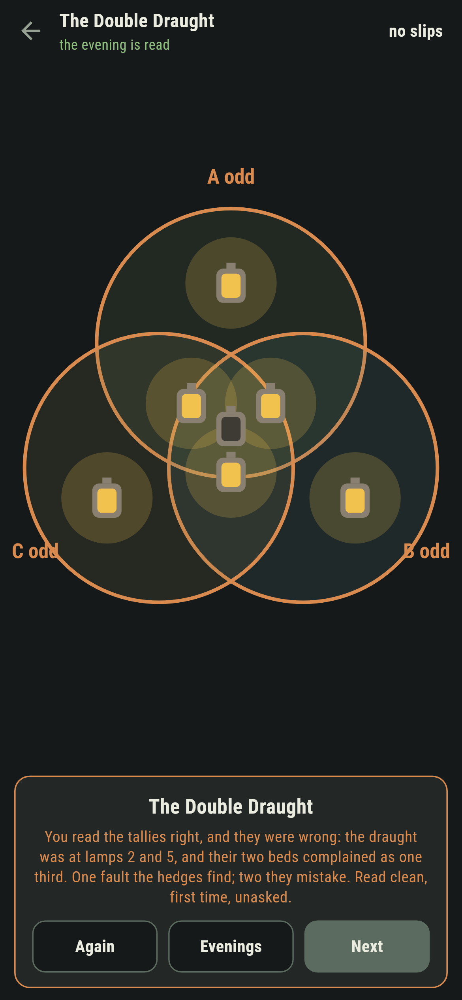
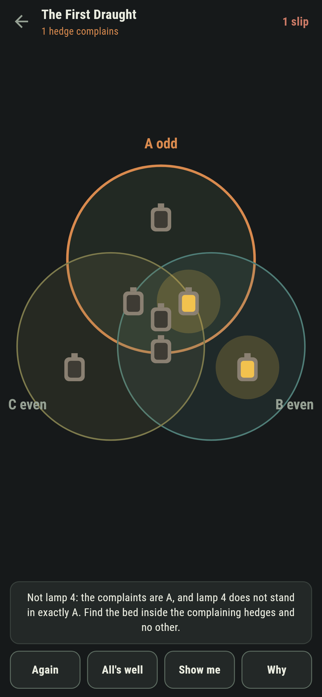

# Tallowfield

A lantern-garden puzzle for phones, in Flutter, for Android and iOS.

Seven lanterns stand among three round hedges, one in each of the seven
beds the hedges cut the garden into. The gardener lights them so every
hedge holds an even count. A draught has been at one lantern, or none:
read the three tallies and name it, or say all is well.

| | | | |
|---|---|---|---|
|  |  |  |  |

## Three tallies find one fault among seven

A changed lantern turns exactly its own hedges odd. The odd hedges cut
out one bed among the seven, the bed inside the complaining hedges and no
other, and that bed holds the changed lantern. The finding is a picture
you stand in front of: **Why** shades the bed the complaints name.

This is Hamming's code with its geometry showing, and nothing about it is
taken on faith:

```
$ make evenings
the tallies name the changed lantern on all 112 one-draught evenings there are

 1 The First Draught  draught at 1  the tallies say lamp 1  true
 2 The Shared Bed     draught at 7  the tallies say lamp 7  true
 3 The Quiet Garden   draught at nothing  the tallies say all is well  true
 4 The Fourth Bed     draught at 6  the tallies say lamp 6  true
 5 The Double Draught draught at 2 and 5  the tallies say lamp 7  MISTAKEN, as built
```

The suite holds the tally-reading against the long way, flipping each
lamp and looking, on all 128 patterns a garden can show; checks that the
sixteen sound plantings pairwise differ at three lamps or more, which is
why one fault is always findable; and confirms the seven beds are the
seven ways three hedges can overlap, one lamp each.

## The Double Draught

One evening the draught is at two lanterns, and the tallies, which cannot
know, point with perfect confidence at a third: the two changed beds
cancel and complain as one. You read the tallies right, and they are
wrong, and the card says so in as many words. The suite sweeps every pair
of lamps over every planting to show the mistake is total: the mended
garden is always sound and never the gardener's. One fault the hedges
find; two they mistake, and no reading of three tallies can do better.



## Slips are corrected from the tallies

Name a wrong lantern and the game does not just buzz: it says which
hedges complain and why that lantern cannot be the one, so the correction
teaches the code. The score is slips and askings together, and an evening
read clean says so.



## Building

```
make deps      # fetch packages
make check     # analyze + every test
make evenings  # prove the tallies everywhere, walk the shipped evenings
make shots     # render the screenshots and redraw the icons
make apk       # Android release build
make ios       # iOS release build (unsigned)
```

The logo and every app icon are drawn by the game's own painter in
`test/mark_test.dart`. There is no image in this repository that was not
produced by code in it.

## How it is put together

```
lib/garden/code.dart      the hedges, the tallies, and the long way round
lib/garden/evening.dart   an evening: the planting and the draught's work
lib/garden/evenings.dart  the five evenings that ship
lib/garden/play.dart      an evening being read: slips, the settling
lib/ui/                   the painter, the screens, the mark
tool/check_evenings.dart  the ledger above
```

The tests hold the tallies against trying every lamp on every pattern,
sweep every one-draught evening and every two-draught pair, check the
code's distance the long way, and hold the pictures against the real
widget tree. If any of that drifts, `make check` goes red before anything
leaves the machine.
