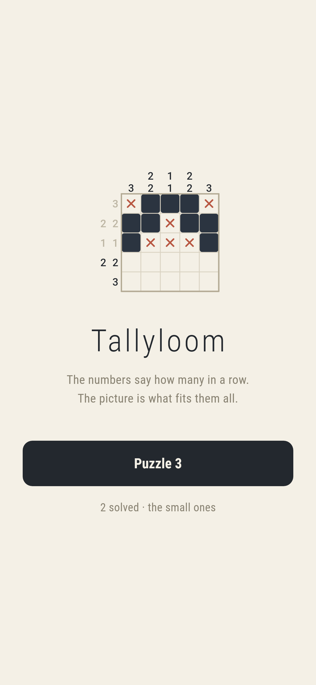
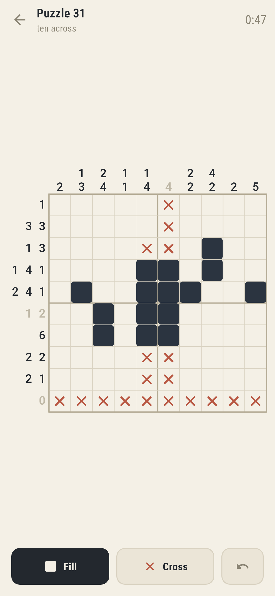
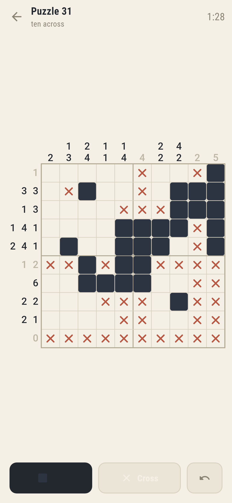
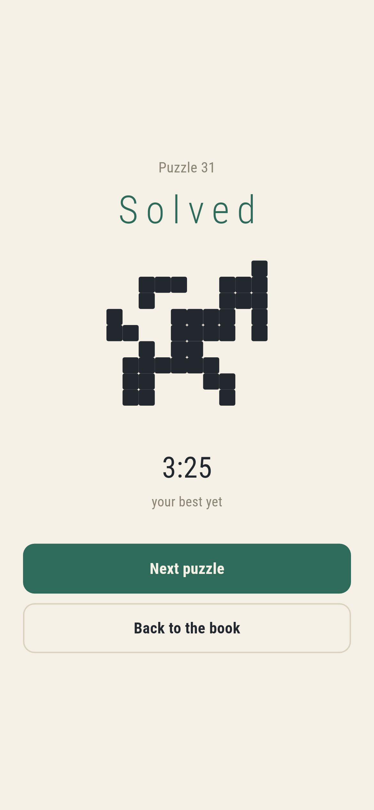
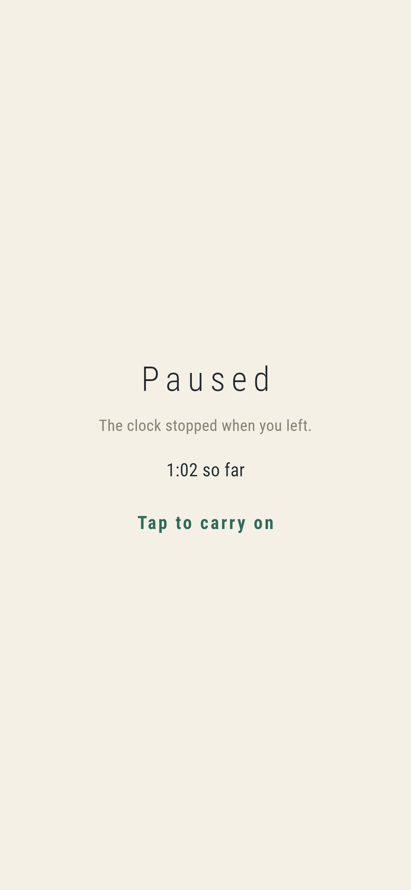

# Tallyloom

A nonogram for phones, in Flutter, for Android and iOS.

The numbers beside each line are the lengths of the runs of filled squares in
it, in order: `3 1` means three together, a gap, then one. Work out which
squares those are, in every row and every column at once, and a picture comes
out.

Drag to fill a run rather than tapping square by square. A stroke that starts
on a square you have already filled rubs out instead, so taking four squares
back is one stroke the other way.

| | | | |
|---|---|---|---|
|  |  |  |  |

## You are never asked to guess

This is the promise the game is built around, and it is enforced rather than
hoped for.

A grid of random squares produces perfectly valid clues and usually an unfair
puzzle. There comes a point where nothing more follows from any single line and
the only way on is to try a square and see what breaks. A player who hits one
cannot tell a hard puzzle from a broken one, and the game has lost them either
way.

So every candidate picture goes through a solver that reasons the way a person
does, one line at a time, taking only what that line's own clue forces, going
round again because a square settled in a row changes what the column through
it forces, and which never tries a square to see what happens. Anything it
cannot finish is thrown away. What is left has a guaranteed route through it,
made of nothing but deductions a player could make.

That also settles uniqueness for free. If every square is forced, no other
picture fits the clues.

## How it is put together

`lib/game/` is the game and knows nothing about screens.

- `picture.dart` is an answer. Always the thing a puzzle was made *from*.
- `clues.dart` holds the numbers, read off a picture and never written by hand,
  so a puzzle always has at least the answer it came from.
- `grid.dart` is what the player has worked out, which includes knowing where
  the picture is *not*. A grid matches a picture on the filled squares only:
  crossing off empties is a way of working, not part of the answer, so
  finishing does not mean clearing them.
- `line.dart` is the whole of nonogram reasoning, in one class. A clue and a
  partly known line permit some set of arrangements; any square that is the
  same in all of them is settled.
- `solver.dart` runs line logic until it finishes or runs out of ideas.
- `maker.dart` draws a picture, reads its clues, solves it, and throws it
  away unless the solver got it out.
- `book.dart` turns a puzzle number into a puzzle. The book stores nothing: a number is
  its own seed, so puzzle forty one is the same grid on every phone that asks
  for it, worked out in a few milliseconds when it is wanted.

`lib/ui/` draws it. There is no art to load: a nonogram is squares and two
digit numbers, so every pixel is painted and it is sharp at whatever size a
phone gives it. That includes the logo and the app icon, which are drawn by
the same painter as the board. The mark is a real seven by seven nonogram, and
there is a test that solves it.

## Things worth knowing

**Line logic without writing arrangements down.** Enumerating every
arrangement of a clue is easy to describe and hopeless in practice: a fifteen
wide line holds thousands, and the maker runs this over both directions of
every candidate it tries. Instead the runs are walked forwards, with a
memoised backwards feasibility check, which is linear in the line length times
the number of runs.

Alongside it in the tests sits the slow obvious version that really does write
down every arrangement. The two are compared on **every clue and every state of
knowledge** a line up to eight squares wide can be in. Not a sample, but all
of them: fifty five clues against six and a half thousand states, in about three
seconds. `make verify` takes it to eleven wide.

**The grids stop at ten across**, and the reason is the smallest phone still
sold rather than anything about the puzzles. A row of clues needs room beside
the grid, so what a phone shares out is the grid plus its deepest clue. On a
320 point screen that leaves 23 point squares at ten across, 19 at twelve and
15 at fifteen. Fifteen point squares are half a keyboard key and a thumb
covers four of them. So the book climbs through difficulty instead, which was
the dial worth turning anyway: ten across has room to need eight sweeps of the
lines, and there is a test that walks two hundred and fifty puzzles to prove
the book can keep finding them.

**Most pictures are folded.** A picture grown from random walks looks like
spilled ink; the same picture mirrored looks like a mask or a butterfly. Since
the picture is the payoff for twenty minutes of arithmetic, that difference is
the whole reward. Not all of them, and not always the same way, or knowing the
shape of the answer would be worth more than reading the clues.

Folding is drawn *into* rather than applied afterwards, because applying it
afterwards copies one half of the grid over the other and moves the share of
squares that end up filled, so a picture drawn to a target and then folded
misses it and gets thrown away, and a maker that mirrors most of its pictures
ends up handing over hardly any.

The trade shows at the top of the book: symmetrical clues solve each other, so
folded pictures are easier. The last chapter therefore does not fold.

**Leaving the game stops the clock and covers the puzzle.** The times are worth
keeping honest, so a puzzle put down at a bus stop should not read as forty
minutes. A stopped clock over a puzzle that can still be read is dishonest
the other way, because every number is already on the screen and thinking is
the entire game. Coming back does not start the clock either; you do, by
tapping.



## Running it

```
make deps      # flutter pub get
make test      # everything
make verify    # everything, with the exhaustive line check taken wider
make analyze
make shots     # render the screens into build/showcase, redraw the logo
make book      # print what the book deals, and what each puzzle cost to make
make apk       # release APK
make ios       # release iOS build, unsigned
```

`make book` prints the table the difficulty curve was tuned against. `passes`
is how many times the solver had to come back round the lines, which is the
closest honest measure of difficulty; `rejected` is how many pictures were
drawn and thrown away to find that one.

## Tests

`flutter test` runs everything: the line logic against brute force, the maker's
promises across every size, two hundred and fifty puzzles of the book checked
for size, difficulty, solvability without a guess and (for the small ones)
uniqueness found by an independent exhaustive search, and the game itself
played with a thumb on three phone sizes.

Screenshots come from `test/showcase_test.dart`, which is the real widget tree
at real phone dimensions drawn by the engine the app uses. The half finished
boards in them are genuine positions: every square shown is one the solver
settled from the clues, so nothing in the pictures is filled in that a player
could not have reasoned out by then.

Pictures of the game on an actual phone need an actual phone. No emulator is
published for this machine's architecture and there is no CI here to borrow
one from, so `integration_test/screenshot_test.dart` is driven by hand on a
machine that has one. `.github/scripts/` holds the two scripts that do it.
