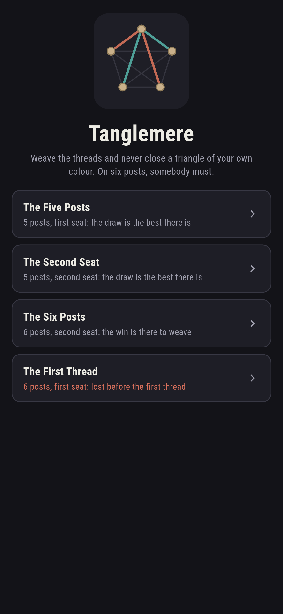
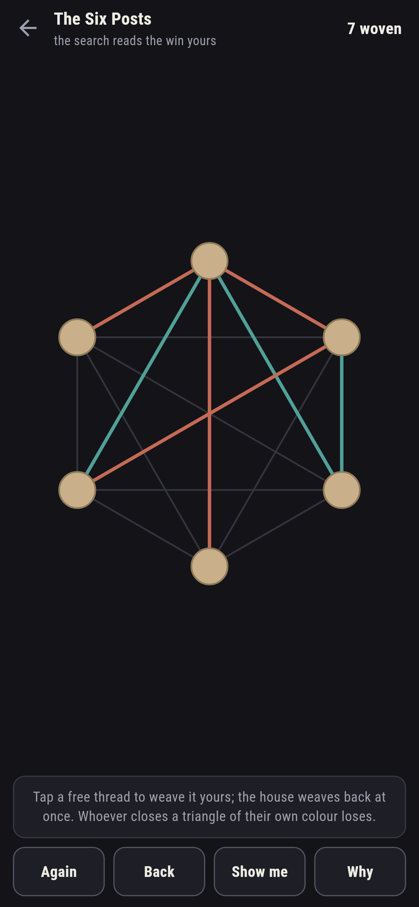
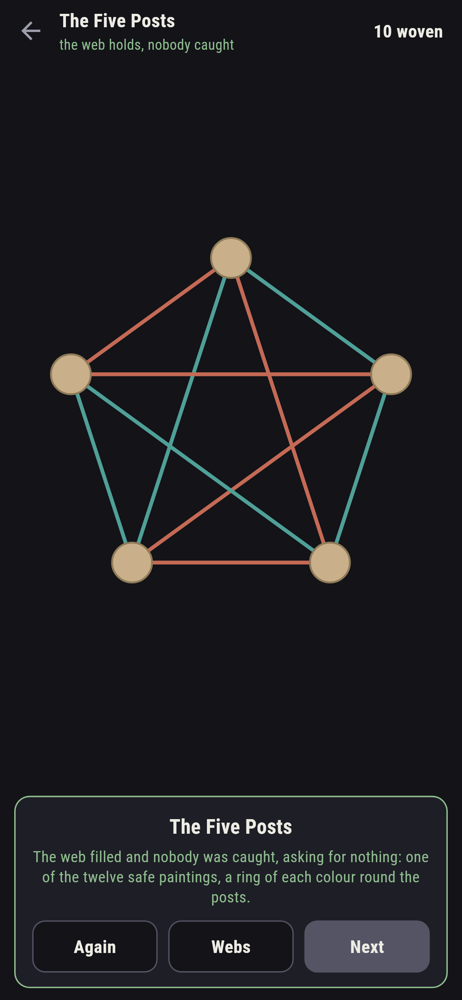
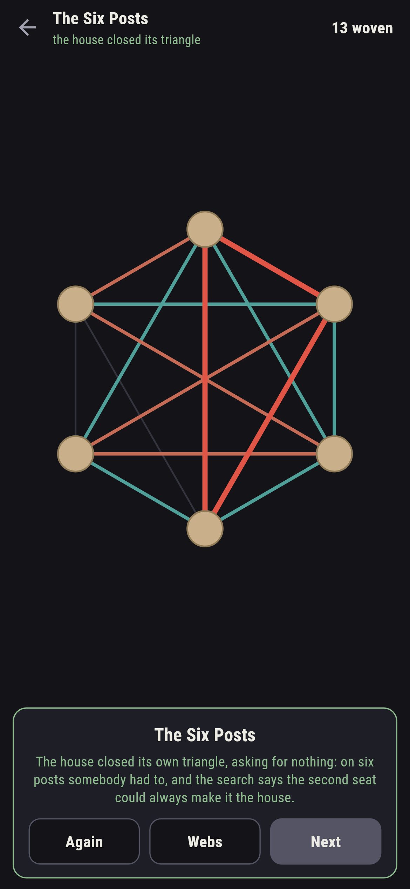
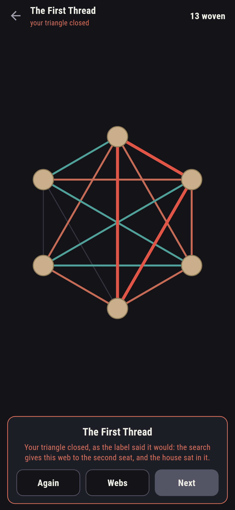
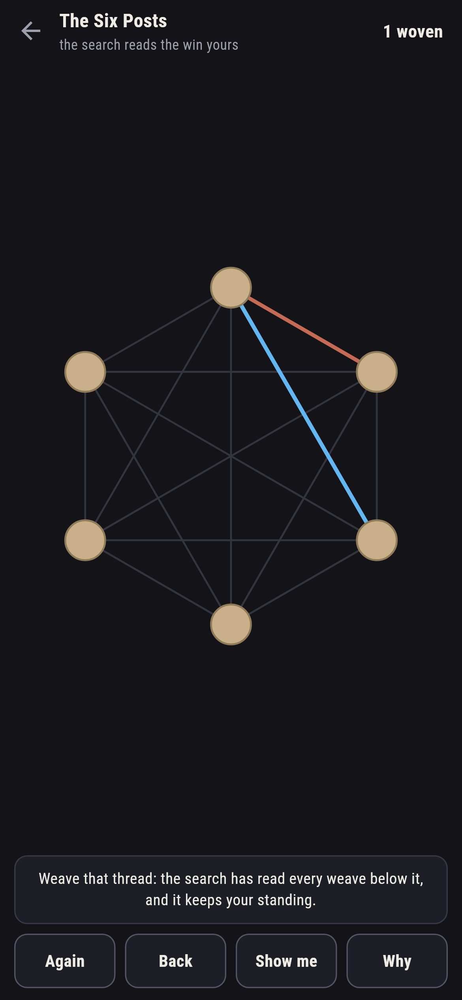

# Tanglemere

A thread-weaving game for phones, in Flutter, for Android and iOS.

Posts in a ring, a thread between every pair, two weavers taking
turns, and one rule: close a triangle of three own-colour threads
and you lose at once. This is the game of Sim, and under it sits the
oldest party trick in Ramsey theory, run here in full rather than
told.

| | | | |
|---|---|---|---|
|  |  |  |  |

## The Ramsey pair

On five posts the whole web can fill with nobody caught: the sweep
paints all 1,024 finished webs and finds exactly twelve safe, every
one a ring of each colour round all five posts, checked both ways.
On six posts it cannot: all 32,768 paintings hold a one-colour
triangle, and the counting argument, five threads at a post, three
sharing a colour, finds that triangle on any painting without
looking twice, run as code across every one.

```
$ make webs
five posts: 12 safe paintings, every one two rings; six posts: none of 32,768, and the counting argument finds the triangle on every painting

 1 The Five Posts   5 posts, first seat  best weaving holds the draw
 2 The Second Seat  5 posts, second seat  best weaving holds the draw
 3 The Six Posts    6 posts, second seat  the player holds the win
 4 The First Thread 6 posts, first seat  lost before the first thread
```

## The search

Somebody must lose on six posts, and the search of every weave says
who: the second weaver, with best play. The Six Posts gives you that
chair against a house that never blunders; The First Thread gives
you the other one, and ships labelled, in the house tradition of
games nobody can win. The five-post webs hold the draw from either
chair, and the ledger reads your standing from the same search at
every thread.



## The live loom

The ledger reads the search's verdict on the weave as it stands, and
a thread that lets your standing slip is called out the moment it is
woven, with **Back** waiting. **Show me** weaves from the same
search, and the closing triangle, whoever's it is, draws itself bold.



## Building

```
make deps    # fetch packages
make check   # analyze + every test
make webs    # search every weave, sweep every painting, print the ledger
make shots   # render the screenshots and redraw the icons
make apk     # Android release build
make ios     # iOS release build (unsigned)
```

The logo and every app icon are drawn by the game's own painter in
`test/mark_test.dart`. There is no image in this repository that was not
produced by code in it.

## How it is put together

```
lib/web/rules.dart     threads, triangles, the search, the sweeps,
                       the counting argument
lib/web/web.dart       a web: posts, seat, its standing
lib/web/webs.dart      the four webs that ship
lib/web/play.dart      a weave in progress: threads, the house's
                       reply, take-back
lib/ui/                the painter, the screens, the mark
tool/check_webs.dart   the searches, the sweeps, the ledger above
```

The tests count threads and triangles by hand, hold the sweeps to
twelve and to none, run the counting argument over all 32,768
paintings, read the famous standings from the search, draw both
five-post webs and win the six-post second seat by following it, and
hold the pictures against the real widget tree. If any of that
drifts, `make check` goes red before anything leaves the machine.
