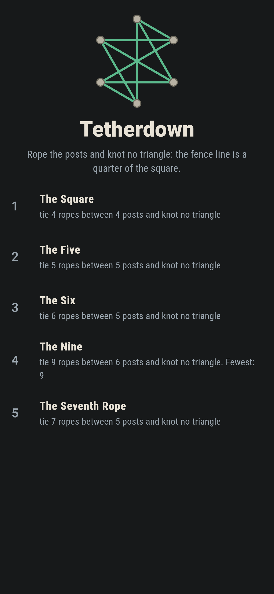
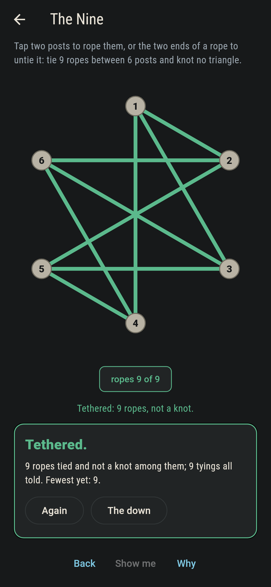
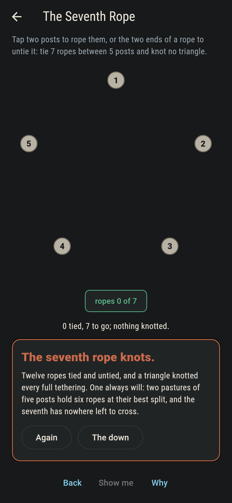
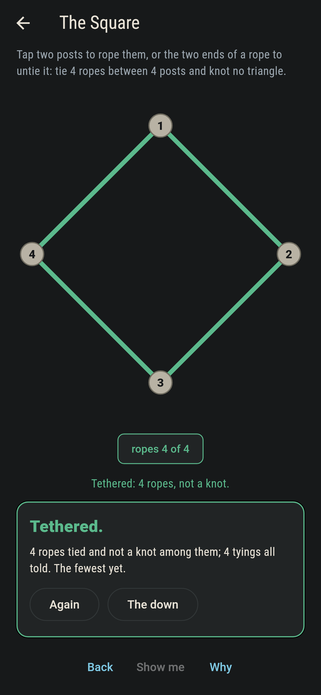
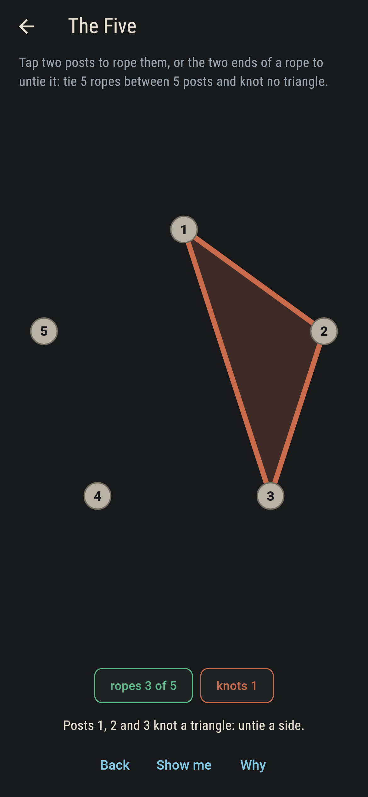
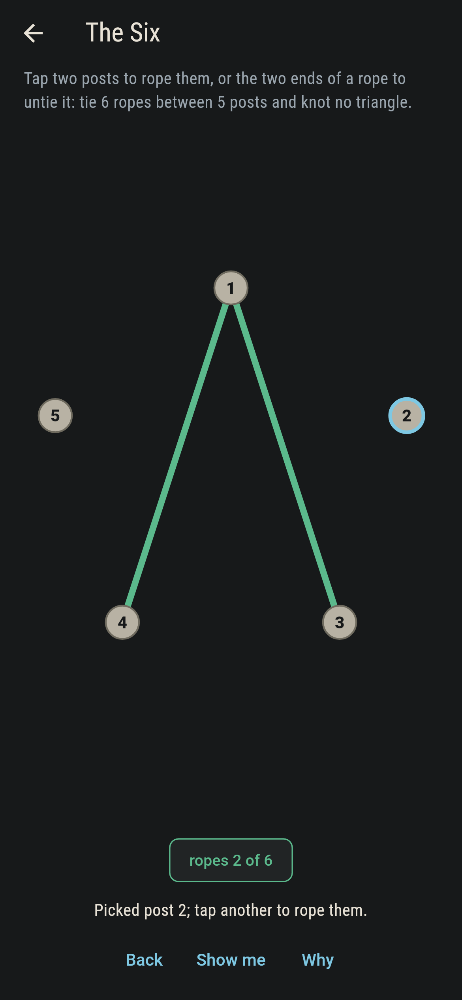
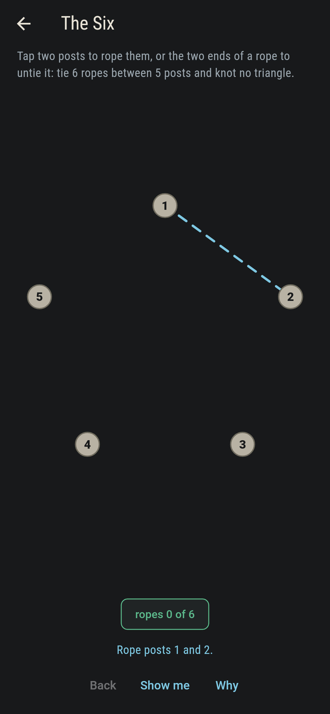
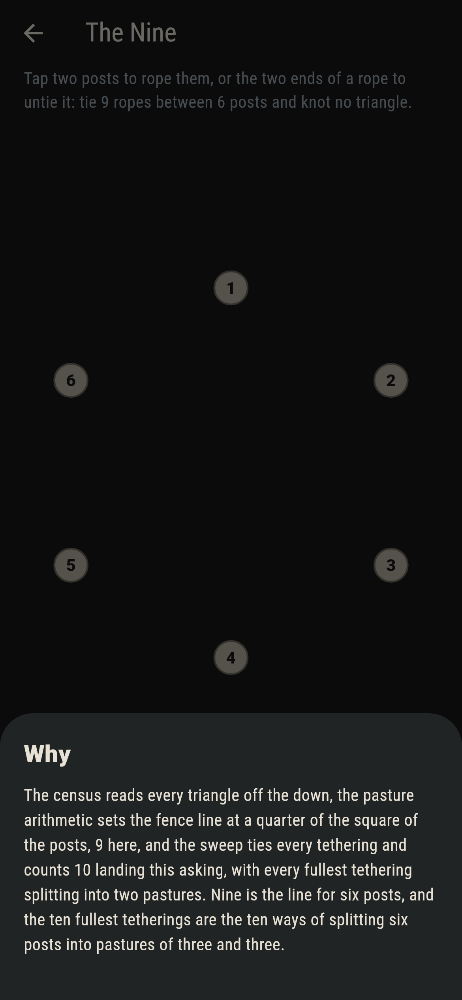

# Tetherdown


Posts stand in a ring on the down, and ropes tie post to post.
The one rule of the tethering is never to knot a triangle: three
posts all roped to one another. How many ropes a down can take is
Mantel's law, a quarter of the square of the posts, and the game
knows the line, the count and the shape of every fullest
tethering it ships.

## The downs

1. **The Square** - tie 4 ropes between 4 posts and knot no triangle
2. **The Five** - tie 5 ropes between 5 posts and knot no triangle
3. **The Six** - tie 6 ropes between 5 posts and knot no triangle
4. **The Nine** - tie 9 ropes between 6 posts and knot no triangle
5. **The Seventh Rope** - tie 7 ropes between 5 posts and knot no triangle

The Six and The Nine sit exactly on their fence lines, and every
tethering that reaches a line wears the same shape: the posts
split into two pastures with every rope crossing between them and
every crossing roped. The Seventh Rope asks for one rope more
than five posts can carry, and the reason is pasture arithmetic:
two pastures of five posts hold two times three ropes at their
best split, and that is all there is.

## Three voices

The game never asserts what it has not computed, and it computes
everything at least twice:

* **The census** reads every triangle off the down and washes the
  knot in rust the moment one closes.
* **The pasture arithmetic** sets the fence line: over every
  split of the posts into two pastures, the most crossings is a
  quarter of the square, 4, 6 and 9 on the downs shipped.
* **The sweep** ties every tethering there is: it finds the
  labelled counts, finds nothing triangle-free past any fence
  line, and finds every fullest tethering splitting into two
  pastures.

`tool/check_downs.dart` runs all three and refuses the bake on
any disagreement.

## The checker's ledger

What `dart run tool/check_downs.dart` printed for the build this
README shipped with, word for word:

```
every tethering of every down swept: the fence lines 4, 6 and 9 match the pasture arithmetic to the rope, no tethering past a line ever comes triangle-free, and every fullest tethering splits into two pastures with every crossing roped

 1 The Square         tie 4 ropes between 4 posts and knot no triangle: 3 tetherings of the sweep land it
 2 The Five           tie 5 ropes between 5 posts and knot no triangle: 72 tetherings of the sweep land it
 3 The Six            tie 6 ropes between 5 posts and knot no triangle: 10 tetherings of the sweep land it
 4 The Nine           tie 9 ropes between 6 posts and knot no triangle: 10 tetherings of the sweep land it
 5 The Seventh Rope   tie 7 ropes between 5 posts and knot no triangle: none of the 120 tried, and the pastures say why
```

## Screenshots

| The downland | The nine tethered | The seventh rope admitted |
| --- | --- | --- |
|  |  |  |

| The square | A knot called out | Picking | Show me | The why |
| --- | --- | --- | --- | --- |
|  |  |  |  |  |

Screenshots are drawn by `test/showcase_test.dart` at real phone
sizes with the app's own painter, then copied into `docs/` as they
came out; every rope in them was tied by taps, so nothing
pictured is a down the game could not reach. The logo and every
launcher icon come out of `test/mark_test.dart` the same way: the
mark is the nine tethered.

## Building

```
flutter test          # 48 tests, the sweep among them
dart run tool/check_downs.dart
flutter build apk     # or: flutter build ios
```
