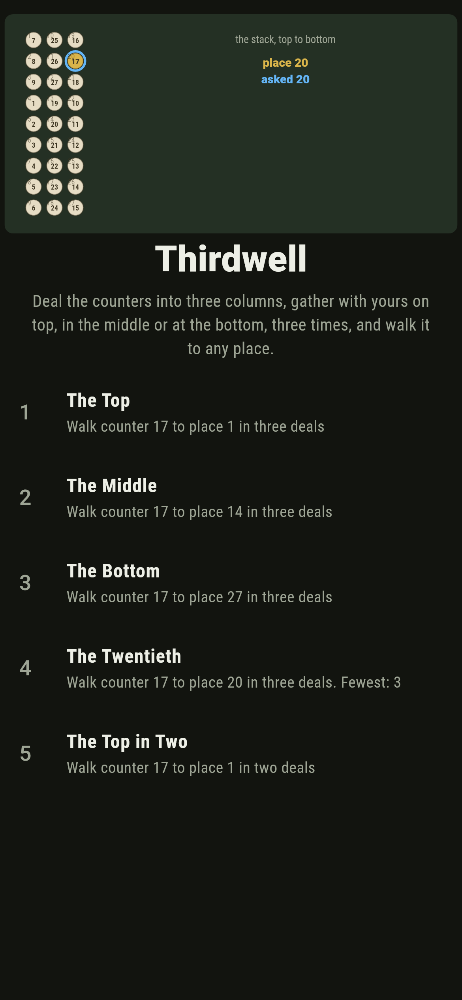
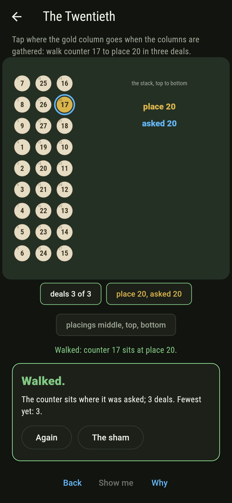
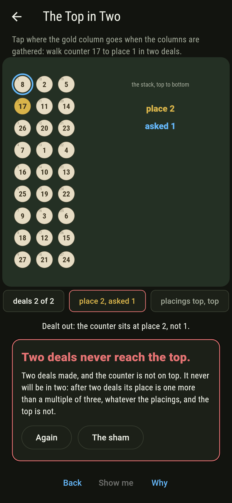
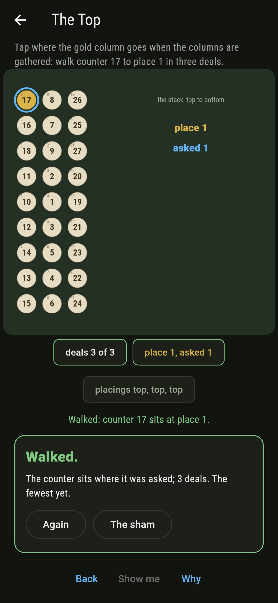
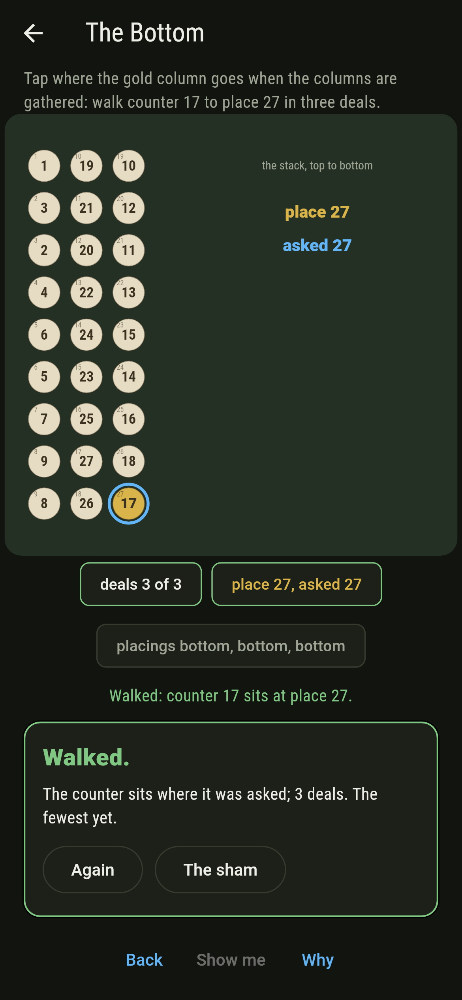
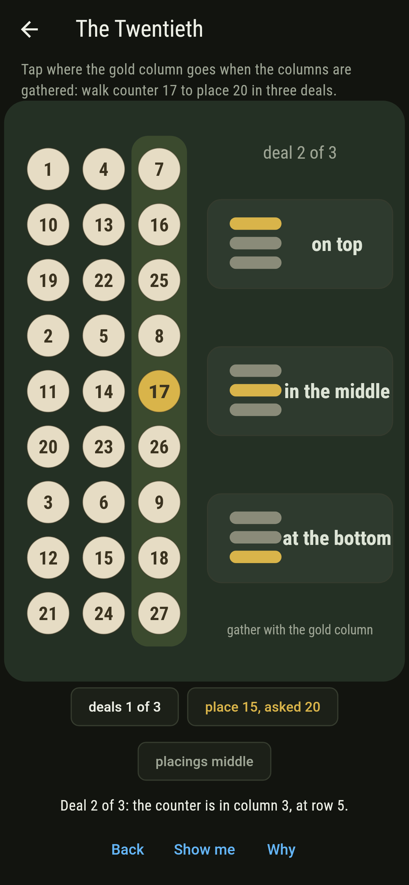
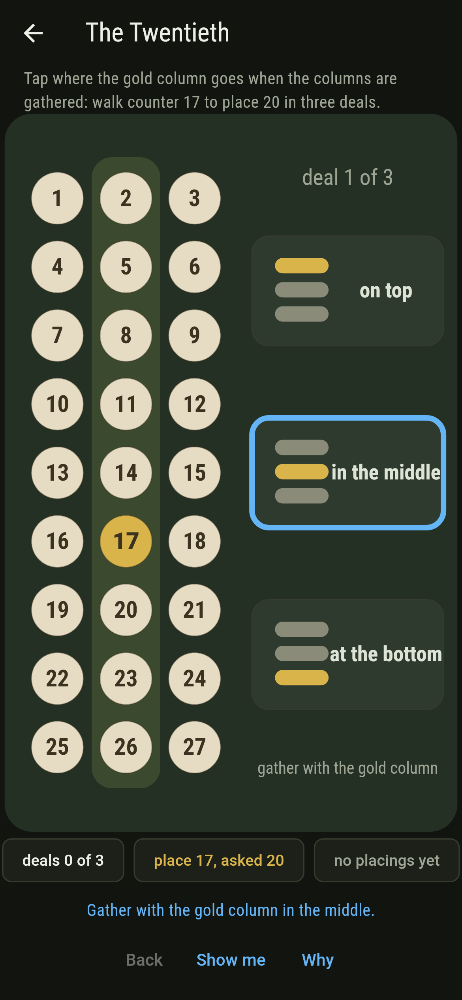
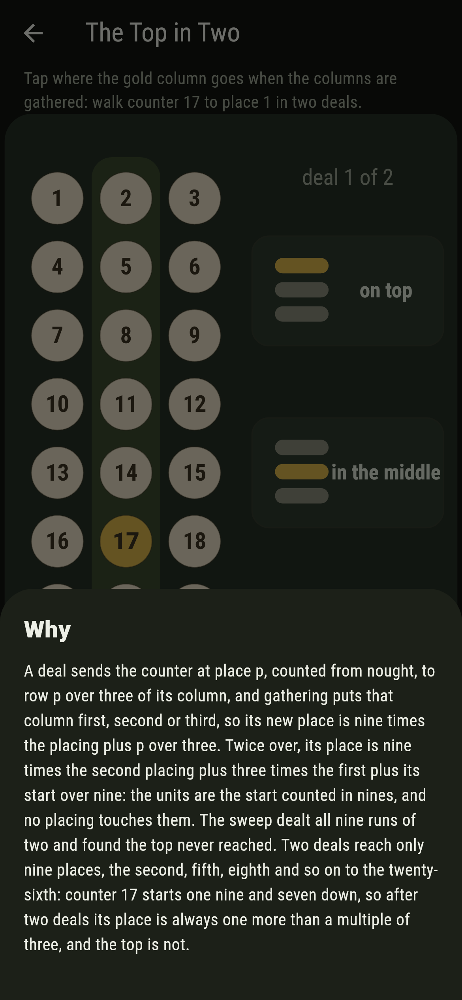

# Thirdwell


Twenty-seven counters in a stack, one of them yours. Deal them out
into three columns, round and round; say which column holds yours;
gather the columns into a stack again with yours on top, in the
middle, or at the bottom, as you please. Do it three times.
Gergonne worked out in 1813 where your counter ends up: read the
three placings as digits in threes, first deal the units, and that
is its place from the top, whatever place it started in. Every
place can be reached, each by one run of placings only. Two deals
cannot do it, and the why says why.

## The walks

1. **The Top** - walk counter 17 to place 1 in three deals
2. **The Middle** - walk counter 17 to place 14 in three deals
3. **The Bottom** - walk counter 17 to place 27 in three deals
4. **The Twentieth** - walk counter 17 to place 20 in three deals
5. **The Top in Two** - walk counter 17 to place 1 in two deals

Top, top, top lands the counter on top; middle, middle, middle
lands it fourteenth, one and three and nine; bottom thrice lands
it last; middle, top, bottom lands it twentieth, one and nought
threes and two nines. Every one of the 27 places is reached by
exactly one of the 27 runs, from any of the 27 starts. The Top in
Two is labeled hopeless on its tile: two deals reach nine places
only, and counter 17's are the second, fifth, eighth and so on.

## Two voices

The game never asserts what it has not computed, and it computes
everything at least twice:

* **The dealing** is done for real, every run of three placings
  dealt out for every one of the 27 counters, 729 runs, and every
  run of two besides.
* **Gergonne's arithmetic** names the place with no dealing at
  all, the placings read as digits in threes with the first deal
  the units, and it agrees with the dealing for every counter, run
  and place; run backwards it gives the one run for any place. For
  two deals the arithmetic says the units are the start counted in
  nines, untouched by any placing, and the dealing agrees for every
  counter.

`tool/check_deals.dart` runs the lot and refuses the bake on any
disagreement.

## The checker's ledger

What `dart run tool/check_deals.dart` printed for the build this
README shipped with, word for word:

```
every run of three placings dealt out for every one of the 27 counters, 729 runs, and every one lands where Gergonne's arithmetic says, the placings read as digits in threes with the first deal the units, so each of the 27 places is reached by exactly one run from any start; two deals reach nine places only, those whose units are the start counted in nines, and counter 17 never reaches the top in two

 1 The Top         walk counter 17 to place 1 in three deals: 1 run of the 27 lands it
 2 The Middle      walk counter 17 to place 14 in three deals: 1 run of the 27 lands it
 3 The Bottom      walk counter 17 to place 27 in three deals: 1 run of the 27 lands it
 4 The Twentieth   walk counter 17 to place 20 in three deals: 1 run of the 27 lands it
 5 The Top in Two  walk counter 17 to place 1 in two deals: none of the 9, and the units said so first
```

## Screenshots

| The sham | The twentieth walked | The top in two admitted |
| --- | --- | --- |
|  |  |  |

| The top | The middle | The bottom | Mid-deal | Show me | The why |
| --- | --- | --- | --- | --- | --- |
|  |  |  |  |  |  |

Screenshots are drawn by `test/showcase_test.dart` at real phone
sizes with the app's own painter, then copied into `docs/` as they
came out; every gathering in them was tapped, so nothing pictured
is a stack the game could not reach. The logo and every launcher
icon come out of `test/mark_test.dart` the same way: the mark is
the twentieth walked, middle then top then bottom.

## Building

```
flutter test          # 44 tests, the sweep among them
dart run tool/check_deals.dart
flutter build apk     # or: flutter build ios
```
