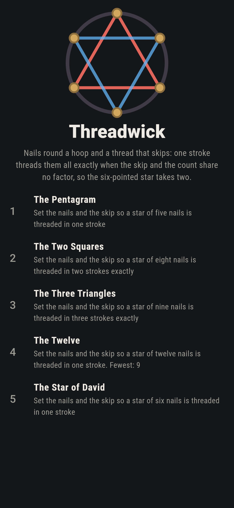
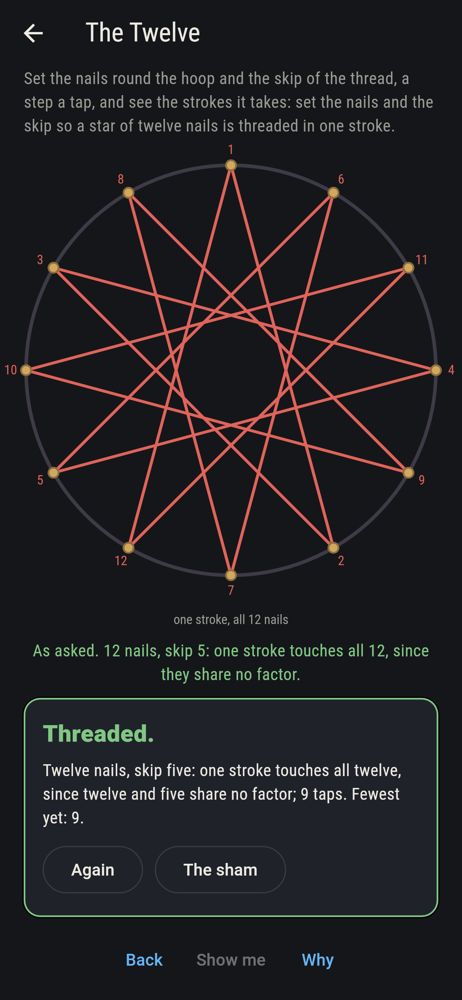
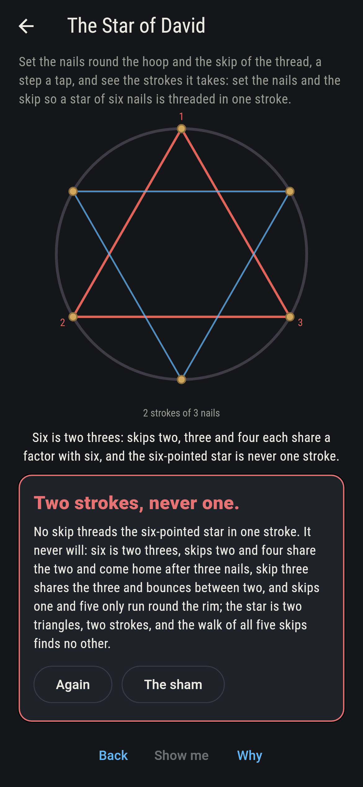
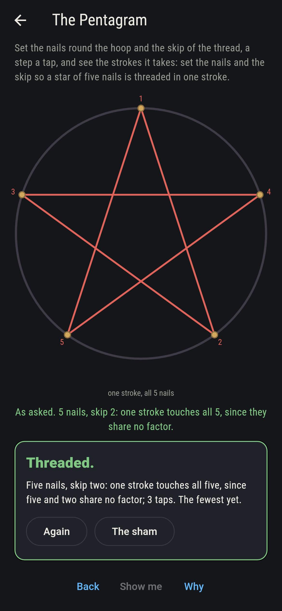
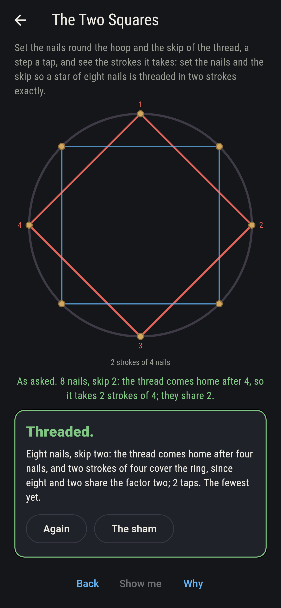
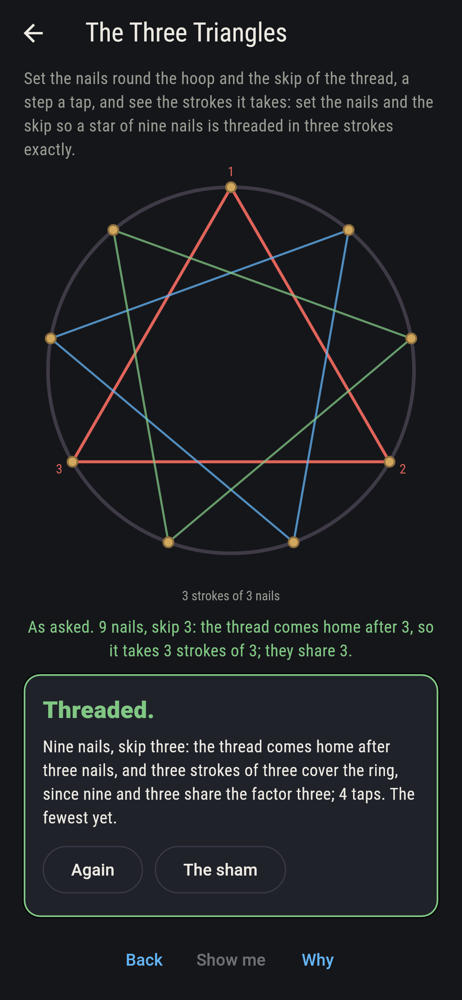
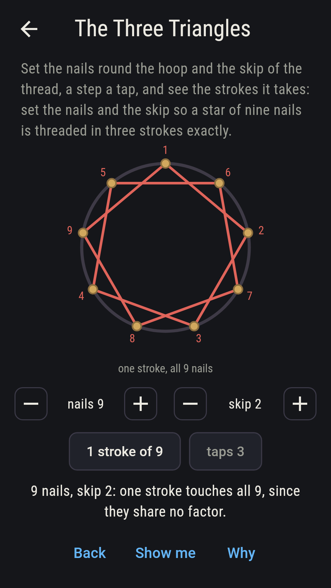
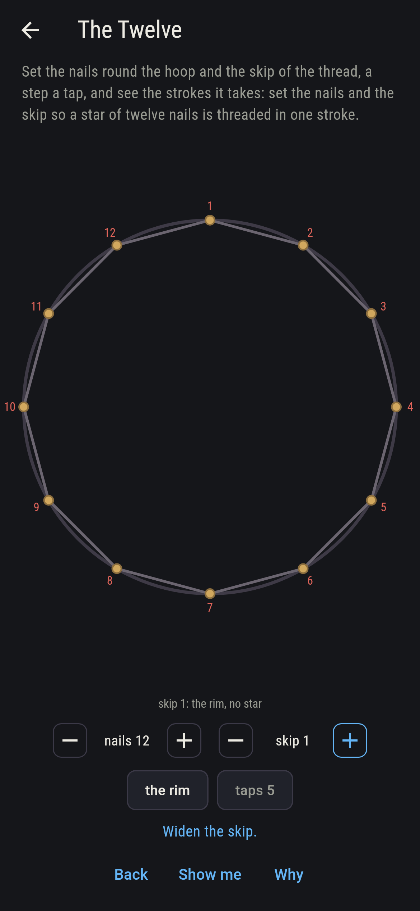
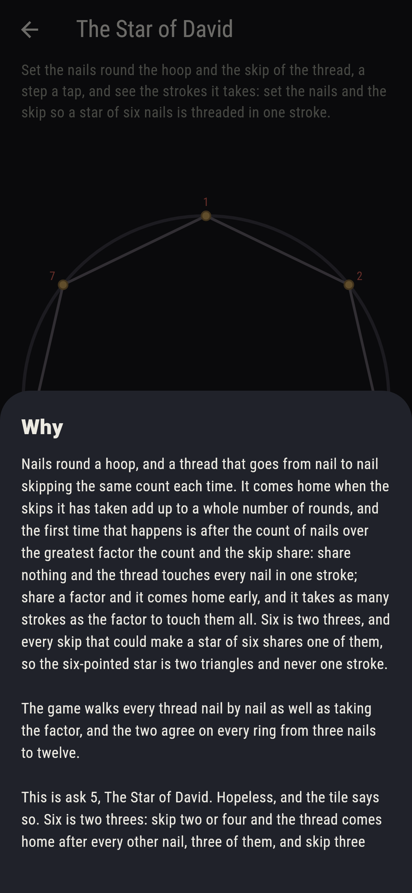

# Threadwick


Nails round a hoop and a thread that skips. Set the nails, five to
twelve, and the skip, and the thread goes from nail to nail skipping
the same count each time until it comes home; it comes home the first
time its skips add up to whole rounds, which is after the count of
nails over the greatest factor the count and the skip share. Share
nothing and one stroke touches every nail; share a factor and the
thread comes home early, and it takes as many strokes as the factor
to touch them all. Six is two threes, and every skip that could make
a star of six shares one of them, so the six-pointed star is two
triangles and never one stroke. Every thread is walked nail by nail
as well as taking the factor, on every ring from three nails to
twelve, and the two agree throughout.

## The asks

1. **The Pentagram** - set the nails and the skip so a star of five nails is threaded in one stroke
2. **The Two Squares** - set the nails and the skip so a star of eight nails is threaded in two strokes exactly
3. **The Three Triangles** - set the nails and the skip so a star of nine nails is threaded in three strokes exactly
4. **The Twelve** - set the nails and the skip so a star of twelve nails is threaded in one stroke
5. **The Star of David** - set the nails and the skip so a star of six nails is threaded in one stroke

Five nails and a skip of two or three thread the pentagram in one
stroke, the same five lines either way, two settings of the 60;
eight nails and a skip of two or six come home after four and take
two strokes, two squares, while a skip of four takes four bare lines
and three or five thread all eight at once; nine nails and a skip of
three or six take three triangles; twelve nails and a skip of five
or seven thread the one star of twelve, every other skip sharing a
factor with twelve, six of them making six lines through the middle.
The Star of David is labeled hopeless on its tile: skips two and four
come home after three nails, skip three bounces between two, and
skips one and five only run round the rim; the sham admits it once
the player has tried skips two, three and four at six nails.

## Two voices

The game never asserts what it has not computed, and it computes
everything at least twice:

* **The walk** follows the thread nail by nail from the first nail
  until it comes home, then starts again from the first bare nail,
  and counts the strokes; it runs on every ring from three nails to
  twelve and every skip, 65 settings, and every count on the sham is
  the walk's over the 60 the dials reach.
* **The divisor** walks nothing: the strokes are the greatest common
  divisor of the count and the skip, and each touches the count over
  it; it agrees with the walk on all 65, skip k and skip count less k
  draw the same lines on all 65, and the one-stroke stars of every
  ring are Euler's count of the skips sharing nothing with the count,
  less the two that run round the rim, each star drawn by two skips.

`tool/check_stars.dart` runs the lot and refuses the bake on any
disagreement.

## The checker's ledger

What `dart run tool/check_stars.dart` printed for the build this
README shipped with, word for word:

```
every thread walked nail by nail round every ring from three nails to twelve and every skip from one to a nail short of the round, 65 settings, and the strokes walked agree with the divisor on every one, as many strokes as the count and the skip share and each stroke touching the count over that, every nail touched once; skip k and skip count less k draw the same lines on all 65; the one-stroke stars of five to twelve nails are the skips sharing nothing with the count less the two round the rim, Euler's count less two on every ring, each star drawn by two skips: five nails 2 and 3, six none, seven 2, 3, 4 and 5, eight 3 and 5, nine 2, 4, 5 and 7, ten 3 and 7, eleven every skip from 2 to 9, twelve 5 and 7; eight by two is two squares and by four four bare lines, nine by three three triangles, twelve by six six lines through the middle, by two two hexagons, by three three squares and by four four triangles; and six by two or four is two triangles and by three three lines, so no skip threads the six-pointed star in one stroke

 1 The Pentagram       set the nails and the skip so a star of five nails is threaded in one stroke: 2 of the 60 settings land it
 2 The Two Squares     set the nails and the skip so a star of eight nails is threaded in two strokes exactly: 2 of the 60 settings land it
 3 The Three Triangles set the nails and the skip so a star of nine nails is threaded in three strokes exactly: 2 of the 60 settings land it
 4 The Twelve          set the nails and the skip so a star of twelve nails is threaded in one stroke: 2 of the 60 settings land it
 5 The Star of David   set the nails and the skip so a star of six nails is threaded in one stroke: none of the 60, and the shared factor said so first
```

## Screenshots

| The sham | The twelve | The star of David admitted |
| --- | --- | --- |
|  |  |  |

| The pentagram | The two squares | The three triangles | Midway, on the small phone | Show me | The why |
| --- | --- | --- | --- | --- | --- |
|  |  |  |  |  |  |

Screenshots are drawn by `test/showcase_test.dart` at real phone
sizes with the app's own painter, then copied into `docs/` as they
came out; every star in them was set by taps on the dials, so nothing
pictured is a setting the game could not reach. The logo and every
launcher icon come out of `test/mark_test.dart` the same way: the
mark is the star of David in its two strokes.

## Building

```
flutter test          # 47 tests, the walk among them
dart run tool/check_stars.dart
flutter build apk     # or: flutter build ios
```
